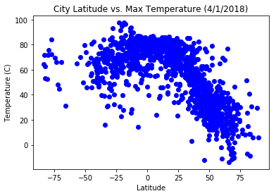

```python
import pandas as pd
import numpy as np
import json
import requests as req
from citipy import citipy
import matplotlib.pyplot as plt

from API_Key import API_Key
```


```python
num_of_cities = 4500
latitude = np.random.uniform(-90,90, size = num_of_cities)
longitude = np.random.uniform(-180,180,size = num_of_cities)
coord = pd.DataFrame(latitude, longitude)
coord = coord.reset_index()
coord = coord.rename(columns = {'index':'longitude',0:'latitude'})
```


```python
cities = []
country = []
for index, row in coord.iterrows():
    lat = row['latitude']
    lng = row['longitude']
    city = citipy.nearest_city(lat,lng)
    cities.append(city.city_name)
    country.append(city.country_code)
```


```python
cities_df = pd.DataFrame(cities)
cities_df['country_code'] = pd.DataFrame(country)
cities_df = cities_df.rename(columns = {0 : 'city_name'})
cities_df['latitude'] = coord['latitude']
cities_df['longitude'] = coord['longitude']
cities_df['temperature'] = ''
cities_df['humidity'] = ''
cities_df['cloudiness'] =''
cities_df['wind_speed'] = ''
```


```python
units = 'imperial'

for index, row in cities_df.iterrows():
    url = 'http://api.openweathermap.org/data/2.5/weather?'

    city = row[0]
    query_url = f'{url}appid={API_Key}&q={city}&units={units}'
    city_weather = req.get(query_url)
    weather_json = city_weather.json()
    print(query_url, "record", index )
    try:
        temp = weather_json['main']['temp']
        humid = weather_json['main']['humidity']
        cloud = weather_json['clouds']['all']
        wind = weather_json['wind']['speed']
        cities_df.set_value(index,'temperature', temp)
        cities_df.set_value(index, 'humidity', humid)
        cities_df.set_value(index, 'cloudiness', cloud)
        cities_df.set_value(index, 'wind_speed', wind)
        #print(temperature)
    except:
        continue

#append cities_df with temp and other data
```

    http://api.openweathermap.org/data/2.5/weather?appid=4a6e796c7a99fac93bbcd278fa3318b4&q=markivka&units=imperial record 0
    http://api.openweathermap.org/data/2.5/weather?appid=4a6e796c7a99fac93bbcd278fa3318b4&q=faanui&units=imperial record 1
    http://api.openweathermap.org/data/2.5/weather?appid=4a6e796c7a99fac93bbcd278fa3318b4&q=barrow&units=imperial record 2
    http://api.openweathermap.org/data/2.5/weather?appid=4a6e796c7a99fac93bbcd278fa3318b4&q=esperance&units=imperial record 3
    http://api.openweathermap.org/data/2.5/weather?appid=4a6e796c7a99fac93bbcd278fa3318b4&q=mys shmidta&units=imperial record 4
    http://api.openweathermap.org/data/2.5/weather?appid=4a6e796c7a99fac93bbcd278fa3318b4&q=prince george&units=imperial record 5
    http://api.openweathermap.org/data/2.5/weather?appid=4a6e796c7a99fac93bbcd278fa3318b4&q=rikitea&units=imperial record 6
    http://api.openweathermap.org/data/2.5/weather?appid=4a6e796c7a99fac93bbcd278fa3318b4&q=hobart&units=imperial record 7
    http://api.openweathermap.org/data/2.5/weather?appid=4a6e796c7a99fac93bbcd278fa3318b4&q=castro&units=imperial record 8
    http://api.openweathermap.org/data/2.5/weather?appid=4a6e796c7a99fac93bbcd278fa3318b4&q=taolanaro&units=imperial record 9
    http://api.openweathermap.org/data/2.5/weather?appid=4a6e796c7a99fac93bbcd278fa3318b4&q=ponta do sol&units=imperial record 10
    http://api.openweathermap.org/data/2.5/weather?appid=4a6e796c7a99fac93bbcd278fa3318b4&q=saint-philippe&units=imperial record 11
    http://api.openweathermap.org/data/2.5/weather?appid=4a6e796c7a99fac93bbcd278fa3318b4&q=busselton&units=imperial record 12
    http://api.openweathermap.org/data/2.5/weather?appid=4a6e796c7a99fac93bbcd278fa3318b4&q=ondorhaan&units=imperial record 13
    http://api.openweathermap.org/data/2.5/weather?appid=4a6e796c7a99fac93bbcd278fa3318b4&q=constantine&units=imperial record 14
    http://api.openweathermap.org/data/2.5/weather?appid=4a6e796c7a99fac93bbcd278fa3318b4&q=severodvinsk&units=imperial record 15
    http://api.openweathermap.org/data/2.5/weather?appid=4a6e796c7a99fac93bbcd278fa3318b4&q=mareeba&units=imperial record 16
    http://api.openweathermap.org/data/2.5/weather?appid=4a6e796c7a99fac93bbcd278fa3318b4&q=warrington&units=imperial record 17
    http://api.openweathermap.org/data/2.5/weather?appid=4a6e796c7a99fac93bbcd278fa3318b4&q=karratha&units=imperial record 18
    http://api.openweathermap.org/data/2.5/weather?appid=4a6e796c7a99fac93bbcd278fa3318b4&q=saint anthony&units=imperial record 19
    http://api.openweathermap.org/data/2.5/weather?appid=4a6e796c7a99fac93bbcd278fa3318b4&q=kolimvari&units=imperial record 20
    http://api.openweathermap.org/data/2.5/weather?appid=4a6e796c7a99fac93bbcd278fa3318b4&q=bac lieu&units=imperial record 21
    http://api.openweathermap.org/data/2.5/weather?appid=4a6e796c7a99fac93bbcd278fa3318b4&q=saint-philippe&units=imperial record 22
    http://api.openweathermap.org/data/2.5/weather?appid=4a6e796c7a99fac93bbcd278fa3318b4&q=phan rang&units=imperial record 23
    http://api.openweathermap.org/data/2.5/weather?appid=4a6e796c7a99fac93bbcd278fa3318b4&q=attawapiskat&units=imperial record 24
    http://api.openweathermap.org/data/2.5/weather?appid=4a6e796c7a99fac93bbcd278fa3318b4&q=albany&units=imperial record 25
    http://api.openweathermap.org/data/2.5/weather?appid=4a6e796c7a99fac93bbcd278fa3318b4&q=carballo&units=imperial record 26
    http://api.openweathermap.org/data/2.5/weather?appid=4a6e796c7a99fac93bbcd278fa3318b4&q=longyearbyen&units=imperial record 27
    http://api.openweathermap.org/data/2.5/weather?appid=4a6e796c7a99fac93bbcd278fa3318b4&q=yerbogachen&units=imperial record 28
    http://api.openweathermap.org/data/2.5/weather?appid=4a6e796c7a99fac93bbcd278fa3318b4&q=ilabaya&units=imperial record 29
    http://api.openweathermap.org/data/2.5/weather?appid=4a6e796c7a99fac93bbcd278fa3318b4&q=ushuaia&units=imperial record 30
    http://api.openweathermap.org/data/2.5/weather?appid=4a6e796c7a99fac93bbcd278fa3318b4&q=severo-kurilsk&units=imperial record 31
    http://api.openweathermap.org/data/2.5/weather?appid=4a6e796c7a99fac93bbcd278fa3318b4&q=kavieng&units=imperial record 32
    http://api.openweathermap.org/data/2.5/weather?appid=4a6e796c7a99fac93bbcd278fa3318b4&q=rikitea&units=imperial record 33
    http://api.openweathermap.org/data/2.5/weather?appid=4a6e796c7a99fac93bbcd278fa3318b4&q=ushuaia&units=imperial record 34
    http://api.openweathermap.org/data/2.5/weather?appid=4a6e796c7a99fac93bbcd278fa3318b4&q=saint-philippe&units=imperial record 35
    http://api.openweathermap.org/data/2.5/weather?appid=4a6e796c7a99fac93bbcd278fa3318b4&q=grand river south east&units=imperial record 36
    http://api.openweathermap.org/data/2.5/weather?appid=4a6e796c7a99fac93bbcd278fa3318b4&q=rikitea&units=imperial record 37
    http://api.openweathermap.org/data/2.5/weather?appid=4a6e796c7a99fac93bbcd278fa3318b4&q=port alfred&units=imperial record 38
    http://api.openweathermap.org/data/2.5/weather?appid=4a6e796c7a99fac93bbcd278fa3318b4&q=saint george&units=imperial record 39
    http://api.openweathermap.org/data/2.5/weather?appid=4a6e796c7a99fac93bbcd278fa3318b4&q=ossora&units=imperial record 40
    http://api.openweathermap.org/data/2.5/weather?appid=4a6e796c7a99fac93bbcd278fa3318b4&q=saskylakh&units=imperial record 41
    http://api.openweathermap.org/data/2.5/weather?appid=4a6e796c7a99fac93bbcd278fa3318b4&q=hermanus&units=imperial record 42
    http://api.openweathermap.org/data/2.5/weather?appid=4a6e796c7a99fac93bbcd278fa3318b4&q=rikitea&units=imperial record 43
    http://api.openweathermap.org/data/2.5/weather?appid=4a6e796c7a99fac93bbcd278fa3318b4&q=zaozerne&units=imperial record 44
    http://api.openweathermap.org/data/2.5/weather?appid=4a6e796c7a99fac93bbcd278fa3318b4&q=bocaranga&units=imperial record 45
    http://api.openweathermap.org/data/2.5/weather?appid=4a6e796c7a99fac93bbcd278fa3318b4&q=saskylakh&units=imperial record 46
    http://api.openweathermap.org/data/2.5/weather?appid=4a6e796c7a99fac93bbcd278fa3318b4&q=new norfolk&units=imperial record 47
    http://api.openweathermap.org/data/2.5/weather?appid=4a6e796c7a99fac93bbcd278fa3318b4&q=san rafael&units=imperial record 48
    http://api.openweathermap.org/data/2.5/weather?appid=4a6e796c7a99fac93bbcd278fa3318b4&q=kapaa&units=imperial record 49
    http://api.openweathermap.org/data/2.5/weather?appid=4a6e796c7a99fac93bbcd278fa3318b4&q=cape town&units=imperial record 50
    http://api.openweathermap.org/data/2.5/weather?appid=4a6e796c7a99fac93bbcd278fa3318b4&q=kirakira&units=imperial record 51
    http://api.openweathermap.org/data/2.5/weather?appid=4a6e796c7a99fac93bbcd278fa3318b4&q=georgetown&units=imperial record 52
    http://api.openweathermap.org/data/2.5/weather?appid=4a6e796c7a99fac93bbcd278fa3318b4&q=zonguldak&units=imperial record 53
    http://api.openweathermap.org/data/2.5/weather?appid=4a6e796c7a99fac93bbcd278fa3318b4&q=ugoofaaru&units=imperial record 54
    http://api.openweathermap.org/data/2.5/weather?appid=4a6e796c7a99fac93bbcd278fa3318b4&q=tsihombe&units=imperial record 55
    http://api.openweathermap.org/data/2.5/weather?appid=4a6e796c7a99fac93bbcd278fa3318b4&q=gopalur&units=imperial record 56
    http://api.openweathermap.org/data/2.5/weather?appid=4a6e796c7a99fac93bbcd278fa3318b4&q=ribas do rio pardo&units=imperial record 57
    http://api.openweathermap.org/data/2.5/weather?appid=4a6e796c7a99fac93bbcd278fa3318b4&q=punta arenas&units=imperial record 58
    http://api.openweathermap.org/data/2.5/weather?appid=4a6e796c7a99fac93bbcd278fa3318b4&q=pundaguitan&units=imperial record 59
    http://api.openweathermap.org/data/2.5/weather?appid=4a6e796c7a99fac93bbcd278fa3318b4&q=swift current&units=imperial record 60
    http://api.openweathermap.org/data/2.5/weather?appid=4a6e796c7a99fac93bbcd278fa3318b4&q=milingimbi&units=imperial record 61
    http://api.openweathermap.org/data/2.5/weather?appid=4a6e796c7a99fac93bbcd278fa3318b4&q=busselton&units=imperial record 62
    http://api.openweathermap.org/data/2.5/weather?appid=4a6e796c7a99fac93bbcd278fa3318b4&q=rikitea&units=imperial record 63
    http://api.openweathermap.org/data/2.5/weather?appid=4a6e796c7a99fac93bbcd278fa3318b4&q=ushuaia&units=imperial record 64
    http://api.openweathermap.org/data/2.5/weather?appid=4a6e796c7a99fac93bbcd278fa3318b4&q=rikitea&units=imperial record 65
    http://api.openweathermap.org/data/2.5/weather?appid=4a6e796c7a99fac93bbcd278fa3318b4&q=walvis bay&units=imperial record 66
    http://api.openweathermap.org/data/2.5/weather?appid=4a6e796c7a99fac93bbcd278fa3318b4&q=nassau&units=imperial record 67
    http://api.openweathermap.org/data/2.5/weather?appid=4a6e796c7a99fac93bbcd278fa3318b4&q=jamestown&units=imperial record 68
    http://api.openweathermap.org/data/2.5/weather?appid=4a6e796c7a99fac93bbcd278fa3318b4&q=port alfred&units=imperial record 69
    http://api.openweathermap.org/data/2.5/weather?appid=4a6e796c7a99fac93bbcd278fa3318b4&q=madimba&units=imperial record 70
    http://api.openweathermap.org/data/2.5/weather?appid=4a6e796c7a99fac93bbcd278fa3318b4&q=tabiauea&units=imperial record 71
    http://api.openweathermap.org/data/2.5/weather?appid=4a6e796c7a99fac93bbcd278fa3318b4&q=ilulissat&units=imperial record 72
    http://api.openweathermap.org/data/2.5/weather?appid=4a6e796c7a99fac93bbcd278fa3318b4&q=sosnovo-ozerskoye&units=imperial record 73
    http://api.openweathermap.org/data/2.5/weather?appid=4a6e796c7a99fac93bbcd278fa3318b4&q=kapaa&units=imperial record 74
    http://api.openweathermap.org/data/2.5/weather?appid=4a6e796c7a99fac93bbcd278fa3318b4&q=busselton&units=imperial record 75
    http://api.openweathermap.org/data/2.5/weather?appid=4a6e796c7a99fac93bbcd278fa3318b4&q=salalah&units=imperial record 76
    http://api.openweathermap.org/data/2.5/weather?appid=4a6e796c7a99fac93bbcd278fa3318b4&q=nandu&units=imperial record 77
    http://api.openweathermap.org/data/2.5/weather?appid=4a6e796c7a99fac93bbcd278fa3318b4&q=busselton&units=imperial record 78
    http://api.openweathermap.org/data/2.5/weather?appid=4a6e796c7a99fac93bbcd278fa3318b4&q=coihaique&units=imperial record 79
    http://api.openweathermap.org/data/2.5/weather?appid=4a6e796c7a99fac93bbcd278fa3318b4&q=nikolskoye&units=imperial record 80
    http://api.openweathermap.org/data/2.5/weather?appid=4a6e796c7a99fac93bbcd278fa3318b4&q=barentsburg&units=imperial record 81
    http://api.openweathermap.org/data/2.5/weather?appid=4a6e796c7a99fac93bbcd278fa3318b4&q=ponta do sol&units=imperial record 82
    http://api.openweathermap.org/data/2.5/weather?appid=4a6e796c7a99fac93bbcd278fa3318b4&q=ushuaia&units=imperial record 83
    http://api.openweathermap.org/data/2.5/weather?appid=4a6e796c7a99fac93bbcd278fa3318b4&q=ushuaia&units=imperial record 84
    http://api.openweathermap.org/data/2.5/weather?appid=4a6e796c7a99fac93bbcd278fa3318b4&q=kavieng&units=imperial record 85
    http://api.openweathermap.org/data/2.5/weather?appid=4a6e796c7a99fac93bbcd278fa3318b4&q=boysun&units=imperial record 86
    http://api.openweathermap.org/data/2.5/weather?appid=4a6e796c7a99fac93bbcd278fa3318b4&q=bethel&units=imperial record 87
    http://api.openweathermap.org/data/2.5/weather?appid=4a6e796c7a99fac93bbcd278fa3318b4&q=taolanaro&units=imperial record 88
    http://api.openweathermap.org/data/2.5/weather?appid=4a6e796c7a99fac93bbcd278fa3318b4&q=vaini&units=imperial record 89
    http://api.openweathermap.org/data/2.5/weather?appid=4a6e796c7a99fac93bbcd278fa3318b4&q=marystown&units=imperial record 90
    http://api.openweathermap.org/data/2.5/weather?appid=4a6e796c7a99fac93bbcd278fa3318b4&q=banda aceh&units=imperial record 91
    http://api.openweathermap.org/data/2.5/weather?appid=4a6e796c7a99fac93bbcd278fa3318b4&q=saint-francois&units=imperial record 92
    http://api.openweathermap.org/data/2.5/weather?appid=4a6e796c7a99fac93bbcd278fa3318b4&q=rikitea&units=imperial record 93
    http://api.openweathermap.org/data/2.5/weather?appid=4a6e796c7a99fac93bbcd278fa3318b4&q=busselton&units=imperial record 94
    http://api.openweathermap.org/data/2.5/weather?appid=4a6e796c7a99fac93bbcd278fa3318b4&q=kapaa&units=imperial record 95
    http://api.openweathermap.org/data/2.5/weather?appid=4a6e796c7a99fac93bbcd278fa3318b4&q=valparaiso&units=imperial record 96
    http://api.openweathermap.org/data/2.5/weather?appid=4a6e796c7a99fac93bbcd278fa3318b4&q=albany&units=imperial record 97
    http://api.openweathermap.org/data/2.5/weather?appid=4a6e796c7a99fac93bbcd278fa3318b4&q=ushuaia&units=imperial record 98
    http://api.openweathermap.org/data/2.5/weather?appid=4a6e796c7a99fac93bbcd278fa3318b4&q=longyearbyen&units=imperial record 99
    http://api.openweathermap.org/data/2.5/weather?appid=4a6e796c7a99fac93bbcd278fa3318b4&q=castro&units=imperial record 100
    http://api.openweathermap.org/data/2.5/weather?appid=4a6e796c7a99fac93bbcd278fa3318b4&q=severobaykalsk&units=imperial record 101
    http://api.openweathermap.org/data/2.5/weather?appid=4a6e796c7a99fac93bbcd278fa3318b4&q=umm kaddadah&units=imperial record 102
    http://api.openweathermap.org/data/2.5/weather?appid=4a6e796c7a99fac93bbcd278fa3318b4&q=kapaa&units=imperial record 103
    http://api.openweathermap.org/data/2.5/weather?appid=4a6e796c7a99fac93bbcd278fa3318b4&q=hobart&units=imperial record 104
    http://api.openweathermap.org/data/2.5/weather?appid=4a6e796c7a99fac93bbcd278fa3318b4&q=braganca paulista&units=imperial record 105
    http://api.openweathermap.org/data/2.5/weather?appid=4a6e796c7a99fac93bbcd278fa3318b4&q=longyearbyen&units=imperial record 106
    http://api.openweathermap.org/data/2.5/weather?appid=4a6e796c7a99fac93bbcd278fa3318b4&q=hilo&units=imperial record 107
    http://api.openweathermap.org/data/2.5/weather?appid=4a6e796c7a99fac93bbcd278fa3318b4&q=saskylakh&units=imperial record 108
    http://api.openweathermap.org/data/2.5/weather?appid=4a6e796c7a99fac93bbcd278fa3318b4&q=takoradi&units=imperial record 109
    http://api.openweathermap.org/data/2.5/weather?appid=4a6e796c7a99fac93bbcd278fa3318b4&q=qaanaaq&units=imperial record 110
    http://api.openweathermap.org/data/2.5/weather?appid=4a6e796c7a99fac93bbcd278fa3318b4&q=port elizabeth&units=imperial record 111
    http://api.openweathermap.org/data/2.5/weather?appid=4a6e796c7a99fac93bbcd278fa3318b4&q=pangnirtung&units=imperial record 112
    http://api.openweathermap.org/data/2.5/weather?appid=4a6e796c7a99fac93bbcd278fa3318b4&q=punta arenas&units=imperial record 113
    http://api.openweathermap.org/data/2.5/weather?appid=4a6e796c7a99fac93bbcd278fa3318b4&q=rikitea&units=imperial record 114
    http://api.openweathermap.org/data/2.5/weather?appid=4a6e796c7a99fac93bbcd278fa3318b4&q=halalo&units=imperial record 115
    http://api.openweathermap.org/data/2.5/weather?appid=4a6e796c7a99fac93bbcd278fa3318b4&q=buckeye&units=imperial record 116
    http://api.openweathermap.org/data/2.5/weather?appid=4a6e796c7a99fac93bbcd278fa3318b4&q=punta arenas&units=imperial record 117
    http://api.openweathermap.org/data/2.5/weather?appid=4a6e796c7a99fac93bbcd278fa3318b4&q=baykit&units=imperial record 118
    http://api.openweathermap.org/data/2.5/weather?appid=4a6e796c7a99fac93bbcd278fa3318b4&q=oranjestad&units=imperial record 119
    http://api.openweathermap.org/data/2.5/weather?appid=4a6e796c7a99fac93bbcd278fa3318b4&q=san ramon&units=imperial record 120
    http://api.openweathermap.org/data/2.5/weather?appid=4a6e796c7a99fac93bbcd278fa3318b4&q=half moon bay&units=imperial record 121
    http://api.openweathermap.org/data/2.5/weather?appid=4a6e796c7a99fac93bbcd278fa3318b4&q=severo-kurilsk&units=imperial record 122
    http://api.openweathermap.org/data/2.5/weather?appid=4a6e796c7a99fac93bbcd278fa3318b4&q=alice springs&units=imperial record 123
    http://api.openweathermap.org/data/2.5/weather?appid=4a6e796c7a99fac93bbcd278fa3318b4&q=thunder bay&units=imperial record 124
    http://api.openweathermap.org/data/2.5/weather?appid=4a6e796c7a99fac93bbcd278fa3318b4&q=kruisfontein&units=imperial record 125
    http://api.openweathermap.org/data/2.5/weather?appid=4a6e796c7a99fac93bbcd278fa3318b4&q=severo-kurilsk&units=imperial record 126
    http://api.openweathermap.org/data/2.5/weather?appid=4a6e796c7a99fac93bbcd278fa3318b4&q=qaanaaq&units=imperial record 127
    http://api.openweathermap.org/data/2.5/weather?appid=4a6e796c7a99fac93bbcd278fa3318b4&q=grindavik&units=imperial record 128
    http://api.openweathermap.org/data/2.5/weather?appid=4a6e796c7a99fac93bbcd278fa3318b4&q=punta arenas&units=imperial record 129
    http://api.openweathermap.org/data/2.5/weather?appid=4a6e796c7a99fac93bbcd278fa3318b4&q=hermanus&units=imperial record 130
    http://api.openweathermap.org/data/2.5/weather?appid=4a6e796c7a99fac93bbcd278fa3318b4&q=tiksi&units=imperial record 131
    http://api.openweathermap.org/data/2.5/weather?appid=4a6e796c7a99fac93bbcd278fa3318b4&q=east london&units=imperial record 132
    http://api.openweathermap.org/data/2.5/weather?appid=4a6e796c7a99fac93bbcd278fa3318b4&q=arraial do cabo&units=imperial record 133
    http://api.openweathermap.org/data/2.5/weather?appid=4a6e796c7a99fac93bbcd278fa3318b4&q=sao joao da barra&units=imperial record 134
    http://api.openweathermap.org/data/2.5/weather?appid=4a6e796c7a99fac93bbcd278fa3318b4&q=whitehorse&units=imperial record 135
    http://api.openweathermap.org/data/2.5/weather?appid=4a6e796c7a99fac93bbcd278fa3318b4&q=atuona&units=imperial record 136
    http://api.openweathermap.org/data/2.5/weather?appid=4a6e796c7a99fac93bbcd278fa3318b4&q=bredasdorp&units=imperial record 137
    http://api.openweathermap.org/data/2.5/weather?appid=4a6e796c7a99fac93bbcd278fa3318b4&q=vaini&units=imperial record 138
    http://api.openweathermap.org/data/2.5/weather?appid=4a6e796c7a99fac93bbcd278fa3318b4&q=jerez&units=imperial record 139
    http://api.openweathermap.org/data/2.5/weather?appid=4a6e796c7a99fac93bbcd278fa3318b4&q=port elizabeth&units=imperial record 140
    http://api.openweathermap.org/data/2.5/weather?appid=4a6e796c7a99fac93bbcd278fa3318b4&q=belushya guba&units=imperial record 141
    http://api.openweathermap.org/data/2.5/weather?appid=4a6e796c7a99fac93bbcd278fa3318b4&q=ituni&units=imperial record 142
    http://api.openweathermap.org/data/2.5/weather?appid=4a6e796c7a99fac93bbcd278fa3318b4&q=kloulklubed&units=imperial record 143
    http://api.openweathermap.org/data/2.5/weather?appid=4a6e796c7a99fac93bbcd278fa3318b4&q=yulara&units=imperial record 144
    http://api.openweathermap.org/data/2.5/weather?appid=4a6e796c7a99fac93bbcd278fa3318b4&q=aklavik&units=imperial record 145
    http://api.openweathermap.org/data/2.5/weather?appid=4a6e796c7a99fac93bbcd278fa3318b4&q=new norfolk&units=imperial record 146
    http://api.openweathermap.org/data/2.5/weather?appid=4a6e796c7a99fac93bbcd278fa3318b4&q=touros&units=imperial record 147
    http://api.openweathermap.org/data/2.5/weather?appid=4a6e796c7a99fac93bbcd278fa3318b4&q=leningradskiy&units=imperial record 148
    http://api.openweathermap.org/data/2.5/weather?appid=4a6e796c7a99fac93bbcd278fa3318b4&q=tasiilaq&units=imperial record 149
    http://api.openweathermap.org/data/2.5/weather?appid=4a6e796c7a99fac93bbcd278fa3318b4&q=codrington&units=imperial record 150
    http://api.openweathermap.org/data/2.5/weather?appid=4a6e796c7a99fac93bbcd278fa3318b4&q=tshikapa&units=imperial record 151
    http://api.openweathermap.org/data/2.5/weather?appid=4a6e796c7a99fac93bbcd278fa3318b4&q=qaanaaq&units=imperial record 152
    http://api.openweathermap.org/data/2.5/weather?appid=4a6e796c7a99fac93bbcd278fa3318b4&q=butaritari&units=imperial record 153
    http://api.openweathermap.org/data/2.5/weather?appid=4a6e796c7a99fac93bbcd278fa3318b4&q=clyde river&units=imperial record 154
    http://api.openweathermap.org/data/2.5/weather?appid=4a6e796c7a99fac93bbcd278fa3318b4&q=mys shmidta&units=imperial record 155
    http://api.openweathermap.org/data/2.5/weather?appid=4a6e796c7a99fac93bbcd278fa3318b4&q=aksarka&units=imperial record 156
    http://api.openweathermap.org/data/2.5/weather?appid=4a6e796c7a99fac93bbcd278fa3318b4&q=punta arenas&units=imperial record 157
    http://api.openweathermap.org/data/2.5/weather?appid=4a6e796c7a99fac93bbcd278fa3318b4&q=palembang&units=imperial record 158
    http://api.openweathermap.org/data/2.5/weather?appid=4a6e796c7a99fac93bbcd278fa3318b4&q=moron&units=imperial record 159
    http://api.openweathermap.org/data/2.5/weather?appid=4a6e796c7a99fac93bbcd278fa3318b4&q=valdivia&units=imperial record 160
    http://api.openweathermap.org/data/2.5/weather?appid=4a6e796c7a99fac93bbcd278fa3318b4&q=rikitea&units=imperial record 161
    http://api.openweathermap.org/data/2.5/weather?appid=4a6e796c7a99fac93bbcd278fa3318b4&q=albany&units=imperial record 162
    http://api.openweathermap.org/data/2.5/weather?appid=4a6e796c7a99fac93bbcd278fa3318b4&q=formoso do araguaia&units=imperial record 163
    http://api.openweathermap.org/data/2.5/weather?appid=4a6e796c7a99fac93bbcd278fa3318b4&q=enumclaw&units=imperial record 164
    http://api.openweathermap.org/data/2.5/weather?appid=4a6e796c7a99fac93bbcd278fa3318b4&q=newport&units=imperial record 165
    http://api.openweathermap.org/data/2.5/weather?appid=4a6e796c7a99fac93bbcd278fa3318b4&q=thompson&units=imperial record 166
    http://api.openweathermap.org/data/2.5/weather?appid=4a6e796c7a99fac93bbcd278fa3318b4&q=carnarvon&units=imperial record 167
    http://api.openweathermap.org/data/2.5/weather?appid=4a6e796c7a99fac93bbcd278fa3318b4&q=saint george&units=imperial record 168
    http://api.openweathermap.org/data/2.5/weather?appid=4a6e796c7a99fac93bbcd278fa3318b4&q=tangwani&units=imperial record 169
    http://api.openweathermap.org/data/2.5/weather?appid=4a6e796c7a99fac93bbcd278fa3318b4&q=albany&units=imperial record 170
    http://api.openweathermap.org/data/2.5/weather?appid=4a6e796c7a99fac93bbcd278fa3318b4&q=savannah bight&units=imperial record 171
    http://api.openweathermap.org/data/2.5/weather?appid=4a6e796c7a99fac93bbcd278fa3318b4&q=san cristobal&units=imperial record 172
    http://api.openweathermap.org/data/2.5/weather?appid=4a6e796c7a99fac93bbcd278fa3318b4&q=beloha&units=imperial record 173
    http://api.openweathermap.org/data/2.5/weather?appid=4a6e796c7a99fac93bbcd278fa3318b4&q=saint-philippe&units=imperial record 174
    http://api.openweathermap.org/data/2.5/weather?appid=4a6e796c7a99fac93bbcd278fa3318b4&q=lima duarte&units=imperial record 175
    http://api.openweathermap.org/data/2.5/weather?appid=4a6e796c7a99fac93bbcd278fa3318b4&q=vaini&units=imperial record 176
    http://api.openweathermap.org/data/2.5/weather?appid=4a6e796c7a99fac93bbcd278fa3318b4&q=avarua&units=imperial record 177
    http://api.openweathermap.org/data/2.5/weather?appid=4a6e796c7a99fac93bbcd278fa3318b4&q=saint george&units=imperial record 178
    http://api.openweathermap.org/data/2.5/weather?appid=4a6e796c7a99fac93bbcd278fa3318b4&q=nikolskoye&units=imperial record 179
    http://api.openweathermap.org/data/2.5/weather?appid=4a6e796c7a99fac93bbcd278fa3318b4&q=klaksvik&units=imperial record 180
    http://api.openweathermap.org/data/2.5/weather?appid=4a6e796c7a99fac93bbcd278fa3318b4&q=north bend&units=imperial record 181
    http://api.openweathermap.org/data/2.5/weather?appid=4a6e796c7a99fac93bbcd278fa3318b4&q=husavik&units=imperial record 182
    http://api.openweathermap.org/data/2.5/weather?appid=4a6e796c7a99fac93bbcd278fa3318b4&q=deputatskiy&units=imperial record 183
    http://api.openweathermap.org/data/2.5/weather?appid=4a6e796c7a99fac93bbcd278fa3318b4&q=puerto maldonado&units=imperial record 184
    http://api.openweathermap.org/data/2.5/weather?appid=4a6e796c7a99fac93bbcd278fa3318b4&q=atuona&units=imperial record 185
    http://api.openweathermap.org/data/2.5/weather?appid=4a6e796c7a99fac93bbcd278fa3318b4&q=hobart&units=imperial record 186
    http://api.openweathermap.org/data/2.5/weather?appid=4a6e796c7a99fac93bbcd278fa3318b4&q=saint-philippe&units=imperial record 187
    http://api.openweathermap.org/data/2.5/weather?appid=4a6e796c7a99fac93bbcd278fa3318b4&q=punta arenas&units=imperial record 188
    http://api.openweathermap.org/data/2.5/weather?appid=4a6e796c7a99fac93bbcd278fa3318b4&q=port augusta&units=imperial record 189
    http://api.openweathermap.org/data/2.5/weather?appid=4a6e796c7a99fac93bbcd278fa3318b4&q=ushuaia&units=imperial record 190
    http://api.openweathermap.org/data/2.5/weather?appid=4a6e796c7a99fac93bbcd278fa3318b4&q=cape town&units=imperial record 191
    http://api.openweathermap.org/data/2.5/weather?appid=4a6e796c7a99fac93bbcd278fa3318b4&q=hermanus&units=imperial record 192
    http://api.openweathermap.org/data/2.5/weather?appid=4a6e796c7a99fac93bbcd278fa3318b4&q=san jeronimo&units=imperial record 193
    http://api.openweathermap.org/data/2.5/weather?appid=4a6e796c7a99fac93bbcd278fa3318b4&q=saint george&units=imperial record 194
    http://api.openweathermap.org/data/2.5/weather?appid=4a6e796c7a99fac93bbcd278fa3318b4&q=saint george&units=imperial record 195
    http://api.openweathermap.org/data/2.5/weather?appid=4a6e796c7a99fac93bbcd278fa3318b4&q=port elizabeth&units=imperial record 196
    http://api.openweathermap.org/data/2.5/weather?appid=4a6e796c7a99fac93bbcd278fa3318b4&q=puerto ayora&units=imperial record 197
    http://api.openweathermap.org/data/2.5/weather?appid=4a6e796c7a99fac93bbcd278fa3318b4&q=avarua&units=imperial record 198
    http://api.openweathermap.org/data/2.5/weather?appid=4a6e796c7a99fac93bbcd278fa3318b4&q=albany&units=imperial record 199
    http://api.openweathermap.org/data/2.5/weather?appid=4a6e796c7a99fac93bbcd278fa3318b4&q=lucea&units=imperial record 200
    http://api.openweathermap.org/data/2.5/weather?appid=4a6e796c7a99fac93bbcd278fa3318b4&q=tuatapere&units=imperial record 201
    http://api.openweathermap.org/data/2.5/weather?appid=4a6e796c7a99fac93bbcd278fa3318b4&q=jamestown&units=imperial record 202
    http://api.openweathermap.org/data/2.5/weather?appid=4a6e796c7a99fac93bbcd278fa3318b4&q=hilo&units=imperial record 203
    http://api.openweathermap.org/data/2.5/weather?appid=4a6e796c7a99fac93bbcd278fa3318b4&q=terrace bay&units=imperial record 204
    http://api.openweathermap.org/data/2.5/weather?appid=4a6e796c7a99fac93bbcd278fa3318b4&q=imamoglu&units=imperial record 205
    http://api.openweathermap.org/data/2.5/weather?appid=4a6e796c7a99fac93bbcd278fa3318b4&q=vaini&units=imperial record 206
    http://api.openweathermap.org/data/2.5/weather?appid=4a6e796c7a99fac93bbcd278fa3318b4&q=cape town&units=imperial record 207
    http://api.openweathermap.org/data/2.5/weather?appid=4a6e796c7a99fac93bbcd278fa3318b4&q=srbobran&units=imperial record 208
    http://api.openweathermap.org/data/2.5/weather?appid=4a6e796c7a99fac93bbcd278fa3318b4&q=iquique&units=imperial record 209
    http://api.openweathermap.org/data/2.5/weather?appid=4a6e796c7a99fac93bbcd278fa3318b4&q=mys shmidta&units=imperial record 210
    http://api.openweathermap.org/data/2.5/weather?appid=4a6e796c7a99fac93bbcd278fa3318b4&q=kavieng&units=imperial record 211
    http://api.openweathermap.org/data/2.5/weather?appid=4a6e796c7a99fac93bbcd278fa3318b4&q=rikitea&units=imperial record 212
    http://api.openweathermap.org/data/2.5/weather?appid=4a6e796c7a99fac93bbcd278fa3318b4&q=constitucion&units=imperial record 213
    http://api.openweathermap.org/data/2.5/weather?appid=4a6e796c7a99fac93bbcd278fa3318b4&q=vila velha&units=imperial record 214
    http://api.openweathermap.org/data/2.5/weather?appid=4a6e796c7a99fac93bbcd278fa3318b4&q=turukhansk&units=imperial record 215
    http://api.openweathermap.org/data/2.5/weather?appid=4a6e796c7a99fac93bbcd278fa3318b4&q=adrar&units=imperial record 216
    http://api.openweathermap.org/data/2.5/weather?appid=4a6e796c7a99fac93bbcd278fa3318b4&q=airai&units=imperial record 217
    http://api.openweathermap.org/data/2.5/weather?appid=4a6e796c7a99fac93bbcd278fa3318b4&q=jamestown&units=imperial record 218
    http://api.openweathermap.org/data/2.5/weather?appid=4a6e796c7a99fac93bbcd278fa3318b4&q=mocambique&units=imperial record 219
    http://api.openweathermap.org/data/2.5/weather?appid=4a6e796c7a99fac93bbcd278fa3318b4&q=provideniya&units=imperial record 220
    http://api.openweathermap.org/data/2.5/weather?appid=4a6e796c7a99fac93bbcd278fa3318b4&q=hithadhoo&units=imperial record 221
    http://api.openweathermap.org/data/2.5/weather?appid=4a6e796c7a99fac93bbcd278fa3318b4&q=busselton&units=imperial record 222
    http://api.openweathermap.org/data/2.5/weather?appid=4a6e796c7a99fac93bbcd278fa3318b4&q=vaini&units=imperial record 223
    http://api.openweathermap.org/data/2.5/weather?appid=4a6e796c7a99fac93bbcd278fa3318b4&q=adrar&units=imperial record 224
    http://api.openweathermap.org/data/2.5/weather?appid=4a6e796c7a99fac93bbcd278fa3318b4&q=daru&units=imperial record 225
    http://api.openweathermap.org/data/2.5/weather?appid=4a6e796c7a99fac93bbcd278fa3318b4&q=barrow&units=imperial record 226
    http://api.openweathermap.org/data/2.5/weather?appid=4a6e796c7a99fac93bbcd278fa3318b4&q=ushuaia&units=imperial record 227
    http://api.openweathermap.org/data/2.5/weather?appid=4a6e796c7a99fac93bbcd278fa3318b4&q=san patricio&units=imperial record 228
    http://api.openweathermap.org/data/2.5/weather?appid=4a6e796c7a99fac93bbcd278fa3318b4&q=tuktoyaktuk&units=imperial record 229
    http://api.openweathermap.org/data/2.5/weather?appid=4a6e796c7a99fac93bbcd278fa3318b4&q=port alfred&units=imperial record 230
    http://api.openweathermap.org/data/2.5/weather?appid=4a6e796c7a99fac93bbcd278fa3318b4&q=jamestown&units=imperial record 231
    http://api.openweathermap.org/data/2.5/weather?appid=4a6e796c7a99fac93bbcd278fa3318b4&q=albany&units=imperial record 232
    http://api.openweathermap.org/data/2.5/weather?appid=4a6e796c7a99fac93bbcd278fa3318b4&q=avarua&units=imperial record 233
    http://api.openweathermap.org/data/2.5/weather?appid=4a6e796c7a99fac93bbcd278fa3318b4&q=kailua&units=imperial record 234
    http://api.openweathermap.org/data/2.5/weather?appid=4a6e796c7a99fac93bbcd278fa3318b4&q=vaini&units=imperial record 235
    http://api.openweathermap.org/data/2.5/weather?appid=4a6e796c7a99fac93bbcd278fa3318b4&q=rikitea&units=imperial record 236
    http://api.openweathermap.org/data/2.5/weather?appid=4a6e796c7a99fac93bbcd278fa3318b4&q=khatanga&units=imperial record 237
    http://api.openweathermap.org/data/2.5/weather?appid=4a6e796c7a99fac93bbcd278fa3318b4&q=bredasdorp&units=imperial record 238
    http://api.openweathermap.org/data/2.5/weather?appid=4a6e796c7a99fac93bbcd278fa3318b4&q=konitsa&units=imperial record 239
    http://api.openweathermap.org/data/2.5/weather?appid=4a6e796c7a99fac93bbcd278fa3318b4&q=hambantota&units=imperial record 240
    http://api.openweathermap.org/data/2.5/weather?appid=4a6e796c7a99fac93bbcd278fa3318b4&q=mahebourg&units=imperial record 241
    http://api.openweathermap.org/data/2.5/weather?appid=4a6e796c7a99fac93bbcd278fa3318b4&q=upernavik&units=imperial record 242
    http://api.openweathermap.org/data/2.5/weather?appid=4a6e796c7a99fac93bbcd278fa3318b4&q=busselton&units=imperial record 243
    http://api.openweathermap.org/data/2.5/weather?appid=4a6e796c7a99fac93bbcd278fa3318b4&q=luena&units=imperial record 244
    http://api.openweathermap.org/data/2.5/weather?appid=4a6e796c7a99fac93bbcd278fa3318b4&q=new norfolk&units=imperial record 245
    http://api.openweathermap.org/data/2.5/weather?appid=4a6e796c7a99fac93bbcd278fa3318b4&q=cabo san lucas&units=imperial record 246
    http://api.openweathermap.org/data/2.5/weather?appid=4a6e796c7a99fac93bbcd278fa3318b4&q=illoqqortoormiut&units=imperial record 247
    http://api.openweathermap.org/data/2.5/weather?appid=4a6e796c7a99fac93bbcd278fa3318b4&q=ushuaia&units=imperial record 248
    http://api.openweathermap.org/data/2.5/weather?appid=4a6e796c7a99fac93bbcd278fa3318b4&q=illoqqortoormiut&units=imperial record 249
    http://api.openweathermap.org/data/2.5/weather?appid=4a6e796c7a99fac93bbcd278fa3318b4&q=bluff&units=imperial record 250
    http://api.openweathermap.org/data/2.5/weather?appid=4a6e796c7a99fac93bbcd278fa3318b4&q=samana&units=imperial record 251
    http://api.openweathermap.org/data/2.5/weather?appid=4a6e796c7a99fac93bbcd278fa3318b4&q=ushuaia&units=imperial record 252
    http://api.openweathermap.org/data/2.5/weather?appid=4a6e796c7a99fac93bbcd278fa3318b4&q=provideniya&units=imperial record 253
    http://api.openweathermap.org/data/2.5/weather?appid=4a6e796c7a99fac93bbcd278fa3318b4&q=solovetskiy&units=imperial record 254
    http://api.openweathermap.org/data/2.5/weather?appid=4a6e796c7a99fac93bbcd278fa3318b4&q=pampa&units=imperial record 255
    http://api.openweathermap.org/data/2.5/weather?appid=4a6e796c7a99fac93bbcd278fa3318b4&q=tasiilaq&units=imperial record 256
    http://api.openweathermap.org/data/2.5/weather?appid=4a6e796c7a99fac93bbcd278fa3318b4&q=rudnichnyy&units=imperial record 257
    http://api.openweathermap.org/data/2.5/weather?appid=4a6e796c7a99fac93bbcd278fa3318b4&q=provideniya&units=imperial record 258
    http://api.openweathermap.org/data/2.5/weather?appid=4a6e796c7a99fac93bbcd278fa3318b4&q=punta arenas&units=imperial record 259
    http://api.openweathermap.org/data/2.5/weather?appid=4a6e796c7a99fac93bbcd278fa3318b4&q=caravelas&units=imperial record 260
    http://api.openweathermap.org/data/2.5/weather?appid=4a6e796c7a99fac93bbcd278fa3318b4&q=ostrovnoy&units=imperial record 261
    http://api.openweathermap.org/data/2.5/weather?appid=4a6e796c7a99fac93bbcd278fa3318b4&q=haines junction&units=imperial record 262
    http://api.openweathermap.org/data/2.5/weather?appid=4a6e796c7a99fac93bbcd278fa3318b4&q=victoria&units=imperial record 263
    http://api.openweathermap.org/data/2.5/weather?appid=4a6e796c7a99fac93bbcd278fa3318b4&q=katsuura&units=imperial record 264
    http://api.openweathermap.org/data/2.5/weather?appid=4a6e796c7a99fac93bbcd278fa3318b4&q=bredasdorp&units=imperial record 265
    http://api.openweathermap.org/data/2.5/weather?appid=4a6e796c7a99fac93bbcd278fa3318b4&q=oyama&units=imperial record 266
    http://api.openweathermap.org/data/2.5/weather?appid=4a6e796c7a99fac93bbcd278fa3318b4&q=fez&units=imperial record 267
    http://api.openweathermap.org/data/2.5/weather?appid=4a6e796c7a99fac93bbcd278fa3318b4&q=taolanaro&units=imperial record 268
    http://api.openweathermap.org/data/2.5/weather?appid=4a6e796c7a99fac93bbcd278fa3318b4&q=jamestown&units=imperial record 269
    http://api.openweathermap.org/data/2.5/weather?appid=4a6e796c7a99fac93bbcd278fa3318b4&q=hermanus&units=imperial record 270
    http://api.openweathermap.org/data/2.5/weather?appid=4a6e796c7a99fac93bbcd278fa3318b4&q=taolanaro&units=imperial record 271
    http://api.openweathermap.org/data/2.5/weather?appid=4a6e796c7a99fac93bbcd278fa3318b4&q=khao wong&units=imperial record 272
    http://api.openweathermap.org/data/2.5/weather?appid=4a6e796c7a99fac93bbcd278fa3318b4&q=nome&units=imperial record 273
    http://api.openweathermap.org/data/2.5/weather?appid=4a6e796c7a99fac93bbcd278fa3318b4&q=kaitangata&units=imperial record 274
    http://api.openweathermap.org/data/2.5/weather?appid=4a6e796c7a99fac93bbcd278fa3318b4&q=saint-joseph&units=imperial record 275
    http://api.openweathermap.org/data/2.5/weather?appid=4a6e796c7a99fac93bbcd278fa3318b4&q=port alfred&units=imperial record 276
    http://api.openweathermap.org/data/2.5/weather?appid=4a6e796c7a99fac93bbcd278fa3318b4&q=busselton&units=imperial record 277
    http://api.openweathermap.org/data/2.5/weather?appid=4a6e796c7a99fac93bbcd278fa3318b4&q=hithadhoo&units=imperial record 278
    http://api.openweathermap.org/data/2.5/weather?appid=4a6e796c7a99fac93bbcd278fa3318b4&q=kapaa&units=imperial record 279
    http://api.openweathermap.org/data/2.5/weather?appid=4a6e796c7a99fac93bbcd278fa3318b4&q=ordynskoye&units=imperial record 280
    http://api.openweathermap.org/data/2.5/weather?appid=4a6e796c7a99fac93bbcd278fa3318b4&q=constitucion&units=imperial record 281
    http://api.openweathermap.org/data/2.5/weather?appid=4a6e796c7a99fac93bbcd278fa3318b4&q=punta arenas&units=imperial record 282
    http://api.openweathermap.org/data/2.5/weather?appid=4a6e796c7a99fac93bbcd278fa3318b4&q=albany&units=imperial record 283
    http://api.openweathermap.org/data/2.5/weather?appid=4a6e796c7a99fac93bbcd278fa3318b4&q=mayo&units=imperial record 284
    http://api.openweathermap.org/data/2.5/weather?appid=4a6e796c7a99fac93bbcd278fa3318b4&q=coahuayana&units=imperial record 285
    http://api.openweathermap.org/data/2.5/weather?appid=4a6e796c7a99fac93bbcd278fa3318b4&q=batsfjord&units=imperial record 286
    http://api.openweathermap.org/data/2.5/weather?appid=4a6e796c7a99fac93bbcd278fa3318b4&q=atuona&units=imperial record 287
    http://api.openweathermap.org/data/2.5/weather?appid=4a6e796c7a99fac93bbcd278fa3318b4&q=ferme-neuve&units=imperial record 288
    http://api.openweathermap.org/data/2.5/weather?appid=4a6e796c7a99fac93bbcd278fa3318b4&q=illoqqortoormiut&units=imperial record 289
    http://api.openweathermap.org/data/2.5/weather?appid=4a6e796c7a99fac93bbcd278fa3318b4&q=kloulklubed&units=imperial record 290
    http://api.openweathermap.org/data/2.5/weather?appid=4a6e796c7a99fac93bbcd278fa3318b4&q=saskylakh&units=imperial record 291
    http://api.openweathermap.org/data/2.5/weather?appid=4a6e796c7a99fac93bbcd278fa3318b4&q=vaini&units=imperial record 292
    http://api.openweathermap.org/data/2.5/weather?appid=4a6e796c7a99fac93bbcd278fa3318b4&q=hit&units=imperial record 293
    http://api.openweathermap.org/data/2.5/weather?appid=4a6e796c7a99fac93bbcd278fa3318b4&q=gangtok&units=imperial record 294
    http://api.openweathermap.org/data/2.5/weather?appid=4a6e796c7a99fac93bbcd278fa3318b4&q=victoria&units=imperial record 295
    http://api.openweathermap.org/data/2.5/weather?appid=4a6e796c7a99fac93bbcd278fa3318b4&q=serpa&units=imperial record 296
    http://api.openweathermap.org/data/2.5/weather?appid=4a6e796c7a99fac93bbcd278fa3318b4&q=ushuaia&units=imperial record 297
    http://api.openweathermap.org/data/2.5/weather?appid=4a6e796c7a99fac93bbcd278fa3318b4&q=puerto colombia&units=imperial record 298
    http://api.openweathermap.org/data/2.5/weather?appid=4a6e796c7a99fac93bbcd278fa3318b4&q=padang&units=imperial record 299
    http://api.openweathermap.org/data/2.5/weather?appid=4a6e796c7a99fac93bbcd278fa3318b4&q=punta arenas&units=imperial record 300
    http://api.openweathermap.org/data/2.5/weather?appid=4a6e796c7a99fac93bbcd278fa3318b4&q=albany&units=imperial record 301
    http://api.openweathermap.org/data/2.5/weather?appid=4a6e796c7a99fac93bbcd278fa3318b4&q=russell&units=imperial record 302
    http://api.openweathermap.org/data/2.5/weather?appid=4a6e796c7a99fac93bbcd278fa3318b4&q=huarmey&units=imperial record 303
    http://api.openweathermap.org/data/2.5/weather?appid=4a6e796c7a99fac93bbcd278fa3318b4&q=san patricio&units=imperial record 304
    http://api.openweathermap.org/data/2.5/weather?appid=4a6e796c7a99fac93bbcd278fa3318b4&q=pisco&units=imperial record 305
    http://api.openweathermap.org/data/2.5/weather?appid=4a6e796c7a99fac93bbcd278fa3318b4&q=georgetown&units=imperial record 306
    http://api.openweathermap.org/data/2.5/weather?appid=4a6e796c7a99fac93bbcd278fa3318b4&q=castro&units=imperial record 307
    http://api.openweathermap.org/data/2.5/weather?appid=4a6e796c7a99fac93bbcd278fa3318b4&q=talnakh&units=imperial record 308
    http://api.openweathermap.org/data/2.5/weather?appid=4a6e796c7a99fac93bbcd278fa3318b4&q=makakilo city&units=imperial record 309
    http://api.openweathermap.org/data/2.5/weather?appid=4a6e796c7a99fac93bbcd278fa3318b4&q=saint-philippe&units=imperial record 310
    http://api.openweathermap.org/data/2.5/weather?appid=4a6e796c7a99fac93bbcd278fa3318b4&q=birobidzhan&units=imperial record 311
    http://api.openweathermap.org/data/2.5/weather?appid=4a6e796c7a99fac93bbcd278fa3318b4&q=hilo&units=imperial record 312
    http://api.openweathermap.org/data/2.5/weather?appid=4a6e796c7a99fac93bbcd278fa3318b4&q=albany&units=imperial record 313
    http://api.openweathermap.org/data/2.5/weather?appid=4a6e796c7a99fac93bbcd278fa3318b4&q=albany&units=imperial record 314
    http://api.openweathermap.org/data/2.5/weather?appid=4a6e796c7a99fac93bbcd278fa3318b4&q=qaanaaq&units=imperial record 315
    http://api.openweathermap.org/data/2.5/weather?appid=4a6e796c7a99fac93bbcd278fa3318b4&q=punta arenas&units=imperial record 316
    http://api.openweathermap.org/data/2.5/weather?appid=4a6e796c7a99fac93bbcd278fa3318b4&q=jamestown&units=imperial record 317
    http://api.openweathermap.org/data/2.5/weather?appid=4a6e796c7a99fac93bbcd278fa3318b4&q=torres&units=imperial record 318
    http://api.openweathermap.org/data/2.5/weather?appid=4a6e796c7a99fac93bbcd278fa3318b4&q=waipawa&units=imperial record 319
    http://api.openweathermap.org/data/2.5/weather?appid=4a6e796c7a99fac93bbcd278fa3318b4&q=haines junction&units=imperial record 320
    http://api.openweathermap.org/data/2.5/weather?appid=4a6e796c7a99fac93bbcd278fa3318b4&q=torbay&units=imperial record 321
    http://api.openweathermap.org/data/2.5/weather?appid=4a6e796c7a99fac93bbcd278fa3318b4&q=namibe&units=imperial record 322
    http://api.openweathermap.org/data/2.5/weather?appid=4a6e796c7a99fac93bbcd278fa3318b4&q=chokurdakh&units=imperial record 323
    http://api.openweathermap.org/data/2.5/weather?appid=4a6e796c7a99fac93bbcd278fa3318b4&q=katsuura&units=imperial record 324
    http://api.openweathermap.org/data/2.5/weather?appid=4a6e796c7a99fac93bbcd278fa3318b4&q=mataura&units=imperial record 325
    http://api.openweathermap.org/data/2.5/weather?appid=4a6e796c7a99fac93bbcd278fa3318b4&q=chanute&units=imperial record 326
    http://api.openweathermap.org/data/2.5/weather?appid=4a6e796c7a99fac93bbcd278fa3318b4&q=bengkulu&units=imperial record 327
    http://api.openweathermap.org/data/2.5/weather?appid=4a6e796c7a99fac93bbcd278fa3318b4&q=mataura&units=imperial record 328
    http://api.openweathermap.org/data/2.5/weather?appid=4a6e796c7a99fac93bbcd278fa3318b4&q=udachnyy&units=imperial record 329
    http://api.openweathermap.org/data/2.5/weather?appid=4a6e796c7a99fac93bbcd278fa3318b4&q=nizhneyansk&units=imperial record 330
    http://api.openweathermap.org/data/2.5/weather?appid=4a6e796c7a99fac93bbcd278fa3318b4&q=barentsburg&units=imperial record 331
    http://api.openweathermap.org/data/2.5/weather?appid=4a6e796c7a99fac93bbcd278fa3318b4&q=esna&units=imperial record 332
    http://api.openweathermap.org/data/2.5/weather?appid=4a6e796c7a99fac93bbcd278fa3318b4&q=vaini&units=imperial record 333
    http://api.openweathermap.org/data/2.5/weather?appid=4a6e796c7a99fac93bbcd278fa3318b4&q=rikitea&units=imperial record 334
    http://api.openweathermap.org/data/2.5/weather?appid=4a6e796c7a99fac93bbcd278fa3318b4&q=kapoeta&units=imperial record 335
    http://api.openweathermap.org/data/2.5/weather?appid=4a6e796c7a99fac93bbcd278fa3318b4&q=pisco&units=imperial record 336
    http://api.openweathermap.org/data/2.5/weather?appid=4a6e796c7a99fac93bbcd278fa3318b4&q=marmaris&units=imperial record 337
    http://api.openweathermap.org/data/2.5/weather?appid=4a6e796c7a99fac93bbcd278fa3318b4&q=bluff&units=imperial record 338
    http://api.openweathermap.org/data/2.5/weather?appid=4a6e796c7a99fac93bbcd278fa3318b4&q=santa cruz cabralia&units=imperial record 339
    http://api.openweathermap.org/data/2.5/weather?appid=4a6e796c7a99fac93bbcd278fa3318b4&q=punta arenas&units=imperial record 340
    http://api.openweathermap.org/data/2.5/weather?appid=4a6e796c7a99fac93bbcd278fa3318b4&q=novikovo&units=imperial record 341
    http://api.openweathermap.org/data/2.5/weather?appid=4a6e796c7a99fac93bbcd278fa3318b4&q=lavrentiya&units=imperial record 342
    http://api.openweathermap.org/data/2.5/weather?appid=4a6e796c7a99fac93bbcd278fa3318b4&q=castro&units=imperial record 343
    http://api.openweathermap.org/data/2.5/weather?appid=4a6e796c7a99fac93bbcd278fa3318b4&q=falealupo&units=imperial record 344
    http://api.openweathermap.org/data/2.5/weather?appid=4a6e796c7a99fac93bbcd278fa3318b4&q=progreso&units=imperial record 345
    http://api.openweathermap.org/data/2.5/weather?appid=4a6e796c7a99fac93bbcd278fa3318b4&q=geraldton&units=imperial record 346
    http://api.openweathermap.org/data/2.5/weather?appid=4a6e796c7a99fac93bbcd278fa3318b4&q=bluff&units=imperial record 347
    http://api.openweathermap.org/data/2.5/weather?appid=4a6e796c7a99fac93bbcd278fa3318b4&q=punta arenas&units=imperial record 348
    http://api.openweathermap.org/data/2.5/weather?appid=4a6e796c7a99fac93bbcd278fa3318b4&q=aguimes&units=imperial record 349
    http://api.openweathermap.org/data/2.5/weather?appid=4a6e796c7a99fac93bbcd278fa3318b4&q=bambous virieux&units=imperial record 350
    http://api.openweathermap.org/data/2.5/weather?appid=4a6e796c7a99fac93bbcd278fa3318b4&q=chokurdakh&units=imperial record 351
    http://api.openweathermap.org/data/2.5/weather?appid=4a6e796c7a99fac93bbcd278fa3318b4&q=mataura&units=imperial record 352
    http://api.openweathermap.org/data/2.5/weather?appid=4a6e796c7a99fac93bbcd278fa3318b4&q=ternate&units=imperial record 353
    http://api.openweathermap.org/data/2.5/weather?appid=4a6e796c7a99fac93bbcd278fa3318b4&q=coihaique&units=imperial record 354
    http://api.openweathermap.org/data/2.5/weather?appid=4a6e796c7a99fac93bbcd278fa3318b4&q=kaitangata&units=imperial record 355
    http://api.openweathermap.org/data/2.5/weather?appid=4a6e796c7a99fac93bbcd278fa3318b4&q=punta arenas&units=imperial record 356
    http://api.openweathermap.org/data/2.5/weather?appid=4a6e796c7a99fac93bbcd278fa3318b4&q=severo-kurilsk&units=imperial record 357
    http://api.openweathermap.org/data/2.5/weather?appid=4a6e796c7a99fac93bbcd278fa3318b4&q=masunga&units=imperial record 358
    http://api.openweathermap.org/data/2.5/weather?appid=4a6e796c7a99fac93bbcd278fa3318b4&q=kaitangata&units=imperial record 359
    http://api.openweathermap.org/data/2.5/weather?appid=4a6e796c7a99fac93bbcd278fa3318b4&q=vaini&units=imperial record 360
    http://api.openweathermap.org/data/2.5/weather?appid=4a6e796c7a99fac93bbcd278fa3318b4&q=hilo&units=imperial record 361
    http://api.openweathermap.org/data/2.5/weather?appid=4a6e796c7a99fac93bbcd278fa3318b4&q=swan hill&units=imperial record 362
    http://api.openweathermap.org/data/2.5/weather?appid=4a6e796c7a99fac93bbcd278fa3318b4&q=kodiak&units=imperial record 363
    http://api.openweathermap.org/data/2.5/weather?appid=4a6e796c7a99fac93bbcd278fa3318b4&q=sept-iles&units=imperial record 364
    http://api.openweathermap.org/data/2.5/weather?appid=4a6e796c7a99fac93bbcd278fa3318b4&q=iqaluit&units=imperial record 365
    http://api.openweathermap.org/data/2.5/weather?appid=4a6e796c7a99fac93bbcd278fa3318b4&q=thompson&units=imperial record 366
    http://api.openweathermap.org/data/2.5/weather?appid=4a6e796c7a99fac93bbcd278fa3318b4&q=rikitea&units=imperial record 367
    http://api.openweathermap.org/data/2.5/weather?appid=4a6e796c7a99fac93bbcd278fa3318b4&q=kodiak&units=imperial record 368
    http://api.openweathermap.org/data/2.5/weather?appid=4a6e796c7a99fac93bbcd278fa3318b4&q=bambous virieux&units=imperial record 369
    http://api.openweathermap.org/data/2.5/weather?appid=4a6e796c7a99fac93bbcd278fa3318b4&q=roanne&units=imperial record 370
    http://api.openweathermap.org/data/2.5/weather?appid=4a6e796c7a99fac93bbcd278fa3318b4&q=eidfjord&units=imperial record 371
    http://api.openweathermap.org/data/2.5/weather?appid=4a6e796c7a99fac93bbcd278fa3318b4&q=darnah&units=imperial record 372
    http://api.openweathermap.org/data/2.5/weather?appid=4a6e796c7a99fac93bbcd278fa3318b4&q=rikitea&units=imperial record 373
    http://api.openweathermap.org/data/2.5/weather?appid=4a6e796c7a99fac93bbcd278fa3318b4&q=darhan&units=imperial record 374
    http://api.openweathermap.org/data/2.5/weather?appid=4a6e796c7a99fac93bbcd278fa3318b4&q=mogadishu&units=imperial record 375
    http://api.openweathermap.org/data/2.5/weather?appid=4a6e796c7a99fac93bbcd278fa3318b4&q=punta arenas&units=imperial record 376
    http://api.openweathermap.org/data/2.5/weather?appid=4a6e796c7a99fac93bbcd278fa3318b4&q=taolanaro&units=imperial record 377
    http://api.openweathermap.org/data/2.5/weather?appid=4a6e796c7a99fac93bbcd278fa3318b4&q=ayan&units=imperial record 378
    http://api.openweathermap.org/data/2.5/weather?appid=4a6e796c7a99fac93bbcd278fa3318b4&q=illoqqortoormiut&units=imperial record 379
    http://api.openweathermap.org/data/2.5/weather?appid=4a6e796c7a99fac93bbcd278fa3318b4&q=utiroa&units=imperial record 380
    http://api.openweathermap.org/data/2.5/weather?appid=4a6e796c7a99fac93bbcd278fa3318b4&q=hithadhoo&units=imperial record 381
    http://api.openweathermap.org/data/2.5/weather?appid=4a6e796c7a99fac93bbcd278fa3318b4&q=rikitea&units=imperial record 382
    http://api.openweathermap.org/data/2.5/weather?appid=4a6e796c7a99fac93bbcd278fa3318b4&q=saskylakh&units=imperial record 383
    http://api.openweathermap.org/data/2.5/weather?appid=4a6e796c7a99fac93bbcd278fa3318b4&q=palana&units=imperial record 384
    http://api.openweathermap.org/data/2.5/weather?appid=4a6e796c7a99fac93bbcd278fa3318b4&q=petropavlovsk-kamchatskiy&units=imperial record 385
    http://api.openweathermap.org/data/2.5/weather?appid=4a6e796c7a99fac93bbcd278fa3318b4&q=salme&units=imperial record 386
    http://api.openweathermap.org/data/2.5/weather?appid=4a6e796c7a99fac93bbcd278fa3318b4&q=ushuaia&units=imperial record 387
    http://api.openweathermap.org/data/2.5/weather?appid=4a6e796c7a99fac93bbcd278fa3318b4&q=ushuaia&units=imperial record 388
    http://api.openweathermap.org/data/2.5/weather?appid=4a6e796c7a99fac93bbcd278fa3318b4&q=khatanga&units=imperial record 389
    http://api.openweathermap.org/data/2.5/weather?appid=4a6e796c7a99fac93bbcd278fa3318b4&q=esperance&units=imperial record 390
    http://api.openweathermap.org/data/2.5/weather?appid=4a6e796c7a99fac93bbcd278fa3318b4&q=butaritari&units=imperial record 391
    http://api.openweathermap.org/data/2.5/weather?appid=4a6e796c7a99fac93bbcd278fa3318b4&q=kropotkin&units=imperial record 392
    http://api.openweathermap.org/data/2.5/weather?appid=4a6e796c7a99fac93bbcd278fa3318b4&q=dongsheng&units=imperial record 393
    http://api.openweathermap.org/data/2.5/weather?appid=4a6e796c7a99fac93bbcd278fa3318b4&q=tuktoyaktuk&units=imperial record 394
    http://api.openweathermap.org/data/2.5/weather?appid=4a6e796c7a99fac93bbcd278fa3318b4&q=bubaque&units=imperial record 395
    http://api.openweathermap.org/data/2.5/weather?appid=4a6e796c7a99fac93bbcd278fa3318b4&q=port hardy&units=imperial record 396
    http://api.openweathermap.org/data/2.5/weather?appid=4a6e796c7a99fac93bbcd278fa3318b4&q=sisimiut&units=imperial record 397
    http://api.openweathermap.org/data/2.5/weather?appid=4a6e796c7a99fac93bbcd278fa3318b4&q=micomeseng&units=imperial record 398
    http://api.openweathermap.org/data/2.5/weather?appid=4a6e796c7a99fac93bbcd278fa3318b4&q=ushuaia&units=imperial record 399
    http://api.openweathermap.org/data/2.5/weather?appid=4a6e796c7a99fac93bbcd278fa3318b4&q=puerto ayora&units=imperial record 400
    http://api.openweathermap.org/data/2.5/weather?appid=4a6e796c7a99fac93bbcd278fa3318b4&q=chagda&units=imperial record 401
    http://api.openweathermap.org/data/2.5/weather?appid=4a6e796c7a99fac93bbcd278fa3318b4&q=vanimo&units=imperial record 402
    http://api.openweathermap.org/data/2.5/weather?appid=4a6e796c7a99fac93bbcd278fa3318b4&q=rikitea&units=imperial record 403
    http://api.openweathermap.org/data/2.5/weather?appid=4a6e796c7a99fac93bbcd278fa3318b4&q=busselton&units=imperial record 404
    http://api.openweathermap.org/data/2.5/weather?appid=4a6e796c7a99fac93bbcd278fa3318b4&q=kapaa&units=imperial record 405
    http://api.openweathermap.org/data/2.5/weather?appid=4a6e796c7a99fac93bbcd278fa3318b4&q=katobu&units=imperial record 406
    http://api.openweathermap.org/data/2.5/weather?appid=4a6e796c7a99fac93bbcd278fa3318b4&q=broome&units=imperial record 407
    http://api.openweathermap.org/data/2.5/weather?appid=4a6e796c7a99fac93bbcd278fa3318b4&q=hilo&units=imperial record 408
    http://api.openweathermap.org/data/2.5/weather?appid=4a6e796c7a99fac93bbcd278fa3318b4&q=atuona&units=imperial record 409
    http://api.openweathermap.org/data/2.5/weather?appid=4a6e796c7a99fac93bbcd278fa3318b4&q=karkaralinsk&units=imperial record 410
    http://api.openweathermap.org/data/2.5/weather?appid=4a6e796c7a99fac93bbcd278fa3318b4&q=barentsburg&units=imperial record 411
    http://api.openweathermap.org/data/2.5/weather?appid=4a6e796c7a99fac93bbcd278fa3318b4&q=rikitea&units=imperial record 412
    http://api.openweathermap.org/data/2.5/weather?appid=4a6e796c7a99fac93bbcd278fa3318b4&q=ulaanbaatar&units=imperial record 413
    http://api.openweathermap.org/data/2.5/weather?appid=4a6e796c7a99fac93bbcd278fa3318b4&q=chililabombwe&units=imperial record 414
    http://api.openweathermap.org/data/2.5/weather?appid=4a6e796c7a99fac93bbcd278fa3318b4&q=rikitea&units=imperial record 415
    http://api.openweathermap.org/data/2.5/weather?appid=4a6e796c7a99fac93bbcd278fa3318b4&q=praia&units=imperial record 416
    http://api.openweathermap.org/data/2.5/weather?appid=4a6e796c7a99fac93bbcd278fa3318b4&q=oda&units=imperial record 417
    http://api.openweathermap.org/data/2.5/weather?appid=4a6e796c7a99fac93bbcd278fa3318b4&q=tura&units=imperial record 418
    http://api.openweathermap.org/data/2.5/weather?appid=4a6e796c7a99fac93bbcd278fa3318b4&q=sioux lookout&units=imperial record 419
    http://api.openweathermap.org/data/2.5/weather?appid=4a6e796c7a99fac93bbcd278fa3318b4&q=aykhal&units=imperial record 420
    http://api.openweathermap.org/data/2.5/weather?appid=4a6e796c7a99fac93bbcd278fa3318b4&q=norman wells&units=imperial record 421
    http://api.openweathermap.org/data/2.5/weather?appid=4a6e796c7a99fac93bbcd278fa3318b4&q=grand river south east&units=imperial record 422
    http://api.openweathermap.org/data/2.5/weather?appid=4a6e796c7a99fac93bbcd278fa3318b4&q=rikitea&units=imperial record 423
    http://api.openweathermap.org/data/2.5/weather?appid=4a6e796c7a99fac93bbcd278fa3318b4&q=ushuaia&units=imperial record 424
    http://api.openweathermap.org/data/2.5/weather?appid=4a6e796c7a99fac93bbcd278fa3318b4&q=nizhneyansk&units=imperial record 425
    http://api.openweathermap.org/data/2.5/weather?appid=4a6e796c7a99fac93bbcd278fa3318b4&q=autun&units=imperial record 426
    http://api.openweathermap.org/data/2.5/weather?appid=4a6e796c7a99fac93bbcd278fa3318b4&q=punta arenas&units=imperial record 427
    http://api.openweathermap.org/data/2.5/weather?appid=4a6e796c7a99fac93bbcd278fa3318b4&q=aljezur&units=imperial record 428
    http://api.openweathermap.org/data/2.5/weather?appid=4a6e796c7a99fac93bbcd278fa3318b4&q=moose factory&units=imperial record 429
    http://api.openweathermap.org/data/2.5/weather?appid=4a6e796c7a99fac93bbcd278fa3318b4&q=avarua&units=imperial record 430
    http://api.openweathermap.org/data/2.5/weather?appid=4a6e796c7a99fac93bbcd278fa3318b4&q=truckee&units=imperial record 431
    http://api.openweathermap.org/data/2.5/weather?appid=4a6e796c7a99fac93bbcd278fa3318b4&q=saleaula&units=imperial record 432
    http://api.openweathermap.org/data/2.5/weather?appid=4a6e796c7a99fac93bbcd278fa3318b4&q=kapaa&units=imperial record 433
    http://api.openweathermap.org/data/2.5/weather?appid=4a6e796c7a99fac93bbcd278fa3318b4&q=chapais&units=imperial record 434
    http://api.openweathermap.org/data/2.5/weather?appid=4a6e796c7a99fac93bbcd278fa3318b4&q=alice springs&units=imperial record 435
    http://api.openweathermap.org/data/2.5/weather?appid=4a6e796c7a99fac93bbcd278fa3318b4&q=iqaluit&units=imperial record 436
    http://api.openweathermap.org/data/2.5/weather?appid=4a6e796c7a99fac93bbcd278fa3318b4&q=mataura&units=imperial record 437
    http://api.openweathermap.org/data/2.5/weather?appid=4a6e796c7a99fac93bbcd278fa3318b4&q=clyde river&units=imperial record 438
    http://api.openweathermap.org/data/2.5/weather?appid=4a6e796c7a99fac93bbcd278fa3318b4&q=punta arenas&units=imperial record 439
    http://api.openweathermap.org/data/2.5/weather?appid=4a6e796c7a99fac93bbcd278fa3318b4&q=bilibino&units=imperial record 440
    http://api.openweathermap.org/data/2.5/weather?appid=4a6e796c7a99fac93bbcd278fa3318b4&q=arraial do cabo&units=imperial record 441
    http://api.openweathermap.org/data/2.5/weather?appid=4a6e796c7a99fac93bbcd278fa3318b4&q=saint-joseph&units=imperial record 442
    http://api.openweathermap.org/data/2.5/weather?appid=4a6e796c7a99fac93bbcd278fa3318b4&q=kidal&units=imperial record 443
    http://api.openweathermap.org/data/2.5/weather?appid=4a6e796c7a99fac93bbcd278fa3318b4&q=albany&units=imperial record 444
    http://api.openweathermap.org/data/2.5/weather?appid=4a6e796c7a99fac93bbcd278fa3318b4&q=walvis bay&units=imperial record 445
    http://api.openweathermap.org/data/2.5/weather?appid=4a6e796c7a99fac93bbcd278fa3318b4&q=grand centre&units=imperial record 446
    http://api.openweathermap.org/data/2.5/weather?appid=4a6e796c7a99fac93bbcd278fa3318b4&q=punta arenas&units=imperial record 447
    http://api.openweathermap.org/data/2.5/weather?appid=4a6e796c7a99fac93bbcd278fa3318b4&q=cayenne&units=imperial record 448
    http://api.openweathermap.org/data/2.5/weather?appid=4a6e796c7a99fac93bbcd278fa3318b4&q=yakeshi&units=imperial record 449
    http://api.openweathermap.org/data/2.5/weather?appid=4a6e796c7a99fac93bbcd278fa3318b4&q=vaini&units=imperial record 450
    http://api.openweathermap.org/data/2.5/weather?appid=4a6e796c7a99fac93bbcd278fa3318b4&q=dikson&units=imperial record 451
    http://api.openweathermap.org/data/2.5/weather?appid=4a6e796c7a99fac93bbcd278fa3318b4&q=busselton&units=imperial record 452
    http://api.openweathermap.org/data/2.5/weather?appid=4a6e796c7a99fac93bbcd278fa3318b4&q=baltay&units=imperial record 453
    http://api.openweathermap.org/data/2.5/weather?appid=4a6e796c7a99fac93bbcd278fa3318b4&q=clevelandia&units=imperial record 454
    http://api.openweathermap.org/data/2.5/weather?appid=4a6e796c7a99fac93bbcd278fa3318b4&q=broome&units=imperial record 455
    http://api.openweathermap.org/data/2.5/weather?appid=4a6e796c7a99fac93bbcd278fa3318b4&q=belem de sao francisco&units=imperial record 456
    http://api.openweathermap.org/data/2.5/weather?appid=4a6e796c7a99fac93bbcd278fa3318b4&q=hermanus&units=imperial record 457
    http://api.openweathermap.org/data/2.5/weather?appid=4a6e796c7a99fac93bbcd278fa3318b4&q=chokurdakh&units=imperial record 458
    http://api.openweathermap.org/data/2.5/weather?appid=4a6e796c7a99fac93bbcd278fa3318b4&q=kapaa&units=imperial record 459
    http://api.openweathermap.org/data/2.5/weather?appid=4a6e796c7a99fac93bbcd278fa3318b4&q=huarmey&units=imperial record 460
    http://api.openweathermap.org/data/2.5/weather?appid=4a6e796c7a99fac93bbcd278fa3318b4&q=mar del plata&units=imperial record 461
    http://api.openweathermap.org/data/2.5/weather?appid=4a6e796c7a99fac93bbcd278fa3318b4&q=caravelas&units=imperial record 462
    http://api.openweathermap.org/data/2.5/weather?appid=4a6e796c7a99fac93bbcd278fa3318b4&q=ushuaia&units=imperial record 463
    http://api.openweathermap.org/data/2.5/weather?appid=4a6e796c7a99fac93bbcd278fa3318b4&q=el carmen&units=imperial record 464
    http://api.openweathermap.org/data/2.5/weather?appid=4a6e796c7a99fac93bbcd278fa3318b4&q=mataura&units=imperial record 465
    http://api.openweathermap.org/data/2.5/weather?appid=4a6e796c7a99fac93bbcd278fa3318b4&q=rikitea&units=imperial record 466
    http://api.openweathermap.org/data/2.5/weather?appid=4a6e796c7a99fac93bbcd278fa3318b4&q=qaanaaq&units=imperial record 467
    http://api.openweathermap.org/data/2.5/weather?appid=4a6e796c7a99fac93bbcd278fa3318b4&q=vetlanda&units=imperial record 468
    http://api.openweathermap.org/data/2.5/weather?appid=4a6e796c7a99fac93bbcd278fa3318b4&q=rikitea&units=imperial record 469
    http://api.openweathermap.org/data/2.5/weather?appid=4a6e796c7a99fac93bbcd278fa3318b4&q=cabo san lucas&units=imperial record 470
    http://api.openweathermap.org/data/2.5/weather?appid=4a6e796c7a99fac93bbcd278fa3318b4&q=mataura&units=imperial record 471
    http://api.openweathermap.org/data/2.5/weather?appid=4a6e796c7a99fac93bbcd278fa3318b4&q=ouadda&units=imperial record 472
    http://api.openweathermap.org/data/2.5/weather?appid=4a6e796c7a99fac93bbcd278fa3318b4&q=kaitangata&units=imperial record 473
    http://api.openweathermap.org/data/2.5/weather?appid=4a6e796c7a99fac93bbcd278fa3318b4&q=punta arenas&units=imperial record 474
    http://api.openweathermap.org/data/2.5/weather?appid=4a6e796c7a99fac93bbcd278fa3318b4&q=hermanus&units=imperial record 475
    http://api.openweathermap.org/data/2.5/weather?appid=4a6e796c7a99fac93bbcd278fa3318b4&q=buraydah&units=imperial record 476
    http://api.openweathermap.org/data/2.5/weather?appid=4a6e796c7a99fac93bbcd278fa3318b4&q=cape town&units=imperial record 477
    http://api.openweathermap.org/data/2.5/weather?appid=4a6e796c7a99fac93bbcd278fa3318b4&q=busselton&units=imperial record 478
    http://api.openweathermap.org/data/2.5/weather?appid=4a6e796c7a99fac93bbcd278fa3318b4&q=corralillo&units=imperial record 479
    http://api.openweathermap.org/data/2.5/weather?appid=4a6e796c7a99fac93bbcd278fa3318b4&q=faanui&units=imperial record 480
    http://api.openweathermap.org/data/2.5/weather?appid=4a6e796c7a99fac93bbcd278fa3318b4&q=cabo san lucas&units=imperial record 481
    http://api.openweathermap.org/data/2.5/weather?appid=4a6e796c7a99fac93bbcd278fa3318b4&q=cherskiy&units=imperial record 482
    http://api.openweathermap.org/data/2.5/weather?appid=4a6e796c7a99fac93bbcd278fa3318b4&q=mount gambier&units=imperial record 483
    http://api.openweathermap.org/data/2.5/weather?appid=4a6e796c7a99fac93bbcd278fa3318b4&q=cherskiy&units=imperial record 484
    http://api.openweathermap.org/data/2.5/weather?appid=4a6e796c7a99fac93bbcd278fa3318b4&q=east london&units=imperial record 485
    http://api.openweathermap.org/data/2.5/weather?appid=4a6e796c7a99fac93bbcd278fa3318b4&q=margate&units=imperial record 486
    http://api.openweathermap.org/data/2.5/weather?appid=4a6e796c7a99fac93bbcd278fa3318b4&q=dikson&units=imperial record 487
    http://api.openweathermap.org/data/2.5/weather?appid=4a6e796c7a99fac93bbcd278fa3318b4&q=kavieng&units=imperial record 488
    http://api.openweathermap.org/data/2.5/weather?appid=4a6e796c7a99fac93bbcd278fa3318b4&q=sentyabrskiy&units=imperial record 489
    http://api.openweathermap.org/data/2.5/weather?appid=4a6e796c7a99fac93bbcd278fa3318b4&q=oneonta&units=imperial record 490
    http://api.openweathermap.org/data/2.5/weather?appid=4a6e796c7a99fac93bbcd278fa3318b4&q=mataura&units=imperial record 491
    http://api.openweathermap.org/data/2.5/weather?appid=4a6e796c7a99fac93bbcd278fa3318b4&q=road town&units=imperial record 492
    http://api.openweathermap.org/data/2.5/weather?appid=4a6e796c7a99fac93bbcd278fa3318b4&q=beaverlodge&units=imperial record 493
    http://api.openweathermap.org/data/2.5/weather?appid=4a6e796c7a99fac93bbcd278fa3318b4&q=bluff&units=imperial record 494
    http://api.openweathermap.org/data/2.5/weather?appid=4a6e796c7a99fac93bbcd278fa3318b4&q=albany&units=imperial record 495
    http://api.openweathermap.org/data/2.5/weather?appid=4a6e796c7a99fac93bbcd278fa3318b4&q=bengkulu&units=imperial record 496
    http://api.openweathermap.org/data/2.5/weather?appid=4a6e796c7a99fac93bbcd278fa3318b4&q=hilo&units=imperial record 497
    http://api.openweathermap.org/data/2.5/weather?appid=4a6e796c7a99fac93bbcd278fa3318b4&q=cabo san lucas&units=imperial record 498
    http://api.openweathermap.org/data/2.5/weather?appid=4a6e796c7a99fac93bbcd278fa3318b4&q=klaksvik&units=imperial record 499
    http://api.openweathermap.org/data/2.5/weather?appid=4a6e796c7a99fac93bbcd278fa3318b4&q=codrington&units=imperial record 500
    http://api.openweathermap.org/data/2.5/weather?appid=4a6e796c7a99fac93bbcd278fa3318b4&q=hilo&units=imperial record 501
    http://api.openweathermap.org/data/2.5/weather?appid=4a6e796c7a99fac93bbcd278fa3318b4&q=umm lajj&units=imperial record 502
    http://api.openweathermap.org/data/2.5/weather?appid=4a6e796c7a99fac93bbcd278fa3318b4&q=qaanaaq&units=imperial record 503
    http://api.openweathermap.org/data/2.5/weather?appid=4a6e796c7a99fac93bbcd278fa3318b4&q=saint anthony&units=imperial record 504
    http://api.openweathermap.org/data/2.5/weather?appid=4a6e796c7a99fac93bbcd278fa3318b4&q=gucheng&units=imperial record 505
    http://api.openweathermap.org/data/2.5/weather?appid=4a6e796c7a99fac93bbcd278fa3318b4&q=dikson&units=imperial record 506
    http://api.openweathermap.org/data/2.5/weather?appid=4a6e796c7a99fac93bbcd278fa3318b4&q=puerto ayora&units=imperial record 507
    http://api.openweathermap.org/data/2.5/weather?appid=4a6e796c7a99fac93bbcd278fa3318b4&q=khatanga&units=imperial record 508
    http://api.openweathermap.org/data/2.5/weather?appid=4a6e796c7a99fac93bbcd278fa3318b4&q=shannon&units=imperial record 509
    http://api.openweathermap.org/data/2.5/weather?appid=4a6e796c7a99fac93bbcd278fa3318b4&q=mataura&units=imperial record 510
    http://api.openweathermap.org/data/2.5/weather?appid=4a6e796c7a99fac93bbcd278fa3318b4&q=dingle&units=imperial record 511
    http://api.openweathermap.org/data/2.5/weather?appid=4a6e796c7a99fac93bbcd278fa3318b4&q=sibu&units=imperial record 512
    http://api.openweathermap.org/data/2.5/weather?appid=4a6e796c7a99fac93bbcd278fa3318b4&q=hervey bay&units=imperial record 513
    http://api.openweathermap.org/data/2.5/weather?appid=4a6e796c7a99fac93bbcd278fa3318b4&q=illoqqortoormiut&units=imperial record 514
    http://api.openweathermap.org/data/2.5/weather?appid=4a6e796c7a99fac93bbcd278fa3318b4&q=punta arenas&units=imperial record 515
    http://api.openweathermap.org/data/2.5/weather?appid=4a6e796c7a99fac93bbcd278fa3318b4&q=punta arenas&units=imperial record 516
    http://api.openweathermap.org/data/2.5/weather?appid=4a6e796c7a99fac93bbcd278fa3318b4&q=mysen&units=imperial record 517
    http://api.openweathermap.org/data/2.5/weather?appid=4a6e796c7a99fac93bbcd278fa3318b4&q=chokurdakh&units=imperial record 518
    http://api.openweathermap.org/data/2.5/weather?appid=4a6e796c7a99fac93bbcd278fa3318b4&q=shieli&units=imperial record 519
    http://api.openweathermap.org/data/2.5/weather?appid=4a6e796c7a99fac93bbcd278fa3318b4&q=illoqqortoormiut&units=imperial record 520
    http://api.openweathermap.org/data/2.5/weather?appid=4a6e796c7a99fac93bbcd278fa3318b4&q=ushuaia&units=imperial record 521
    http://api.openweathermap.org/data/2.5/weather?appid=4a6e796c7a99fac93bbcd278fa3318b4&q=sisimiut&units=imperial record 522
    http://api.openweathermap.org/data/2.5/weather?appid=4a6e796c7a99fac93bbcd278fa3318b4&q=jamestown&units=imperial record 523
    http://api.openweathermap.org/data/2.5/weather?appid=4a6e796c7a99fac93bbcd278fa3318b4&q=jilemnice&units=imperial record 524
    http://api.openweathermap.org/data/2.5/weather?appid=4a6e796c7a99fac93bbcd278fa3318b4&q=bredasdorp&units=imperial record 525
    http://api.openweathermap.org/data/2.5/weather?appid=4a6e796c7a99fac93bbcd278fa3318b4&q=taoudenni&units=imperial record 526
    http://api.openweathermap.org/data/2.5/weather?appid=4a6e796c7a99fac93bbcd278fa3318b4&q=plettenberg bay&units=imperial record 527
    http://api.openweathermap.org/data/2.5/weather?appid=4a6e796c7a99fac93bbcd278fa3318b4&q=albany&units=imperial record 528
    http://api.openweathermap.org/data/2.5/weather?appid=4a6e796c7a99fac93bbcd278fa3318b4&q=narsaq&units=imperial record 529
    http://api.openweathermap.org/data/2.5/weather?appid=4a6e796c7a99fac93bbcd278fa3318b4&q=mataura&units=imperial record 530
    http://api.openweathermap.org/data/2.5/weather?appid=4a6e796c7a99fac93bbcd278fa3318b4&q=kupang&units=imperial record 531
    http://api.openweathermap.org/data/2.5/weather?appid=4a6e796c7a99fac93bbcd278fa3318b4&q=poddorye&units=imperial record 532
    http://api.openweathermap.org/data/2.5/weather?appid=4a6e796c7a99fac93bbcd278fa3318b4&q=itupiranga&units=imperial record 533
    http://api.openweathermap.org/data/2.5/weather?appid=4a6e796c7a99fac93bbcd278fa3318b4&q=taolanaro&units=imperial record 534
    http://api.openweathermap.org/data/2.5/weather?appid=4a6e796c7a99fac93bbcd278fa3318b4&q=rikitea&units=imperial record 535
    http://api.openweathermap.org/data/2.5/weather?appid=4a6e796c7a99fac93bbcd278fa3318b4&q=lamu&units=imperial record 536
    http://api.openweathermap.org/data/2.5/weather?appid=4a6e796c7a99fac93bbcd278fa3318b4&q=vaini&units=imperial record 537
    http://api.openweathermap.org/data/2.5/weather?appid=4a6e796c7a99fac93bbcd278fa3318b4&q=port alfred&units=imperial record 538
    http://api.openweathermap.org/data/2.5/weather?appid=4a6e796c7a99fac93bbcd278fa3318b4&q=zachagansk&units=imperial record 539
    http://api.openweathermap.org/data/2.5/weather?appid=4a6e796c7a99fac93bbcd278fa3318b4&q=busselton&units=imperial record 540
    http://api.openweathermap.org/data/2.5/weather?appid=4a6e796c7a99fac93bbcd278fa3318b4&q=bluff&units=imperial record 541
    http://api.openweathermap.org/data/2.5/weather?appid=4a6e796c7a99fac93bbcd278fa3318b4&q=butaritari&units=imperial record 542
    http://api.openweathermap.org/data/2.5/weather?appid=4a6e796c7a99fac93bbcd278fa3318b4&q=hobart&units=imperial record 543
    http://api.openweathermap.org/data/2.5/weather?appid=4a6e796c7a99fac93bbcd278fa3318b4&q=luderitz&units=imperial record 544
    http://api.openweathermap.org/data/2.5/weather?appid=4a6e796c7a99fac93bbcd278fa3318b4&q=port alfred&units=imperial record 545
    http://api.openweathermap.org/data/2.5/weather?appid=4a6e796c7a99fac93bbcd278fa3318b4&q=cape town&units=imperial record 546
    http://api.openweathermap.org/data/2.5/weather?appid=4a6e796c7a99fac93bbcd278fa3318b4&q=iqaluit&units=imperial record 547
    http://api.openweathermap.org/data/2.5/weather?appid=4a6e796c7a99fac93bbcd278fa3318b4&q=taolanaro&units=imperial record 548
    http://api.openweathermap.org/data/2.5/weather?appid=4a6e796c7a99fac93bbcd278fa3318b4&q=hermanus&units=imperial record 549
    http://api.openweathermap.org/data/2.5/weather?appid=4a6e796c7a99fac93bbcd278fa3318b4&q=tuktoyaktuk&units=imperial record 550
    http://api.openweathermap.org/data/2.5/weather?appid=4a6e796c7a99fac93bbcd278fa3318b4&q=thompson&units=imperial record 551
    http://api.openweathermap.org/data/2.5/weather?appid=4a6e796c7a99fac93bbcd278fa3318b4&q=rikitea&units=imperial record 552
    http://api.openweathermap.org/data/2.5/weather?appid=4a6e796c7a99fac93bbcd278fa3318b4&q=puerto ayora&units=imperial record 553
    http://api.openweathermap.org/data/2.5/weather?appid=4a6e796c7a99fac93bbcd278fa3318b4&q=kez&units=imperial record 554
    http://api.openweathermap.org/data/2.5/weather?appid=4a6e796c7a99fac93bbcd278fa3318b4&q=buchanan&units=imperial record 555
    http://api.openweathermap.org/data/2.5/weather?appid=4a6e796c7a99fac93bbcd278fa3318b4&q=kapaa&units=imperial record 556
    http://api.openweathermap.org/data/2.5/weather?appid=4a6e796c7a99fac93bbcd278fa3318b4&q=nikolskoye&units=imperial record 557
    http://api.openweathermap.org/data/2.5/weather?appid=4a6e796c7a99fac93bbcd278fa3318b4&q=ust-ishim&units=imperial record 558
    http://api.openweathermap.org/data/2.5/weather?appid=4a6e796c7a99fac93bbcd278fa3318b4&q=urozhaynoye&units=imperial record 559
    http://api.openweathermap.org/data/2.5/weather?appid=4a6e796c7a99fac93bbcd278fa3318b4&q=rikitea&units=imperial record 560
    http://api.openweathermap.org/data/2.5/weather?appid=4a6e796c7a99fac93bbcd278fa3318b4&q=castro&units=imperial record 561
    http://api.openweathermap.org/data/2.5/weather?appid=4a6e796c7a99fac93bbcd278fa3318b4&q=shelabolikha&units=imperial record 562
    http://api.openweathermap.org/data/2.5/weather?appid=4a6e796c7a99fac93bbcd278fa3318b4&q=saint-philippe&units=imperial record 563
    http://api.openweathermap.org/data/2.5/weather?appid=4a6e796c7a99fac93bbcd278fa3318b4&q=kavieng&units=imperial record 564
    http://api.openweathermap.org/data/2.5/weather?appid=4a6e796c7a99fac93bbcd278fa3318b4&q=bredasdorp&units=imperial record 565
    http://api.openweathermap.org/data/2.5/weather?appid=4a6e796c7a99fac93bbcd278fa3318b4&q=chokurdakh&units=imperial record 566
    http://api.openweathermap.org/data/2.5/weather?appid=4a6e796c7a99fac93bbcd278fa3318b4&q=te anau&units=imperial record 567
    http://api.openweathermap.org/data/2.5/weather?appid=4a6e796c7a99fac93bbcd278fa3318b4&q=punta arenas&units=imperial record 568
    http://api.openweathermap.org/data/2.5/weather?appid=4a6e796c7a99fac93bbcd278fa3318b4&q=dicabisagan&units=imperial record 569
    http://api.openweathermap.org/data/2.5/weather?appid=4a6e796c7a99fac93bbcd278fa3318b4&q=upernavik&units=imperial record 570
    http://api.openweathermap.org/data/2.5/weather?appid=4a6e796c7a99fac93bbcd278fa3318b4&q=albany&units=imperial record 571
    http://api.openweathermap.org/data/2.5/weather?appid=4a6e796c7a99fac93bbcd278fa3318b4&q=arlit&units=imperial record 572
    http://api.openweathermap.org/data/2.5/weather?appid=4a6e796c7a99fac93bbcd278fa3318b4&q=east london&units=imperial record 573
    http://api.openweathermap.org/data/2.5/weather?appid=4a6e796c7a99fac93bbcd278fa3318b4&q=nukus&units=imperial record 574
    http://api.openweathermap.org/data/2.5/weather?appid=4a6e796c7a99fac93bbcd278fa3318b4&q=viedma&units=imperial record 575
    http://api.openweathermap.org/data/2.5/weather?appid=4a6e796c7a99fac93bbcd278fa3318b4&q=butaritari&units=imperial record 576
    http://api.openweathermap.org/data/2.5/weather?appid=4a6e796c7a99fac93bbcd278fa3318b4&q=belushya guba&units=imperial record 577
    http://api.openweathermap.org/data/2.5/weather?appid=4a6e796c7a99fac93bbcd278fa3318b4&q=marawi&units=imperial record 578
    http://api.openweathermap.org/data/2.5/weather?appid=4a6e796c7a99fac93bbcd278fa3318b4&q=palabuhanratu&units=imperial record 579
    http://api.openweathermap.org/data/2.5/weather?appid=4a6e796c7a99fac93bbcd278fa3318b4&q=marzuq&units=imperial record 580
    http://api.openweathermap.org/data/2.5/weather?appid=4a6e796c7a99fac93bbcd278fa3318b4&q=punta arenas&units=imperial record 581
    http://api.openweathermap.org/data/2.5/weather?appid=4a6e796c7a99fac93bbcd278fa3318b4&q=tilichiki&units=imperial record 582
    http://api.openweathermap.org/data/2.5/weather?appid=4a6e796c7a99fac93bbcd278fa3318b4&q=hyeres&units=imperial record 583
    http://api.openweathermap.org/data/2.5/weather?appid=4a6e796c7a99fac93bbcd278fa3318b4&q=carutapera&units=imperial record 584
    http://api.openweathermap.org/data/2.5/weather?appid=4a6e796c7a99fac93bbcd278fa3318b4&q=mataura&units=imperial record 585
    http://api.openweathermap.org/data/2.5/weather?appid=4a6e796c7a99fac93bbcd278fa3318b4&q=cape town&units=imperial record 586
    http://api.openweathermap.org/data/2.5/weather?appid=4a6e796c7a99fac93bbcd278fa3318b4&q=nikolskoye&units=imperial record 587
    http://api.openweathermap.org/data/2.5/weather?appid=4a6e796c7a99fac93bbcd278fa3318b4&q=portland&units=imperial record 588
    http://api.openweathermap.org/data/2.5/weather?appid=4a6e796c7a99fac93bbcd278fa3318b4&q=atuona&units=imperial record 589
    http://api.openweathermap.org/data/2.5/weather?appid=4a6e796c7a99fac93bbcd278fa3318b4&q=butaritari&units=imperial record 590
    http://api.openweathermap.org/data/2.5/weather?appid=4a6e796c7a99fac93bbcd278fa3318b4&q=norman wells&units=imperial record 591
    http://api.openweathermap.org/data/2.5/weather?appid=4a6e796c7a99fac93bbcd278fa3318b4&q=hobart&units=imperial record 592
    http://api.openweathermap.org/data/2.5/weather?appid=4a6e796c7a99fac93bbcd278fa3318b4&q=utiroa&units=imperial record 593
    http://api.openweathermap.org/data/2.5/weather?appid=4a6e796c7a99fac93bbcd278fa3318b4&q=salalah&units=imperial record 594
    http://api.openweathermap.org/data/2.5/weather?appid=4a6e796c7a99fac93bbcd278fa3318b4&q=sandnessjoen&units=imperial record 595
    http://api.openweathermap.org/data/2.5/weather?appid=4a6e796c7a99fac93bbcd278fa3318b4&q=tsihombe&units=imperial record 596
    http://api.openweathermap.org/data/2.5/weather?appid=4a6e796c7a99fac93bbcd278fa3318b4&q=hobart&units=imperial record 597
    http://api.openweathermap.org/data/2.5/weather?appid=4a6e796c7a99fac93bbcd278fa3318b4&q=hithadhoo&units=imperial record 598
    http://api.openweathermap.org/data/2.5/weather?appid=4a6e796c7a99fac93bbcd278fa3318b4&q=beringovskiy&units=imperial record 599
    http://api.openweathermap.org/data/2.5/weather?appid=4a6e796c7a99fac93bbcd278fa3318b4&q=rikitea&units=imperial record 600
    http://api.openweathermap.org/data/2.5/weather?appid=4a6e796c7a99fac93bbcd278fa3318b4&q=ribeira grande&units=imperial record 601
    http://api.openweathermap.org/data/2.5/weather?appid=4a6e796c7a99fac93bbcd278fa3318b4&q=tabory&units=imperial record 602
    http://api.openweathermap.org/data/2.5/weather?appid=4a6e796c7a99fac93bbcd278fa3318b4&q=malinovoye ozero&units=imperial record 603
    http://api.openweathermap.org/data/2.5/weather?appid=4a6e796c7a99fac93bbcd278fa3318b4&q=belushya guba&units=imperial record 604
    http://api.openweathermap.org/data/2.5/weather?appid=4a6e796c7a99fac93bbcd278fa3318b4&q=ushuaia&units=imperial record 605
    http://api.openweathermap.org/data/2.5/weather?appid=4a6e796c7a99fac93bbcd278fa3318b4&q=udachnyy&units=imperial record 606
    http://api.openweathermap.org/data/2.5/weather?appid=4a6e796c7a99fac93bbcd278fa3318b4&q=umzimvubu&units=imperial record 607
    http://api.openweathermap.org/data/2.5/weather?appid=4a6e796c7a99fac93bbcd278fa3318b4&q=vaitupu&units=imperial record 608
    http://api.openweathermap.org/data/2.5/weather?appid=4a6e796c7a99fac93bbcd278fa3318b4&q=mataura&units=imperial record 609
    http://api.openweathermap.org/data/2.5/weather?appid=4a6e796c7a99fac93bbcd278fa3318b4&q=ushuaia&units=imperial record 610
    http://api.openweathermap.org/data/2.5/weather?appid=4a6e796c7a99fac93bbcd278fa3318b4&q=hermanus&units=imperial record 611
    http://api.openweathermap.org/data/2.5/weather?appid=4a6e796c7a99fac93bbcd278fa3318b4&q=thompson&units=imperial record 612
    http://api.openweathermap.org/data/2.5/weather?appid=4a6e796c7a99fac93bbcd278fa3318b4&q=vaini&units=imperial record 613
    http://api.openweathermap.org/data/2.5/weather?appid=4a6e796c7a99fac93bbcd278fa3318b4&q=thompson&units=imperial record 614
    http://api.openweathermap.org/data/2.5/weather?appid=4a6e796c7a99fac93bbcd278fa3318b4&q=hobart&units=imperial record 615
    http://api.openweathermap.org/data/2.5/weather?appid=4a6e796c7a99fac93bbcd278fa3318b4&q=mahebourg&units=imperial record 616
    http://api.openweathermap.org/data/2.5/weather?appid=4a6e796c7a99fac93bbcd278fa3318b4&q=punta arenas&units=imperial record 617
    http://api.openweathermap.org/data/2.5/weather?appid=4a6e796c7a99fac93bbcd278fa3318b4&q=narasannapeta&units=imperial record 618
    http://api.openweathermap.org/data/2.5/weather?appid=4a6e796c7a99fac93bbcd278fa3318b4&q=nizhneyansk&units=imperial record 619
    http://api.openweathermap.org/data/2.5/weather?appid=4a6e796c7a99fac93bbcd278fa3318b4&q=mataura&units=imperial record 620
    http://api.openweathermap.org/data/2.5/weather?appid=4a6e796c7a99fac93bbcd278fa3318b4&q=punta arenas&units=imperial record 621
    http://api.openweathermap.org/data/2.5/weather?appid=4a6e796c7a99fac93bbcd278fa3318b4&q=tuktoyaktuk&units=imperial record 622
    http://api.openweathermap.org/data/2.5/weather?appid=4a6e796c7a99fac93bbcd278fa3318b4&q=torbay&units=imperial record 623
    http://api.openweathermap.org/data/2.5/weather?appid=4a6e796c7a99fac93bbcd278fa3318b4&q=punta arenas&units=imperial record 624
    http://api.openweathermap.org/data/2.5/weather?appid=4a6e796c7a99fac93bbcd278fa3318b4&q=harper&units=imperial record 625
    http://api.openweathermap.org/data/2.5/weather?appid=4a6e796c7a99fac93bbcd278fa3318b4&q=clemencia&units=imperial record 626
    http://api.openweathermap.org/data/2.5/weather?appid=4a6e796c7a99fac93bbcd278fa3318b4&q=nizhneyansk&units=imperial record 627
    http://api.openweathermap.org/data/2.5/weather?appid=4a6e796c7a99fac93bbcd278fa3318b4&q=torbay&units=imperial record 628
    http://api.openweathermap.org/data/2.5/weather?appid=4a6e796c7a99fac93bbcd278fa3318b4&q=khorixas&units=imperial record 629
    http://api.openweathermap.org/data/2.5/weather?appid=4a6e796c7a99fac93bbcd278fa3318b4&q=port elizabeth&units=imperial record 630
    http://api.openweathermap.org/data/2.5/weather?appid=4a6e796c7a99fac93bbcd278fa3318b4&q=amderma&units=imperial record 631
    http://api.openweathermap.org/data/2.5/weather?appid=4a6e796c7a99fac93bbcd278fa3318b4&q=chokurdakh&units=imperial record 632
    http://api.openweathermap.org/data/2.5/weather?appid=4a6e796c7a99fac93bbcd278fa3318b4&q=new norfolk&units=imperial record 633
    http://api.openweathermap.org/data/2.5/weather?appid=4a6e796c7a99fac93bbcd278fa3318b4&q=lasa&units=imperial record 634
    http://api.openweathermap.org/data/2.5/weather?appid=4a6e796c7a99fac93bbcd278fa3318b4&q=puerto ayora&units=imperial record 635
    http://api.openweathermap.org/data/2.5/weather?appid=4a6e796c7a99fac93bbcd278fa3318b4&q=gurupa&units=imperial record 636
    http://api.openweathermap.org/data/2.5/weather?appid=4a6e796c7a99fac93bbcd278fa3318b4&q=hermanus&units=imperial record 637
    http://api.openweathermap.org/data/2.5/weather?appid=4a6e796c7a99fac93bbcd278fa3318b4&q=isangel&units=imperial record 638
    http://api.openweathermap.org/data/2.5/weather?appid=4a6e796c7a99fac93bbcd278fa3318b4&q=calvia&units=imperial record 639
    http://api.openweathermap.org/data/2.5/weather?appid=4a6e796c7a99fac93bbcd278fa3318b4&q=nizhniy tsasuchey&units=imperial record 640
    http://api.openweathermap.org/data/2.5/weather?appid=4a6e796c7a99fac93bbcd278fa3318b4&q=hinatuan&units=imperial record 641
    http://api.openweathermap.org/data/2.5/weather?appid=4a6e796c7a99fac93bbcd278fa3318b4&q=tiksi&units=imperial record 642
    http://api.openweathermap.org/data/2.5/weather?appid=4a6e796c7a99fac93bbcd278fa3318b4&q=crab hill&units=imperial record 643
    http://api.openweathermap.org/data/2.5/weather?appid=4a6e796c7a99fac93bbcd278fa3318b4&q=chokurdakh&units=imperial record 644
    http://api.openweathermap.org/data/2.5/weather?appid=4a6e796c7a99fac93bbcd278fa3318b4&q=victoria&units=imperial record 645
    http://api.openweathermap.org/data/2.5/weather?appid=4a6e796c7a99fac93bbcd278fa3318b4&q=yambio&units=imperial record 646
    http://api.openweathermap.org/data/2.5/weather?appid=4a6e796c7a99fac93bbcd278fa3318b4&q=puerto leguizamo&units=imperial record 647
    http://api.openweathermap.org/data/2.5/weather?appid=4a6e796c7a99fac93bbcd278fa3318b4&q=vicksburg&units=imperial record 648
    http://api.openweathermap.org/data/2.5/weather?appid=4a6e796c7a99fac93bbcd278fa3318b4&q=qaanaaq&units=imperial record 649
    http://api.openweathermap.org/data/2.5/weather?appid=4a6e796c7a99fac93bbcd278fa3318b4&q=ushuaia&units=imperial record 650
    http://api.openweathermap.org/data/2.5/weather?appid=4a6e796c7a99fac93bbcd278fa3318b4&q=dikson&units=imperial record 651
    http://api.openweathermap.org/data/2.5/weather?appid=4a6e796c7a99fac93bbcd278fa3318b4&q=ushuaia&units=imperial record 652
    http://api.openweathermap.org/data/2.5/weather?appid=4a6e796c7a99fac93bbcd278fa3318b4&q=palabuhanratu&units=imperial record 653
    http://api.openweathermap.org/data/2.5/weather?appid=4a6e796c7a99fac93bbcd278fa3318b4&q=college&units=imperial record 654
    http://api.openweathermap.org/data/2.5/weather?appid=4a6e796c7a99fac93bbcd278fa3318b4&q=taolanaro&units=imperial record 655
    http://api.openweathermap.org/data/2.5/weather?appid=4a6e796c7a99fac93bbcd278fa3318b4&q=sao joao da barra&units=imperial record 656
    http://api.openweathermap.org/data/2.5/weather?appid=4a6e796c7a99fac93bbcd278fa3318b4&q=sur&units=imperial record 657
    http://api.openweathermap.org/data/2.5/weather?appid=4a6e796c7a99fac93bbcd278fa3318b4&q=lorengau&units=imperial record 658
    http://api.openweathermap.org/data/2.5/weather?appid=4a6e796c7a99fac93bbcd278fa3318b4&q=mataura&units=imperial record 659
    http://api.openweathermap.org/data/2.5/weather?appid=4a6e796c7a99fac93bbcd278fa3318b4&q=tuatapere&units=imperial record 660
    http://api.openweathermap.org/data/2.5/weather?appid=4a6e796c7a99fac93bbcd278fa3318b4&q=hithadhoo&units=imperial record 661
    http://api.openweathermap.org/data/2.5/weather?appid=4a6e796c7a99fac93bbcd278fa3318b4&q=hilo&units=imperial record 662
    http://api.openweathermap.org/data/2.5/weather?appid=4a6e796c7a99fac93bbcd278fa3318b4&q=hilo&units=imperial record 663
    http://api.openweathermap.org/data/2.5/weather?appid=4a6e796c7a99fac93bbcd278fa3318b4&q=rikitea&units=imperial record 664
    http://api.openweathermap.org/data/2.5/weather?appid=4a6e796c7a99fac93bbcd278fa3318b4&q=vaini&units=imperial record 665
    http://api.openweathermap.org/data/2.5/weather?appid=4a6e796c7a99fac93bbcd278fa3318b4&q=atuona&units=imperial record 666
    http://api.openweathermap.org/data/2.5/weather?appid=4a6e796c7a99fac93bbcd278fa3318b4&q=butaritari&units=imperial record 667
    http://api.openweathermap.org/data/2.5/weather?appid=4a6e796c7a99fac93bbcd278fa3318b4&q=kodiak&units=imperial record 668
    http://api.openweathermap.org/data/2.5/weather?appid=4a6e796c7a99fac93bbcd278fa3318b4&q=jamestown&units=imperial record 669
    http://api.openweathermap.org/data/2.5/weather?appid=4a6e796c7a99fac93bbcd278fa3318b4&q=mataura&units=imperial record 670
    http://api.openweathermap.org/data/2.5/weather?appid=4a6e796c7a99fac93bbcd278fa3318b4&q=zabol&units=imperial record 671
    http://api.openweathermap.org/data/2.5/weather?appid=4a6e796c7a99fac93bbcd278fa3318b4&q=msanga&units=imperial record 672
    http://api.openweathermap.org/data/2.5/weather?appid=4a6e796c7a99fac93bbcd278fa3318b4&q=sorland&units=imperial record 673
    http://api.openweathermap.org/data/2.5/weather?appid=4a6e796c7a99fac93bbcd278fa3318b4&q=lebu&units=imperial record 674
    http://api.openweathermap.org/data/2.5/weather?appid=4a6e796c7a99fac93bbcd278fa3318b4&q=saskylakh&units=imperial record 675
    http://api.openweathermap.org/data/2.5/weather?appid=4a6e796c7a99fac93bbcd278fa3318b4&q=rikitea&units=imperial record 676
    http://api.openweathermap.org/data/2.5/weather?appid=4a6e796c7a99fac93bbcd278fa3318b4&q=lagoa&units=imperial record 677
    http://api.openweathermap.org/data/2.5/weather?appid=4a6e796c7a99fac93bbcd278fa3318b4&q=meghri&units=imperial record 678
    http://api.openweathermap.org/data/2.5/weather?appid=4a6e796c7a99fac93bbcd278fa3318b4&q=albany&units=imperial record 679
    http://api.openweathermap.org/data/2.5/weather?appid=4a6e796c7a99fac93bbcd278fa3318b4&q=kununurra&units=imperial record 680
    http://api.openweathermap.org/data/2.5/weather?appid=4a6e796c7a99fac93bbcd278fa3318b4&q=saint-pierre&units=imperial record 681
    http://api.openweathermap.org/data/2.5/weather?appid=4a6e796c7a99fac93bbcd278fa3318b4&q=vaini&units=imperial record 682
    http://api.openweathermap.org/data/2.5/weather?appid=4a6e796c7a99fac93bbcd278fa3318b4&q=baykit&units=imperial record 683
    http://api.openweathermap.org/data/2.5/weather?appid=4a6e796c7a99fac93bbcd278fa3318b4&q=faanui&units=imperial record 684
    http://api.openweathermap.org/data/2.5/weather?appid=4a6e796c7a99fac93bbcd278fa3318b4&q=rikitea&units=imperial record 685
    http://api.openweathermap.org/data/2.5/weather?appid=4a6e796c7a99fac93bbcd278fa3318b4&q=ushuaia&units=imperial record 686
    http://api.openweathermap.org/data/2.5/weather?appid=4a6e796c7a99fac93bbcd278fa3318b4&q=punta arenas&units=imperial record 687
    http://api.openweathermap.org/data/2.5/weather?appid=4a6e796c7a99fac93bbcd278fa3318b4&q=bredasdorp&units=imperial record 688
    http://api.openweathermap.org/data/2.5/weather?appid=4a6e796c7a99fac93bbcd278fa3318b4&q=muros&units=imperial record 689
    http://api.openweathermap.org/data/2.5/weather?appid=4a6e796c7a99fac93bbcd278fa3318b4&q=hilo&units=imperial record 690
    http://api.openweathermap.org/data/2.5/weather?appid=4a6e796c7a99fac93bbcd278fa3318b4&q=thompson&units=imperial record 691
    http://api.openweathermap.org/data/2.5/weather?appid=4a6e796c7a99fac93bbcd278fa3318b4&q=east london&units=imperial record 692
    http://api.openweathermap.org/data/2.5/weather?appid=4a6e796c7a99fac93bbcd278fa3318b4&q=mys shmidta&units=imperial record 693
    http://api.openweathermap.org/data/2.5/weather?appid=4a6e796c7a99fac93bbcd278fa3318b4&q=albany&units=imperial record 694
    http://api.openweathermap.org/data/2.5/weather?appid=4a6e796c7a99fac93bbcd278fa3318b4&q=albany&units=imperial record 695
    http://api.openweathermap.org/data/2.5/weather?appid=4a6e796c7a99fac93bbcd278fa3318b4&q=rikitea&units=imperial record 696
    http://api.openweathermap.org/data/2.5/weather?appid=4a6e796c7a99fac93bbcd278fa3318b4&q=mar del plata&units=imperial record 697
    http://api.openweathermap.org/data/2.5/weather?appid=4a6e796c7a99fac93bbcd278fa3318b4&q=rikitea&units=imperial record 698
    http://api.openweathermap.org/data/2.5/weather?appid=4a6e796c7a99fac93bbcd278fa3318b4&q=tarauaca&units=imperial record 699
    http://api.openweathermap.org/data/2.5/weather?appid=4a6e796c7a99fac93bbcd278fa3318b4&q=jamestown&units=imperial record 700
    http://api.openweathermap.org/data/2.5/weather?appid=4a6e796c7a99fac93bbcd278fa3318b4&q=katangli&units=imperial record 701
    http://api.openweathermap.org/data/2.5/weather?appid=4a6e796c7a99fac93bbcd278fa3318b4&q=torbay&units=imperial record 702
    http://api.openweathermap.org/data/2.5/weather?appid=4a6e796c7a99fac93bbcd278fa3318b4&q=lasa&units=imperial record 703
    http://api.openweathermap.org/data/2.5/weather?appid=4a6e796c7a99fac93bbcd278fa3318b4&q=ushuaia&units=imperial record 704
    http://api.openweathermap.org/data/2.5/weather?appid=4a6e796c7a99fac93bbcd278fa3318b4&q=benghazi&units=imperial record 705
    http://api.openweathermap.org/data/2.5/weather?appid=4a6e796c7a99fac93bbcd278fa3318b4&q=barrow&units=imperial record 706
    http://api.openweathermap.org/data/2.5/weather?appid=4a6e796c7a99fac93bbcd278fa3318b4&q=vao&units=imperial record 707
    http://api.openweathermap.org/data/2.5/weather?appid=4a6e796c7a99fac93bbcd278fa3318b4&q=khandyga&units=imperial record 708
    http://api.openweathermap.org/data/2.5/weather?appid=4a6e796c7a99fac93bbcd278fa3318b4&q=nuuk&units=imperial record 709
    http://api.openweathermap.org/data/2.5/weather?appid=4a6e796c7a99fac93bbcd278fa3318b4&q=amderma&units=imperial record 710
    http://api.openweathermap.org/data/2.5/weather?appid=4a6e796c7a99fac93bbcd278fa3318b4&q=yellowknife&units=imperial record 711
    http://api.openweathermap.org/data/2.5/weather?appid=4a6e796c7a99fac93bbcd278fa3318b4&q=palmer&units=imperial record 712
    http://api.openweathermap.org/data/2.5/weather?appid=4a6e796c7a99fac93bbcd278fa3318b4&q=ushuaia&units=imperial record 713
    http://api.openweathermap.org/data/2.5/weather?appid=4a6e796c7a99fac93bbcd278fa3318b4&q=rikitea&units=imperial record 714
    http://api.openweathermap.org/data/2.5/weather?appid=4a6e796c7a99fac93bbcd278fa3318b4&q=thompson&units=imperial record 715
    http://api.openweathermap.org/data/2.5/weather?appid=4a6e796c7a99fac93bbcd278fa3318b4&q=atuona&units=imperial record 716
    http://api.openweathermap.org/data/2.5/weather?appid=4a6e796c7a99fac93bbcd278fa3318b4&q=klaksvik&units=imperial record 717
    http://api.openweathermap.org/data/2.5/weather?appid=4a6e796c7a99fac93bbcd278fa3318b4&q=rikitea&units=imperial record 718
    http://api.openweathermap.org/data/2.5/weather?appid=4a6e796c7a99fac93bbcd278fa3318b4&q=deputatskiy&units=imperial record 719
    http://api.openweathermap.org/data/2.5/weather?appid=4a6e796c7a99fac93bbcd278fa3318b4&q=hobart&units=imperial record 720
    http://api.openweathermap.org/data/2.5/weather?appid=4a6e796c7a99fac93bbcd278fa3318b4&q=kapaa&units=imperial record 721
    http://api.openweathermap.org/data/2.5/weather?appid=4a6e796c7a99fac93bbcd278fa3318b4&q=broome&units=imperial record 722
    http://api.openweathermap.org/data/2.5/weather?appid=4a6e796c7a99fac93bbcd278fa3318b4&q=oistins&units=imperial record 723
    http://api.openweathermap.org/data/2.5/weather?appid=4a6e796c7a99fac93bbcd278fa3318b4&q=rikitea&units=imperial record 724
    http://api.openweathermap.org/data/2.5/weather?appid=4a6e796c7a99fac93bbcd278fa3318b4&q=mataura&units=imperial record 725
    http://api.openweathermap.org/data/2.5/weather?appid=4a6e796c7a99fac93bbcd278fa3318b4&q=weihai&units=imperial record 726
    http://api.openweathermap.org/data/2.5/weather?appid=4a6e796c7a99fac93bbcd278fa3318b4&q=new norfolk&units=imperial record 727
    http://api.openweathermap.org/data/2.5/weather?appid=4a6e796c7a99fac93bbcd278fa3318b4&q=avarua&units=imperial record 728
    http://api.openweathermap.org/data/2.5/weather?appid=4a6e796c7a99fac93bbcd278fa3318b4&q=salem&units=imperial record 729
    http://api.openweathermap.org/data/2.5/weather?appid=4a6e796c7a99fac93bbcd278fa3318b4&q=nantucket&units=imperial record 730
    http://api.openweathermap.org/data/2.5/weather?appid=4a6e796c7a99fac93bbcd278fa3318b4&q=taoudenni&units=imperial record 731
    http://api.openweathermap.org/data/2.5/weather?appid=4a6e796c7a99fac93bbcd278fa3318b4&q=vanavara&units=imperial record 732
    http://api.openweathermap.org/data/2.5/weather?appid=4a6e796c7a99fac93bbcd278fa3318b4&q=atuona&units=imperial record 733
    http://api.openweathermap.org/data/2.5/weather?appid=4a6e796c7a99fac93bbcd278fa3318b4&q=nikolskoye&units=imperial record 734
    http://api.openweathermap.org/data/2.5/weather?appid=4a6e796c7a99fac93bbcd278fa3318b4&q=puerto carreno&units=imperial record 735
    http://api.openweathermap.org/data/2.5/weather?appid=4a6e796c7a99fac93bbcd278fa3318b4&q=rikitea&units=imperial record 736
    http://api.openweathermap.org/data/2.5/weather?appid=4a6e796c7a99fac93bbcd278fa3318b4&q=serenje&units=imperial record 737
    http://api.openweathermap.org/data/2.5/weather?appid=4a6e796c7a99fac93bbcd278fa3318b4&q=bredasdorp&units=imperial record 738
    http://api.openweathermap.org/data/2.5/weather?appid=4a6e796c7a99fac93bbcd278fa3318b4&q=attawapiskat&units=imperial record 739
    http://api.openweathermap.org/data/2.5/weather?appid=4a6e796c7a99fac93bbcd278fa3318b4&q=cockburn town&units=imperial record 740
    http://api.openweathermap.org/data/2.5/weather?appid=4a6e796c7a99fac93bbcd278fa3318b4&q=kosjeric&units=imperial record 741
    http://api.openweathermap.org/data/2.5/weather?appid=4a6e796c7a99fac93bbcd278fa3318b4&q=punta arenas&units=imperial record 742
    http://api.openweathermap.org/data/2.5/weather?appid=4a6e796c7a99fac93bbcd278fa3318b4&q=vestmannaeyjar&units=imperial record 743
    http://api.openweathermap.org/data/2.5/weather?appid=4a6e796c7a99fac93bbcd278fa3318b4&q=aykhal&units=imperial record 744
    http://api.openweathermap.org/data/2.5/weather?appid=4a6e796c7a99fac93bbcd278fa3318b4&q=airai&units=imperial record 745
    http://api.openweathermap.org/data/2.5/weather?appid=4a6e796c7a99fac93bbcd278fa3318b4&q=vaini&units=imperial record 746
    http://api.openweathermap.org/data/2.5/weather?appid=4a6e796c7a99fac93bbcd278fa3318b4&q=hambantota&units=imperial record 747
    http://api.openweathermap.org/data/2.5/weather?appid=4a6e796c7a99fac93bbcd278fa3318b4&q=iqaluit&units=imperial record 748
    http://api.openweathermap.org/data/2.5/weather?appid=4a6e796c7a99fac93bbcd278fa3318b4&q=arraial do cabo&units=imperial record 749
    http://api.openweathermap.org/data/2.5/weather?appid=4a6e796c7a99fac93bbcd278fa3318b4&q=new norfolk&units=imperial record 750
    http://api.openweathermap.org/data/2.5/weather?appid=4a6e796c7a99fac93bbcd278fa3318b4&q=necochea&units=imperial record 751
    http://api.openweathermap.org/data/2.5/weather?appid=4a6e796c7a99fac93bbcd278fa3318b4&q=finote selam&units=imperial record 752
    http://api.openweathermap.org/data/2.5/weather?appid=4a6e796c7a99fac93bbcd278fa3318b4&q=barra do garcas&units=imperial record 753
    http://api.openweathermap.org/data/2.5/weather?appid=4a6e796c7a99fac93bbcd278fa3318b4&q=hermanus&units=imperial record 754
    http://api.openweathermap.org/data/2.5/weather?appid=4a6e796c7a99fac93bbcd278fa3318b4&q=asyut&units=imperial record 755
    http://api.openweathermap.org/data/2.5/weather?appid=4a6e796c7a99fac93bbcd278fa3318b4&q=attawapiskat&units=imperial record 756
    http://api.openweathermap.org/data/2.5/weather?appid=4a6e796c7a99fac93bbcd278fa3318b4&q=ilulissat&units=imperial record 757
    http://api.openweathermap.org/data/2.5/weather?appid=4a6e796c7a99fac93bbcd278fa3318b4&q=castro&units=imperial record 758
    http://api.openweathermap.org/data/2.5/weather?appid=4a6e796c7a99fac93bbcd278fa3318b4&q=vaini&units=imperial record 759
    http://api.openweathermap.org/data/2.5/weather?appid=4a6e796c7a99fac93bbcd278fa3318b4&q=hermanus&units=imperial record 760
    http://api.openweathermap.org/data/2.5/weather?appid=4a6e796c7a99fac93bbcd278fa3318b4&q=oytal&units=imperial record 761
    http://api.openweathermap.org/data/2.5/weather?appid=4a6e796c7a99fac93bbcd278fa3318b4&q=qaanaaq&units=imperial record 762
    http://api.openweathermap.org/data/2.5/weather?appid=4a6e796c7a99fac93bbcd278fa3318b4&q=ondorhaan&units=imperial record 763
    http://api.openweathermap.org/data/2.5/weather?appid=4a6e796c7a99fac93bbcd278fa3318b4&q=jamestown&units=imperial record 764
    http://api.openweathermap.org/data/2.5/weather?appid=4a6e796c7a99fac93bbcd278fa3318b4&q=rikitea&units=imperial record 765
    http://api.openweathermap.org/data/2.5/weather?appid=4a6e796c7a99fac93bbcd278fa3318b4&q=mataura&units=imperial record 766
    http://api.openweathermap.org/data/2.5/weather?appid=4a6e796c7a99fac93bbcd278fa3318b4&q=geraldton&units=imperial record 767
    http://api.openweathermap.org/data/2.5/weather?appid=4a6e796c7a99fac93bbcd278fa3318b4&q=mwinilunga&units=imperial record 768
    http://api.openweathermap.org/data/2.5/weather?appid=4a6e796c7a99fac93bbcd278fa3318b4&q=tiznit&units=imperial record 769
    http://api.openweathermap.org/data/2.5/weather?appid=4a6e796c7a99fac93bbcd278fa3318b4&q=hilo&units=imperial record 770
    http://api.openweathermap.org/data/2.5/weather?appid=4a6e796c7a99fac93bbcd278fa3318b4&q=albany&units=imperial record 771
    http://api.openweathermap.org/data/2.5/weather?appid=4a6e796c7a99fac93bbcd278fa3318b4&q=cape town&units=imperial record 772
    http://api.openweathermap.org/data/2.5/weather?appid=4a6e796c7a99fac93bbcd278fa3318b4&q=east london&units=imperial record 773
    http://api.openweathermap.org/data/2.5/weather?appid=4a6e796c7a99fac93bbcd278fa3318b4&q=nizhneyansk&units=imperial record 774
    http://api.openweathermap.org/data/2.5/weather?appid=4a6e796c7a99fac93bbcd278fa3318b4&q=barentsburg&units=imperial record 775
    http://api.openweathermap.org/data/2.5/weather?appid=4a6e796c7a99fac93bbcd278fa3318b4&q=cape town&units=imperial record 776
    http://api.openweathermap.org/data/2.5/weather?appid=4a6e796c7a99fac93bbcd278fa3318b4&q=ushuaia&units=imperial record 777
    http://api.openweathermap.org/data/2.5/weather?appid=4a6e796c7a99fac93bbcd278fa3318b4&q=busselton&units=imperial record 778
    http://api.openweathermap.org/data/2.5/weather?appid=4a6e796c7a99fac93bbcd278fa3318b4&q=tumannyy&units=imperial record 779
    http://api.openweathermap.org/data/2.5/weather?appid=4a6e796c7a99fac93bbcd278fa3318b4&q=arraial do cabo&units=imperial record 780
    http://api.openweathermap.org/data/2.5/weather?appid=4a6e796c7a99fac93bbcd278fa3318b4&q=ushuaia&units=imperial record 781
    http://api.openweathermap.org/data/2.5/weather?appid=4a6e796c7a99fac93bbcd278fa3318b4&q=kodiak&units=imperial record 782
    http://api.openweathermap.org/data/2.5/weather?appid=4a6e796c7a99fac93bbcd278fa3318b4&q=punta arenas&units=imperial record 783
    http://api.openweathermap.org/data/2.5/weather?appid=4a6e796c7a99fac93bbcd278fa3318b4&q=atuona&units=imperial record 784
    http://api.openweathermap.org/data/2.5/weather?appid=4a6e796c7a99fac93bbcd278fa3318b4&q=dikson&units=imperial record 785
    http://api.openweathermap.org/data/2.5/weather?appid=4a6e796c7a99fac93bbcd278fa3318b4&q=nalut&units=imperial record 786
    http://api.openweathermap.org/data/2.5/weather?appid=4a6e796c7a99fac93bbcd278fa3318b4&q=port alfred&units=imperial record 787
    http://api.openweathermap.org/data/2.5/weather?appid=4a6e796c7a99fac93bbcd278fa3318b4&q=carnarvon&units=imperial record 788
    http://api.openweathermap.org/data/2.5/weather?appid=4a6e796c7a99fac93bbcd278fa3318b4&q=castro&units=imperial record 789
    http://api.openweathermap.org/data/2.5/weather?appid=4a6e796c7a99fac93bbcd278fa3318b4&q=tuktoyaktuk&units=imperial record 790
    http://api.openweathermap.org/data/2.5/weather?appid=4a6e796c7a99fac93bbcd278fa3318b4&q=mataura&units=imperial record 791
    http://api.openweathermap.org/data/2.5/weather?appid=4a6e796c7a99fac93bbcd278fa3318b4&q=yellowknife&units=imperial record 792
    http://api.openweathermap.org/data/2.5/weather?appid=4a6e796c7a99fac93bbcd278fa3318b4&q=rikitea&units=imperial record 793
    http://api.openweathermap.org/data/2.5/weather?appid=4a6e796c7a99fac93bbcd278fa3318b4&q=taoudenni&units=imperial record 794
    http://api.openweathermap.org/data/2.5/weather?appid=4a6e796c7a99fac93bbcd278fa3318b4&q=ribeira grande&units=imperial record 795
    http://api.openweathermap.org/data/2.5/weather?appid=4a6e796c7a99fac93bbcd278fa3318b4&q=bulancak&units=imperial record 796
    http://api.openweathermap.org/data/2.5/weather?appid=4a6e796c7a99fac93bbcd278fa3318b4&q=atuona&units=imperial record 797
    http://api.openweathermap.org/data/2.5/weather?appid=4a6e796c7a99fac93bbcd278fa3318b4&q=sorland&units=imperial record 798
    http://api.openweathermap.org/data/2.5/weather?appid=4a6e796c7a99fac93bbcd278fa3318b4&q=emerald&units=imperial record 799
    http://api.openweathermap.org/data/2.5/weather?appid=4a6e796c7a99fac93bbcd278fa3318b4&q=de-kastri&units=imperial record 800
    http://api.openweathermap.org/data/2.5/weather?appid=4a6e796c7a99fac93bbcd278fa3318b4&q=eftimie murgu&units=imperial record 801
    http://api.openweathermap.org/data/2.5/weather?appid=4a6e796c7a99fac93bbcd278fa3318b4&q=mopipi&units=imperial record 802
    http://api.openweathermap.org/data/2.5/weather?appid=4a6e796c7a99fac93bbcd278fa3318b4&q=new norfolk&units=imperial record 803
    http://api.openweathermap.org/data/2.5/weather?appid=4a6e796c7a99fac93bbcd278fa3318b4&q=nikolskoye&units=imperial record 804
    http://api.openweathermap.org/data/2.5/weather?appid=4a6e796c7a99fac93bbcd278fa3318b4&q=carnarvon&units=imperial record 805
    http://api.openweathermap.org/data/2.5/weather?appid=4a6e796c7a99fac93bbcd278fa3318b4&q=carnarvon&units=imperial record 806
    http://api.openweathermap.org/data/2.5/weather?appid=4a6e796c7a99fac93bbcd278fa3318b4&q=wagar&units=imperial record 807
    http://api.openweathermap.org/data/2.5/weather?appid=4a6e796c7a99fac93bbcd278fa3318b4&q=illoqqortoormiut&units=imperial record 808
    http://api.openweathermap.org/data/2.5/weather?appid=4a6e796c7a99fac93bbcd278fa3318b4&q=kodiak&units=imperial record 809
    http://api.openweathermap.org/data/2.5/weather?appid=4a6e796c7a99fac93bbcd278fa3318b4&q=ambato&units=imperial record 810
    http://api.openweathermap.org/data/2.5/weather?appid=4a6e796c7a99fac93bbcd278fa3318b4&q=beloha&units=imperial record 811
    http://api.openweathermap.org/data/2.5/weather?appid=4a6e796c7a99fac93bbcd278fa3318b4&q=severo-kurilsk&units=imperial record 812
    http://api.openweathermap.org/data/2.5/weather?appid=4a6e796c7a99fac93bbcd278fa3318b4&q=hithadhoo&units=imperial record 813
    http://api.openweathermap.org/data/2.5/weather?appid=4a6e796c7a99fac93bbcd278fa3318b4&q=caninde&units=imperial record 814
    http://api.openweathermap.org/data/2.5/weather?appid=4a6e796c7a99fac93bbcd278fa3318b4&q=ballina&units=imperial record 815
    http://api.openweathermap.org/data/2.5/weather?appid=4a6e796c7a99fac93bbcd278fa3318b4&q=nizhneyansk&units=imperial record 816
    http://api.openweathermap.org/data/2.5/weather?appid=4a6e796c7a99fac93bbcd278fa3318b4&q=fortuna&units=imperial record 817
    http://api.openweathermap.org/data/2.5/weather?appid=4a6e796c7a99fac93bbcd278fa3318b4&q=pangkalanbuun&units=imperial record 818
    http://api.openweathermap.org/data/2.5/weather?appid=4a6e796c7a99fac93bbcd278fa3318b4&q=ushuaia&units=imperial record 819
    http://api.openweathermap.org/data/2.5/weather?appid=4a6e796c7a99fac93bbcd278fa3318b4&q=busselton&units=imperial record 820
    http://api.openweathermap.org/data/2.5/weather?appid=4a6e796c7a99fac93bbcd278fa3318b4&q=kapaa&units=imperial record 821
    http://api.openweathermap.org/data/2.5/weather?appid=4a6e796c7a99fac93bbcd278fa3318b4&q=mahebourg&units=imperial record 822
    http://api.openweathermap.org/data/2.5/weather?appid=4a6e796c7a99fac93bbcd278fa3318b4&q=mahebourg&units=imperial record 823
    http://api.openweathermap.org/data/2.5/weather?appid=4a6e796c7a99fac93bbcd278fa3318b4&q=kirakira&units=imperial record 824
    http://api.openweathermap.org/data/2.5/weather?appid=4a6e796c7a99fac93bbcd278fa3318b4&q=tonantins&units=imperial record 825
    http://api.openweathermap.org/data/2.5/weather?appid=4a6e796c7a99fac93bbcd278fa3318b4&q=lima&units=imperial record 826
    http://api.openweathermap.org/data/2.5/weather?appid=4a6e796c7a99fac93bbcd278fa3318b4&q=illoqqortoormiut&units=imperial record 827
    http://api.openweathermap.org/data/2.5/weather?appid=4a6e796c7a99fac93bbcd278fa3318b4&q=norman wells&units=imperial record 828
    http://api.openweathermap.org/data/2.5/weather?appid=4a6e796c7a99fac93bbcd278fa3318b4&q=mataura&units=imperial record 829
    http://api.openweathermap.org/data/2.5/weather?appid=4a6e796c7a99fac93bbcd278fa3318b4&q=upernavik&units=imperial record 830
    http://api.openweathermap.org/data/2.5/weather?appid=4a6e796c7a99fac93bbcd278fa3318b4&q=avarua&units=imperial record 831
    http://api.openweathermap.org/data/2.5/weather?appid=4a6e796c7a99fac93bbcd278fa3318b4&q=thompson&units=imperial record 832
    http://api.openweathermap.org/data/2.5/weather?appid=4a6e796c7a99fac93bbcd278fa3318b4&q=torbay&units=imperial record 833
    http://api.openweathermap.org/data/2.5/weather?appid=4a6e796c7a99fac93bbcd278fa3318b4&q=port elizabeth&units=imperial record 834
    http://api.openweathermap.org/data/2.5/weather?appid=4a6e796c7a99fac93bbcd278fa3318b4&q=nioro&units=imperial record 835
    http://api.openweathermap.org/data/2.5/weather?appid=4a6e796c7a99fac93bbcd278fa3318b4&q=saint paul&units=imperial record 836
    http://api.openweathermap.org/data/2.5/weather?appid=4a6e796c7a99fac93bbcd278fa3318b4&q=laem sing&units=imperial record 837
    http://api.openweathermap.org/data/2.5/weather?appid=4a6e796c7a99fac93bbcd278fa3318b4&q=rikitea&units=imperial record 838
    http://api.openweathermap.org/data/2.5/weather?appid=4a6e796c7a99fac93bbcd278fa3318b4&q=hay river&units=imperial record 839
    http://api.openweathermap.org/data/2.5/weather?appid=4a6e796c7a99fac93bbcd278fa3318b4&q=qaanaaq&units=imperial record 840
    http://api.openweathermap.org/data/2.5/weather?appid=4a6e796c7a99fac93bbcd278fa3318b4&q=hithadhoo&units=imperial record 841
    http://api.openweathermap.org/data/2.5/weather?appid=4a6e796c7a99fac93bbcd278fa3318b4&q=hobart&units=imperial record 842
    http://api.openweathermap.org/data/2.5/weather?appid=4a6e796c7a99fac93bbcd278fa3318b4&q=karasjok&units=imperial record 843
    http://api.openweathermap.org/data/2.5/weather?appid=4a6e796c7a99fac93bbcd278fa3318b4&q=albany&units=imperial record 844
    http://api.openweathermap.org/data/2.5/weather?appid=4a6e796c7a99fac93bbcd278fa3318b4&q=tsihombe&units=imperial record 845
    http://api.openweathermap.org/data/2.5/weather?appid=4a6e796c7a99fac93bbcd278fa3318b4&q=vostok&units=imperial record 846
    http://api.openweathermap.org/data/2.5/weather?appid=4a6e796c7a99fac93bbcd278fa3318b4&q=atuona&units=imperial record 847
    http://api.openweathermap.org/data/2.5/weather?appid=4a6e796c7a99fac93bbcd278fa3318b4&q=chuy&units=imperial record 848
    http://api.openweathermap.org/data/2.5/weather?appid=4a6e796c7a99fac93bbcd278fa3318b4&q=punta arenas&units=imperial record 849
    http://api.openweathermap.org/data/2.5/weather?appid=4a6e796c7a99fac93bbcd278fa3318b4&q=ponta do sol&units=imperial record 850
    http://api.openweathermap.org/data/2.5/weather?appid=4a6e796c7a99fac93bbcd278fa3318b4&q=bredasdorp&units=imperial record 851
    http://api.openweathermap.org/data/2.5/weather?appid=4a6e796c7a99fac93bbcd278fa3318b4&q=lata&units=imperial record 852
    http://api.openweathermap.org/data/2.5/weather?appid=4a6e796c7a99fac93bbcd278fa3318b4&q=ushuaia&units=imperial record 853
    http://api.openweathermap.org/data/2.5/weather?appid=4a6e796c7a99fac93bbcd278fa3318b4&q=castro&units=imperial record 854
    http://api.openweathermap.org/data/2.5/weather?appid=4a6e796c7a99fac93bbcd278fa3318b4&q=sentyabrskiy&units=imperial record 855
    http://api.openweathermap.org/data/2.5/weather?appid=4a6e796c7a99fac93bbcd278fa3318b4&q=butaritari&units=imperial record 856
    http://api.openweathermap.org/data/2.5/weather?appid=4a6e796c7a99fac93bbcd278fa3318b4&q=gagarin&units=imperial record 857
    http://api.openweathermap.org/data/2.5/weather?appid=4a6e796c7a99fac93bbcd278fa3318b4&q=port alfred&units=imperial record 858
    http://api.openweathermap.org/data/2.5/weather?appid=4a6e796c7a99fac93bbcd278fa3318b4&q=tiksi&units=imperial record 859
    http://api.openweathermap.org/data/2.5/weather?appid=4a6e796c7a99fac93bbcd278fa3318b4&q=kedrovyy&units=imperial record 860
    http://api.openweathermap.org/data/2.5/weather?appid=4a6e796c7a99fac93bbcd278fa3318b4&q=bluff&units=imperial record 861
    http://api.openweathermap.org/data/2.5/weather?appid=4a6e796c7a99fac93bbcd278fa3318b4&q=darasun&units=imperial record 862
    http://api.openweathermap.org/data/2.5/weather?appid=4a6e796c7a99fac93bbcd278fa3318b4&q=lompoc&units=imperial record 863
    http://api.openweathermap.org/data/2.5/weather?appid=4a6e796c7a99fac93bbcd278fa3318b4&q=barrow&units=imperial record 864
    http://api.openweathermap.org/data/2.5/weather?appid=4a6e796c7a99fac93bbcd278fa3318b4&q=mar del plata&units=imperial record 865
    http://api.openweathermap.org/data/2.5/weather?appid=4a6e796c7a99fac93bbcd278fa3318b4&q=west point&units=imperial record 866
    http://api.openweathermap.org/data/2.5/weather?appid=4a6e796c7a99fac93bbcd278fa3318b4&q=barrow&units=imperial record 867
    http://api.openweathermap.org/data/2.5/weather?appid=4a6e796c7a99fac93bbcd278fa3318b4&q=grindavik&units=imperial record 868
    http://api.openweathermap.org/data/2.5/weather?appid=4a6e796c7a99fac93bbcd278fa3318b4&q=lorengau&units=imperial record 869
    http://api.openweathermap.org/data/2.5/weather?appid=4a6e796c7a99fac93bbcd278fa3318b4&q=upernavik&units=imperial record 870
    http://api.openweathermap.org/data/2.5/weather?appid=4a6e796c7a99fac93bbcd278fa3318b4&q=baijiantan&units=imperial record 871
    http://api.openweathermap.org/data/2.5/weather?appid=4a6e796c7a99fac93bbcd278fa3318b4&q=port blair&units=imperial record 872
    http://api.openweathermap.org/data/2.5/weather?appid=4a6e796c7a99fac93bbcd278fa3318b4&q=bambous virieux&units=imperial record 873
    http://api.openweathermap.org/data/2.5/weather?appid=4a6e796c7a99fac93bbcd278fa3318b4&q=lubao&units=imperial record 874
    http://api.openweathermap.org/data/2.5/weather?appid=4a6e796c7a99fac93bbcd278fa3318b4&q=upernavik&units=imperial record 875
    http://api.openweathermap.org/data/2.5/weather?appid=4a6e796c7a99fac93bbcd278fa3318b4&q=puno&units=imperial record 876
    http://api.openweathermap.org/data/2.5/weather?appid=4a6e796c7a99fac93bbcd278fa3318b4&q=hermanus&units=imperial record 877
    http://api.openweathermap.org/data/2.5/weather?appid=4a6e796c7a99fac93bbcd278fa3318b4&q=hilo&units=imperial record 878
    http://api.openweathermap.org/data/2.5/weather?appid=4a6e796c7a99fac93bbcd278fa3318b4&q=kaitangata&units=imperial record 879
    http://api.openweathermap.org/data/2.5/weather?appid=4a6e796c7a99fac93bbcd278fa3318b4&q=chopinzinho&units=imperial record 880
    http://api.openweathermap.org/data/2.5/weather?appid=4a6e796c7a99fac93bbcd278fa3318b4&q=port moresby&units=imperial record 881
    http://api.openweathermap.org/data/2.5/weather?appid=4a6e796c7a99fac93bbcd278fa3318b4&q=walvis bay&units=imperial record 882
    http://api.openweathermap.org/data/2.5/weather?appid=4a6e796c7a99fac93bbcd278fa3318b4&q=rikitea&units=imperial record 883
    http://api.openweathermap.org/data/2.5/weather?appid=4a6e796c7a99fac93bbcd278fa3318b4&q=maceio&units=imperial record 884
    http://api.openweathermap.org/data/2.5/weather?appid=4a6e796c7a99fac93bbcd278fa3318b4&q=punta arenas&units=imperial record 885
    http://api.openweathermap.org/data/2.5/weather?appid=4a6e796c7a99fac93bbcd278fa3318b4&q=punta arenas&units=imperial record 886
    http://api.openweathermap.org/data/2.5/weather?appid=4a6e796c7a99fac93bbcd278fa3318b4&q=fairbanks&units=imperial record 887
    http://api.openweathermap.org/data/2.5/weather?appid=4a6e796c7a99fac93bbcd278fa3318b4&q=llangefni&units=imperial record 888
    http://api.openweathermap.org/data/2.5/weather?appid=4a6e796c7a99fac93bbcd278fa3318b4&q=albany&units=imperial record 889
    http://api.openweathermap.org/data/2.5/weather?appid=4a6e796c7a99fac93bbcd278fa3318b4&q=sentyabrskiy&units=imperial record 890
    http://api.openweathermap.org/data/2.5/weather?appid=4a6e796c7a99fac93bbcd278fa3318b4&q=ushuaia&units=imperial record 891
    http://api.openweathermap.org/data/2.5/weather?appid=4a6e796c7a99fac93bbcd278fa3318b4&q=mandalgovi&units=imperial record 892
    http://api.openweathermap.org/data/2.5/weather?appid=4a6e796c7a99fac93bbcd278fa3318b4&q=taolanaro&units=imperial record 893
    http://api.openweathermap.org/data/2.5/weather?appid=4a6e796c7a99fac93bbcd278fa3318b4&q=east london&units=imperial record 894
    http://api.openweathermap.org/data/2.5/weather?appid=4a6e796c7a99fac93bbcd278fa3318b4&q=kulhudhuffushi&units=imperial record 895
    http://api.openweathermap.org/data/2.5/weather?appid=4a6e796c7a99fac93bbcd278fa3318b4&q=palabuhanratu&units=imperial record 896
    http://api.openweathermap.org/data/2.5/weather?appid=4a6e796c7a99fac93bbcd278fa3318b4&q=ushuaia&units=imperial record 897
    http://api.openweathermap.org/data/2.5/weather?appid=4a6e796c7a99fac93bbcd278fa3318b4&q=rikitea&units=imperial record 898
    http://api.openweathermap.org/data/2.5/weather?appid=4a6e796c7a99fac93bbcd278fa3318b4&q=amderma&units=imperial record 899
    http://api.openweathermap.org/data/2.5/weather?appid=4a6e796c7a99fac93bbcd278fa3318b4&q=longlac&units=imperial record 900
    http://api.openweathermap.org/data/2.5/weather?appid=4a6e796c7a99fac93bbcd278fa3318b4&q=kalmunai&units=imperial record 901
    http://api.openweathermap.org/data/2.5/weather?appid=4a6e796c7a99fac93bbcd278fa3318b4&q=lebu&units=imperial record 902
    http://api.openweathermap.org/data/2.5/weather?appid=4a6e796c7a99fac93bbcd278fa3318b4&q=marathon&units=imperial record 903
    http://api.openweathermap.org/data/2.5/weather?appid=4a6e796c7a99fac93bbcd278fa3318b4&q=pinhao&units=imperial record 904
    http://api.openweathermap.org/data/2.5/weather?appid=4a6e796c7a99fac93bbcd278fa3318b4&q=butaritari&units=imperial record 905
    http://api.openweathermap.org/data/2.5/weather?appid=4a6e796c7a99fac93bbcd278fa3318b4&q=dehui&units=imperial record 906
    http://api.openweathermap.org/data/2.5/weather?appid=4a6e796c7a99fac93bbcd278fa3318b4&q=homer&units=imperial record 907
    http://api.openweathermap.org/data/2.5/weather?appid=4a6e796c7a99fac93bbcd278fa3318b4&q=bengkulu&units=imperial record 908
    http://api.openweathermap.org/data/2.5/weather?appid=4a6e796c7a99fac93bbcd278fa3318b4&q=vestmannaeyjar&units=imperial record 909
    http://api.openweathermap.org/data/2.5/weather?appid=4a6e796c7a99fac93bbcd278fa3318b4&q=jamestown&units=imperial record 910
    http://api.openweathermap.org/data/2.5/weather?appid=4a6e796c7a99fac93bbcd278fa3318b4&q=muzhi&units=imperial record 911
    http://api.openweathermap.org/data/2.5/weather?appid=4a6e796c7a99fac93bbcd278fa3318b4&q=namatanai&units=imperial record 912
    http://api.openweathermap.org/data/2.5/weather?appid=4a6e796c7a99fac93bbcd278fa3318b4&q=bereda&units=imperial record 913
    http://api.openweathermap.org/data/2.5/weather?appid=4a6e796c7a99fac93bbcd278fa3318b4&q=iida&units=imperial record 914
    http://api.openweathermap.org/data/2.5/weather?appid=4a6e796c7a99fac93bbcd278fa3318b4&q=samarai&units=imperial record 915
    http://api.openweathermap.org/data/2.5/weather?appid=4a6e796c7a99fac93bbcd278fa3318b4&q=rikitea&units=imperial record 916
    http://api.openweathermap.org/data/2.5/weather?appid=4a6e796c7a99fac93bbcd278fa3318b4&q=ribeira grande&units=imperial record 917
    http://api.openweathermap.org/data/2.5/weather?appid=4a6e796c7a99fac93bbcd278fa3318b4&q=taoudenni&units=imperial record 918
    http://api.openweathermap.org/data/2.5/weather?appid=4a6e796c7a99fac93bbcd278fa3318b4&q=new norfolk&units=imperial record 919
    http://api.openweathermap.org/data/2.5/weather?appid=4a6e796c7a99fac93bbcd278fa3318b4&q=olga&units=imperial record 920
    http://api.openweathermap.org/data/2.5/weather?appid=4a6e796c7a99fac93bbcd278fa3318b4&q=kongolo&units=imperial record 921
    http://api.openweathermap.org/data/2.5/weather?appid=4a6e796c7a99fac93bbcd278fa3318b4&q=ilulissat&units=imperial record 922
    http://api.openweathermap.org/data/2.5/weather?appid=4a6e796c7a99fac93bbcd278fa3318b4&q=bredasdorp&units=imperial record 923
    http://api.openweathermap.org/data/2.5/weather?appid=4a6e796c7a99fac93bbcd278fa3318b4&q=tibagi&units=imperial record 924
    http://api.openweathermap.org/data/2.5/weather?appid=4a6e796c7a99fac93bbcd278fa3318b4&q=avarua&units=imperial record 925
    http://api.openweathermap.org/data/2.5/weather?appid=4a6e796c7a99fac93bbcd278fa3318b4&q=new norfolk&units=imperial record 926
    http://api.openweathermap.org/data/2.5/weather?appid=4a6e796c7a99fac93bbcd278fa3318b4&q=puerto ayora&units=imperial record 927
    http://api.openweathermap.org/data/2.5/weather?appid=4a6e796c7a99fac93bbcd278fa3318b4&q=calderitas&units=imperial record 928
    http://api.openweathermap.org/data/2.5/weather?appid=4a6e796c7a99fac93bbcd278fa3318b4&q=punta arenas&units=imperial record 929
    http://api.openweathermap.org/data/2.5/weather?appid=4a6e796c7a99fac93bbcd278fa3318b4&q=faanui&units=imperial record 930
    http://api.openweathermap.org/data/2.5/weather?appid=4a6e796c7a99fac93bbcd278fa3318b4&q=dikson&units=imperial record 931
    http://api.openweathermap.org/data/2.5/weather?appid=4a6e796c7a99fac93bbcd278fa3318b4&q=portland&units=imperial record 932
    http://api.openweathermap.org/data/2.5/weather?appid=4a6e796c7a99fac93bbcd278fa3318b4&q=mataura&units=imperial record 933
    http://api.openweathermap.org/data/2.5/weather?appid=4a6e796c7a99fac93bbcd278fa3318b4&q=georgetown&units=imperial record 934
    http://api.openweathermap.org/data/2.5/weather?appid=4a6e796c7a99fac93bbcd278fa3318b4&q=hobart&units=imperial record 935
    http://api.openweathermap.org/data/2.5/weather?appid=4a6e796c7a99fac93bbcd278fa3318b4&q=nizhneyansk&units=imperial record 936
    http://api.openweathermap.org/data/2.5/weather?appid=4a6e796c7a99fac93bbcd278fa3318b4&q=port alfred&units=imperial record 937
    http://api.openweathermap.org/data/2.5/weather?appid=4a6e796c7a99fac93bbcd278fa3318b4&q=ponta do sol&units=imperial record 938
    http://api.openweathermap.org/data/2.5/weather?appid=4a6e796c7a99fac93bbcd278fa3318b4&q=nhulunbuy&units=imperial record 939
    http://api.openweathermap.org/data/2.5/weather?appid=4a6e796c7a99fac93bbcd278fa3318b4&q=punta arenas&units=imperial record 940
    http://api.openweathermap.org/data/2.5/weather?appid=4a6e796c7a99fac93bbcd278fa3318b4&q=manaus&units=imperial record 941
    http://api.openweathermap.org/data/2.5/weather?appid=4a6e796c7a99fac93bbcd278fa3318b4&q=kapaa&units=imperial record 942
    http://api.openweathermap.org/data/2.5/weather?appid=4a6e796c7a99fac93bbcd278fa3318b4&q=fuyu&units=imperial record 943
    http://api.openweathermap.org/data/2.5/weather?appid=4a6e796c7a99fac93bbcd278fa3318b4&q=dinar&units=imperial record 944
    http://api.openweathermap.org/data/2.5/weather?appid=4a6e796c7a99fac93bbcd278fa3318b4&q=khatanga&units=imperial record 945
    http://api.openweathermap.org/data/2.5/weather?appid=4a6e796c7a99fac93bbcd278fa3318b4&q=taolanaro&units=imperial record 946
    http://api.openweathermap.org/data/2.5/weather?appid=4a6e796c7a99fac93bbcd278fa3318b4&q=mount gambier&units=imperial record 947
    http://api.openweathermap.org/data/2.5/weather?appid=4a6e796c7a99fac93bbcd278fa3318b4&q=guajara-mirim&units=imperial record 948
    http://api.openweathermap.org/data/2.5/weather?appid=4a6e796c7a99fac93bbcd278fa3318b4&q=binzhou&units=imperial record 949
    http://api.openweathermap.org/data/2.5/weather?appid=4a6e796c7a99fac93bbcd278fa3318b4&q=san patricio&units=imperial record 950
    http://api.openweathermap.org/data/2.5/weather?appid=4a6e796c7a99fac93bbcd278fa3318b4&q=hobart&units=imperial record 951
    http://api.openweathermap.org/data/2.5/weather?appid=4a6e796c7a99fac93bbcd278fa3318b4&q=bethel&units=imperial record 952
    http://api.openweathermap.org/data/2.5/weather?appid=4a6e796c7a99fac93bbcd278fa3318b4&q=bredasdorp&units=imperial record 953
    http://api.openweathermap.org/data/2.5/weather?appid=4a6e796c7a99fac93bbcd278fa3318b4&q=zhireken&units=imperial record 954
    http://api.openweathermap.org/data/2.5/weather?appid=4a6e796c7a99fac93bbcd278fa3318b4&q=kahului&units=imperial record 955
    http://api.openweathermap.org/data/2.5/weather?appid=4a6e796c7a99fac93bbcd278fa3318b4&q=rikitea&units=imperial record 956
    http://api.openweathermap.org/data/2.5/weather?appid=4a6e796c7a99fac93bbcd278fa3318b4&q=punta arenas&units=imperial record 957
    http://api.openweathermap.org/data/2.5/weather?appid=4a6e796c7a99fac93bbcd278fa3318b4&q=hasaki&units=imperial record 958
    http://api.openweathermap.org/data/2.5/weather?appid=4a6e796c7a99fac93bbcd278fa3318b4&q=tuktoyaktuk&units=imperial record 959
    http://api.openweathermap.org/data/2.5/weather?appid=4a6e796c7a99fac93bbcd278fa3318b4&q=yellowknife&units=imperial record 960
    http://api.openweathermap.org/data/2.5/weather?appid=4a6e796c7a99fac93bbcd278fa3318b4&q=moose factory&units=imperial record 961
    http://api.openweathermap.org/data/2.5/weather?appid=4a6e796c7a99fac93bbcd278fa3318b4&q=corn island&units=imperial record 962
    http://api.openweathermap.org/data/2.5/weather?appid=4a6e796c7a99fac93bbcd278fa3318b4&q=illoqqortoormiut&units=imperial record 963
    http://api.openweathermap.org/data/2.5/weather?appid=4a6e796c7a99fac93bbcd278fa3318b4&q=warrnambool&units=imperial record 964
    http://api.openweathermap.org/data/2.5/weather?appid=4a6e796c7a99fac93bbcd278fa3318b4&q=arraial do cabo&units=imperial record 965
    http://api.openweathermap.org/data/2.5/weather?appid=4a6e796c7a99fac93bbcd278fa3318b4&q=belushya guba&units=imperial record 966
    http://api.openweathermap.org/data/2.5/weather?appid=4a6e796c7a99fac93bbcd278fa3318b4&q=taolanaro&units=imperial record 967
    http://api.openweathermap.org/data/2.5/weather?appid=4a6e796c7a99fac93bbcd278fa3318b4&q=tuktoyaktuk&units=imperial record 968
    http://api.openweathermap.org/data/2.5/weather?appid=4a6e796c7a99fac93bbcd278fa3318b4&q=hobart&units=imperial record 969
    http://api.openweathermap.org/data/2.5/weather?appid=4a6e796c7a99fac93bbcd278fa3318b4&q=mataura&units=imperial record 970
    http://api.openweathermap.org/data/2.5/weather?appid=4a6e796c7a99fac93bbcd278fa3318b4&q=bluff&units=imperial record 971
    http://api.openweathermap.org/data/2.5/weather?appid=4a6e796c7a99fac93bbcd278fa3318b4&q=menongue&units=imperial record 972
    http://api.openweathermap.org/data/2.5/weather?appid=4a6e796c7a99fac93bbcd278fa3318b4&q=ambilobe&units=imperial record 973
    http://api.openweathermap.org/data/2.5/weather?appid=4a6e796c7a99fac93bbcd278fa3318b4&q=punta arenas&units=imperial record 974
    http://api.openweathermap.org/data/2.5/weather?appid=4a6e796c7a99fac93bbcd278fa3318b4&q=ergani&units=imperial record 975
    http://api.openweathermap.org/data/2.5/weather?appid=4a6e796c7a99fac93bbcd278fa3318b4&q=cape town&units=imperial record 976
    http://api.openweathermap.org/data/2.5/weather?appid=4a6e796c7a99fac93bbcd278fa3318b4&q=saskylakh&units=imperial record 977
    http://api.openweathermap.org/data/2.5/weather?appid=4a6e796c7a99fac93bbcd278fa3318b4&q=luderitz&units=imperial record 978
    http://api.openweathermap.org/data/2.5/weather?appid=4a6e796c7a99fac93bbcd278fa3318b4&q=bluff&units=imperial record 979
    http://api.openweathermap.org/data/2.5/weather?appid=4a6e796c7a99fac93bbcd278fa3318b4&q=hermanus&units=imperial record 980
    http://api.openweathermap.org/data/2.5/weather?appid=4a6e796c7a99fac93bbcd278fa3318b4&q=atuona&units=imperial record 981
    http://api.openweathermap.org/data/2.5/weather?appid=4a6e796c7a99fac93bbcd278fa3318b4&q=torbay&units=imperial record 982
    http://api.openweathermap.org/data/2.5/weather?appid=4a6e796c7a99fac93bbcd278fa3318b4&q=hithadhoo&units=imperial record 983
    http://api.openweathermap.org/data/2.5/weather?appid=4a6e796c7a99fac93bbcd278fa3318b4&q=louisbourg&units=imperial record 984
    http://api.openweathermap.org/data/2.5/weather?appid=4a6e796c7a99fac93bbcd278fa3318b4&q=rikitea&units=imperial record 985
    http://api.openweathermap.org/data/2.5/weather?appid=4a6e796c7a99fac93bbcd278fa3318b4&q=vaini&units=imperial record 986
    http://api.openweathermap.org/data/2.5/weather?appid=4a6e796c7a99fac93bbcd278fa3318b4&q=reconquista&units=imperial record 987
    http://api.openweathermap.org/data/2.5/weather?appid=4a6e796c7a99fac93bbcd278fa3318b4&q=kodiak&units=imperial record 988
    http://api.openweathermap.org/data/2.5/weather?appid=4a6e796c7a99fac93bbcd278fa3318b4&q=punta arenas&units=imperial record 989
    http://api.openweathermap.org/data/2.5/weather?appid=4a6e796c7a99fac93bbcd278fa3318b4&q=hunza&units=imperial record 990
    http://api.openweathermap.org/data/2.5/weather?appid=4a6e796c7a99fac93bbcd278fa3318b4&q=lorengau&units=imperial record 991
    http://api.openweathermap.org/data/2.5/weather?appid=4a6e796c7a99fac93bbcd278fa3318b4&q=rikitea&units=imperial record 992
    http://api.openweathermap.org/data/2.5/weather?appid=4a6e796c7a99fac93bbcd278fa3318b4&q=padang&units=imperial record 993
    http://api.openweathermap.org/data/2.5/weather?appid=4a6e796c7a99fac93bbcd278fa3318b4&q=hobart&units=imperial record 994
    http://api.openweathermap.org/data/2.5/weather?appid=4a6e796c7a99fac93bbcd278fa3318b4&q=hithadhoo&units=imperial record 995
    http://api.openweathermap.org/data/2.5/weather?appid=4a6e796c7a99fac93bbcd278fa3318b4&q=illoqqortoormiut&units=imperial record 996
    http://api.openweathermap.org/data/2.5/weather?appid=4a6e796c7a99fac93bbcd278fa3318b4&q=bethel&units=imperial record 997
    http://api.openweathermap.org/data/2.5/weather?appid=4a6e796c7a99fac93bbcd278fa3318b4&q=morehead&units=imperial record 998
    http://api.openweathermap.org/data/2.5/weather?appid=4a6e796c7a99fac93bbcd278fa3318b4&q=meulaboh&units=imperial record 999
    http://api.openweathermap.org/data/2.5/weather?appid=4a6e796c7a99fac93bbcd278fa3318b4&q=busselton&units=imperial record 1000
    http://api.openweathermap.org/data/2.5/weather?appid=4a6e796c7a99fac93bbcd278fa3318b4&q=aksehir&units=imperial record 1001
    http://api.openweathermap.org/data/2.5/weather?appid=4a6e796c7a99fac93bbcd278fa3318b4&q=mataura&units=imperial record 1002
    http://api.openweathermap.org/data/2.5/weather?appid=4a6e796c7a99fac93bbcd278fa3318b4&q=qaanaaq&units=imperial record 1003
    http://api.openweathermap.org/data/2.5/weather?appid=4a6e796c7a99fac93bbcd278fa3318b4&q=crab hill&units=imperial record 1004
    http://api.openweathermap.org/data/2.5/weather?appid=4a6e796c7a99fac93bbcd278fa3318b4&q=tautira&units=imperial record 1005
    http://api.openweathermap.org/data/2.5/weather?appid=4a6e796c7a99fac93bbcd278fa3318b4&q=rikitea&units=imperial record 1006
    http://api.openweathermap.org/data/2.5/weather?appid=4a6e796c7a99fac93bbcd278fa3318b4&q=hithadhoo&units=imperial record 1007
    http://api.openweathermap.org/data/2.5/weather?appid=4a6e796c7a99fac93bbcd278fa3318b4&q=mana&units=imperial record 1008
    http://api.openweathermap.org/data/2.5/weather?appid=4a6e796c7a99fac93bbcd278fa3318b4&q=asau&units=imperial record 1009
    http://api.openweathermap.org/data/2.5/weather?appid=4a6e796c7a99fac93bbcd278fa3318b4&q=tabiauea&units=imperial record 1010
    http://api.openweathermap.org/data/2.5/weather?appid=4a6e796c7a99fac93bbcd278fa3318b4&q=haibowan&units=imperial record 1011
    http://api.openweathermap.org/data/2.5/weather?appid=4a6e796c7a99fac93bbcd278fa3318b4&q=illoqqortoormiut&units=imperial record 1012
    http://api.openweathermap.org/data/2.5/weather?appid=4a6e796c7a99fac93bbcd278fa3318b4&q=kalianget&units=imperial record 1013
    http://api.openweathermap.org/data/2.5/weather?appid=4a6e796c7a99fac93bbcd278fa3318b4&q=morehead&units=imperial record 1014
    http://api.openweathermap.org/data/2.5/weather?appid=4a6e796c7a99fac93bbcd278fa3318b4&q=mataura&units=imperial record 1015
    http://api.openweathermap.org/data/2.5/weather?appid=4a6e796c7a99fac93bbcd278fa3318b4&q=manono&units=imperial record 1016
    http://api.openweathermap.org/data/2.5/weather?appid=4a6e796c7a99fac93bbcd278fa3318b4&q=bilma&units=imperial record 1017
    http://api.openweathermap.org/data/2.5/weather?appid=4a6e796c7a99fac93bbcd278fa3318b4&q=rikitea&units=imperial record 1018
    http://api.openweathermap.org/data/2.5/weather?appid=4a6e796c7a99fac93bbcd278fa3318b4&q=samusu&units=imperial record 1019
    http://api.openweathermap.org/data/2.5/weather?appid=4a6e796c7a99fac93bbcd278fa3318b4&q=kavieng&units=imperial record 1020
    http://api.openweathermap.org/data/2.5/weather?appid=4a6e796c7a99fac93bbcd278fa3318b4&q=tiksi&units=imperial record 1021
    http://api.openweathermap.org/data/2.5/weather?appid=4a6e796c7a99fac93bbcd278fa3318b4&q=avarua&units=imperial record 1022
    http://api.openweathermap.org/data/2.5/weather?appid=4a6e796c7a99fac93bbcd278fa3318b4&q=palmerston&units=imperial record 1023
    http://api.openweathermap.org/data/2.5/weather?appid=4a6e796c7a99fac93bbcd278fa3318b4&q=lebu&units=imperial record 1024
    http://api.openweathermap.org/data/2.5/weather?appid=4a6e796c7a99fac93bbcd278fa3318b4&q=wulanhaote&units=imperial record 1025
    http://api.openweathermap.org/data/2.5/weather?appid=4a6e796c7a99fac93bbcd278fa3318b4&q=ushuaia&units=imperial record 1026
    http://api.openweathermap.org/data/2.5/weather?appid=4a6e796c7a99fac93bbcd278fa3318b4&q=qaanaaq&units=imperial record 1027
    http://api.openweathermap.org/data/2.5/weather?appid=4a6e796c7a99fac93bbcd278fa3318b4&q=pampa&units=imperial record 1028
    http://api.openweathermap.org/data/2.5/weather?appid=4a6e796c7a99fac93bbcd278fa3318b4&q=butaritari&units=imperial record 1029
    http://api.openweathermap.org/data/2.5/weather?appid=4a6e796c7a99fac93bbcd278fa3318b4&q=new norfolk&units=imperial record 1030
    http://api.openweathermap.org/data/2.5/weather?appid=4a6e796c7a99fac93bbcd278fa3318b4&q=maykor&units=imperial record 1031
    http://api.openweathermap.org/data/2.5/weather?appid=4a6e796c7a99fac93bbcd278fa3318b4&q=mandalgovi&units=imperial record 1032
    http://api.openweathermap.org/data/2.5/weather?appid=4a6e796c7a99fac93bbcd278fa3318b4&q=hobart&units=imperial record 1033
    http://api.openweathermap.org/data/2.5/weather?appid=4a6e796c7a99fac93bbcd278fa3318b4&q=atuona&units=imperial record 1034
    http://api.openweathermap.org/data/2.5/weather?appid=4a6e796c7a99fac93bbcd278fa3318b4&q=nassau&units=imperial record 1035
    http://api.openweathermap.org/data/2.5/weather?appid=4a6e796c7a99fac93bbcd278fa3318b4&q=cape town&units=imperial record 1036
    http://api.openweathermap.org/data/2.5/weather?appid=4a6e796c7a99fac93bbcd278fa3318b4&q=cayenne&units=imperial record 1037
    http://api.openweathermap.org/data/2.5/weather?appid=4a6e796c7a99fac93bbcd278fa3318b4&q=teguldet&units=imperial record 1038
    http://api.openweathermap.org/data/2.5/weather?appid=4a6e796c7a99fac93bbcd278fa3318b4&q=severo-kurilsk&units=imperial record 1039
    http://api.openweathermap.org/data/2.5/weather?appid=4a6e796c7a99fac93bbcd278fa3318b4&q=mizdah&units=imperial record 1040
    http://api.openweathermap.org/data/2.5/weather?appid=4a6e796c7a99fac93bbcd278fa3318b4&q=dikson&units=imperial record 1041
    http://api.openweathermap.org/data/2.5/weather?appid=4a6e796c7a99fac93bbcd278fa3318b4&q=tuatapere&units=imperial record 1042
    http://api.openweathermap.org/data/2.5/weather?appid=4a6e796c7a99fac93bbcd278fa3318b4&q=port alfred&units=imperial record 1043
    http://api.openweathermap.org/data/2.5/weather?appid=4a6e796c7a99fac93bbcd278fa3318b4&q=hobart&units=imperial record 1044
    http://api.openweathermap.org/data/2.5/weather?appid=4a6e796c7a99fac93bbcd278fa3318b4&q=yirol&units=imperial record 1045
    http://api.openweathermap.org/data/2.5/weather?appid=4a6e796c7a99fac93bbcd278fa3318b4&q=zambezi&units=imperial record 1046
    http://api.openweathermap.org/data/2.5/weather?appid=4a6e796c7a99fac93bbcd278fa3318b4&q=taolanaro&units=imperial record 1047
    http://api.openweathermap.org/data/2.5/weather?appid=4a6e796c7a99fac93bbcd278fa3318b4&q=hermanus&units=imperial record 1048
    http://api.openweathermap.org/data/2.5/weather?appid=4a6e796c7a99fac93bbcd278fa3318b4&q=bluff&units=imperial record 1049
    http://api.openweathermap.org/data/2.5/weather?appid=4a6e796c7a99fac93bbcd278fa3318b4&q=atuona&units=imperial record 1050
    http://api.openweathermap.org/data/2.5/weather?appid=4a6e796c7a99fac93bbcd278fa3318b4&q=letterkenny&units=imperial record 1051
    http://api.openweathermap.org/data/2.5/weather?appid=4a6e796c7a99fac93bbcd278fa3318b4&q=atuona&units=imperial record 1052
    http://api.openweathermap.org/data/2.5/weather?appid=4a6e796c7a99fac93bbcd278fa3318b4&q=piranshahr&units=imperial record 1053
    http://api.openweathermap.org/data/2.5/weather?appid=4a6e796c7a99fac93bbcd278fa3318b4&q=mataura&units=imperial record 1054
    http://api.openweathermap.org/data/2.5/weather?appid=4a6e796c7a99fac93bbcd278fa3318b4&q=hasaki&units=imperial record 1055
    http://api.openweathermap.org/data/2.5/weather?appid=4a6e796c7a99fac93bbcd278fa3318b4&q=punta arenas&units=imperial record 1056
    http://api.openweathermap.org/data/2.5/weather?appid=4a6e796c7a99fac93bbcd278fa3318b4&q=okhotsk&units=imperial record 1057
    http://api.openweathermap.org/data/2.5/weather?appid=4a6e796c7a99fac93bbcd278fa3318b4&q=mogadishu&units=imperial record 1058
    http://api.openweathermap.org/data/2.5/weather?appid=4a6e796c7a99fac93bbcd278fa3318b4&q=lazaro cardenas&units=imperial record 1059
    http://api.openweathermap.org/data/2.5/weather?appid=4a6e796c7a99fac93bbcd278fa3318b4&q=butaritari&units=imperial record 1060
    http://api.openweathermap.org/data/2.5/weather?appid=4a6e796c7a99fac93bbcd278fa3318b4&q=zhigansk&units=imperial record 1061
    http://api.openweathermap.org/data/2.5/weather?appid=4a6e796c7a99fac93bbcd278fa3318b4&q=port alfred&units=imperial record 1062
    http://api.openweathermap.org/data/2.5/weather?appid=4a6e796c7a99fac93bbcd278fa3318b4&q=poum&units=imperial record 1063
    http://api.openweathermap.org/data/2.5/weather?appid=4a6e796c7a99fac93bbcd278fa3318b4&q=taolanaro&units=imperial record 1064
    http://api.openweathermap.org/data/2.5/weather?appid=4a6e796c7a99fac93bbcd278fa3318b4&q=padang&units=imperial record 1065
    http://api.openweathermap.org/data/2.5/weather?appid=4a6e796c7a99fac93bbcd278fa3318b4&q=hithadhoo&units=imperial record 1066
    http://api.openweathermap.org/data/2.5/weather?appid=4a6e796c7a99fac93bbcd278fa3318b4&q=chuy&units=imperial record 1067
    http://api.openweathermap.org/data/2.5/weather?appid=4a6e796c7a99fac93bbcd278fa3318b4&q=albany&units=imperial record 1068
    http://api.openweathermap.org/data/2.5/weather?appid=4a6e796c7a99fac93bbcd278fa3318b4&q=rikitea&units=imperial record 1069
    http://api.openweathermap.org/data/2.5/weather?appid=4a6e796c7a99fac93bbcd278fa3318b4&q=avarua&units=imperial record 1070
    http://api.openweathermap.org/data/2.5/weather?appid=4a6e796c7a99fac93bbcd278fa3318b4&q=boone&units=imperial record 1071
    http://api.openweathermap.org/data/2.5/weather?appid=4a6e796c7a99fac93bbcd278fa3318b4&q=lososina&units=imperial record 1072
    http://api.openweathermap.org/data/2.5/weather?appid=4a6e796c7a99fac93bbcd278fa3318b4&q=castro&units=imperial record 1073
    http://api.openweathermap.org/data/2.5/weather?appid=4a6e796c7a99fac93bbcd278fa3318b4&q=mgandu&units=imperial record 1074
    http://api.openweathermap.org/data/2.5/weather?appid=4a6e796c7a99fac93bbcd278fa3318b4&q=birao&units=imperial record 1075
    http://api.openweathermap.org/data/2.5/weather?appid=4a6e796c7a99fac93bbcd278fa3318b4&q=bethel&units=imperial record 1076
    http://api.openweathermap.org/data/2.5/weather?appid=4a6e796c7a99fac93bbcd278fa3318b4&q=hermanus&units=imperial record 1077
    http://api.openweathermap.org/data/2.5/weather?appid=4a6e796c7a99fac93bbcd278fa3318b4&q=boffa&units=imperial record 1078
    http://api.openweathermap.org/data/2.5/weather?appid=4a6e796c7a99fac93bbcd278fa3318b4&q=taolanaro&units=imperial record 1079
    http://api.openweathermap.org/data/2.5/weather?appid=4a6e796c7a99fac93bbcd278fa3318b4&q=nizhneyansk&units=imperial record 1080
    http://api.openweathermap.org/data/2.5/weather?appid=4a6e796c7a99fac93bbcd278fa3318b4&q=chuy&units=imperial record 1081
    http://api.openweathermap.org/data/2.5/weather?appid=4a6e796c7a99fac93bbcd278fa3318b4&q=jamestown&units=imperial record 1082
    http://api.openweathermap.org/data/2.5/weather?appid=4a6e796c7a99fac93bbcd278fa3318b4&q=busselton&units=imperial record 1083
    http://api.openweathermap.org/data/2.5/weather?appid=4a6e796c7a99fac93bbcd278fa3318b4&q=nikolskoye&units=imperial record 1084
    http://api.openweathermap.org/data/2.5/weather?appid=4a6e796c7a99fac93bbcd278fa3318b4&q=naryan-mar&units=imperial record 1085
    http://api.openweathermap.org/data/2.5/weather?appid=4a6e796c7a99fac93bbcd278fa3318b4&q=novoulyanovsk&units=imperial record 1086
    http://api.openweathermap.org/data/2.5/weather?appid=4a6e796c7a99fac93bbcd278fa3318b4&q=sola&units=imperial record 1087
    http://api.openweathermap.org/data/2.5/weather?appid=4a6e796c7a99fac93bbcd278fa3318b4&q=hermanus&units=imperial record 1088
    http://api.openweathermap.org/data/2.5/weather?appid=4a6e796c7a99fac93bbcd278fa3318b4&q=lernakert&units=imperial record 1089
    http://api.openweathermap.org/data/2.5/weather?appid=4a6e796c7a99fac93bbcd278fa3318b4&q=ilulissat&units=imperial record 1090
    http://api.openweathermap.org/data/2.5/weather?appid=4a6e796c7a99fac93bbcd278fa3318b4&q=mataura&units=imperial record 1091
    http://api.openweathermap.org/data/2.5/weather?appid=4a6e796c7a99fac93bbcd278fa3318b4&q=butaritari&units=imperial record 1092
    http://api.openweathermap.org/data/2.5/weather?appid=4a6e796c7a99fac93bbcd278fa3318b4&q=dunedin&units=imperial record 1093
    http://api.openweathermap.org/data/2.5/weather?appid=4a6e796c7a99fac93bbcd278fa3318b4&q=rikitea&units=imperial record 1094
    http://api.openweathermap.org/data/2.5/weather?appid=4a6e796c7a99fac93bbcd278fa3318b4&q=avarua&units=imperial record 1095
    http://api.openweathermap.org/data/2.5/weather?appid=4a6e796c7a99fac93bbcd278fa3318b4&q=kulhudhuffushi&units=imperial record 1096
    http://api.openweathermap.org/data/2.5/weather?appid=4a6e796c7a99fac93bbcd278fa3318b4&q=jatara&units=imperial record 1097
    http://api.openweathermap.org/data/2.5/weather?appid=4a6e796c7a99fac93bbcd278fa3318b4&q=punta arenas&units=imperial record 1098
    http://api.openweathermap.org/data/2.5/weather?appid=4a6e796c7a99fac93bbcd278fa3318b4&q=mataura&units=imperial record 1099
    http://api.openweathermap.org/data/2.5/weather?appid=4a6e796c7a99fac93bbcd278fa3318b4&q=mar del plata&units=imperial record 1100
    http://api.openweathermap.org/data/2.5/weather?appid=4a6e796c7a99fac93bbcd278fa3318b4&q=ushuaia&units=imperial record 1101
    http://api.openweathermap.org/data/2.5/weather?appid=4a6e796c7a99fac93bbcd278fa3318b4&q=rikitea&units=imperial record 1102
    http://api.openweathermap.org/data/2.5/weather?appid=4a6e796c7a99fac93bbcd278fa3318b4&q=norman wells&units=imperial record 1103
    http://api.openweathermap.org/data/2.5/weather?appid=4a6e796c7a99fac93bbcd278fa3318b4&q=vardo&units=imperial record 1104
    http://api.openweathermap.org/data/2.5/weather?appid=4a6e796c7a99fac93bbcd278fa3318b4&q=hilo&units=imperial record 1105
    http://api.openweathermap.org/data/2.5/weather?appid=4a6e796c7a99fac93bbcd278fa3318b4&q=naze&units=imperial record 1106
    http://api.openweathermap.org/data/2.5/weather?appid=4a6e796c7a99fac93bbcd278fa3318b4&q=butaritari&units=imperial record 1107
    http://api.openweathermap.org/data/2.5/weather?appid=4a6e796c7a99fac93bbcd278fa3318b4&q=ulaangom&units=imperial record 1108
    http://api.openweathermap.org/data/2.5/weather?appid=4a6e796c7a99fac93bbcd278fa3318b4&q=punta arenas&units=imperial record 1109
    http://api.openweathermap.org/data/2.5/weather?appid=4a6e796c7a99fac93bbcd278fa3318b4&q=puerto maldonado&units=imperial record 1110
    http://api.openweathermap.org/data/2.5/weather?appid=4a6e796c7a99fac93bbcd278fa3318b4&q=praia&units=imperial record 1111
    http://api.openweathermap.org/data/2.5/weather?appid=4a6e796c7a99fac93bbcd278fa3318b4&q=sola&units=imperial record 1112
    http://api.openweathermap.org/data/2.5/weather?appid=4a6e796c7a99fac93bbcd278fa3318b4&q=new norfolk&units=imperial record 1113
    http://api.openweathermap.org/data/2.5/weather?appid=4a6e796c7a99fac93bbcd278fa3318b4&q=yellowknife&units=imperial record 1114
    http://api.openweathermap.org/data/2.5/weather?appid=4a6e796c7a99fac93bbcd278fa3318b4&q=cape town&units=imperial record 1115
    http://api.openweathermap.org/data/2.5/weather?appid=4a6e796c7a99fac93bbcd278fa3318b4&q=hilo&units=imperial record 1116
    http://api.openweathermap.org/data/2.5/weather?appid=4a6e796c7a99fac93bbcd278fa3318b4&q=amderma&units=imperial record 1117
    http://api.openweathermap.org/data/2.5/weather?appid=4a6e796c7a99fac93bbcd278fa3318b4&q=barentsburg&units=imperial record 1118
    http://api.openweathermap.org/data/2.5/weather?appid=4a6e796c7a99fac93bbcd278fa3318b4&q=daru&units=imperial record 1119
    http://api.openweathermap.org/data/2.5/weather?appid=4a6e796c7a99fac93bbcd278fa3318b4&q=pevek&units=imperial record 1120
    http://api.openweathermap.org/data/2.5/weather?appid=4a6e796c7a99fac93bbcd278fa3318b4&q=qaanaaq&units=imperial record 1121
    http://api.openweathermap.org/data/2.5/weather?appid=4a6e796c7a99fac93bbcd278fa3318b4&q=albany&units=imperial record 1122
    http://api.openweathermap.org/data/2.5/weather?appid=4a6e796c7a99fac93bbcd278fa3318b4&q=hobart&units=imperial record 1123
    http://api.openweathermap.org/data/2.5/weather?appid=4a6e796c7a99fac93bbcd278fa3318b4&q=hambantota&units=imperial record 1124
    http://api.openweathermap.org/data/2.5/weather?appid=4a6e796c7a99fac93bbcd278fa3318b4&q=hobart&units=imperial record 1125
    http://api.openweathermap.org/data/2.5/weather?appid=4a6e796c7a99fac93bbcd278fa3318b4&q=ukiah&units=imperial record 1126
    http://api.openweathermap.org/data/2.5/weather?appid=4a6e796c7a99fac93bbcd278fa3318b4&q=lagdo&units=imperial record 1127
    http://api.openweathermap.org/data/2.5/weather?appid=4a6e796c7a99fac93bbcd278fa3318b4&q=ketchikan&units=imperial record 1128
    http://api.openweathermap.org/data/2.5/weather?appid=4a6e796c7a99fac93bbcd278fa3318b4&q=dzaoudzi&units=imperial record 1129
    http://api.openweathermap.org/data/2.5/weather?appid=4a6e796c7a99fac93bbcd278fa3318b4&q=puerto ayora&units=imperial record 1130
    http://api.openweathermap.org/data/2.5/weather?appid=4a6e796c7a99fac93bbcd278fa3318b4&q=lagoa&units=imperial record 1131
    http://api.openweathermap.org/data/2.5/weather?appid=4a6e796c7a99fac93bbcd278fa3318b4&q=punta arenas&units=imperial record 1132
    http://api.openweathermap.org/data/2.5/weather?appid=4a6e796c7a99fac93bbcd278fa3318b4&q=punta arenas&units=imperial record 1133
    http://api.openweathermap.org/data/2.5/weather?appid=4a6e796c7a99fac93bbcd278fa3318b4&q=villa san giovanni&units=imperial record 1134
    http://api.openweathermap.org/data/2.5/weather?appid=4a6e796c7a99fac93bbcd278fa3318b4&q=rikitea&units=imperial record 1135
    http://api.openweathermap.org/data/2.5/weather?appid=4a6e796c7a99fac93bbcd278fa3318b4&q=bluff&units=imperial record 1136
    http://api.openweathermap.org/data/2.5/weather?appid=4a6e796c7a99fac93bbcd278fa3318b4&q=kodiak&units=imperial record 1137
    http://api.openweathermap.org/data/2.5/weather?appid=4a6e796c7a99fac93bbcd278fa3318b4&q=santo domingo&units=imperial record 1138
    http://api.openweathermap.org/data/2.5/weather?appid=4a6e796c7a99fac93bbcd278fa3318b4&q=leh&units=imperial record 1139
    http://api.openweathermap.org/data/2.5/weather?appid=4a6e796c7a99fac93bbcd278fa3318b4&q=escanaba&units=imperial record 1140
    http://api.openweathermap.org/data/2.5/weather?appid=4a6e796c7a99fac93bbcd278fa3318b4&q=punta arenas&units=imperial record 1141
    http://api.openweathermap.org/data/2.5/weather?appid=4a6e796c7a99fac93bbcd278fa3318b4&q=salalah&units=imperial record 1142
    http://api.openweathermap.org/data/2.5/weather?appid=4a6e796c7a99fac93bbcd278fa3318b4&q=mwinilunga&units=imperial record 1143
    http://api.openweathermap.org/data/2.5/weather?appid=4a6e796c7a99fac93bbcd278fa3318b4&q=la ronge&units=imperial record 1144
    http://api.openweathermap.org/data/2.5/weather?appid=4a6e796c7a99fac93bbcd278fa3318b4&q=vaini&units=imperial record 1145
    http://api.openweathermap.org/data/2.5/weather?appid=4a6e796c7a99fac93bbcd278fa3318b4&q=aklavik&units=imperial record 1146
    http://api.openweathermap.org/data/2.5/weather?appid=4a6e796c7a99fac93bbcd278fa3318b4&q=mataura&units=imperial record 1147
    http://api.openweathermap.org/data/2.5/weather?appid=4a6e796c7a99fac93bbcd278fa3318b4&q=baruun-urt&units=imperial record 1148
    http://api.openweathermap.org/data/2.5/weather?appid=4a6e796c7a99fac93bbcd278fa3318b4&q=bredasdorp&units=imperial record 1149
    http://api.openweathermap.org/data/2.5/weather?appid=4a6e796c7a99fac93bbcd278fa3318b4&q=mabaruma&units=imperial record 1150
    http://api.openweathermap.org/data/2.5/weather?appid=4a6e796c7a99fac93bbcd278fa3318b4&q=sabha&units=imperial record 1151
    http://api.openweathermap.org/data/2.5/weather?appid=4a6e796c7a99fac93bbcd278fa3318b4&q=cape town&units=imperial record 1152
    http://api.openweathermap.org/data/2.5/weather?appid=4a6e796c7a99fac93bbcd278fa3318b4&q=cidreira&units=imperial record 1153
    http://api.openweathermap.org/data/2.5/weather?appid=4a6e796c7a99fac93bbcd278fa3318b4&q=constantine&units=imperial record 1154
    http://api.openweathermap.org/data/2.5/weather?appid=4a6e796c7a99fac93bbcd278fa3318b4&q=chokurdakh&units=imperial record 1155
    http://api.openweathermap.org/data/2.5/weather?appid=4a6e796c7a99fac93bbcd278fa3318b4&q=saleaula&units=imperial record 1156
    http://api.openweathermap.org/data/2.5/weather?appid=4a6e796c7a99fac93bbcd278fa3318b4&q=vila franca do campo&units=imperial record 1157
    http://api.openweathermap.org/data/2.5/weather?appid=4a6e796c7a99fac93bbcd278fa3318b4&q=jumla&units=imperial record 1158
    http://api.openweathermap.org/data/2.5/weather?appid=4a6e796c7a99fac93bbcd278fa3318b4&q=barentsburg&units=imperial record 1159
    http://api.openweathermap.org/data/2.5/weather?appid=4a6e796c7a99fac93bbcd278fa3318b4&q=aiken&units=imperial record 1160
    http://api.openweathermap.org/data/2.5/weather?appid=4a6e796c7a99fac93bbcd278fa3318b4&q=bengkulu&units=imperial record 1161
    http://api.openweathermap.org/data/2.5/weather?appid=4a6e796c7a99fac93bbcd278fa3318b4&q=yellowknife&units=imperial record 1162
    http://api.openweathermap.org/data/2.5/weather?appid=4a6e796c7a99fac93bbcd278fa3318b4&q=illoqqortoormiut&units=imperial record 1163
    http://api.openweathermap.org/data/2.5/weather?appid=4a6e796c7a99fac93bbcd278fa3318b4&q=geraldton&units=imperial record 1164
    http://api.openweathermap.org/data/2.5/weather?appid=4a6e796c7a99fac93bbcd278fa3318b4&q=fairbanks&units=imperial record 1165
    http://api.openweathermap.org/data/2.5/weather?appid=4a6e796c7a99fac93bbcd278fa3318b4&q=jamestown&units=imperial record 1166
    http://api.openweathermap.org/data/2.5/weather?appid=4a6e796c7a99fac93bbcd278fa3318b4&q=arraial do cabo&units=imperial record 1167
    http://api.openweathermap.org/data/2.5/weather?appid=4a6e796c7a99fac93bbcd278fa3318b4&q=sabang&units=imperial record 1168
    http://api.openweathermap.org/data/2.5/weather?appid=4a6e796c7a99fac93bbcd278fa3318b4&q=rikitea&units=imperial record 1169
    http://api.openweathermap.org/data/2.5/weather?appid=4a6e796c7a99fac93bbcd278fa3318b4&q=sitka&units=imperial record 1170
    http://api.openweathermap.org/data/2.5/weather?appid=4a6e796c7a99fac93bbcd278fa3318b4&q=mar del plata&units=imperial record 1171
    http://api.openweathermap.org/data/2.5/weather?appid=4a6e796c7a99fac93bbcd278fa3318b4&q=provideniya&units=imperial record 1172
    http://api.openweathermap.org/data/2.5/weather?appid=4a6e796c7a99fac93bbcd278fa3318b4&q=buraydah&units=imperial record 1173
    http://api.openweathermap.org/data/2.5/weather?appid=4a6e796c7a99fac93bbcd278fa3318b4&q=barentsburg&units=imperial record 1174
    http://api.openweathermap.org/data/2.5/weather?appid=4a6e796c7a99fac93bbcd278fa3318b4&q=ushuaia&units=imperial record 1175
    http://api.openweathermap.org/data/2.5/weather?appid=4a6e796c7a99fac93bbcd278fa3318b4&q=vaini&units=imperial record 1176
    http://api.openweathermap.org/data/2.5/weather?appid=4a6e796c7a99fac93bbcd278fa3318b4&q=bambous virieux&units=imperial record 1177
    http://api.openweathermap.org/data/2.5/weather?appid=4a6e796c7a99fac93bbcd278fa3318b4&q=puerto ayacucho&units=imperial record 1178
    http://api.openweathermap.org/data/2.5/weather?appid=4a6e796c7a99fac93bbcd278fa3318b4&q=tuy hoa&units=imperial record 1179
    http://api.openweathermap.org/data/2.5/weather?appid=4a6e796c7a99fac93bbcd278fa3318b4&q=busselton&units=imperial record 1180
    http://api.openweathermap.org/data/2.5/weather?appid=4a6e796c7a99fac93bbcd278fa3318b4&q=albany&units=imperial record 1181
    http://api.openweathermap.org/data/2.5/weather?appid=4a6e796c7a99fac93bbcd278fa3318b4&q=illoqqortoormiut&units=imperial record 1182
    http://api.openweathermap.org/data/2.5/weather?appid=4a6e796c7a99fac93bbcd278fa3318b4&q=port keats&units=imperial record 1183
    http://api.openweathermap.org/data/2.5/weather?appid=4a6e796c7a99fac93bbcd278fa3318b4&q=lasa&units=imperial record 1184
    http://api.openweathermap.org/data/2.5/weather?appid=4a6e796c7a99fac93bbcd278fa3318b4&q=sept-iles&units=imperial record 1185
    http://api.openweathermap.org/data/2.5/weather?appid=4a6e796c7a99fac93bbcd278fa3318b4&q=charlestown&units=imperial record 1186
    http://api.openweathermap.org/data/2.5/weather?appid=4a6e796c7a99fac93bbcd278fa3318b4&q=thompson&units=imperial record 1187
    http://api.openweathermap.org/data/2.5/weather?appid=4a6e796c7a99fac93bbcd278fa3318b4&q=butaritari&units=imperial record 1188
    http://api.openweathermap.org/data/2.5/weather?appid=4a6e796c7a99fac93bbcd278fa3318b4&q=rikitea&units=imperial record 1189
    http://api.openweathermap.org/data/2.5/weather?appid=4a6e796c7a99fac93bbcd278fa3318b4&q=khatanga&units=imperial record 1190
    http://api.openweathermap.org/data/2.5/weather?appid=4a6e796c7a99fac93bbcd278fa3318b4&q=vaini&units=imperial record 1191
    http://api.openweathermap.org/data/2.5/weather?appid=4a6e796c7a99fac93bbcd278fa3318b4&q=isangel&units=imperial record 1192
    http://api.openweathermap.org/data/2.5/weather?appid=4a6e796c7a99fac93bbcd278fa3318b4&q=mataura&units=imperial record 1193
    http://api.openweathermap.org/data/2.5/weather?appid=4a6e796c7a99fac93bbcd278fa3318b4&q=lorengau&units=imperial record 1194
    http://api.openweathermap.org/data/2.5/weather?appid=4a6e796c7a99fac93bbcd278fa3318b4&q=umzimvubu&units=imperial record 1195
    http://api.openweathermap.org/data/2.5/weather?appid=4a6e796c7a99fac93bbcd278fa3318b4&q=casper&units=imperial record 1196
    http://api.openweathermap.org/data/2.5/weather?appid=4a6e796c7a99fac93bbcd278fa3318b4&q=vaitupu&units=imperial record 1197
    http://api.openweathermap.org/data/2.5/weather?appid=4a6e796c7a99fac93bbcd278fa3318b4&q=castro&units=imperial record 1198
    http://api.openweathermap.org/data/2.5/weather?appid=4a6e796c7a99fac93bbcd278fa3318b4&q=kurchum&units=imperial record 1199
    http://api.openweathermap.org/data/2.5/weather?appid=4a6e796c7a99fac93bbcd278fa3318b4&q=necochea&units=imperial record 1200
    http://api.openweathermap.org/data/2.5/weather?appid=4a6e796c7a99fac93bbcd278fa3318b4&q=flinders&units=imperial record 1201
    http://api.openweathermap.org/data/2.5/weather?appid=4a6e796c7a99fac93bbcd278fa3318b4&q=asau&units=imperial record 1202
    http://api.openweathermap.org/data/2.5/weather?appid=4a6e796c7a99fac93bbcd278fa3318b4&q=galgani&units=imperial record 1203
    http://api.openweathermap.org/data/2.5/weather?appid=4a6e796c7a99fac93bbcd278fa3318b4&q=san luis&units=imperial record 1204
    http://api.openweathermap.org/data/2.5/weather?appid=4a6e796c7a99fac93bbcd278fa3318b4&q=severo-kurilsk&units=imperial record 1205
    http://api.openweathermap.org/data/2.5/weather?appid=4a6e796c7a99fac93bbcd278fa3318b4&q=great falls&units=imperial record 1206
    http://api.openweathermap.org/data/2.5/weather?appid=4a6e796c7a99fac93bbcd278fa3318b4&q=busembatia&units=imperial record 1207
    http://api.openweathermap.org/data/2.5/weather?appid=4a6e796c7a99fac93bbcd278fa3318b4&q=georgetown&units=imperial record 1208
    http://api.openweathermap.org/data/2.5/weather?appid=4a6e796c7a99fac93bbcd278fa3318b4&q=vaini&units=imperial record 1209
    http://api.openweathermap.org/data/2.5/weather?appid=4a6e796c7a99fac93bbcd278fa3318b4&q=nikel&units=imperial record 1210
    http://api.openweathermap.org/data/2.5/weather?appid=4a6e796c7a99fac93bbcd278fa3318b4&q=punta arenas&units=imperial record 1211
    http://api.openweathermap.org/data/2.5/weather?appid=4a6e796c7a99fac93bbcd278fa3318b4&q=mataura&units=imperial record 1212
    http://api.openweathermap.org/data/2.5/weather?appid=4a6e796c7a99fac93bbcd278fa3318b4&q=kokstad&units=imperial record 1213
    http://api.openweathermap.org/data/2.5/weather?appid=4a6e796c7a99fac93bbcd278fa3318b4&q=busselton&units=imperial record 1214
    http://api.openweathermap.org/data/2.5/weather?appid=4a6e796c7a99fac93bbcd278fa3318b4&q=erenhot&units=imperial record 1215
    http://api.openweathermap.org/data/2.5/weather?appid=4a6e796c7a99fac93bbcd278fa3318b4&q=zhezkazgan&units=imperial record 1216
    http://api.openweathermap.org/data/2.5/weather?appid=4a6e796c7a99fac93bbcd278fa3318b4&q=redmond&units=imperial record 1217
    http://api.openweathermap.org/data/2.5/weather?appid=4a6e796c7a99fac93bbcd278fa3318b4&q=lubango&units=imperial record 1218
    http://api.openweathermap.org/data/2.5/weather?appid=4a6e796c7a99fac93bbcd278fa3318b4&q=maltahohe&units=imperial record 1219
    http://api.openweathermap.org/data/2.5/weather?appid=4a6e796c7a99fac93bbcd278fa3318b4&q=berlevag&units=imperial record 1220
    http://api.openweathermap.org/data/2.5/weather?appid=4a6e796c7a99fac93bbcd278fa3318b4&q=bluff&units=imperial record 1221
    http://api.openweathermap.org/data/2.5/weather?appid=4a6e796c7a99fac93bbcd278fa3318b4&q=metro&units=imperial record 1222
    http://api.openweathermap.org/data/2.5/weather?appid=4a6e796c7a99fac93bbcd278fa3318b4&q=manjacaze&units=imperial record 1223
    http://api.openweathermap.org/data/2.5/weather?appid=4a6e796c7a99fac93bbcd278fa3318b4&q=hilo&units=imperial record 1224
    http://api.openweathermap.org/data/2.5/weather?appid=4a6e796c7a99fac93bbcd278fa3318b4&q=nouadhibou&units=imperial record 1225
    http://api.openweathermap.org/data/2.5/weather?appid=4a6e796c7a99fac93bbcd278fa3318b4&q=nikolskoye&units=imperial record 1226
    http://api.openweathermap.org/data/2.5/weather?appid=4a6e796c7a99fac93bbcd278fa3318b4&q=upernavik&units=imperial record 1227
    http://api.openweathermap.org/data/2.5/weather?appid=4a6e796c7a99fac93bbcd278fa3318b4&q=port elizabeth&units=imperial record 1228
    http://api.openweathermap.org/data/2.5/weather?appid=4a6e796c7a99fac93bbcd278fa3318b4&q=bundaberg&units=imperial record 1229
    http://api.openweathermap.org/data/2.5/weather?appid=4a6e796c7a99fac93bbcd278fa3318b4&q=carauari&units=imperial record 1230
    http://api.openweathermap.org/data/2.5/weather?appid=4a6e796c7a99fac93bbcd278fa3318b4&q=jamestown&units=imperial record 1231
    http://api.openweathermap.org/data/2.5/weather?appid=4a6e796c7a99fac93bbcd278fa3318b4&q=nichinan&units=imperial record 1232
    http://api.openweathermap.org/data/2.5/weather?appid=4a6e796c7a99fac93bbcd278fa3318b4&q=zaqatala&units=imperial record 1233
    http://api.openweathermap.org/data/2.5/weather?appid=4a6e796c7a99fac93bbcd278fa3318b4&q=vacha&units=imperial record 1234
    http://api.openweathermap.org/data/2.5/weather?appid=4a6e796c7a99fac93bbcd278fa3318b4&q=san cristobal&units=imperial record 1235
    http://api.openweathermap.org/data/2.5/weather?appid=4a6e796c7a99fac93bbcd278fa3318b4&q=hilo&units=imperial record 1236
    http://api.openweathermap.org/data/2.5/weather?appid=4a6e796c7a99fac93bbcd278fa3318b4&q=san vicente&units=imperial record 1237
    http://api.openweathermap.org/data/2.5/weather?appid=4a6e796c7a99fac93bbcd278fa3318b4&q=taolanaro&units=imperial record 1238
    http://api.openweathermap.org/data/2.5/weather?appid=4a6e796c7a99fac93bbcd278fa3318b4&q=mataura&units=imperial record 1239
    http://api.openweathermap.org/data/2.5/weather?appid=4a6e796c7a99fac93bbcd278fa3318b4&q=la canada flintridge&units=imperial record 1240
    http://api.openweathermap.org/data/2.5/weather?appid=4a6e796c7a99fac93bbcd278fa3318b4&q=chuy&units=imperial record 1241
    http://api.openweathermap.org/data/2.5/weather?appid=4a6e796c7a99fac93bbcd278fa3318b4&q=bredasdorp&units=imperial record 1242
    http://api.openweathermap.org/data/2.5/weather?appid=4a6e796c7a99fac93bbcd278fa3318b4&q=ushuaia&units=imperial record 1243
    http://api.openweathermap.org/data/2.5/weather?appid=4a6e796c7a99fac93bbcd278fa3318b4&q=hambantota&units=imperial record 1244
    http://api.openweathermap.org/data/2.5/weather?appid=4a6e796c7a99fac93bbcd278fa3318b4&q=nizhneyansk&units=imperial record 1245
    http://api.openweathermap.org/data/2.5/weather?appid=4a6e796c7a99fac93bbcd278fa3318b4&q=sur&units=imperial record 1246
    http://api.openweathermap.org/data/2.5/weather?appid=4a6e796c7a99fac93bbcd278fa3318b4&q=saysain&units=imperial record 1247
    http://api.openweathermap.org/data/2.5/weather?appid=4a6e796c7a99fac93bbcd278fa3318b4&q=ushuaia&units=imperial record 1248
    http://api.openweathermap.org/data/2.5/weather?appid=4a6e796c7a99fac93bbcd278fa3318b4&q=punta arenas&units=imperial record 1249
    http://api.openweathermap.org/data/2.5/weather?appid=4a6e796c7a99fac93bbcd278fa3318b4&q=victoria&units=imperial record 1250
    http://api.openweathermap.org/data/2.5/weather?appid=4a6e796c7a99fac93bbcd278fa3318b4&q=mount isa&units=imperial record 1251
    http://api.openweathermap.org/data/2.5/weather?appid=4a6e796c7a99fac93bbcd278fa3318b4&q=sinnamary&units=imperial record 1252
    http://api.openweathermap.org/data/2.5/weather?appid=4a6e796c7a99fac93bbcd278fa3318b4&q=bela crkva&units=imperial record 1253
    http://api.openweathermap.org/data/2.5/weather?appid=4a6e796c7a99fac93bbcd278fa3318b4&q=anloga&units=imperial record 1254
    http://api.openweathermap.org/data/2.5/weather?appid=4a6e796c7a99fac93bbcd278fa3318b4&q=rawson&units=imperial record 1255
    http://api.openweathermap.org/data/2.5/weather?appid=4a6e796c7a99fac93bbcd278fa3318b4&q=nantucket&units=imperial record 1256
    http://api.openweathermap.org/data/2.5/weather?appid=4a6e796c7a99fac93bbcd278fa3318b4&q=tupik&units=imperial record 1257
    http://api.openweathermap.org/data/2.5/weather?appid=4a6e796c7a99fac93bbcd278fa3318b4&q=port alfred&units=imperial record 1258
    http://api.openweathermap.org/data/2.5/weather?appid=4a6e796c7a99fac93bbcd278fa3318b4&q=esperance&units=imperial record 1259
    http://api.openweathermap.org/data/2.5/weather?appid=4a6e796c7a99fac93bbcd278fa3318b4&q=ushuaia&units=imperial record 1260
    http://api.openweathermap.org/data/2.5/weather?appid=4a6e796c7a99fac93bbcd278fa3318b4&q=lebane&units=imperial record 1261
    http://api.openweathermap.org/data/2.5/weather?appid=4a6e796c7a99fac93bbcd278fa3318b4&q=sinazongwe&units=imperial record 1262
    http://api.openweathermap.org/data/2.5/weather?appid=4a6e796c7a99fac93bbcd278fa3318b4&q=mujiayingzi&units=imperial record 1263
    http://api.openweathermap.org/data/2.5/weather?appid=4a6e796c7a99fac93bbcd278fa3318b4&q=tuktoyaktuk&units=imperial record 1264
    http://api.openweathermap.org/data/2.5/weather?appid=4a6e796c7a99fac93bbcd278fa3318b4&q=kapaa&units=imperial record 1265
    http://api.openweathermap.org/data/2.5/weather?appid=4a6e796c7a99fac93bbcd278fa3318b4&q=salalah&units=imperial record 1266
    http://api.openweathermap.org/data/2.5/weather?appid=4a6e796c7a99fac93bbcd278fa3318b4&q=rikitea&units=imperial record 1267
    http://api.openweathermap.org/data/2.5/weather?appid=4a6e796c7a99fac93bbcd278fa3318b4&q=hobart&units=imperial record 1268
    http://api.openweathermap.org/data/2.5/weather?appid=4a6e796c7a99fac93bbcd278fa3318b4&q=antofagasta&units=imperial record 1269
    http://api.openweathermap.org/data/2.5/weather?appid=4a6e796c7a99fac93bbcd278fa3318b4&q=bluff&units=imperial record 1270
    http://api.openweathermap.org/data/2.5/weather?appid=4a6e796c7a99fac93bbcd278fa3318b4&q=glenwood springs&units=imperial record 1271
    http://api.openweathermap.org/data/2.5/weather?appid=4a6e796c7a99fac93bbcd278fa3318b4&q=taolanaro&units=imperial record 1272
    http://api.openweathermap.org/data/2.5/weather?appid=4a6e796c7a99fac93bbcd278fa3318b4&q=arraial do cabo&units=imperial record 1273
    http://api.openweathermap.org/data/2.5/weather?appid=4a6e796c7a99fac93bbcd278fa3318b4&q=hilo&units=imperial record 1274
    http://api.openweathermap.org/data/2.5/weather?appid=4a6e796c7a99fac93bbcd278fa3318b4&q=hobart&units=imperial record 1275
    http://api.openweathermap.org/data/2.5/weather?appid=4a6e796c7a99fac93bbcd278fa3318b4&q=hilo&units=imperial record 1276
    http://api.openweathermap.org/data/2.5/weather?appid=4a6e796c7a99fac93bbcd278fa3318b4&q=changqing&units=imperial record 1277
    http://api.openweathermap.org/data/2.5/weather?appid=4a6e796c7a99fac93bbcd278fa3318b4&q=taolanaro&units=imperial record 1278
    http://api.openweathermap.org/data/2.5/weather?appid=4a6e796c7a99fac93bbcd278fa3318b4&q=murgab&units=imperial record 1279
    http://api.openweathermap.org/data/2.5/weather?appid=4a6e796c7a99fac93bbcd278fa3318b4&q=loei&units=imperial record 1280
    http://api.openweathermap.org/data/2.5/weather?appid=4a6e796c7a99fac93bbcd278fa3318b4&q=palabuhanratu&units=imperial record 1281
    http://api.openweathermap.org/data/2.5/weather?appid=4a6e796c7a99fac93bbcd278fa3318b4&q=tasiilaq&units=imperial record 1282
    http://api.openweathermap.org/data/2.5/weather?appid=4a6e796c7a99fac93bbcd278fa3318b4&q=tiksi&units=imperial record 1283
    http://api.openweathermap.org/data/2.5/weather?appid=4a6e796c7a99fac93bbcd278fa3318b4&q=oktyabrskiy&units=imperial record 1284
    http://api.openweathermap.org/data/2.5/weather?appid=4a6e796c7a99fac93bbcd278fa3318b4&q=avarua&units=imperial record 1285
    http://api.openweathermap.org/data/2.5/weather?appid=4a6e796c7a99fac93bbcd278fa3318b4&q=hokitika&units=imperial record 1286
    http://api.openweathermap.org/data/2.5/weather?appid=4a6e796c7a99fac93bbcd278fa3318b4&q=matagami&units=imperial record 1287
    http://api.openweathermap.org/data/2.5/weather?appid=4a6e796c7a99fac93bbcd278fa3318b4&q=hofn&units=imperial record 1288
    http://api.openweathermap.org/data/2.5/weather?appid=4a6e796c7a99fac93bbcd278fa3318b4&q=puerto concordia&units=imperial record 1289
    http://api.openweathermap.org/data/2.5/weather?appid=4a6e796c7a99fac93bbcd278fa3318b4&q=lebu&units=imperial record 1290
    http://api.openweathermap.org/data/2.5/weather?appid=4a6e796c7a99fac93bbcd278fa3318b4&q=busselton&units=imperial record 1291
    http://api.openweathermap.org/data/2.5/weather?appid=4a6e796c7a99fac93bbcd278fa3318b4&q=mae sai&units=imperial record 1292
    http://api.openweathermap.org/data/2.5/weather?appid=4a6e796c7a99fac93bbcd278fa3318b4&q=longyearbyen&units=imperial record 1293
    http://api.openweathermap.org/data/2.5/weather?appid=4a6e796c7a99fac93bbcd278fa3318b4&q=mikuni&units=imperial record 1294
    http://api.openweathermap.org/data/2.5/weather?appid=4a6e796c7a99fac93bbcd278fa3318b4&q=airai&units=imperial record 1295
    http://api.openweathermap.org/data/2.5/weather?appid=4a6e796c7a99fac93bbcd278fa3318b4&q=rikitea&units=imperial record 1296
    http://api.openweathermap.org/data/2.5/weather?appid=4a6e796c7a99fac93bbcd278fa3318b4&q=hermanus&units=imperial record 1297
    http://api.openweathermap.org/data/2.5/weather?appid=4a6e796c7a99fac93bbcd278fa3318b4&q=port elizabeth&units=imperial record 1298
    http://api.openweathermap.org/data/2.5/weather?appid=4a6e796c7a99fac93bbcd278fa3318b4&q=grand river south east&units=imperial record 1299
    http://api.openweathermap.org/data/2.5/weather?appid=4a6e796c7a99fac93bbcd278fa3318b4&q=ushuaia&units=imperial record 1300
    http://api.openweathermap.org/data/2.5/weather?appid=4a6e796c7a99fac93bbcd278fa3318b4&q=mataura&units=imperial record 1301
    http://api.openweathermap.org/data/2.5/weather?appid=4a6e796c7a99fac93bbcd278fa3318b4&q=mys shmidta&units=imperial record 1302
    http://api.openweathermap.org/data/2.5/weather?appid=4a6e796c7a99fac93bbcd278fa3318b4&q=ushuaia&units=imperial record 1303
    http://api.openweathermap.org/data/2.5/weather?appid=4a6e796c7a99fac93bbcd278fa3318b4&q=taolanaro&units=imperial record 1304
    http://api.openweathermap.org/data/2.5/weather?appid=4a6e796c7a99fac93bbcd278fa3318b4&q=pangkalanbuun&units=imperial record 1305
    http://api.openweathermap.org/data/2.5/weather?appid=4a6e796c7a99fac93bbcd278fa3318b4&q=mataura&units=imperial record 1306
    http://api.openweathermap.org/data/2.5/weather?appid=4a6e796c7a99fac93bbcd278fa3318b4&q=kapaa&units=imperial record 1307
    http://api.openweathermap.org/data/2.5/weather?appid=4a6e796c7a99fac93bbcd278fa3318b4&q=port elizabeth&units=imperial record 1308
    http://api.openweathermap.org/data/2.5/weather?appid=4a6e796c7a99fac93bbcd278fa3318b4&q=belushya guba&units=imperial record 1309
    http://api.openweathermap.org/data/2.5/weather?appid=4a6e796c7a99fac93bbcd278fa3318b4&q=jiayuguan&units=imperial record 1310
    http://api.openweathermap.org/data/2.5/weather?appid=4a6e796c7a99fac93bbcd278fa3318b4&q=kpalime&units=imperial record 1311
    http://api.openweathermap.org/data/2.5/weather?appid=4a6e796c7a99fac93bbcd278fa3318b4&q=puerto ayora&units=imperial record 1312
    http://api.openweathermap.org/data/2.5/weather?appid=4a6e796c7a99fac93bbcd278fa3318b4&q=kinkala&units=imperial record 1313
    http://api.openweathermap.org/data/2.5/weather?appid=4a6e796c7a99fac93bbcd278fa3318b4&q=hobart&units=imperial record 1314
    http://api.openweathermap.org/data/2.5/weather?appid=4a6e796c7a99fac93bbcd278fa3318b4&q=gautier&units=imperial record 1315
    http://api.openweathermap.org/data/2.5/weather?appid=4a6e796c7a99fac93bbcd278fa3318b4&q=vao&units=imperial record 1316
    http://api.openweathermap.org/data/2.5/weather?appid=4a6e796c7a99fac93bbcd278fa3318b4&q=namatanai&units=imperial record 1317
    http://api.openweathermap.org/data/2.5/weather?appid=4a6e796c7a99fac93bbcd278fa3318b4&q=svetlogorsk&units=imperial record 1318
    http://api.openweathermap.org/data/2.5/weather?appid=4a6e796c7a99fac93bbcd278fa3318b4&q=voh&units=imperial record 1319
    http://api.openweathermap.org/data/2.5/weather?appid=4a6e796c7a99fac93bbcd278fa3318b4&q=tuktoyaktuk&units=imperial record 1320
    http://api.openweathermap.org/data/2.5/weather?appid=4a6e796c7a99fac93bbcd278fa3318b4&q=marevo&units=imperial record 1321
    http://api.openweathermap.org/data/2.5/weather?appid=4a6e796c7a99fac93bbcd278fa3318b4&q=mount isa&units=imperial record 1322
    http://api.openweathermap.org/data/2.5/weather?appid=4a6e796c7a99fac93bbcd278fa3318b4&q=rawson&units=imperial record 1323
    http://api.openweathermap.org/data/2.5/weather?appid=4a6e796c7a99fac93bbcd278fa3318b4&q=chervishevo&units=imperial record 1324
    http://api.openweathermap.org/data/2.5/weather?appid=4a6e796c7a99fac93bbcd278fa3318b4&q=kruisfontein&units=imperial record 1325
    http://api.openweathermap.org/data/2.5/weather?appid=4a6e796c7a99fac93bbcd278fa3318b4&q=hilo&units=imperial record 1326
    http://api.openweathermap.org/data/2.5/weather?appid=4a6e796c7a99fac93bbcd278fa3318b4&q=vaini&units=imperial record 1327
    http://api.openweathermap.org/data/2.5/weather?appid=4a6e796c7a99fac93bbcd278fa3318b4&q=vaini&units=imperial record 1328
    http://api.openweathermap.org/data/2.5/weather?appid=4a6e796c7a99fac93bbcd278fa3318b4&q=kapaa&units=imperial record 1329
    http://api.openweathermap.org/data/2.5/weather?appid=4a6e796c7a99fac93bbcd278fa3318b4&q=port elizabeth&units=imperial record 1330
    http://api.openweathermap.org/data/2.5/weather?appid=4a6e796c7a99fac93bbcd278fa3318b4&q=thompson&units=imperial record 1331
    http://api.openweathermap.org/data/2.5/weather?appid=4a6e796c7a99fac93bbcd278fa3318b4&q=busselton&units=imperial record 1332
    http://api.openweathermap.org/data/2.5/weather?appid=4a6e796c7a99fac93bbcd278fa3318b4&q=torbay&units=imperial record 1333
    http://api.openweathermap.org/data/2.5/weather?appid=4a6e796c7a99fac93bbcd278fa3318b4&q=port elizabeth&units=imperial record 1334
    http://api.openweathermap.org/data/2.5/weather?appid=4a6e796c7a99fac93bbcd278fa3318b4&q=ostrovnoy&units=imperial record 1335
    http://api.openweathermap.org/data/2.5/weather?appid=4a6e796c7a99fac93bbcd278fa3318b4&q=punta arenas&units=imperial record 1336
    http://api.openweathermap.org/data/2.5/weather?appid=4a6e796c7a99fac93bbcd278fa3318b4&q=majene&units=imperial record 1337
    http://api.openweathermap.org/data/2.5/weather?appid=4a6e796c7a99fac93bbcd278fa3318b4&q=yellowknife&units=imperial record 1338
    http://api.openweathermap.org/data/2.5/weather?appid=4a6e796c7a99fac93bbcd278fa3318b4&q=fengzhen&units=imperial record 1339
    http://api.openweathermap.org/data/2.5/weather?appid=4a6e796c7a99fac93bbcd278fa3318b4&q=georgetown&units=imperial record 1340
    http://api.openweathermap.org/data/2.5/weather?appid=4a6e796c7a99fac93bbcd278fa3318b4&q=vaini&units=imperial record 1341
    http://api.openweathermap.org/data/2.5/weather?appid=4a6e796c7a99fac93bbcd278fa3318b4&q=barentsburg&units=imperial record 1342
    http://api.openweathermap.org/data/2.5/weather?appid=4a6e796c7a99fac93bbcd278fa3318b4&q=bethel&units=imperial record 1343
    http://api.openweathermap.org/data/2.5/weather?appid=4a6e796c7a99fac93bbcd278fa3318b4&q=hobart&units=imperial record 1344
    http://api.openweathermap.org/data/2.5/weather?appid=4a6e796c7a99fac93bbcd278fa3318b4&q=constitucion&units=imperial record 1345
    http://api.openweathermap.org/data/2.5/weather?appid=4a6e796c7a99fac93bbcd278fa3318b4&q=lavrentiya&units=imperial record 1346
    http://api.openweathermap.org/data/2.5/weather?appid=4a6e796c7a99fac93bbcd278fa3318b4&q=amderma&units=imperial record 1347
    http://api.openweathermap.org/data/2.5/weather?appid=4a6e796c7a99fac93bbcd278fa3318b4&q=cadereyta&units=imperial record 1348
    http://api.openweathermap.org/data/2.5/weather?appid=4a6e796c7a99fac93bbcd278fa3318b4&q=umzimvubu&units=imperial record 1349
    http://api.openweathermap.org/data/2.5/weather?appid=4a6e796c7a99fac93bbcd278fa3318b4&q=chokurdakh&units=imperial record 1350
    http://api.openweathermap.org/data/2.5/weather?appid=4a6e796c7a99fac93bbcd278fa3318b4&q=tiksi&units=imperial record 1351
    http://api.openweathermap.org/data/2.5/weather?appid=4a6e796c7a99fac93bbcd278fa3318b4&q=port elizabeth&units=imperial record 1352
    http://api.openweathermap.org/data/2.5/weather?appid=4a6e796c7a99fac93bbcd278fa3318b4&q=taolanaro&units=imperial record 1353
    http://api.openweathermap.org/data/2.5/weather?appid=4a6e796c7a99fac93bbcd278fa3318b4&q=ushuaia&units=imperial record 1354
    http://api.openweathermap.org/data/2.5/weather?appid=4a6e796c7a99fac93bbcd278fa3318b4&q=saint george&units=imperial record 1355
    http://api.openweathermap.org/data/2.5/weather?appid=4a6e796c7a99fac93bbcd278fa3318b4&q=punta arenas&units=imperial record 1356
    http://api.openweathermap.org/data/2.5/weather?appid=4a6e796c7a99fac93bbcd278fa3318b4&q=puerto ayora&units=imperial record 1357
    http://api.openweathermap.org/data/2.5/weather?appid=4a6e796c7a99fac93bbcd278fa3318b4&q=priladozhskiy&units=imperial record 1358
    http://api.openweathermap.org/data/2.5/weather?appid=4a6e796c7a99fac93bbcd278fa3318b4&q=esperance&units=imperial record 1359
    http://api.openweathermap.org/data/2.5/weather?appid=4a6e796c7a99fac93bbcd278fa3318b4&q=punta arenas&units=imperial record 1360
    http://api.openweathermap.org/data/2.5/weather?appid=4a6e796c7a99fac93bbcd278fa3318b4&q=mapiripan&units=imperial record 1361
    http://api.openweathermap.org/data/2.5/weather?appid=4a6e796c7a99fac93bbcd278fa3318b4&q=atasu&units=imperial record 1362
    http://api.openweathermap.org/data/2.5/weather?appid=4a6e796c7a99fac93bbcd278fa3318b4&q=kapaa&units=imperial record 1363
    http://api.openweathermap.org/data/2.5/weather?appid=4a6e796c7a99fac93bbcd278fa3318b4&q=cape town&units=imperial record 1364
    http://api.openweathermap.org/data/2.5/weather?appid=4a6e796c7a99fac93bbcd278fa3318b4&q=qaanaaq&units=imperial record 1365
    http://api.openweathermap.org/data/2.5/weather?appid=4a6e796c7a99fac93bbcd278fa3318b4&q=ushuaia&units=imperial record 1366
    http://api.openweathermap.org/data/2.5/weather?appid=4a6e796c7a99fac93bbcd278fa3318b4&q=avarua&units=imperial record 1367
    http://api.openweathermap.org/data/2.5/weather?appid=4a6e796c7a99fac93bbcd278fa3318b4&q=jamestown&units=imperial record 1368
    http://api.openweathermap.org/data/2.5/weather?appid=4a6e796c7a99fac93bbcd278fa3318b4&q=banda aceh&units=imperial record 1369
    http://api.openweathermap.org/data/2.5/weather?appid=4a6e796c7a99fac93bbcd278fa3318b4&q=severo-kurilsk&units=imperial record 1370
    http://api.openweathermap.org/data/2.5/weather?appid=4a6e796c7a99fac93bbcd278fa3318b4&q=vaini&units=imperial record 1371
    http://api.openweathermap.org/data/2.5/weather?appid=4a6e796c7a99fac93bbcd278fa3318b4&q=rikitea&units=imperial record 1372
    http://api.openweathermap.org/data/2.5/weather?appid=4a6e796c7a99fac93bbcd278fa3318b4&q=bratsk&units=imperial record 1373
    http://api.openweathermap.org/data/2.5/weather?appid=4a6e796c7a99fac93bbcd278fa3318b4&q=bluff&units=imperial record 1374
    http://api.openweathermap.org/data/2.5/weather?appid=4a6e796c7a99fac93bbcd278fa3318b4&q=butaritari&units=imperial record 1375
    http://api.openweathermap.org/data/2.5/weather?appid=4a6e796c7a99fac93bbcd278fa3318b4&q=codrington&units=imperial record 1376
    http://api.openweathermap.org/data/2.5/weather?appid=4a6e796c7a99fac93bbcd278fa3318b4&q=vaitupu&units=imperial record 1377
    http://api.openweathermap.org/data/2.5/weather?appid=4a6e796c7a99fac93bbcd278fa3318b4&q=vaini&units=imperial record 1378
    http://api.openweathermap.org/data/2.5/weather?appid=4a6e796c7a99fac93bbcd278fa3318b4&q=rikitea&units=imperial record 1379
    http://api.openweathermap.org/data/2.5/weather?appid=4a6e796c7a99fac93bbcd278fa3318b4&q=rikitea&units=imperial record 1380
    http://api.openweathermap.org/data/2.5/weather?appid=4a6e796c7a99fac93bbcd278fa3318b4&q=punta arenas&units=imperial record 1381
    http://api.openweathermap.org/data/2.5/weather?appid=4a6e796c7a99fac93bbcd278fa3318b4&q=korem&units=imperial record 1382
    http://api.openweathermap.org/data/2.5/weather?appid=4a6e796c7a99fac93bbcd278fa3318b4&q=vardo&units=imperial record 1383
    http://api.openweathermap.org/data/2.5/weather?appid=4a6e796c7a99fac93bbcd278fa3318b4&q=qaanaaq&units=imperial record 1384
    http://api.openweathermap.org/data/2.5/weather?appid=4a6e796c7a99fac93bbcd278fa3318b4&q=behshahr&units=imperial record 1385
    http://api.openweathermap.org/data/2.5/weather?appid=4a6e796c7a99fac93bbcd278fa3318b4&q=jamame&units=imperial record 1386
    http://api.openweathermap.org/data/2.5/weather?appid=4a6e796c7a99fac93bbcd278fa3318b4&q=arraial do cabo&units=imperial record 1387
    http://api.openweathermap.org/data/2.5/weather?appid=4a6e796c7a99fac93bbcd278fa3318b4&q=nikolskoye&units=imperial record 1388
    http://api.openweathermap.org/data/2.5/weather?appid=4a6e796c7a99fac93bbcd278fa3318b4&q=sangin&units=imperial record 1389
    http://api.openweathermap.org/data/2.5/weather?appid=4a6e796c7a99fac93bbcd278fa3318b4&q=rikitea&units=imperial record 1390
    http://api.openweathermap.org/data/2.5/weather?appid=4a6e796c7a99fac93bbcd278fa3318b4&q=utiroa&units=imperial record 1391
    http://api.openweathermap.org/data/2.5/weather?appid=4a6e796c7a99fac93bbcd278fa3318b4&q=barrow&units=imperial record 1392
    http://api.openweathermap.org/data/2.5/weather?appid=4a6e796c7a99fac93bbcd278fa3318b4&q=palmer&units=imperial record 1393
    http://api.openweathermap.org/data/2.5/weather?appid=4a6e796c7a99fac93bbcd278fa3318b4&q=yellowknife&units=imperial record 1394
    http://api.openweathermap.org/data/2.5/weather?appid=4a6e796c7a99fac93bbcd278fa3318b4&q=harper&units=imperial record 1395
    http://api.openweathermap.org/data/2.5/weather?appid=4a6e796c7a99fac93bbcd278fa3318b4&q=hasaki&units=imperial record 1396
    http://api.openweathermap.org/data/2.5/weather?appid=4a6e796c7a99fac93bbcd278fa3318b4&q=hilo&units=imperial record 1397
    http://api.openweathermap.org/data/2.5/weather?appid=4a6e796c7a99fac93bbcd278fa3318b4&q=mazagao&units=imperial record 1398
    http://api.openweathermap.org/data/2.5/weather?appid=4a6e796c7a99fac93bbcd278fa3318b4&q=arraial do cabo&units=imperial record 1399
    http://api.openweathermap.org/data/2.5/weather?appid=4a6e796c7a99fac93bbcd278fa3318b4&q=san patricio&units=imperial record 1400
    http://api.openweathermap.org/data/2.5/weather?appid=4a6e796c7a99fac93bbcd278fa3318b4&q=jamestown&units=imperial record 1401
    http://api.openweathermap.org/data/2.5/weather?appid=4a6e796c7a99fac93bbcd278fa3318b4&q=grindavik&units=imperial record 1402
    http://api.openweathermap.org/data/2.5/weather?appid=4a6e796c7a99fac93bbcd278fa3318b4&q=nikolskoye&units=imperial record 1403
    http://api.openweathermap.org/data/2.5/weather?appid=4a6e796c7a99fac93bbcd278fa3318b4&q=huilong&units=imperial record 1404
    http://api.openweathermap.org/data/2.5/weather?appid=4a6e796c7a99fac93bbcd278fa3318b4&q=carutapera&units=imperial record 1405
    http://api.openweathermap.org/data/2.5/weather?appid=4a6e796c7a99fac93bbcd278fa3318b4&q=hithadhoo&units=imperial record 1406
    http://api.openweathermap.org/data/2.5/weather?appid=4a6e796c7a99fac93bbcd278fa3318b4&q=shimoda&units=imperial record 1407
    http://api.openweathermap.org/data/2.5/weather?appid=4a6e796c7a99fac93bbcd278fa3318b4&q=port alfred&units=imperial record 1408
    http://api.openweathermap.org/data/2.5/weather?appid=4a6e796c7a99fac93bbcd278fa3318b4&q=hilo&units=imperial record 1409
    http://api.openweathermap.org/data/2.5/weather?appid=4a6e796c7a99fac93bbcd278fa3318b4&q=georgetown&units=imperial record 1410
    http://api.openweathermap.org/data/2.5/weather?appid=4a6e796c7a99fac93bbcd278fa3318b4&q=avarua&units=imperial record 1411
    http://api.openweathermap.org/data/2.5/weather?appid=4a6e796c7a99fac93bbcd278fa3318b4&q=mahebourg&units=imperial record 1412
    http://api.openweathermap.org/data/2.5/weather?appid=4a6e796c7a99fac93bbcd278fa3318b4&q=warqla&units=imperial record 1413
    http://api.openweathermap.org/data/2.5/weather?appid=4a6e796c7a99fac93bbcd278fa3318b4&q=butaritari&units=imperial record 1414
    http://api.openweathermap.org/data/2.5/weather?appid=4a6e796c7a99fac93bbcd278fa3318b4&q=rikitea&units=imperial record 1415
    http://api.openweathermap.org/data/2.5/weather?appid=4a6e796c7a99fac93bbcd278fa3318b4&q=port alfred&units=imperial record 1416
    http://api.openweathermap.org/data/2.5/weather?appid=4a6e796c7a99fac93bbcd278fa3318b4&q=ushuaia&units=imperial record 1417
    http://api.openweathermap.org/data/2.5/weather?appid=4a6e796c7a99fac93bbcd278fa3318b4&q=rikitea&units=imperial record 1418
    http://api.openweathermap.org/data/2.5/weather?appid=4a6e796c7a99fac93bbcd278fa3318b4&q=longlac&units=imperial record 1419
    http://api.openweathermap.org/data/2.5/weather?appid=4a6e796c7a99fac93bbcd278fa3318b4&q=marzuq&units=imperial record 1420
    http://api.openweathermap.org/data/2.5/weather?appid=4a6e796c7a99fac93bbcd278fa3318b4&q=oistins&units=imperial record 1421
    http://api.openweathermap.org/data/2.5/weather?appid=4a6e796c7a99fac93bbcd278fa3318b4&q=hobart&units=imperial record 1422
    http://api.openweathermap.org/data/2.5/weather?appid=4a6e796c7a99fac93bbcd278fa3318b4&q=ushuaia&units=imperial record 1423
    http://api.openweathermap.org/data/2.5/weather?appid=4a6e796c7a99fac93bbcd278fa3318b4&q=yanan&units=imperial record 1424
    http://api.openweathermap.org/data/2.5/weather?appid=4a6e796c7a99fac93bbcd278fa3318b4&q=upernavik&units=imperial record 1425
    http://api.openweathermap.org/data/2.5/weather?appid=4a6e796c7a99fac93bbcd278fa3318b4&q=codrington&units=imperial record 1426
    http://api.openweathermap.org/data/2.5/weather?appid=4a6e796c7a99fac93bbcd278fa3318b4&q=ribeira grande&units=imperial record 1427
    http://api.openweathermap.org/data/2.5/weather?appid=4a6e796c7a99fac93bbcd278fa3318b4&q=thompson&units=imperial record 1428
    http://api.openweathermap.org/data/2.5/weather?appid=4a6e796c7a99fac93bbcd278fa3318b4&q=saleaula&units=imperial record 1429
    http://api.openweathermap.org/data/2.5/weather?appid=4a6e796c7a99fac93bbcd278fa3318b4&q=anadyr&units=imperial record 1430
    http://api.openweathermap.org/data/2.5/weather?appid=4a6e796c7a99fac93bbcd278fa3318b4&q=east london&units=imperial record 1431
    http://api.openweathermap.org/data/2.5/weather?appid=4a6e796c7a99fac93bbcd278fa3318b4&q=vikarabad&units=imperial record 1432
    http://api.openweathermap.org/data/2.5/weather?appid=4a6e796c7a99fac93bbcd278fa3318b4&q=coihaique&units=imperial record 1433
    http://api.openweathermap.org/data/2.5/weather?appid=4a6e796c7a99fac93bbcd278fa3318b4&q=vaini&units=imperial record 1434
    http://api.openweathermap.org/data/2.5/weather?appid=4a6e796c7a99fac93bbcd278fa3318b4&q=jamestown&units=imperial record 1435
    http://api.openweathermap.org/data/2.5/weather?appid=4a6e796c7a99fac93bbcd278fa3318b4&q=rikitea&units=imperial record 1436
    http://api.openweathermap.org/data/2.5/weather?appid=4a6e796c7a99fac93bbcd278fa3318b4&q=georgetown&units=imperial record 1437
    http://api.openweathermap.org/data/2.5/weather?appid=4a6e796c7a99fac93bbcd278fa3318b4&q=albany&units=imperial record 1438
    http://api.openweathermap.org/data/2.5/weather?appid=4a6e796c7a99fac93bbcd278fa3318b4&q=cabo san lucas&units=imperial record 1439
    http://api.openweathermap.org/data/2.5/weather?appid=4a6e796c7a99fac93bbcd278fa3318b4&q=carnarvon&units=imperial record 1440
    http://api.openweathermap.org/data/2.5/weather?appid=4a6e796c7a99fac93bbcd278fa3318b4&q=lincoln&units=imperial record 1441
    http://api.openweathermap.org/data/2.5/weather?appid=4a6e796c7a99fac93bbcd278fa3318b4&q=punta arenas&units=imperial record 1442
    http://api.openweathermap.org/data/2.5/weather?appid=4a6e796c7a99fac93bbcd278fa3318b4&q=souillac&units=imperial record 1443
    http://api.openweathermap.org/data/2.5/weather?appid=4a6e796c7a99fac93bbcd278fa3318b4&q=longyearbyen&units=imperial record 1444
    http://api.openweathermap.org/data/2.5/weather?appid=4a6e796c7a99fac93bbcd278fa3318b4&q=tasiilaq&units=imperial record 1445
    http://api.openweathermap.org/data/2.5/weather?appid=4a6e796c7a99fac93bbcd278fa3318b4&q=hilo&units=imperial record 1446
    http://api.openweathermap.org/data/2.5/weather?appid=4a6e796c7a99fac93bbcd278fa3318b4&q=cabo san lucas&units=imperial record 1447
    http://api.openweathermap.org/data/2.5/weather?appid=4a6e796c7a99fac93bbcd278fa3318b4&q=te anau&units=imperial record 1448
    http://api.openweathermap.org/data/2.5/weather?appid=4a6e796c7a99fac93bbcd278fa3318b4&q=barrow&units=imperial record 1449
    http://api.openweathermap.org/data/2.5/weather?appid=4a6e796c7a99fac93bbcd278fa3318b4&q=chuy&units=imperial record 1450
    http://api.openweathermap.org/data/2.5/weather?appid=4a6e796c7a99fac93bbcd278fa3318b4&q=kunyang&units=imperial record 1451
    http://api.openweathermap.org/data/2.5/weather?appid=4a6e796c7a99fac93bbcd278fa3318b4&q=hasaki&units=imperial record 1452
    http://api.openweathermap.org/data/2.5/weather?appid=4a6e796c7a99fac93bbcd278fa3318b4&q=bosaso&units=imperial record 1453
    http://api.openweathermap.org/data/2.5/weather?appid=4a6e796c7a99fac93bbcd278fa3318b4&q=cape town&units=imperial record 1454
    http://api.openweathermap.org/data/2.5/weather?appid=4a6e796c7a99fac93bbcd278fa3318b4&q=saint george&units=imperial record 1455
    http://api.openweathermap.org/data/2.5/weather?appid=4a6e796c7a99fac93bbcd278fa3318b4&q=barrow&units=imperial record 1456
    http://api.openweathermap.org/data/2.5/weather?appid=4a6e796c7a99fac93bbcd278fa3318b4&q=nouadhibou&units=imperial record 1457
    http://api.openweathermap.org/data/2.5/weather?appid=4a6e796c7a99fac93bbcd278fa3318b4&q=canmore&units=imperial record 1458
    http://api.openweathermap.org/data/2.5/weather?appid=4a6e796c7a99fac93bbcd278fa3318b4&q=kazalinsk&units=imperial record 1459
    http://api.openweathermap.org/data/2.5/weather?appid=4a6e796c7a99fac93bbcd278fa3318b4&q=ust-kuyga&units=imperial record 1460
    http://api.openweathermap.org/data/2.5/weather?appid=4a6e796c7a99fac93bbcd278fa3318b4&q=saint-philippe&units=imperial record 1461
    http://api.openweathermap.org/data/2.5/weather?appid=4a6e796c7a99fac93bbcd278fa3318b4&q=rikitea&units=imperial record 1462
    http://api.openweathermap.org/data/2.5/weather?appid=4a6e796c7a99fac93bbcd278fa3318b4&q=conakry&units=imperial record 1463
    http://api.openweathermap.org/data/2.5/weather?appid=4a6e796c7a99fac93bbcd278fa3318b4&q=chuy&units=imperial record 1464
    http://api.openweathermap.org/data/2.5/weather?appid=4a6e796c7a99fac93bbcd278fa3318b4&q=nabire&units=imperial record 1465
    http://api.openweathermap.org/data/2.5/weather?appid=4a6e796c7a99fac93bbcd278fa3318b4&q=grand-lahou&units=imperial record 1466
    http://api.openweathermap.org/data/2.5/weather?appid=4a6e796c7a99fac93bbcd278fa3318b4&q=flinders&units=imperial record 1467
    http://api.openweathermap.org/data/2.5/weather?appid=4a6e796c7a99fac93bbcd278fa3318b4&q=erenhot&units=imperial record 1468
    http://api.openweathermap.org/data/2.5/weather?appid=4a6e796c7a99fac93bbcd278fa3318b4&q=upernavik&units=imperial record 1469
    http://api.openweathermap.org/data/2.5/weather?appid=4a6e796c7a99fac93bbcd278fa3318b4&q=tsihombe&units=imperial record 1470
    http://api.openweathermap.org/data/2.5/weather?appid=4a6e796c7a99fac93bbcd278fa3318b4&q=bambous virieux&units=imperial record 1471
    http://api.openweathermap.org/data/2.5/weather?appid=4a6e796c7a99fac93bbcd278fa3318b4&q=chokurdakh&units=imperial record 1472
    http://api.openweathermap.org/data/2.5/weather?appid=4a6e796c7a99fac93bbcd278fa3318b4&q=mataura&units=imperial record 1473
    http://api.openweathermap.org/data/2.5/weather?appid=4a6e796c7a99fac93bbcd278fa3318b4&q=bolungarvik&units=imperial record 1474
    http://api.openweathermap.org/data/2.5/weather?appid=4a6e796c7a99fac93bbcd278fa3318b4&q=san patricio&units=imperial record 1475
    http://api.openweathermap.org/data/2.5/weather?appid=4a6e796c7a99fac93bbcd278fa3318b4&q=buin&units=imperial record 1476
    http://api.openweathermap.org/data/2.5/weather?appid=4a6e796c7a99fac93bbcd278fa3318b4&q=parakou&units=imperial record 1477
    http://api.openweathermap.org/data/2.5/weather?appid=4a6e796c7a99fac93bbcd278fa3318b4&q=ushuaia&units=imperial record 1478
    http://api.openweathermap.org/data/2.5/weather?appid=4a6e796c7a99fac93bbcd278fa3318b4&q=taolanaro&units=imperial record 1479
    http://api.openweathermap.org/data/2.5/weather?appid=4a6e796c7a99fac93bbcd278fa3318b4&q=aklavik&units=imperial record 1480
    http://api.openweathermap.org/data/2.5/weather?appid=4a6e796c7a99fac93bbcd278fa3318b4&q=itoman&units=imperial record 1481
    http://api.openweathermap.org/data/2.5/weather?appid=4a6e796c7a99fac93bbcd278fa3318b4&q=saint george&units=imperial record 1482
    http://api.openweathermap.org/data/2.5/weather?appid=4a6e796c7a99fac93bbcd278fa3318b4&q=mar del plata&units=imperial record 1483
    http://api.openweathermap.org/data/2.5/weather?appid=4a6e796c7a99fac93bbcd278fa3318b4&q=mataura&units=imperial record 1484
    http://api.openweathermap.org/data/2.5/weather?appid=4a6e796c7a99fac93bbcd278fa3318b4&q=college&units=imperial record 1485
    http://api.openweathermap.org/data/2.5/weather?appid=4a6e796c7a99fac93bbcd278fa3318b4&q=busselton&units=imperial record 1486
    http://api.openweathermap.org/data/2.5/weather?appid=4a6e796c7a99fac93bbcd278fa3318b4&q=umzimvubu&units=imperial record 1487
    http://api.openweathermap.org/data/2.5/weather?appid=4a6e796c7a99fac93bbcd278fa3318b4&q=iskateley&units=imperial record 1488
    http://api.openweathermap.org/data/2.5/weather?appid=4a6e796c7a99fac93bbcd278fa3318b4&q=busselton&units=imperial record 1489
    http://api.openweathermap.org/data/2.5/weather?appid=4a6e796c7a99fac93bbcd278fa3318b4&q=tuktoyaktuk&units=imperial record 1490
    http://api.openweathermap.org/data/2.5/weather?appid=4a6e796c7a99fac93bbcd278fa3318b4&q=dolbeau&units=imperial record 1491
    http://api.openweathermap.org/data/2.5/weather?appid=4a6e796c7a99fac93bbcd278fa3318b4&q=geraldton&units=imperial record 1492
    http://api.openweathermap.org/data/2.5/weather?appid=4a6e796c7a99fac93bbcd278fa3318b4&q=naze&units=imperial record 1493
    http://api.openweathermap.org/data/2.5/weather?appid=4a6e796c7a99fac93bbcd278fa3318b4&q=andenes&units=imperial record 1494
    http://api.openweathermap.org/data/2.5/weather?appid=4a6e796c7a99fac93bbcd278fa3318b4&q=cape town&units=imperial record 1495
    http://api.openweathermap.org/data/2.5/weather?appid=4a6e796c7a99fac93bbcd278fa3318b4&q=san lawrenz&units=imperial record 1496
    http://api.openweathermap.org/data/2.5/weather?appid=4a6e796c7a99fac93bbcd278fa3318b4&q=butaritari&units=imperial record 1497
    http://api.openweathermap.org/data/2.5/weather?appid=4a6e796c7a99fac93bbcd278fa3318b4&q=hit&units=imperial record 1498
    http://api.openweathermap.org/data/2.5/weather?appid=4a6e796c7a99fac93bbcd278fa3318b4&q=mildura&units=imperial record 1499
    http://api.openweathermap.org/data/2.5/weather?appid=4a6e796c7a99fac93bbcd278fa3318b4&q=arraial do cabo&units=imperial record 1500
    http://api.openweathermap.org/data/2.5/weather?appid=4a6e796c7a99fac93bbcd278fa3318b4&q=fort nelson&units=imperial record 1501
    http://api.openweathermap.org/data/2.5/weather?appid=4a6e796c7a99fac93bbcd278fa3318b4&q=qaanaaq&units=imperial record 1502
    http://api.openweathermap.org/data/2.5/weather?appid=4a6e796c7a99fac93bbcd278fa3318b4&q=nizhneyansk&units=imperial record 1503
    http://api.openweathermap.org/data/2.5/weather?appid=4a6e796c7a99fac93bbcd278fa3318b4&q=ribeira grande&units=imperial record 1504
    http://api.openweathermap.org/data/2.5/weather?appid=4a6e796c7a99fac93bbcd278fa3318b4&q=thung song&units=imperial record 1505
    http://api.openweathermap.org/data/2.5/weather?appid=4a6e796c7a99fac93bbcd278fa3318b4&q=palabuhanratu&units=imperial record 1506
    http://api.openweathermap.org/data/2.5/weather?appid=4a6e796c7a99fac93bbcd278fa3318b4&q=mataura&units=imperial record 1507
    http://api.openweathermap.org/data/2.5/weather?appid=4a6e796c7a99fac93bbcd278fa3318b4&q=jalingo&units=imperial record 1508
    http://api.openweathermap.org/data/2.5/weather?appid=4a6e796c7a99fac93bbcd278fa3318b4&q=kriel&units=imperial record 1509
    http://api.openweathermap.org/data/2.5/weather?appid=4a6e796c7a99fac93bbcd278fa3318b4&q=albany&units=imperial record 1510
    http://api.openweathermap.org/data/2.5/weather?appid=4a6e796c7a99fac93bbcd278fa3318b4&q=qaanaaq&units=imperial record 1511
    http://api.openweathermap.org/data/2.5/weather?appid=4a6e796c7a99fac93bbcd278fa3318b4&q=louisbourg&units=imperial record 1512
    http://api.openweathermap.org/data/2.5/weather?appid=4a6e796c7a99fac93bbcd278fa3318b4&q=nikolskoye&units=imperial record 1513
    http://api.openweathermap.org/data/2.5/weather?appid=4a6e796c7a99fac93bbcd278fa3318b4&q=vaini&units=imperial record 1514
    http://api.openweathermap.org/data/2.5/weather?appid=4a6e796c7a99fac93bbcd278fa3318b4&q=mar del plata&units=imperial record 1515
    http://api.openweathermap.org/data/2.5/weather?appid=4a6e796c7a99fac93bbcd278fa3318b4&q=albany&units=imperial record 1516
    http://api.openweathermap.org/data/2.5/weather?appid=4a6e796c7a99fac93bbcd278fa3318b4&q=kaeo&units=imperial record 1517
    http://api.openweathermap.org/data/2.5/weather?appid=4a6e796c7a99fac93bbcd278fa3318b4&q=vao&units=imperial record 1518
    http://api.openweathermap.org/data/2.5/weather?appid=4a6e796c7a99fac93bbcd278fa3318b4&q=ahipara&units=imperial record 1519
    http://api.openweathermap.org/data/2.5/weather?appid=4a6e796c7a99fac93bbcd278fa3318b4&q=yar-sale&units=imperial record 1520
    http://api.openweathermap.org/data/2.5/weather?appid=4a6e796c7a99fac93bbcd278fa3318b4&q=hobart&units=imperial record 1521
    http://api.openweathermap.org/data/2.5/weather?appid=4a6e796c7a99fac93bbcd278fa3318b4&q=codrington&units=imperial record 1522
    http://api.openweathermap.org/data/2.5/weather?appid=4a6e796c7a99fac93bbcd278fa3318b4&q=sarandi&units=imperial record 1523
    http://api.openweathermap.org/data/2.5/weather?appid=4a6e796c7a99fac93bbcd278fa3318b4&q=jamestown&units=imperial record 1524
    http://api.openweathermap.org/data/2.5/weather?appid=4a6e796c7a99fac93bbcd278fa3318b4&q=barcelos&units=imperial record 1525
    http://api.openweathermap.org/data/2.5/weather?appid=4a6e796c7a99fac93bbcd278fa3318b4&q=tasiilaq&units=imperial record 1526
    http://api.openweathermap.org/data/2.5/weather?appid=4a6e796c7a99fac93bbcd278fa3318b4&q=hobart&units=imperial record 1527
    http://api.openweathermap.org/data/2.5/weather?appid=4a6e796c7a99fac93bbcd278fa3318b4&q=raghogarh&units=imperial record 1528
    http://api.openweathermap.org/data/2.5/weather?appid=4a6e796c7a99fac93bbcd278fa3318b4&q=ushuaia&units=imperial record 1529
    http://api.openweathermap.org/data/2.5/weather?appid=4a6e796c7a99fac93bbcd278fa3318b4&q=vaini&units=imperial record 1530
    http://api.openweathermap.org/data/2.5/weather?appid=4a6e796c7a99fac93bbcd278fa3318b4&q=atuona&units=imperial record 1531
    http://api.openweathermap.org/data/2.5/weather?appid=4a6e796c7a99fac93bbcd278fa3318b4&q=eureka&units=imperial record 1532
    http://api.openweathermap.org/data/2.5/weather?appid=4a6e796c7a99fac93bbcd278fa3318b4&q=houma&units=imperial record 1533
    http://api.openweathermap.org/data/2.5/weather?appid=4a6e796c7a99fac93bbcd278fa3318b4&q=dingle&units=imperial record 1534
    http://api.openweathermap.org/data/2.5/weather?appid=4a6e796c7a99fac93bbcd278fa3318b4&q=kirkcudbright&units=imperial record 1535
    http://api.openweathermap.org/data/2.5/weather?appid=4a6e796c7a99fac93bbcd278fa3318b4&q=altay&units=imperial record 1536
    http://api.openweathermap.org/data/2.5/weather?appid=4a6e796c7a99fac93bbcd278fa3318b4&q=shieli&units=imperial record 1537
    http://api.openweathermap.org/data/2.5/weather?appid=4a6e796c7a99fac93bbcd278fa3318b4&q=torbay&units=imperial record 1538
    http://api.openweathermap.org/data/2.5/weather?appid=4a6e796c7a99fac93bbcd278fa3318b4&q=atuona&units=imperial record 1539
    http://api.openweathermap.org/data/2.5/weather?appid=4a6e796c7a99fac93bbcd278fa3318b4&q=port elizabeth&units=imperial record 1540
    http://api.openweathermap.org/data/2.5/weather?appid=4a6e796c7a99fac93bbcd278fa3318b4&q=imbituba&units=imperial record 1541
    http://api.openweathermap.org/data/2.5/weather?appid=4a6e796c7a99fac93bbcd278fa3318b4&q=hithadhoo&units=imperial record 1542
    http://api.openweathermap.org/data/2.5/weather?appid=4a6e796c7a99fac93bbcd278fa3318b4&q=hovd&units=imperial record 1543
    http://api.openweathermap.org/data/2.5/weather?appid=4a6e796c7a99fac93bbcd278fa3318b4&q=lebu&units=imperial record 1544
    http://api.openweathermap.org/data/2.5/weather?appid=4a6e796c7a99fac93bbcd278fa3318b4&q=taksimo&units=imperial record 1545
    http://api.openweathermap.org/data/2.5/weather?appid=4a6e796c7a99fac93bbcd278fa3318b4&q=yaring&units=imperial record 1546
    http://api.openweathermap.org/data/2.5/weather?appid=4a6e796c7a99fac93bbcd278fa3318b4&q=rock sound&units=imperial record 1547
    http://api.openweathermap.org/data/2.5/weather?appid=4a6e796c7a99fac93bbcd278fa3318b4&q=bredasdorp&units=imperial record 1548
    http://api.openweathermap.org/data/2.5/weather?appid=4a6e796c7a99fac93bbcd278fa3318b4&q=albany&units=imperial record 1549
    http://api.openweathermap.org/data/2.5/weather?appid=4a6e796c7a99fac93bbcd278fa3318b4&q=bambous virieux&units=imperial record 1550
    http://api.openweathermap.org/data/2.5/weather?appid=4a6e796c7a99fac93bbcd278fa3318b4&q=punta arenas&units=imperial record 1551
    http://api.openweathermap.org/data/2.5/weather?appid=4a6e796c7a99fac93bbcd278fa3318b4&q=rikitea&units=imperial record 1552
    http://api.openweathermap.org/data/2.5/weather?appid=4a6e796c7a99fac93bbcd278fa3318b4&q=doctor pedro p. pena&units=imperial record 1553
    http://api.openweathermap.org/data/2.5/weather?appid=4a6e796c7a99fac93bbcd278fa3318b4&q=busselton&units=imperial record 1554
    http://api.openweathermap.org/data/2.5/weather?appid=4a6e796c7a99fac93bbcd278fa3318b4&q=mahebourg&units=imperial record 1555
    http://api.openweathermap.org/data/2.5/weather?appid=4a6e796c7a99fac93bbcd278fa3318b4&q=chapais&units=imperial record 1556
    http://api.openweathermap.org/data/2.5/weather?appid=4a6e796c7a99fac93bbcd278fa3318b4&q=katsuura&units=imperial record 1557
    http://api.openweathermap.org/data/2.5/weather?appid=4a6e796c7a99fac93bbcd278fa3318b4&q=kangaatsiaq&units=imperial record 1558
    http://api.openweathermap.org/data/2.5/weather?appid=4a6e796c7a99fac93bbcd278fa3318b4&q=rikitea&units=imperial record 1559
    http://api.openweathermap.org/data/2.5/weather?appid=4a6e796c7a99fac93bbcd278fa3318b4&q=saint-philippe&units=imperial record 1560
    http://api.openweathermap.org/data/2.5/weather?appid=4a6e796c7a99fac93bbcd278fa3318b4&q=butaritari&units=imperial record 1561
    http://api.openweathermap.org/data/2.5/weather?appid=4a6e796c7a99fac93bbcd278fa3318b4&q=luganville&units=imperial record 1562
    http://api.openweathermap.org/data/2.5/weather?appid=4a6e796c7a99fac93bbcd278fa3318b4&q=hermanus&units=imperial record 1563
    http://api.openweathermap.org/data/2.5/weather?appid=4a6e796c7a99fac93bbcd278fa3318b4&q=kahului&units=imperial record 1564
    http://api.openweathermap.org/data/2.5/weather?appid=4a6e796c7a99fac93bbcd278fa3318b4&q=taolanaro&units=imperial record 1565
    http://api.openweathermap.org/data/2.5/weather?appid=4a6e796c7a99fac93bbcd278fa3318b4&q=puerto ayora&units=imperial record 1566
    http://api.openweathermap.org/data/2.5/weather?appid=4a6e796c7a99fac93bbcd278fa3318b4&q=punta arenas&units=imperial record 1567
    http://api.openweathermap.org/data/2.5/weather?appid=4a6e796c7a99fac93bbcd278fa3318b4&q=tuensang&units=imperial record 1568
    http://api.openweathermap.org/data/2.5/weather?appid=4a6e796c7a99fac93bbcd278fa3318b4&q=karaul&units=imperial record 1569
    http://api.openweathermap.org/data/2.5/weather?appid=4a6e796c7a99fac93bbcd278fa3318b4&q=kapaa&units=imperial record 1570
    http://api.openweathermap.org/data/2.5/weather?appid=4a6e796c7a99fac93bbcd278fa3318b4&q=albany&units=imperial record 1571
    http://api.openweathermap.org/data/2.5/weather?appid=4a6e796c7a99fac93bbcd278fa3318b4&q=tiksi&units=imperial record 1572
    http://api.openweathermap.org/data/2.5/weather?appid=4a6e796c7a99fac93bbcd278fa3318b4&q=mataura&units=imperial record 1573
    http://api.openweathermap.org/data/2.5/weather?appid=4a6e796c7a99fac93bbcd278fa3318b4&q=coihaique&units=imperial record 1574
    http://api.openweathermap.org/data/2.5/weather?appid=4a6e796c7a99fac93bbcd278fa3318b4&q=ferme-neuve&units=imperial record 1575
    http://api.openweathermap.org/data/2.5/weather?appid=4a6e796c7a99fac93bbcd278fa3318b4&q=kpandu&units=imperial record 1576
    http://api.openweathermap.org/data/2.5/weather?appid=4a6e796c7a99fac93bbcd278fa3318b4&q=longyearbyen&units=imperial record 1577
    http://api.openweathermap.org/data/2.5/weather?appid=4a6e796c7a99fac93bbcd278fa3318b4&q=cape town&units=imperial record 1578
    http://api.openweathermap.org/data/2.5/weather?appid=4a6e796c7a99fac93bbcd278fa3318b4&q=punta arenas&units=imperial record 1579
    http://api.openweathermap.org/data/2.5/weather?appid=4a6e796c7a99fac93bbcd278fa3318b4&q=grand river south east&units=imperial record 1580
    http://api.openweathermap.org/data/2.5/weather?appid=4a6e796c7a99fac93bbcd278fa3318b4&q=barentsburg&units=imperial record 1581
    http://api.openweathermap.org/data/2.5/weather?appid=4a6e796c7a99fac93bbcd278fa3318b4&q=banamba&units=imperial record 1582
    http://api.openweathermap.org/data/2.5/weather?appid=4a6e796c7a99fac93bbcd278fa3318b4&q=thompson&units=imperial record 1583
    http://api.openweathermap.org/data/2.5/weather?appid=4a6e796c7a99fac93bbcd278fa3318b4&q=eyl&units=imperial record 1584
    http://api.openweathermap.org/data/2.5/weather?appid=4a6e796c7a99fac93bbcd278fa3318b4&q=novyy urengoy&units=imperial record 1585
    http://api.openweathermap.org/data/2.5/weather?appid=4a6e796c7a99fac93bbcd278fa3318b4&q=attawapiskat&units=imperial record 1586
    http://api.openweathermap.org/data/2.5/weather?appid=4a6e796c7a99fac93bbcd278fa3318b4&q=manokwari&units=imperial record 1587
    http://api.openweathermap.org/data/2.5/weather?appid=4a6e796c7a99fac93bbcd278fa3318b4&q=tuktoyaktuk&units=imperial record 1588
    http://api.openweathermap.org/data/2.5/weather?appid=4a6e796c7a99fac93bbcd278fa3318b4&q=jamestown&units=imperial record 1589
    http://api.openweathermap.org/data/2.5/weather?appid=4a6e796c7a99fac93bbcd278fa3318b4&q=sao joao da barra&units=imperial record 1590
    http://api.openweathermap.org/data/2.5/weather?appid=4a6e796c7a99fac93bbcd278fa3318b4&q=kindu&units=imperial record 1591
    http://api.openweathermap.org/data/2.5/weather?appid=4a6e796c7a99fac93bbcd278fa3318b4&q=cururupu&units=imperial record 1592
    http://api.openweathermap.org/data/2.5/weather?appid=4a6e796c7a99fac93bbcd278fa3318b4&q=haines junction&units=imperial record 1593
    http://api.openweathermap.org/data/2.5/weather?appid=4a6e796c7a99fac93bbcd278fa3318b4&q=busselton&units=imperial record 1594
    http://api.openweathermap.org/data/2.5/weather?appid=4a6e796c7a99fac93bbcd278fa3318b4&q=kazalinsk&units=imperial record 1595
    http://api.openweathermap.org/data/2.5/weather?appid=4a6e796c7a99fac93bbcd278fa3318b4&q=leningradskiy&units=imperial record 1596
    http://api.openweathermap.org/data/2.5/weather?appid=4a6e796c7a99fac93bbcd278fa3318b4&q=sao jose da coroa grande&units=imperial record 1597
    http://api.openweathermap.org/data/2.5/weather?appid=4a6e796c7a99fac93bbcd278fa3318b4&q=hilo&units=imperial record 1598
    http://api.openweathermap.org/data/2.5/weather?appid=4a6e796c7a99fac93bbcd278fa3318b4&q=acapulco&units=imperial record 1599
    http://api.openweathermap.org/data/2.5/weather?appid=4a6e796c7a99fac93bbcd278fa3318b4&q=punta arenas&units=imperial record 1600
    http://api.openweathermap.org/data/2.5/weather?appid=4a6e796c7a99fac93bbcd278fa3318b4&q=cape town&units=imperial record 1601
    http://api.openweathermap.org/data/2.5/weather?appid=4a6e796c7a99fac93bbcd278fa3318b4&q=arraial do cabo&units=imperial record 1602
    http://api.openweathermap.org/data/2.5/weather?appid=4a6e796c7a99fac93bbcd278fa3318b4&q=ushuaia&units=imperial record 1603
    http://api.openweathermap.org/data/2.5/weather?appid=4a6e796c7a99fac93bbcd278fa3318b4&q=lagos&units=imperial record 1604
    http://api.openweathermap.org/data/2.5/weather?appid=4a6e796c7a99fac93bbcd278fa3318b4&q=koygorodok&units=imperial record 1605
    http://api.openweathermap.org/data/2.5/weather?appid=4a6e796c7a99fac93bbcd278fa3318b4&q=georgetown&units=imperial record 1606
    http://api.openweathermap.org/data/2.5/weather?appid=4a6e796c7a99fac93bbcd278fa3318b4&q=busselton&units=imperial record 1607
    http://api.openweathermap.org/data/2.5/weather?appid=4a6e796c7a99fac93bbcd278fa3318b4&q=rikitea&units=imperial record 1608
    http://api.openweathermap.org/data/2.5/weather?appid=4a6e796c7a99fac93bbcd278fa3318b4&q=nantucket&units=imperial record 1609
    http://api.openweathermap.org/data/2.5/weather?appid=4a6e796c7a99fac93bbcd278fa3318b4&q=dombarovskiy&units=imperial record 1610
    http://api.openweathermap.org/data/2.5/weather?appid=4a6e796c7a99fac93bbcd278fa3318b4&q=grindavik&units=imperial record 1611
    http://api.openweathermap.org/data/2.5/weather?appid=4a6e796c7a99fac93bbcd278fa3318b4&q=port elizabeth&units=imperial record 1612
    http://api.openweathermap.org/data/2.5/weather?appid=4a6e796c7a99fac93bbcd278fa3318b4&q=sterling&units=imperial record 1613
    http://api.openweathermap.org/data/2.5/weather?appid=4a6e796c7a99fac93bbcd278fa3318b4&q=mbanza-ngungu&units=imperial record 1614
    http://api.openweathermap.org/data/2.5/weather?appid=4a6e796c7a99fac93bbcd278fa3318b4&q=bathsheba&units=imperial record 1615
    http://api.openweathermap.org/data/2.5/weather?appid=4a6e796c7a99fac93bbcd278fa3318b4&q=bredasdorp&units=imperial record 1616
    http://api.openweathermap.org/data/2.5/weather?appid=4a6e796c7a99fac93bbcd278fa3318b4&q=parakai&units=imperial record 1617
    http://api.openweathermap.org/data/2.5/weather?appid=4a6e796c7a99fac93bbcd278fa3318b4&q=ushuaia&units=imperial record 1618
    http://api.openweathermap.org/data/2.5/weather?appid=4a6e796c7a99fac93bbcd278fa3318b4&q=ushuaia&units=imperial record 1619
    http://api.openweathermap.org/data/2.5/weather?appid=4a6e796c7a99fac93bbcd278fa3318b4&q=zhezkazgan&units=imperial record 1620
    http://api.openweathermap.org/data/2.5/weather?appid=4a6e796c7a99fac93bbcd278fa3318b4&q=jamestown&units=imperial record 1621
    http://api.openweathermap.org/data/2.5/weather?appid=4a6e796c7a99fac93bbcd278fa3318b4&q=salinas&units=imperial record 1622
    http://api.openweathermap.org/data/2.5/weather?appid=4a6e796c7a99fac93bbcd278fa3318b4&q=broome&units=imperial record 1623
    http://api.openweathermap.org/data/2.5/weather?appid=4a6e796c7a99fac93bbcd278fa3318b4&q=lodja&units=imperial record 1624
    http://api.openweathermap.org/data/2.5/weather?appid=4a6e796c7a99fac93bbcd278fa3318b4&q=mataura&units=imperial record 1625
    http://api.openweathermap.org/data/2.5/weather?appid=4a6e796c7a99fac93bbcd278fa3318b4&q=akyab&units=imperial record 1626
    http://api.openweathermap.org/data/2.5/weather?appid=4a6e796c7a99fac93bbcd278fa3318b4&q=hilo&units=imperial record 1627
    http://api.openweathermap.org/data/2.5/weather?appid=4a6e796c7a99fac93bbcd278fa3318b4&q=kanigiri&units=imperial record 1628
    http://api.openweathermap.org/data/2.5/weather?appid=4a6e796c7a99fac93bbcd278fa3318b4&q=khatanga&units=imperial record 1629
    http://api.openweathermap.org/data/2.5/weather?appid=4a6e796c7a99fac93bbcd278fa3318b4&q=komsomolskiy&units=imperial record 1630
    http://api.openweathermap.org/data/2.5/weather?appid=4a6e796c7a99fac93bbcd278fa3318b4&q=iracoubo&units=imperial record 1631
    http://api.openweathermap.org/data/2.5/weather?appid=4a6e796c7a99fac93bbcd278fa3318b4&q=touros&units=imperial record 1632
    http://api.openweathermap.org/data/2.5/weather?appid=4a6e796c7a99fac93bbcd278fa3318b4&q=iqaluit&units=imperial record 1633
    http://api.openweathermap.org/data/2.5/weather?appid=4a6e796c7a99fac93bbcd278fa3318b4&q=khatanga&units=imperial record 1634
    http://api.openweathermap.org/data/2.5/weather?appid=4a6e796c7a99fac93bbcd278fa3318b4&q=tumannyy&units=imperial record 1635
    http://api.openweathermap.org/data/2.5/weather?appid=4a6e796c7a99fac93bbcd278fa3318b4&q=iralaya&units=imperial record 1636
    http://api.openweathermap.org/data/2.5/weather?appid=4a6e796c7a99fac93bbcd278fa3318b4&q=saint-philippe&units=imperial record 1637
    http://api.openweathermap.org/data/2.5/weather?appid=4a6e796c7a99fac93bbcd278fa3318b4&q=cape town&units=imperial record 1638
    http://api.openweathermap.org/data/2.5/weather?appid=4a6e796c7a99fac93bbcd278fa3318b4&q=yellowknife&units=imperial record 1639
    http://api.openweathermap.org/data/2.5/weather?appid=4a6e796c7a99fac93bbcd278fa3318b4&q=nikolskoye&units=imperial record 1640
    http://api.openweathermap.org/data/2.5/weather?appid=4a6e796c7a99fac93bbcd278fa3318b4&q=east london&units=imperial record 1641
    http://api.openweathermap.org/data/2.5/weather?appid=4a6e796c7a99fac93bbcd278fa3318b4&q=hobart&units=imperial record 1642
    http://api.openweathermap.org/data/2.5/weather?appid=4a6e796c7a99fac93bbcd278fa3318b4&q=hilo&units=imperial record 1643
    http://api.openweathermap.org/data/2.5/weather?appid=4a6e796c7a99fac93bbcd278fa3318b4&q=rikitea&units=imperial record 1644
    http://api.openweathermap.org/data/2.5/weather?appid=4a6e796c7a99fac93bbcd278fa3318b4&q=bambous virieux&units=imperial record 1645
    http://api.openweathermap.org/data/2.5/weather?appid=4a6e796c7a99fac93bbcd278fa3318b4&q=albany&units=imperial record 1646
    http://api.openweathermap.org/data/2.5/weather?appid=4a6e796c7a99fac93bbcd278fa3318b4&q=saint-philippe&units=imperial record 1647
    http://api.openweathermap.org/data/2.5/weather?appid=4a6e796c7a99fac93bbcd278fa3318b4&q=hun&units=imperial record 1648
    http://api.openweathermap.org/data/2.5/weather?appid=4a6e796c7a99fac93bbcd278fa3318b4&q=lebu&units=imperial record 1649
    http://api.openweathermap.org/data/2.5/weather?appid=4a6e796c7a99fac93bbcd278fa3318b4&q=busselton&units=imperial record 1650
    http://api.openweathermap.org/data/2.5/weather?appid=4a6e796c7a99fac93bbcd278fa3318b4&q=yumen&units=imperial record 1651
    http://api.openweathermap.org/data/2.5/weather?appid=4a6e796c7a99fac93bbcd278fa3318b4&q=jamestown&units=imperial record 1652
    http://api.openweathermap.org/data/2.5/weather?appid=4a6e796c7a99fac93bbcd278fa3318b4&q=barentsburg&units=imperial record 1653
    http://api.openweathermap.org/data/2.5/weather?appid=4a6e796c7a99fac93bbcd278fa3318b4&q=thompson&units=imperial record 1654
    http://api.openweathermap.org/data/2.5/weather?appid=4a6e796c7a99fac93bbcd278fa3318b4&q=pocatello&units=imperial record 1655
    http://api.openweathermap.org/data/2.5/weather?appid=4a6e796c7a99fac93bbcd278fa3318b4&q=caravelas&units=imperial record 1656
    http://api.openweathermap.org/data/2.5/weather?appid=4a6e796c7a99fac93bbcd278fa3318b4&q=rikitea&units=imperial record 1657
    http://api.openweathermap.org/data/2.5/weather?appid=4a6e796c7a99fac93bbcd278fa3318b4&q=bluff&units=imperial record 1658
    http://api.openweathermap.org/data/2.5/weather?appid=4a6e796c7a99fac93bbcd278fa3318b4&q=mar del plata&units=imperial record 1659
    http://api.openweathermap.org/data/2.5/weather?appid=4a6e796c7a99fac93bbcd278fa3318b4&q=rikitea&units=imperial record 1660
    http://api.openweathermap.org/data/2.5/weather?appid=4a6e796c7a99fac93bbcd278fa3318b4&q=todos santos&units=imperial record 1661
    http://api.openweathermap.org/data/2.5/weather?appid=4a6e796c7a99fac93bbcd278fa3318b4&q=tumannyy&units=imperial record 1662
    http://api.openweathermap.org/data/2.5/weather?appid=4a6e796c7a99fac93bbcd278fa3318b4&q=pevek&units=imperial record 1663
    http://api.openweathermap.org/data/2.5/weather?appid=4a6e796c7a99fac93bbcd278fa3318b4&q=terney&units=imperial record 1664
    http://api.openweathermap.org/data/2.5/weather?appid=4a6e796c7a99fac93bbcd278fa3318b4&q=ambon&units=imperial record 1665
    http://api.openweathermap.org/data/2.5/weather?appid=4a6e796c7a99fac93bbcd278fa3318b4&q=alotau&units=imperial record 1666
    http://api.openweathermap.org/data/2.5/weather?appid=4a6e796c7a99fac93bbcd278fa3318b4&q=kodiak&units=imperial record 1667
    http://api.openweathermap.org/data/2.5/weather?appid=4a6e796c7a99fac93bbcd278fa3318b4&q=pucara&units=imperial record 1668
    http://api.openweathermap.org/data/2.5/weather?appid=4a6e796c7a99fac93bbcd278fa3318b4&q=severomuysk&units=imperial record 1669
    http://api.openweathermap.org/data/2.5/weather?appid=4a6e796c7a99fac93bbcd278fa3318b4&q=fortuna&units=imperial record 1670
    http://api.openweathermap.org/data/2.5/weather?appid=4a6e796c7a99fac93bbcd278fa3318b4&q=avarua&units=imperial record 1671
    http://api.openweathermap.org/data/2.5/weather?appid=4a6e796c7a99fac93bbcd278fa3318b4&q=qaanaaq&units=imperial record 1672
    http://api.openweathermap.org/data/2.5/weather?appid=4a6e796c7a99fac93bbcd278fa3318b4&q=ushuaia&units=imperial record 1673
    http://api.openweathermap.org/data/2.5/weather?appid=4a6e796c7a99fac93bbcd278fa3318b4&q=ushuaia&units=imperial record 1674
    http://api.openweathermap.org/data/2.5/weather?appid=4a6e796c7a99fac93bbcd278fa3318b4&q=punta arenas&units=imperial record 1675
    http://api.openweathermap.org/data/2.5/weather?appid=4a6e796c7a99fac93bbcd278fa3318b4&q=mataura&units=imperial record 1676
    http://api.openweathermap.org/data/2.5/weather?appid=4a6e796c7a99fac93bbcd278fa3318b4&q=hobart&units=imperial record 1677
    http://api.openweathermap.org/data/2.5/weather?appid=4a6e796c7a99fac93bbcd278fa3318b4&q=saskylakh&units=imperial record 1678
    http://api.openweathermap.org/data/2.5/weather?appid=4a6e796c7a99fac93bbcd278fa3318b4&q=bengkulu&units=imperial record 1679
    http://api.openweathermap.org/data/2.5/weather?appid=4a6e796c7a99fac93bbcd278fa3318b4&q=bredasdorp&units=imperial record 1680
    http://api.openweathermap.org/data/2.5/weather?appid=4a6e796c7a99fac93bbcd278fa3318b4&q=ushuaia&units=imperial record 1681
    http://api.openweathermap.org/data/2.5/weather?appid=4a6e796c7a99fac93bbcd278fa3318b4&q=hermanus&units=imperial record 1682
    http://api.openweathermap.org/data/2.5/weather?appid=4a6e796c7a99fac93bbcd278fa3318b4&q=rikitea&units=imperial record 1683
    http://api.openweathermap.org/data/2.5/weather?appid=4a6e796c7a99fac93bbcd278fa3318b4&q=george town&units=imperial record 1684
    http://api.openweathermap.org/data/2.5/weather?appid=4a6e796c7a99fac93bbcd278fa3318b4&q=atuona&units=imperial record 1685
    http://api.openweathermap.org/data/2.5/weather?appid=4a6e796c7a99fac93bbcd278fa3318b4&q=chengde&units=imperial record 1686
    http://api.openweathermap.org/data/2.5/weather?appid=4a6e796c7a99fac93bbcd278fa3318b4&q=ahipara&units=imperial record 1687
    http://api.openweathermap.org/data/2.5/weather?appid=4a6e796c7a99fac93bbcd278fa3318b4&q=zhenhai&units=imperial record 1688
    http://api.openweathermap.org/data/2.5/weather?appid=4a6e796c7a99fac93bbcd278fa3318b4&q=bontang&units=imperial record 1689
    http://api.openweathermap.org/data/2.5/weather?appid=4a6e796c7a99fac93bbcd278fa3318b4&q=gornyye klyuchi&units=imperial record 1690
    http://api.openweathermap.org/data/2.5/weather?appid=4a6e796c7a99fac93bbcd278fa3318b4&q=palmer&units=imperial record 1691
    http://api.openweathermap.org/data/2.5/weather?appid=4a6e796c7a99fac93bbcd278fa3318b4&q=esperance&units=imperial record 1692
    http://api.openweathermap.org/data/2.5/weather?appid=4a6e796c7a99fac93bbcd278fa3318b4&q=sidi ali&units=imperial record 1693
    http://api.openweathermap.org/data/2.5/weather?appid=4a6e796c7a99fac93bbcd278fa3318b4&q=port elizabeth&units=imperial record 1694
    http://api.openweathermap.org/data/2.5/weather?appid=4a6e796c7a99fac93bbcd278fa3318b4&q=busselton&units=imperial record 1695
    http://api.openweathermap.org/data/2.5/weather?appid=4a6e796c7a99fac93bbcd278fa3318b4&q=beloha&units=imperial record 1696
    http://api.openweathermap.org/data/2.5/weather?appid=4a6e796c7a99fac93bbcd278fa3318b4&q=margate&units=imperial record 1697
    http://api.openweathermap.org/data/2.5/weather?appid=4a6e796c7a99fac93bbcd278fa3318b4&q=srednekolymsk&units=imperial record 1698
    http://api.openweathermap.org/data/2.5/weather?appid=4a6e796c7a99fac93bbcd278fa3318b4&q=touros&units=imperial record 1699
    http://api.openweathermap.org/data/2.5/weather?appid=4a6e796c7a99fac93bbcd278fa3318b4&q=butaritari&units=imperial record 1700
    http://api.openweathermap.org/data/2.5/weather?appid=4a6e796c7a99fac93bbcd278fa3318b4&q=kapaa&units=imperial record 1701
    http://api.openweathermap.org/data/2.5/weather?appid=4a6e796c7a99fac93bbcd278fa3318b4&q=airai&units=imperial record 1702
    http://api.openweathermap.org/data/2.5/weather?appid=4a6e796c7a99fac93bbcd278fa3318b4&q=zhezkazgan&units=imperial record 1703
    http://api.openweathermap.org/data/2.5/weather?appid=4a6e796c7a99fac93bbcd278fa3318b4&q=vaini&units=imperial record 1704
    http://api.openweathermap.org/data/2.5/weather?appid=4a6e796c7a99fac93bbcd278fa3318b4&q=kapaa&units=imperial record 1705
    http://api.openweathermap.org/data/2.5/weather?appid=4a6e796c7a99fac93bbcd278fa3318b4&q=ushuaia&units=imperial record 1706
    http://api.openweathermap.org/data/2.5/weather?appid=4a6e796c7a99fac93bbcd278fa3318b4&q=puerto suarez&units=imperial record 1707
    http://api.openweathermap.org/data/2.5/weather?appid=4a6e796c7a99fac93bbcd278fa3318b4&q=nizhneyansk&units=imperial record 1708
    http://api.openweathermap.org/data/2.5/weather?appid=4a6e796c7a99fac93bbcd278fa3318b4&q=jamestown&units=imperial record 1709
    http://api.openweathermap.org/data/2.5/weather?appid=4a6e796c7a99fac93bbcd278fa3318b4&q=albany&units=imperial record 1710
    http://api.openweathermap.org/data/2.5/weather?appid=4a6e796c7a99fac93bbcd278fa3318b4&q=jamestown&units=imperial record 1711
    http://api.openweathermap.org/data/2.5/weather?appid=4a6e796c7a99fac93bbcd278fa3318b4&q=mar del plata&units=imperial record 1712
    http://api.openweathermap.org/data/2.5/weather?appid=4a6e796c7a99fac93bbcd278fa3318b4&q=ushuaia&units=imperial record 1713
    http://api.openweathermap.org/data/2.5/weather?appid=4a6e796c7a99fac93bbcd278fa3318b4&q=tiksi&units=imperial record 1714
    http://api.openweathermap.org/data/2.5/weather?appid=4a6e796c7a99fac93bbcd278fa3318b4&q=kodiak&units=imperial record 1715
    http://api.openweathermap.org/data/2.5/weather?appid=4a6e796c7a99fac93bbcd278fa3318b4&q=rikitea&units=imperial record 1716
    http://api.openweathermap.org/data/2.5/weather?appid=4a6e796c7a99fac93bbcd278fa3318b4&q=cartagena del chaira&units=imperial record 1717
    http://api.openweathermap.org/data/2.5/weather?appid=4a6e796c7a99fac93bbcd278fa3318b4&q=malakal&units=imperial record 1718
    http://api.openweathermap.org/data/2.5/weather?appid=4a6e796c7a99fac93bbcd278fa3318b4&q=mar del plata&units=imperial record 1719
    http://api.openweathermap.org/data/2.5/weather?appid=4a6e796c7a99fac93bbcd278fa3318b4&q=meulaboh&units=imperial record 1720
    http://api.openweathermap.org/data/2.5/weather?appid=4a6e796c7a99fac93bbcd278fa3318b4&q=tuktoyaktuk&units=imperial record 1721
    http://api.openweathermap.org/data/2.5/weather?appid=4a6e796c7a99fac93bbcd278fa3318b4&q=bethel&units=imperial record 1722
    http://api.openweathermap.org/data/2.5/weather?appid=4a6e796c7a99fac93bbcd278fa3318b4&q=barrow&units=imperial record 1723
    http://api.openweathermap.org/data/2.5/weather?appid=4a6e796c7a99fac93bbcd278fa3318b4&q=samusu&units=imperial record 1724
    http://api.openweathermap.org/data/2.5/weather?appid=4a6e796c7a99fac93bbcd278fa3318b4&q=new norfolk&units=imperial record 1725
    http://api.openweathermap.org/data/2.5/weather?appid=4a6e796c7a99fac93bbcd278fa3318b4&q=atuona&units=imperial record 1726
    http://api.openweathermap.org/data/2.5/weather?appid=4a6e796c7a99fac93bbcd278fa3318b4&q=illoqqortoormiut&units=imperial record 1727
    http://api.openweathermap.org/data/2.5/weather?appid=4a6e796c7a99fac93bbcd278fa3318b4&q=altamira&units=imperial record 1728
    http://api.openweathermap.org/data/2.5/weather?appid=4a6e796c7a99fac93bbcd278fa3318b4&q=yellowknife&units=imperial record 1729
    http://api.openweathermap.org/data/2.5/weather?appid=4a6e796c7a99fac93bbcd278fa3318b4&q=bredasdorp&units=imperial record 1730
    http://api.openweathermap.org/data/2.5/weather?appid=4a6e796c7a99fac93bbcd278fa3318b4&q=bluff&units=imperial record 1731
    http://api.openweathermap.org/data/2.5/weather?appid=4a6e796c7a99fac93bbcd278fa3318b4&q=guerrero negro&units=imperial record 1732
    http://api.openweathermap.org/data/2.5/weather?appid=4a6e796c7a99fac93bbcd278fa3318b4&q=yaan&units=imperial record 1733
    http://api.openweathermap.org/data/2.5/weather?appid=4a6e796c7a99fac93bbcd278fa3318b4&q=port alfred&units=imperial record 1734
    http://api.openweathermap.org/data/2.5/weather?appid=4a6e796c7a99fac93bbcd278fa3318b4&q=laguna&units=imperial record 1735
    http://api.openweathermap.org/data/2.5/weather?appid=4a6e796c7a99fac93bbcd278fa3318b4&q=kaitangata&units=imperial record 1736
    http://api.openweathermap.org/data/2.5/weather?appid=4a6e796c7a99fac93bbcd278fa3318b4&q=hermanus&units=imperial record 1737
    http://api.openweathermap.org/data/2.5/weather?appid=4a6e796c7a99fac93bbcd278fa3318b4&q=geraldton&units=imperial record 1738
    http://api.openweathermap.org/data/2.5/weather?appid=4a6e796c7a99fac93bbcd278fa3318b4&q=yashkul&units=imperial record 1739
    http://api.openweathermap.org/data/2.5/weather?appid=4a6e796c7a99fac93bbcd278fa3318b4&q=bethel&units=imperial record 1740
    http://api.openweathermap.org/data/2.5/weather?appid=4a6e796c7a99fac93bbcd278fa3318b4&q=senno&units=imperial record 1741
    http://api.openweathermap.org/data/2.5/weather?appid=4a6e796c7a99fac93bbcd278fa3318b4&q=hilo&units=imperial record 1742
    http://api.openweathermap.org/data/2.5/weather?appid=4a6e796c7a99fac93bbcd278fa3318b4&q=tefe&units=imperial record 1743
    http://api.openweathermap.org/data/2.5/weather?appid=4a6e796c7a99fac93bbcd278fa3318b4&q=jamestown&units=imperial record 1744
    http://api.openweathermap.org/data/2.5/weather?appid=4a6e796c7a99fac93bbcd278fa3318b4&q=butaritari&units=imperial record 1745
    http://api.openweathermap.org/data/2.5/weather?appid=4a6e796c7a99fac93bbcd278fa3318b4&q=jamestown&units=imperial record 1746
    http://api.openweathermap.org/data/2.5/weather?appid=4a6e796c7a99fac93bbcd278fa3318b4&q=bredasdorp&units=imperial record 1747
    http://api.openweathermap.org/data/2.5/weather?appid=4a6e796c7a99fac93bbcd278fa3318b4&q=kamaishi&units=imperial record 1748
    http://api.openweathermap.org/data/2.5/weather?appid=4a6e796c7a99fac93bbcd278fa3318b4&q=bengkulu&units=imperial record 1749
    http://api.openweathermap.org/data/2.5/weather?appid=4a6e796c7a99fac93bbcd278fa3318b4&q=scottsbluff&units=imperial record 1750
    http://api.openweathermap.org/data/2.5/weather?appid=4a6e796c7a99fac93bbcd278fa3318b4&q=qaanaaq&units=imperial record 1751
    http://api.openweathermap.org/data/2.5/weather?appid=4a6e796c7a99fac93bbcd278fa3318b4&q=vilhena&units=imperial record 1752
    http://api.openweathermap.org/data/2.5/weather?appid=4a6e796c7a99fac93bbcd278fa3318b4&q=grand river south east&units=imperial record 1753
    http://api.openweathermap.org/data/2.5/weather?appid=4a6e796c7a99fac93bbcd278fa3318b4&q=imeni telmana&units=imperial record 1754
    http://api.openweathermap.org/data/2.5/weather?appid=4a6e796c7a99fac93bbcd278fa3318b4&q=san patricio&units=imperial record 1755
    http://api.openweathermap.org/data/2.5/weather?appid=4a6e796c7a99fac93bbcd278fa3318b4&q=bukan&units=imperial record 1756
    http://api.openweathermap.org/data/2.5/weather?appid=4a6e796c7a99fac93bbcd278fa3318b4&q=porto de moz&units=imperial record 1757
    http://api.openweathermap.org/data/2.5/weather?appid=4a6e796c7a99fac93bbcd278fa3318b4&q=bluff&units=imperial record 1758
    http://api.openweathermap.org/data/2.5/weather?appid=4a6e796c7a99fac93bbcd278fa3318b4&q=vao&units=imperial record 1759
    http://api.openweathermap.org/data/2.5/weather?appid=4a6e796c7a99fac93bbcd278fa3318b4&q=ibaiti&units=imperial record 1760
    http://api.openweathermap.org/data/2.5/weather?appid=4a6e796c7a99fac93bbcd278fa3318b4&q=mataura&units=imperial record 1761
    http://api.openweathermap.org/data/2.5/weather?appid=4a6e796c7a99fac93bbcd278fa3318b4&q=hamilton&units=imperial record 1762
    http://api.openweathermap.org/data/2.5/weather?appid=4a6e796c7a99fac93bbcd278fa3318b4&q=rikitea&units=imperial record 1763
    http://api.openweathermap.org/data/2.5/weather?appid=4a6e796c7a99fac93bbcd278fa3318b4&q=puerto leguizamo&units=imperial record 1764
    http://api.openweathermap.org/data/2.5/weather?appid=4a6e796c7a99fac93bbcd278fa3318b4&q=dikson&units=imperial record 1765
    http://api.openweathermap.org/data/2.5/weather?appid=4a6e796c7a99fac93bbcd278fa3318b4&q=tsienyane&units=imperial record 1766
    http://api.openweathermap.org/data/2.5/weather?appid=4a6e796c7a99fac93bbcd278fa3318b4&q=kennett&units=imperial record 1767
    http://api.openweathermap.org/data/2.5/weather?appid=4a6e796c7a99fac93bbcd278fa3318b4&q=bredasdorp&units=imperial record 1768
    http://api.openweathermap.org/data/2.5/weather?appid=4a6e796c7a99fac93bbcd278fa3318b4&q=pacific grove&units=imperial record 1769
    http://api.openweathermap.org/data/2.5/weather?appid=4a6e796c7a99fac93bbcd278fa3318b4&q=qaanaaq&units=imperial record 1770
    http://api.openweathermap.org/data/2.5/weather?appid=4a6e796c7a99fac93bbcd278fa3318b4&q=chokurdakh&units=imperial record 1771
    http://api.openweathermap.org/data/2.5/weather?appid=4a6e796c7a99fac93bbcd278fa3318b4&q=punta arenas&units=imperial record 1772
    http://api.openweathermap.org/data/2.5/weather?appid=4a6e796c7a99fac93bbcd278fa3318b4&q=le moule&units=imperial record 1773
    http://api.openweathermap.org/data/2.5/weather?appid=4a6e796c7a99fac93bbcd278fa3318b4&q=georgetown&units=imperial record 1774
    http://api.openweathermap.org/data/2.5/weather?appid=4a6e796c7a99fac93bbcd278fa3318b4&q=lorengau&units=imperial record 1775
    http://api.openweathermap.org/data/2.5/weather?appid=4a6e796c7a99fac93bbcd278fa3318b4&q=castro&units=imperial record 1776
    http://api.openweathermap.org/data/2.5/weather?appid=4a6e796c7a99fac93bbcd278fa3318b4&q=hobart&units=imperial record 1777
    http://api.openweathermap.org/data/2.5/weather?appid=4a6e796c7a99fac93bbcd278fa3318b4&q=norman wells&units=imperial record 1778
    http://api.openweathermap.org/data/2.5/weather?appid=4a6e796c7a99fac93bbcd278fa3318b4&q=severo-kurilsk&units=imperial record 1779
    http://api.openweathermap.org/data/2.5/weather?appid=4a6e796c7a99fac93bbcd278fa3318b4&q=hermanus&units=imperial record 1780
    http://api.openweathermap.org/data/2.5/weather?appid=4a6e796c7a99fac93bbcd278fa3318b4&q=yellowknife&units=imperial record 1781
    http://api.openweathermap.org/data/2.5/weather?appid=4a6e796c7a99fac93bbcd278fa3318b4&q=jamestown&units=imperial record 1782
    http://api.openweathermap.org/data/2.5/weather?appid=4a6e796c7a99fac93bbcd278fa3318b4&q=vaini&units=imperial record 1783
    http://api.openweathermap.org/data/2.5/weather?appid=4a6e796c7a99fac93bbcd278fa3318b4&q=kodiak&units=imperial record 1784
    http://api.openweathermap.org/data/2.5/weather?appid=4a6e796c7a99fac93bbcd278fa3318b4&q=qaanaaq&units=imperial record 1785
    http://api.openweathermap.org/data/2.5/weather?appid=4a6e796c7a99fac93bbcd278fa3318b4&q=villa sandino&units=imperial record 1786
    http://api.openweathermap.org/data/2.5/weather?appid=4a6e796c7a99fac93bbcd278fa3318b4&q=kudat&units=imperial record 1787
    http://api.openweathermap.org/data/2.5/weather?appid=4a6e796c7a99fac93bbcd278fa3318b4&q=mataura&units=imperial record 1788
    http://api.openweathermap.org/data/2.5/weather?appid=4a6e796c7a99fac93bbcd278fa3318b4&q=severo-kurilsk&units=imperial record 1789
    http://api.openweathermap.org/data/2.5/weather?appid=4a6e796c7a99fac93bbcd278fa3318b4&q=beringovskiy&units=imperial record 1790
    http://api.openweathermap.org/data/2.5/weather?appid=4a6e796c7a99fac93bbcd278fa3318b4&q=victoria&units=imperial record 1791
    http://api.openweathermap.org/data/2.5/weather?appid=4a6e796c7a99fac93bbcd278fa3318b4&q=verkhoyansk&units=imperial record 1792
    http://api.openweathermap.org/data/2.5/weather?appid=4a6e796c7a99fac93bbcd278fa3318b4&q=haines junction&units=imperial record 1793
    http://api.openweathermap.org/data/2.5/weather?appid=4a6e796c7a99fac93bbcd278fa3318b4&q=dehloran&units=imperial record 1794
    http://api.openweathermap.org/data/2.5/weather?appid=4a6e796c7a99fac93bbcd278fa3318b4&q=ushuaia&units=imperial record 1795
    http://api.openweathermap.org/data/2.5/weather?appid=4a6e796c7a99fac93bbcd278fa3318b4&q=falealupo&units=imperial record 1796
    http://api.openweathermap.org/data/2.5/weather?appid=4a6e796c7a99fac93bbcd278fa3318b4&q=taolanaro&units=imperial record 1797
    http://api.openweathermap.org/data/2.5/weather?appid=4a6e796c7a99fac93bbcd278fa3318b4&q=mahebourg&units=imperial record 1798
    http://api.openweathermap.org/data/2.5/weather?appid=4a6e796c7a99fac93bbcd278fa3318b4&q=thompson&units=imperial record 1799
    http://api.openweathermap.org/data/2.5/weather?appid=4a6e796c7a99fac93bbcd278fa3318b4&q=chokurdakh&units=imperial record 1800
    http://api.openweathermap.org/data/2.5/weather?appid=4a6e796c7a99fac93bbcd278fa3318b4&q=vostok&units=imperial record 1801
    http://api.openweathermap.org/data/2.5/weather?appid=4a6e796c7a99fac93bbcd278fa3318b4&q=atuona&units=imperial record 1802
    http://api.openweathermap.org/data/2.5/weather?appid=4a6e796c7a99fac93bbcd278fa3318b4&q=severo-kurilsk&units=imperial record 1803
    http://api.openweathermap.org/data/2.5/weather?appid=4a6e796c7a99fac93bbcd278fa3318b4&q=hihifo&units=imperial record 1804
    http://api.openweathermap.org/data/2.5/weather?appid=4a6e796c7a99fac93bbcd278fa3318b4&q=bure&units=imperial record 1805
    http://api.openweathermap.org/data/2.5/weather?appid=4a6e796c7a99fac93bbcd278fa3318b4&q=pozo colorado&units=imperial record 1806
    http://api.openweathermap.org/data/2.5/weather?appid=4a6e796c7a99fac93bbcd278fa3318b4&q=barrow&units=imperial record 1807
    http://api.openweathermap.org/data/2.5/weather?appid=4a6e796c7a99fac93bbcd278fa3318b4&q=illoqqortoormiut&units=imperial record 1808
    http://api.openweathermap.org/data/2.5/weather?appid=4a6e796c7a99fac93bbcd278fa3318b4&q=vaini&units=imperial record 1809
    http://api.openweathermap.org/data/2.5/weather?appid=4a6e796c7a99fac93bbcd278fa3318b4&q=teknaf&units=imperial record 1810
    http://api.openweathermap.org/data/2.5/weather?appid=4a6e796c7a99fac93bbcd278fa3318b4&q=chokwe&units=imperial record 1811
    http://api.openweathermap.org/data/2.5/weather?appid=4a6e796c7a99fac93bbcd278fa3318b4&q=batouri&units=imperial record 1812
    http://api.openweathermap.org/data/2.5/weather?appid=4a6e796c7a99fac93bbcd278fa3318b4&q=touros&units=imperial record 1813
    http://api.openweathermap.org/data/2.5/weather?appid=4a6e796c7a99fac93bbcd278fa3318b4&q=igarka&units=imperial record 1814
    http://api.openweathermap.org/data/2.5/weather?appid=4a6e796c7a99fac93bbcd278fa3318b4&q=sentyabrskiy&units=imperial record 1815
    http://api.openweathermap.org/data/2.5/weather?appid=4a6e796c7a99fac93bbcd278fa3318b4&q=mar del plata&units=imperial record 1816
    http://api.openweathermap.org/data/2.5/weather?appid=4a6e796c7a99fac93bbcd278fa3318b4&q=faanui&units=imperial record 1817
    http://api.openweathermap.org/data/2.5/weather?appid=4a6e796c7a99fac93bbcd278fa3318b4&q=cape town&units=imperial record 1818
    http://api.openweathermap.org/data/2.5/weather?appid=4a6e796c7a99fac93bbcd278fa3318b4&q=gurgan&units=imperial record 1819
    http://api.openweathermap.org/data/2.5/weather?appid=4a6e796c7a99fac93bbcd278fa3318b4&q=provideniya&units=imperial record 1820
    http://api.openweathermap.org/data/2.5/weather?appid=4a6e796c7a99fac93bbcd278fa3318b4&q=bambous virieux&units=imperial record 1821
    http://api.openweathermap.org/data/2.5/weather?appid=4a6e796c7a99fac93bbcd278fa3318b4&q=taolanaro&units=imperial record 1822
    http://api.openweathermap.org/data/2.5/weather?appid=4a6e796c7a99fac93bbcd278fa3318b4&q=cobija&units=imperial record 1823
    http://api.openweathermap.org/data/2.5/weather?appid=4a6e796c7a99fac93bbcd278fa3318b4&q=tasiilaq&units=imperial record 1824
    http://api.openweathermap.org/data/2.5/weather?appid=4a6e796c7a99fac93bbcd278fa3318b4&q=bredasdorp&units=imperial record 1825
    http://api.openweathermap.org/data/2.5/weather?appid=4a6e796c7a99fac93bbcd278fa3318b4&q=ushuaia&units=imperial record 1826
    http://api.openweathermap.org/data/2.5/weather?appid=4a6e796c7a99fac93bbcd278fa3318b4&q=albany&units=imperial record 1827
    http://api.openweathermap.org/data/2.5/weather?appid=4a6e796c7a99fac93bbcd278fa3318b4&q=hilo&units=imperial record 1828
    http://api.openweathermap.org/data/2.5/weather?appid=4a6e796c7a99fac93bbcd278fa3318b4&q=hermanus&units=imperial record 1829
    http://api.openweathermap.org/data/2.5/weather?appid=4a6e796c7a99fac93bbcd278fa3318b4&q=yellowknife&units=imperial record 1830
    http://api.openweathermap.org/data/2.5/weather?appid=4a6e796c7a99fac93bbcd278fa3318b4&q=necochea&units=imperial record 1831
    http://api.openweathermap.org/data/2.5/weather?appid=4a6e796c7a99fac93bbcd278fa3318b4&q=busselton&units=imperial record 1832
    http://api.openweathermap.org/data/2.5/weather?appid=4a6e796c7a99fac93bbcd278fa3318b4&q=klaksvik&units=imperial record 1833
    http://api.openweathermap.org/data/2.5/weather?appid=4a6e796c7a99fac93bbcd278fa3318b4&q=nguiu&units=imperial record 1834
    http://api.openweathermap.org/data/2.5/weather?appid=4a6e796c7a99fac93bbcd278fa3318b4&q=namibe&units=imperial record 1835
    http://api.openweathermap.org/data/2.5/weather?appid=4a6e796c7a99fac93bbcd278fa3318b4&q=guadalajara&units=imperial record 1836
    http://api.openweathermap.org/data/2.5/weather?appid=4a6e796c7a99fac93bbcd278fa3318b4&q=jamestown&units=imperial record 1837
    http://api.openweathermap.org/data/2.5/weather?appid=4a6e796c7a99fac93bbcd278fa3318b4&q=bredasdorp&units=imperial record 1838
    http://api.openweathermap.org/data/2.5/weather?appid=4a6e796c7a99fac93bbcd278fa3318b4&q=hithadhoo&units=imperial record 1839
    http://api.openweathermap.org/data/2.5/weather?appid=4a6e796c7a99fac93bbcd278fa3318b4&q=barrow&units=imperial record 1840
    http://api.openweathermap.org/data/2.5/weather?appid=4a6e796c7a99fac93bbcd278fa3318b4&q=ushuaia&units=imperial record 1841
    http://api.openweathermap.org/data/2.5/weather?appid=4a6e796c7a99fac93bbcd278fa3318b4&q=akdepe&units=imperial record 1842
    http://api.openweathermap.org/data/2.5/weather?appid=4a6e796c7a99fac93bbcd278fa3318b4&q=arlit&units=imperial record 1843
    http://api.openweathermap.org/data/2.5/weather?appid=4a6e796c7a99fac93bbcd278fa3318b4&q=cayenne&units=imperial record 1844
    http://api.openweathermap.org/data/2.5/weather?appid=4a6e796c7a99fac93bbcd278fa3318b4&q=mataura&units=imperial record 1845
    http://api.openweathermap.org/data/2.5/weather?appid=4a6e796c7a99fac93bbcd278fa3318b4&q=rikitea&units=imperial record 1846
    http://api.openweathermap.org/data/2.5/weather?appid=4a6e796c7a99fac93bbcd278fa3318b4&q=rikitea&units=imperial record 1847
    http://api.openweathermap.org/data/2.5/weather?appid=4a6e796c7a99fac93bbcd278fa3318b4&q=illoqqortoormiut&units=imperial record 1848
    http://api.openweathermap.org/data/2.5/weather?appid=4a6e796c7a99fac93bbcd278fa3318b4&q=ushuaia&units=imperial record 1849
    http://api.openweathermap.org/data/2.5/weather?appid=4a6e796c7a99fac93bbcd278fa3318b4&q=taolanaro&units=imperial record 1850
    http://api.openweathermap.org/data/2.5/weather?appid=4a6e796c7a99fac93bbcd278fa3318b4&q=shangqiu&units=imperial record 1851
    http://api.openweathermap.org/data/2.5/weather?appid=4a6e796c7a99fac93bbcd278fa3318b4&q=yellowknife&units=imperial record 1852
    http://api.openweathermap.org/data/2.5/weather?appid=4a6e796c7a99fac93bbcd278fa3318b4&q=thompson&units=imperial record 1853
    http://api.openweathermap.org/data/2.5/weather?appid=4a6e796c7a99fac93bbcd278fa3318b4&q=arraial do cabo&units=imperial record 1854
    http://api.openweathermap.org/data/2.5/weather?appid=4a6e796c7a99fac93bbcd278fa3318b4&q=carnarvon&units=imperial record 1855
    http://api.openweathermap.org/data/2.5/weather?appid=4a6e796c7a99fac93bbcd278fa3318b4&q=chuy&units=imperial record 1856
    http://api.openweathermap.org/data/2.5/weather?appid=4a6e796c7a99fac93bbcd278fa3318b4&q=belushya guba&units=imperial record 1857
    http://api.openweathermap.org/data/2.5/weather?appid=4a6e796c7a99fac93bbcd278fa3318b4&q=vila velha&units=imperial record 1858
    http://api.openweathermap.org/data/2.5/weather?appid=4a6e796c7a99fac93bbcd278fa3318b4&q=cherskiy&units=imperial record 1859
    http://api.openweathermap.org/data/2.5/weather?appid=4a6e796c7a99fac93bbcd278fa3318b4&q=mackay&units=imperial record 1860
    http://api.openweathermap.org/data/2.5/weather?appid=4a6e796c7a99fac93bbcd278fa3318b4&q=mendoza&units=imperial record 1861
    http://api.openweathermap.org/data/2.5/weather?appid=4a6e796c7a99fac93bbcd278fa3318b4&q=norman wells&units=imperial record 1862
    http://api.openweathermap.org/data/2.5/weather?appid=4a6e796c7a99fac93bbcd278fa3318b4&q=ushuaia&units=imperial record 1863
    http://api.openweathermap.org/data/2.5/weather?appid=4a6e796c7a99fac93bbcd278fa3318b4&q=vardo&units=imperial record 1864
    http://api.openweathermap.org/data/2.5/weather?appid=4a6e796c7a99fac93bbcd278fa3318b4&q=ushuaia&units=imperial record 1865
    http://api.openweathermap.org/data/2.5/weather?appid=4a6e796c7a99fac93bbcd278fa3318b4&q=rikitea&units=imperial record 1866
    http://api.openweathermap.org/data/2.5/weather?appid=4a6e796c7a99fac93bbcd278fa3318b4&q=rikitea&units=imperial record 1867
    http://api.openweathermap.org/data/2.5/weather?appid=4a6e796c7a99fac93bbcd278fa3318b4&q=lastoursville&units=imperial record 1868
    http://api.openweathermap.org/data/2.5/weather?appid=4a6e796c7a99fac93bbcd278fa3318b4&q=saleaula&units=imperial record 1869
    http://api.openweathermap.org/data/2.5/weather?appid=4a6e796c7a99fac93bbcd278fa3318b4&q=punta arenas&units=imperial record 1870
    http://api.openweathermap.org/data/2.5/weather?appid=4a6e796c7a99fac93bbcd278fa3318b4&q=dikson&units=imperial record 1871
    http://api.openweathermap.org/data/2.5/weather?appid=4a6e796c7a99fac93bbcd278fa3318b4&q=upata&units=imperial record 1872
    http://api.openweathermap.org/data/2.5/weather?appid=4a6e796c7a99fac93bbcd278fa3318b4&q=hermanus&units=imperial record 1873
    http://api.openweathermap.org/data/2.5/weather?appid=4a6e796c7a99fac93bbcd278fa3318b4&q=kodinsk&units=imperial record 1874
    http://api.openweathermap.org/data/2.5/weather?appid=4a6e796c7a99fac93bbcd278fa3318b4&q=attawapiskat&units=imperial record 1875
    http://api.openweathermap.org/data/2.5/weather?appid=4a6e796c7a99fac93bbcd278fa3318b4&q=busselton&units=imperial record 1876
    http://api.openweathermap.org/data/2.5/weather?appid=4a6e796c7a99fac93bbcd278fa3318b4&q=kiama&units=imperial record 1877
    http://api.openweathermap.org/data/2.5/weather?appid=4a6e796c7a99fac93bbcd278fa3318b4&q=avarua&units=imperial record 1878
    http://api.openweathermap.org/data/2.5/weather?appid=4a6e796c7a99fac93bbcd278fa3318b4&q=chapleau&units=imperial record 1879
    http://api.openweathermap.org/data/2.5/weather?appid=4a6e796c7a99fac93bbcd278fa3318b4&q=illoqqortoormiut&units=imperial record 1880
    http://api.openweathermap.org/data/2.5/weather?appid=4a6e796c7a99fac93bbcd278fa3318b4&q=chumikan&units=imperial record 1881
    http://api.openweathermap.org/data/2.5/weather?appid=4a6e796c7a99fac93bbcd278fa3318b4&q=ushuaia&units=imperial record 1882
    http://api.openweathermap.org/data/2.5/weather?appid=4a6e796c7a99fac93bbcd278fa3318b4&q=zhanaozen&units=imperial record 1883
    http://api.openweathermap.org/data/2.5/weather?appid=4a6e796c7a99fac93bbcd278fa3318b4&q=barentsburg&units=imperial record 1884
    http://api.openweathermap.org/data/2.5/weather?appid=4a6e796c7a99fac93bbcd278fa3318b4&q=westport&units=imperial record 1885
    http://api.openweathermap.org/data/2.5/weather?appid=4a6e796c7a99fac93bbcd278fa3318b4&q=kruisfontein&units=imperial record 1886
    http://api.openweathermap.org/data/2.5/weather?appid=4a6e796c7a99fac93bbcd278fa3318b4&q=rikitea&units=imperial record 1887
    http://api.openweathermap.org/data/2.5/weather?appid=4a6e796c7a99fac93bbcd278fa3318b4&q=attawapiskat&units=imperial record 1888
    http://api.openweathermap.org/data/2.5/weather?appid=4a6e796c7a99fac93bbcd278fa3318b4&q=malakal&units=imperial record 1889
    http://api.openweathermap.org/data/2.5/weather?appid=4a6e796c7a99fac93bbcd278fa3318b4&q=jamestown&units=imperial record 1890
    http://api.openweathermap.org/data/2.5/weather?appid=4a6e796c7a99fac93bbcd278fa3318b4&q=ouesso&units=imperial record 1891
    http://api.openweathermap.org/data/2.5/weather?appid=4a6e796c7a99fac93bbcd278fa3318b4&q=jieshi&units=imperial record 1892
    http://api.openweathermap.org/data/2.5/weather?appid=4a6e796c7a99fac93bbcd278fa3318b4&q=port alfred&units=imperial record 1893
    http://api.openweathermap.org/data/2.5/weather?appid=4a6e796c7a99fac93bbcd278fa3318b4&q=nikolskoye&units=imperial record 1894
    http://api.openweathermap.org/data/2.5/weather?appid=4a6e796c7a99fac93bbcd278fa3318b4&q=bluff&units=imperial record 1895
    http://api.openweathermap.org/data/2.5/weather?appid=4a6e796c7a99fac93bbcd278fa3318b4&q=san patricio&units=imperial record 1896
    http://api.openweathermap.org/data/2.5/weather?appid=4a6e796c7a99fac93bbcd278fa3318b4&q=ushuaia&units=imperial record 1897
    http://api.openweathermap.org/data/2.5/weather?appid=4a6e796c7a99fac93bbcd278fa3318b4&q=hithadhoo&units=imperial record 1898
    http://api.openweathermap.org/data/2.5/weather?appid=4a6e796c7a99fac93bbcd278fa3318b4&q=rikitea&units=imperial record 1899
    http://api.openweathermap.org/data/2.5/weather?appid=4a6e796c7a99fac93bbcd278fa3318b4&q=zhangjiakou&units=imperial record 1900
    http://api.openweathermap.org/data/2.5/weather?appid=4a6e796c7a99fac93bbcd278fa3318b4&q=vila franca do campo&units=imperial record 1901
    http://api.openweathermap.org/data/2.5/weather?appid=4a6e796c7a99fac93bbcd278fa3318b4&q=carnarvon&units=imperial record 1902
    http://api.openweathermap.org/data/2.5/weather?appid=4a6e796c7a99fac93bbcd278fa3318b4&q=ushuaia&units=imperial record 1903
    http://api.openweathermap.org/data/2.5/weather?appid=4a6e796c7a99fac93bbcd278fa3318b4&q=asau&units=imperial record 1904
    http://api.openweathermap.org/data/2.5/weather?appid=4a6e796c7a99fac93bbcd278fa3318b4&q=saint-francois&units=imperial record 1905
    http://api.openweathermap.org/data/2.5/weather?appid=4a6e796c7a99fac93bbcd278fa3318b4&q=dawei&units=imperial record 1906
    http://api.openweathermap.org/data/2.5/weather?appid=4a6e796c7a99fac93bbcd278fa3318b4&q=airai&units=imperial record 1907
    http://api.openweathermap.org/data/2.5/weather?appid=4a6e796c7a99fac93bbcd278fa3318b4&q=khatanga&units=imperial record 1908
    http://api.openweathermap.org/data/2.5/weather?appid=4a6e796c7a99fac93bbcd278fa3318b4&q=mocajuba&units=imperial record 1909
    http://api.openweathermap.org/data/2.5/weather?appid=4a6e796c7a99fac93bbcd278fa3318b4&q=lima&units=imperial record 1910
    http://api.openweathermap.org/data/2.5/weather?appid=4a6e796c7a99fac93bbcd278fa3318b4&q=khatanga&units=imperial record 1911
    http://api.openweathermap.org/data/2.5/weather?appid=4a6e796c7a99fac93bbcd278fa3318b4&q=san jose&units=imperial record 1912
    http://api.openweathermap.org/data/2.5/weather?appid=4a6e796c7a99fac93bbcd278fa3318b4&q=zavolzhsk&units=imperial record 1913
    http://api.openweathermap.org/data/2.5/weather?appid=4a6e796c7a99fac93bbcd278fa3318b4&q=berlevag&units=imperial record 1914
    http://api.openweathermap.org/data/2.5/weather?appid=4a6e796c7a99fac93bbcd278fa3318b4&q=east london&units=imperial record 1915
    http://api.openweathermap.org/data/2.5/weather?appid=4a6e796c7a99fac93bbcd278fa3318b4&q=gangotri&units=imperial record 1916
    http://api.openweathermap.org/data/2.5/weather?appid=4a6e796c7a99fac93bbcd278fa3318b4&q=spetsai&units=imperial record 1917
    http://api.openweathermap.org/data/2.5/weather?appid=4a6e796c7a99fac93bbcd278fa3318b4&q=tasiilaq&units=imperial record 1918
    http://api.openweathermap.org/data/2.5/weather?appid=4a6e796c7a99fac93bbcd278fa3318b4&q=punta arenas&units=imperial record 1919
    http://api.openweathermap.org/data/2.5/weather?appid=4a6e796c7a99fac93bbcd278fa3318b4&q=cape town&units=imperial record 1920
    http://api.openweathermap.org/data/2.5/weather?appid=4a6e796c7a99fac93bbcd278fa3318b4&q=georgetown&units=imperial record 1921
    http://api.openweathermap.org/data/2.5/weather?appid=4a6e796c7a99fac93bbcd278fa3318b4&q=arman&units=imperial record 1922
    http://api.openweathermap.org/data/2.5/weather?appid=4a6e796c7a99fac93bbcd278fa3318b4&q=trenggalek&units=imperial record 1923
    http://api.openweathermap.org/data/2.5/weather?appid=4a6e796c7a99fac93bbcd278fa3318b4&q=bluff&units=imperial record 1924
    http://api.openweathermap.org/data/2.5/weather?appid=4a6e796c7a99fac93bbcd278fa3318b4&q=prainha&units=imperial record 1925
    http://api.openweathermap.org/data/2.5/weather?appid=4a6e796c7a99fac93bbcd278fa3318b4&q=saint george&units=imperial record 1926
    http://api.openweathermap.org/data/2.5/weather?appid=4a6e796c7a99fac93bbcd278fa3318b4&q=nanortalik&units=imperial record 1927
    http://api.openweathermap.org/data/2.5/weather?appid=4a6e796c7a99fac93bbcd278fa3318b4&q=mataura&units=imperial record 1928
    http://api.openweathermap.org/data/2.5/weather?appid=4a6e796c7a99fac93bbcd278fa3318b4&q=samarai&units=imperial record 1929
    http://api.openweathermap.org/data/2.5/weather?appid=4a6e796c7a99fac93bbcd278fa3318b4&q=sorong&units=imperial record 1930
    http://api.openweathermap.org/data/2.5/weather?appid=4a6e796c7a99fac93bbcd278fa3318b4&q=busselton&units=imperial record 1931
    http://api.openweathermap.org/data/2.5/weather?appid=4a6e796c7a99fac93bbcd278fa3318b4&q=puerto ayora&units=imperial record 1932
    http://api.openweathermap.org/data/2.5/weather?appid=4a6e796c7a99fac93bbcd278fa3318b4&q=kahului&units=imperial record 1933
    http://api.openweathermap.org/data/2.5/weather?appid=4a6e796c7a99fac93bbcd278fa3318b4&q=codrington&units=imperial record 1934
    http://api.openweathermap.org/data/2.5/weather?appid=4a6e796c7a99fac93bbcd278fa3318b4&q=yumen&units=imperial record 1935
    http://api.openweathermap.org/data/2.5/weather?appid=4a6e796c7a99fac93bbcd278fa3318b4&q=chokurdakh&units=imperial record 1936
    http://api.openweathermap.org/data/2.5/weather?appid=4a6e796c7a99fac93bbcd278fa3318b4&q=illoqqortoormiut&units=imperial record 1937
    http://api.openweathermap.org/data/2.5/weather?appid=4a6e796c7a99fac93bbcd278fa3318b4&q=tsihombe&units=imperial record 1938
    http://api.openweathermap.org/data/2.5/weather?appid=4a6e796c7a99fac93bbcd278fa3318b4&q=lavrentiya&units=imperial record 1939
    http://api.openweathermap.org/data/2.5/weather?appid=4a6e796c7a99fac93bbcd278fa3318b4&q=bluff&units=imperial record 1940
    http://api.openweathermap.org/data/2.5/weather?appid=4a6e796c7a99fac93bbcd278fa3318b4&q=batemans bay&units=imperial record 1941
    http://api.openweathermap.org/data/2.5/weather?appid=4a6e796c7a99fac93bbcd278fa3318b4&q=avarua&units=imperial record 1942
    http://api.openweathermap.org/data/2.5/weather?appid=4a6e796c7a99fac93bbcd278fa3318b4&q=hithadhoo&units=imperial record 1943
    http://api.openweathermap.org/data/2.5/weather?appid=4a6e796c7a99fac93bbcd278fa3318b4&q=torbay&units=imperial record 1944
    http://api.openweathermap.org/data/2.5/weather?appid=4a6e796c7a99fac93bbcd278fa3318b4&q=jalu&units=imperial record 1945
    http://api.openweathermap.org/data/2.5/weather?appid=4a6e796c7a99fac93bbcd278fa3318b4&q=akdepe&units=imperial record 1946
    http://api.openweathermap.org/data/2.5/weather?appid=4a6e796c7a99fac93bbcd278fa3318b4&q=yellowknife&units=imperial record 1947
    http://api.openweathermap.org/data/2.5/weather?appid=4a6e796c7a99fac93bbcd278fa3318b4&q=mataura&units=imperial record 1948
    http://api.openweathermap.org/data/2.5/weather?appid=4a6e796c7a99fac93bbcd278fa3318b4&q=belle fourche&units=imperial record 1949
    http://api.openweathermap.org/data/2.5/weather?appid=4a6e796c7a99fac93bbcd278fa3318b4&q=cap malheureux&units=imperial record 1950
    http://api.openweathermap.org/data/2.5/weather?appid=4a6e796c7a99fac93bbcd278fa3318b4&q=biak&units=imperial record 1951
    http://api.openweathermap.org/data/2.5/weather?appid=4a6e796c7a99fac93bbcd278fa3318b4&q=san cristobal&units=imperial record 1952
    http://api.openweathermap.org/data/2.5/weather?appid=4a6e796c7a99fac93bbcd278fa3318b4&q=ushuaia&units=imperial record 1953
    http://api.openweathermap.org/data/2.5/weather?appid=4a6e796c7a99fac93bbcd278fa3318b4&q=hobart&units=imperial record 1954
    http://api.openweathermap.org/data/2.5/weather?appid=4a6e796c7a99fac93bbcd278fa3318b4&q=kenora&units=imperial record 1955
    http://api.openweathermap.org/data/2.5/weather?appid=4a6e796c7a99fac93bbcd278fa3318b4&q=avarua&units=imperial record 1956
    http://api.openweathermap.org/data/2.5/weather?appid=4a6e796c7a99fac93bbcd278fa3318b4&q=maceio&units=imperial record 1957
    http://api.openweathermap.org/data/2.5/weather?appid=4a6e796c7a99fac93bbcd278fa3318b4&q=qaanaaq&units=imperial record 1958
    http://api.openweathermap.org/data/2.5/weather?appid=4a6e796c7a99fac93bbcd278fa3318b4&q=kapaa&units=imperial record 1959
    http://api.openweathermap.org/data/2.5/weather?appid=4a6e796c7a99fac93bbcd278fa3318b4&q=belushya guba&units=imperial record 1960
    http://api.openweathermap.org/data/2.5/weather?appid=4a6e796c7a99fac93bbcd278fa3318b4&q=tuktoyaktuk&units=imperial record 1961
    http://api.openweathermap.org/data/2.5/weather?appid=4a6e796c7a99fac93bbcd278fa3318b4&q=nikolskoye&units=imperial record 1962
    http://api.openweathermap.org/data/2.5/weather?appid=4a6e796c7a99fac93bbcd278fa3318b4&q=butaritari&units=imperial record 1963
    http://api.openweathermap.org/data/2.5/weather?appid=4a6e796c7a99fac93bbcd278fa3318b4&q=bredasdorp&units=imperial record 1964
    http://api.openweathermap.org/data/2.5/weather?appid=4a6e796c7a99fac93bbcd278fa3318b4&q=palmer&units=imperial record 1965
    http://api.openweathermap.org/data/2.5/weather?appid=4a6e796c7a99fac93bbcd278fa3318b4&q=saskylakh&units=imperial record 1966
    http://api.openweathermap.org/data/2.5/weather?appid=4a6e796c7a99fac93bbcd278fa3318b4&q=uaua&units=imperial record 1967
    http://api.openweathermap.org/data/2.5/weather?appid=4a6e796c7a99fac93bbcd278fa3318b4&q=strezhevoy&units=imperial record 1968
    http://api.openweathermap.org/data/2.5/weather?appid=4a6e796c7a99fac93bbcd278fa3318b4&q=cabo san lucas&units=imperial record 1969
    http://api.openweathermap.org/data/2.5/weather?appid=4a6e796c7a99fac93bbcd278fa3318b4&q=port blair&units=imperial record 1970
    http://api.openweathermap.org/data/2.5/weather?appid=4a6e796c7a99fac93bbcd278fa3318b4&q=kaitangata&units=imperial record 1971
    http://api.openweathermap.org/data/2.5/weather?appid=4a6e796c7a99fac93bbcd278fa3318b4&q=poya&units=imperial record 1972
    http://api.openweathermap.org/data/2.5/weather?appid=4a6e796c7a99fac93bbcd278fa3318b4&q=awjilah&units=imperial record 1973
    http://api.openweathermap.org/data/2.5/weather?appid=4a6e796c7a99fac93bbcd278fa3318b4&q=colares&units=imperial record 1974
    http://api.openweathermap.org/data/2.5/weather?appid=4a6e796c7a99fac93bbcd278fa3318b4&q=naze&units=imperial record 1975
    http://api.openweathermap.org/data/2.5/weather?appid=4a6e796c7a99fac93bbcd278fa3318b4&q=dossor&units=imperial record 1976
    http://api.openweathermap.org/data/2.5/weather?appid=4a6e796c7a99fac93bbcd278fa3318b4&q=barentsburg&units=imperial record 1977
    http://api.openweathermap.org/data/2.5/weather?appid=4a6e796c7a99fac93bbcd278fa3318b4&q=khatanga&units=imperial record 1978
    http://api.openweathermap.org/data/2.5/weather?appid=4a6e796c7a99fac93bbcd278fa3318b4&q=ribeira grande&units=imperial record 1979
    http://api.openweathermap.org/data/2.5/weather?appid=4a6e796c7a99fac93bbcd278fa3318b4&q=rikitea&units=imperial record 1980
    http://api.openweathermap.org/data/2.5/weather?appid=4a6e796c7a99fac93bbcd278fa3318b4&q=cape town&units=imperial record 1981
    http://api.openweathermap.org/data/2.5/weather?appid=4a6e796c7a99fac93bbcd278fa3318b4&q=lata&units=imperial record 1982
    http://api.openweathermap.org/data/2.5/weather?appid=4a6e796c7a99fac93bbcd278fa3318b4&q=boa vista&units=imperial record 1983
    http://api.openweathermap.org/data/2.5/weather?appid=4a6e796c7a99fac93bbcd278fa3318b4&q=saskylakh&units=imperial record 1984
    http://api.openweathermap.org/data/2.5/weather?appid=4a6e796c7a99fac93bbcd278fa3318b4&q=bonavista&units=imperial record 1985
    http://api.openweathermap.org/data/2.5/weather?appid=4a6e796c7a99fac93bbcd278fa3318b4&q=samusu&units=imperial record 1986
    http://api.openweathermap.org/data/2.5/weather?appid=4a6e796c7a99fac93bbcd278fa3318b4&q=harindanga&units=imperial record 1987
    http://api.openweathermap.org/data/2.5/weather?appid=4a6e796c7a99fac93bbcd278fa3318b4&q=oranjemund&units=imperial record 1988
    http://api.openweathermap.org/data/2.5/weather?appid=4a6e796c7a99fac93bbcd278fa3318b4&q=busselton&units=imperial record 1989
    http://api.openweathermap.org/data/2.5/weather?appid=4a6e796c7a99fac93bbcd278fa3318b4&q=nizhneyansk&units=imperial record 1990
    http://api.openweathermap.org/data/2.5/weather?appid=4a6e796c7a99fac93bbcd278fa3318b4&q=albany&units=imperial record 1991
    http://api.openweathermap.org/data/2.5/weather?appid=4a6e796c7a99fac93bbcd278fa3318b4&q=lompoc&units=imperial record 1992
    http://api.openweathermap.org/data/2.5/weather?appid=4a6e796c7a99fac93bbcd278fa3318b4&q=bubaque&units=imperial record 1993
    http://api.openweathermap.org/data/2.5/weather?appid=4a6e796c7a99fac93bbcd278fa3318b4&q=dingle&units=imperial record 1994
    http://api.openweathermap.org/data/2.5/weather?appid=4a6e796c7a99fac93bbcd278fa3318b4&q=cape town&units=imperial record 1995
    http://api.openweathermap.org/data/2.5/weather?appid=4a6e796c7a99fac93bbcd278fa3318b4&q=tenenkou&units=imperial record 1996
    http://api.openweathermap.org/data/2.5/weather?appid=4a6e796c7a99fac93bbcd278fa3318b4&q=cayenne&units=imperial record 1997
    http://api.openweathermap.org/data/2.5/weather?appid=4a6e796c7a99fac93bbcd278fa3318b4&q=ushuaia&units=imperial record 1998
    http://api.openweathermap.org/data/2.5/weather?appid=4a6e796c7a99fac93bbcd278fa3318b4&q=malm&units=imperial record 1999
    http://api.openweathermap.org/data/2.5/weather?appid=4a6e796c7a99fac93bbcd278fa3318b4&q=jamestown&units=imperial record 2000
    http://api.openweathermap.org/data/2.5/weather?appid=4a6e796c7a99fac93bbcd278fa3318b4&q=busselton&units=imperial record 2001
    http://api.openweathermap.org/data/2.5/weather?appid=4a6e796c7a99fac93bbcd278fa3318b4&q=cabo san lucas&units=imperial record 2002
    http://api.openweathermap.org/data/2.5/weather?appid=4a6e796c7a99fac93bbcd278fa3318b4&q=byron bay&units=imperial record 2003
    http://api.openweathermap.org/data/2.5/weather?appid=4a6e796c7a99fac93bbcd278fa3318b4&q=belushya guba&units=imperial record 2004
    http://api.openweathermap.org/data/2.5/weather?appid=4a6e796c7a99fac93bbcd278fa3318b4&q=naze&units=imperial record 2005
    http://api.openweathermap.org/data/2.5/weather?appid=4a6e796c7a99fac93bbcd278fa3318b4&q=mahebourg&units=imperial record 2006
    http://api.openweathermap.org/data/2.5/weather?appid=4a6e796c7a99fac93bbcd278fa3318b4&q=busselton&units=imperial record 2007
    http://api.openweathermap.org/data/2.5/weather?appid=4a6e796c7a99fac93bbcd278fa3318b4&q=punta arenas&units=imperial record 2008
    http://api.openweathermap.org/data/2.5/weather?appid=4a6e796c7a99fac93bbcd278fa3318b4&q=yellowknife&units=imperial record 2009
    http://api.openweathermap.org/data/2.5/weather?appid=4a6e796c7a99fac93bbcd278fa3318b4&q=bredasdorp&units=imperial record 2010
    http://api.openweathermap.org/data/2.5/weather?appid=4a6e796c7a99fac93bbcd278fa3318b4&q=sherbakul&units=imperial record 2011
    http://api.openweathermap.org/data/2.5/weather?appid=4a6e796c7a99fac93bbcd278fa3318b4&q=qaanaaq&units=imperial record 2012
    http://api.openweathermap.org/data/2.5/weather?appid=4a6e796c7a99fac93bbcd278fa3318b4&q=coihaique&units=imperial record 2013
    http://api.openweathermap.org/data/2.5/weather?appid=4a6e796c7a99fac93bbcd278fa3318b4&q=belaya gora&units=imperial record 2014
    http://api.openweathermap.org/data/2.5/weather?appid=4a6e796c7a99fac93bbcd278fa3318b4&q=shache&units=imperial record 2015
    http://api.openweathermap.org/data/2.5/weather?appid=4a6e796c7a99fac93bbcd278fa3318b4&q=kandi&units=imperial record 2016
    http://api.openweathermap.org/data/2.5/weather?appid=4a6e796c7a99fac93bbcd278fa3318b4&q=georgetown&units=imperial record 2017
    http://api.openweathermap.org/data/2.5/weather?appid=4a6e796c7a99fac93bbcd278fa3318b4&q=carnarvon&units=imperial record 2018
    http://api.openweathermap.org/data/2.5/weather?appid=4a6e796c7a99fac93bbcd278fa3318b4&q=klaksvik&units=imperial record 2019
    http://api.openweathermap.org/data/2.5/weather?appid=4a6e796c7a99fac93bbcd278fa3318b4&q=saskylakh&units=imperial record 2020
    http://api.openweathermap.org/data/2.5/weather?appid=4a6e796c7a99fac93bbcd278fa3318b4&q=high rock&units=imperial record 2021
    http://api.openweathermap.org/data/2.5/weather?appid=4a6e796c7a99fac93bbcd278fa3318b4&q=darhan&units=imperial record 2022
    http://api.openweathermap.org/data/2.5/weather?appid=4a6e796c7a99fac93bbcd278fa3318b4&q=kavieng&units=imperial record 2023
    http://api.openweathermap.org/data/2.5/weather?appid=4a6e796c7a99fac93bbcd278fa3318b4&q=dong hoi&units=imperial record 2024
    http://api.openweathermap.org/data/2.5/weather?appid=4a6e796c7a99fac93bbcd278fa3318b4&q=hilo&units=imperial record 2025
    http://api.openweathermap.org/data/2.5/weather?appid=4a6e796c7a99fac93bbcd278fa3318b4&q=rundu&units=imperial record 2026
    http://api.openweathermap.org/data/2.5/weather?appid=4a6e796c7a99fac93bbcd278fa3318b4&q=los llanos de aridane&units=imperial record 2027
    http://api.openweathermap.org/data/2.5/weather?appid=4a6e796c7a99fac93bbcd278fa3318b4&q=honningsvag&units=imperial record 2028
    http://api.openweathermap.org/data/2.5/weather?appid=4a6e796c7a99fac93bbcd278fa3318b4&q=ushuaia&units=imperial record 2029
    http://api.openweathermap.org/data/2.5/weather?appid=4a6e796c7a99fac93bbcd278fa3318b4&q=rikitea&units=imperial record 2030
    http://api.openweathermap.org/data/2.5/weather?appid=4a6e796c7a99fac93bbcd278fa3318b4&q=husavik&units=imperial record 2031
    http://api.openweathermap.org/data/2.5/weather?appid=4a6e796c7a99fac93bbcd278fa3318b4&q=barentsburg&units=imperial record 2032
    http://api.openweathermap.org/data/2.5/weather?appid=4a6e796c7a99fac93bbcd278fa3318b4&q=khatanga&units=imperial record 2033
    http://api.openweathermap.org/data/2.5/weather?appid=4a6e796c7a99fac93bbcd278fa3318b4&q=asosa&units=imperial record 2034
    http://api.openweathermap.org/data/2.5/weather?appid=4a6e796c7a99fac93bbcd278fa3318b4&q=fonte boa&units=imperial record 2035
    http://api.openweathermap.org/data/2.5/weather?appid=4a6e796c7a99fac93bbcd278fa3318b4&q=jiangyou&units=imperial record 2036
    http://api.openweathermap.org/data/2.5/weather?appid=4a6e796c7a99fac93bbcd278fa3318b4&q=luau&units=imperial record 2037
    http://api.openweathermap.org/data/2.5/weather?appid=4a6e796c7a99fac93bbcd278fa3318b4&q=pekan&units=imperial record 2038
    http://api.openweathermap.org/data/2.5/weather?appid=4a6e796c7a99fac93bbcd278fa3318b4&q=jodhpur&units=imperial record 2039
    http://api.openweathermap.org/data/2.5/weather?appid=4a6e796c7a99fac93bbcd278fa3318b4&q=nizhneyansk&units=imperial record 2040
    http://api.openweathermap.org/data/2.5/weather?appid=4a6e796c7a99fac93bbcd278fa3318b4&q=avarua&units=imperial record 2041
    http://api.openweathermap.org/data/2.5/weather?appid=4a6e796c7a99fac93bbcd278fa3318b4&q=saint-philippe&units=imperial record 2042
    http://api.openweathermap.org/data/2.5/weather?appid=4a6e796c7a99fac93bbcd278fa3318b4&q=kokoda&units=imperial record 2043
    http://api.openweathermap.org/data/2.5/weather?appid=4a6e796c7a99fac93bbcd278fa3318b4&q=avera&units=imperial record 2044
    http://api.openweathermap.org/data/2.5/weather?appid=4a6e796c7a99fac93bbcd278fa3318b4&q=pisco&units=imperial record 2045
    http://api.openweathermap.org/data/2.5/weather?appid=4a6e796c7a99fac93bbcd278fa3318b4&q=ponta delgada&units=imperial record 2046
    http://api.openweathermap.org/data/2.5/weather?appid=4a6e796c7a99fac93bbcd278fa3318b4&q=oussouye&units=imperial record 2047
    http://api.openweathermap.org/data/2.5/weather?appid=4a6e796c7a99fac93bbcd278fa3318b4&q=ushuaia&units=imperial record 2048
    http://api.openweathermap.org/data/2.5/weather?appid=4a6e796c7a99fac93bbcd278fa3318b4&q=mataura&units=imperial record 2049
    http://api.openweathermap.org/data/2.5/weather?appid=4a6e796c7a99fac93bbcd278fa3318b4&q=punta arenas&units=imperial record 2050
    http://api.openweathermap.org/data/2.5/weather?appid=4a6e796c7a99fac93bbcd278fa3318b4&q=yellowknife&units=imperial record 2051
    http://api.openweathermap.org/data/2.5/weather?appid=4a6e796c7a99fac93bbcd278fa3318b4&q=longyearbyen&units=imperial record 2052
    http://api.openweathermap.org/data/2.5/weather?appid=4a6e796c7a99fac93bbcd278fa3318b4&q=iqaluit&units=imperial record 2053
    http://api.openweathermap.org/data/2.5/weather?appid=4a6e796c7a99fac93bbcd278fa3318b4&q=ambilobe&units=imperial record 2054
    http://api.openweathermap.org/data/2.5/weather?appid=4a6e796c7a99fac93bbcd278fa3318b4&q=airai&units=imperial record 2055
    http://api.openweathermap.org/data/2.5/weather?appid=4a6e796c7a99fac93bbcd278fa3318b4&q=lata&units=imperial record 2056
    http://api.openweathermap.org/data/2.5/weather?appid=4a6e796c7a99fac93bbcd278fa3318b4&q=cidreira&units=imperial record 2057
    http://api.openweathermap.org/data/2.5/weather?appid=4a6e796c7a99fac93bbcd278fa3318b4&q=nizhneyansk&units=imperial record 2058
    http://api.openweathermap.org/data/2.5/weather?appid=4a6e796c7a99fac93bbcd278fa3318b4&q=puerto ayora&units=imperial record 2059
    http://api.openweathermap.org/data/2.5/weather?appid=4a6e796c7a99fac93bbcd278fa3318b4&q=soyo&units=imperial record 2060
    http://api.openweathermap.org/data/2.5/weather?appid=4a6e796c7a99fac93bbcd278fa3318b4&q=avarua&units=imperial record 2061
    http://api.openweathermap.org/data/2.5/weather?appid=4a6e796c7a99fac93bbcd278fa3318b4&q=zhigansk&units=imperial record 2062
    http://api.openweathermap.org/data/2.5/weather?appid=4a6e796c7a99fac93bbcd278fa3318b4&q=port elizabeth&units=imperial record 2063
    http://api.openweathermap.org/data/2.5/weather?appid=4a6e796c7a99fac93bbcd278fa3318b4&q=ekhabi&units=imperial record 2064
    http://api.openweathermap.org/data/2.5/weather?appid=4a6e796c7a99fac93bbcd278fa3318b4&q=rikitea&units=imperial record 2065
    http://api.openweathermap.org/data/2.5/weather?appid=4a6e796c7a99fac93bbcd278fa3318b4&q=kirkwood&units=imperial record 2066
    http://api.openweathermap.org/data/2.5/weather?appid=4a6e796c7a99fac93bbcd278fa3318b4&q=rikitea&units=imperial record 2067
    http://api.openweathermap.org/data/2.5/weather?appid=4a6e796c7a99fac93bbcd278fa3318b4&q=san rafael&units=imperial record 2068
    http://api.openweathermap.org/data/2.5/weather?appid=4a6e796c7a99fac93bbcd278fa3318b4&q=souillac&units=imperial record 2069
    http://api.openweathermap.org/data/2.5/weather?appid=4a6e796c7a99fac93bbcd278fa3318b4&q=vaitupu&units=imperial record 2070
    http://api.openweathermap.org/data/2.5/weather?appid=4a6e796c7a99fac93bbcd278fa3318b4&q=cabo san lucas&units=imperial record 2071
    http://api.openweathermap.org/data/2.5/weather?appid=4a6e796c7a99fac93bbcd278fa3318b4&q=jamestown&units=imperial record 2072
    http://api.openweathermap.org/data/2.5/weather?appid=4a6e796c7a99fac93bbcd278fa3318b4&q=olafsvik&units=imperial record 2073
    http://api.openweathermap.org/data/2.5/weather?appid=4a6e796c7a99fac93bbcd278fa3318b4&q=butaritari&units=imperial record 2074
    http://api.openweathermap.org/data/2.5/weather?appid=4a6e796c7a99fac93bbcd278fa3318b4&q=yellowknife&units=imperial record 2075
    http://api.openweathermap.org/data/2.5/weather?appid=4a6e796c7a99fac93bbcd278fa3318b4&q=xinzhi&units=imperial record 2076
    http://api.openweathermap.org/data/2.5/weather?appid=4a6e796c7a99fac93bbcd278fa3318b4&q=tsihombe&units=imperial record 2077
    http://api.openweathermap.org/data/2.5/weather?appid=4a6e796c7a99fac93bbcd278fa3318b4&q=busselton&units=imperial record 2078
    http://api.openweathermap.org/data/2.5/weather?appid=4a6e796c7a99fac93bbcd278fa3318b4&q=butaritari&units=imperial record 2079
    http://api.openweathermap.org/data/2.5/weather?appid=4a6e796c7a99fac93bbcd278fa3318b4&q=mataura&units=imperial record 2080
    http://api.openweathermap.org/data/2.5/weather?appid=4a6e796c7a99fac93bbcd278fa3318b4&q=riyadh&units=imperial record 2081
    http://api.openweathermap.org/data/2.5/weather?appid=4a6e796c7a99fac93bbcd278fa3318b4&q=puerto ayora&units=imperial record 2082
    http://api.openweathermap.org/data/2.5/weather?appid=4a6e796c7a99fac93bbcd278fa3318b4&q=hilo&units=imperial record 2083
    http://api.openweathermap.org/data/2.5/weather?appid=4a6e796c7a99fac93bbcd278fa3318b4&q=saint-philippe&units=imperial record 2084
    http://api.openweathermap.org/data/2.5/weather?appid=4a6e796c7a99fac93bbcd278fa3318b4&q=vysokogornyy&units=imperial record 2085
    http://api.openweathermap.org/data/2.5/weather?appid=4a6e796c7a99fac93bbcd278fa3318b4&q=albany&units=imperial record 2086
    http://api.openweathermap.org/data/2.5/weather?appid=4a6e796c7a99fac93bbcd278fa3318b4&q=pangnirtung&units=imperial record 2087
    http://api.openweathermap.org/data/2.5/weather?appid=4a6e796c7a99fac93bbcd278fa3318b4&q=hermanus&units=imperial record 2088
    http://api.openweathermap.org/data/2.5/weather?appid=4a6e796c7a99fac93bbcd278fa3318b4&q=hibbing&units=imperial record 2089
    http://api.openweathermap.org/data/2.5/weather?appid=4a6e796c7a99fac93bbcd278fa3318b4&q=ulladulla&units=imperial record 2090
    http://api.openweathermap.org/data/2.5/weather?appid=4a6e796c7a99fac93bbcd278fa3318b4&q=puerto ayora&units=imperial record 2091
    http://api.openweathermap.org/data/2.5/weather?appid=4a6e796c7a99fac93bbcd278fa3318b4&q=punta arenas&units=imperial record 2092
    http://api.openweathermap.org/data/2.5/weather?appid=4a6e796c7a99fac93bbcd278fa3318b4&q=port alfred&units=imperial record 2093
    http://api.openweathermap.org/data/2.5/weather?appid=4a6e796c7a99fac93bbcd278fa3318b4&q=aswan&units=imperial record 2094
    http://api.openweathermap.org/data/2.5/weather?appid=4a6e796c7a99fac93bbcd278fa3318b4&q=ushuaia&units=imperial record 2095
    http://api.openweathermap.org/data/2.5/weather?appid=4a6e796c7a99fac93bbcd278fa3318b4&q=jiroft&units=imperial record 2096
    http://api.openweathermap.org/data/2.5/weather?appid=4a6e796c7a99fac93bbcd278fa3318b4&q=puerto ayora&units=imperial record 2097
    http://api.openweathermap.org/data/2.5/weather?appid=4a6e796c7a99fac93bbcd278fa3318b4&q=illoqqortoormiut&units=imperial record 2098
    http://api.openweathermap.org/data/2.5/weather?appid=4a6e796c7a99fac93bbcd278fa3318b4&q=thompson&units=imperial record 2099
    http://api.openweathermap.org/data/2.5/weather?appid=4a6e796c7a99fac93bbcd278fa3318b4&q=jamestown&units=imperial record 2100
    http://api.openweathermap.org/data/2.5/weather?appid=4a6e796c7a99fac93bbcd278fa3318b4&q=amderma&units=imperial record 2101
    http://api.openweathermap.org/data/2.5/weather?appid=4a6e796c7a99fac93bbcd278fa3318b4&q=nikolskoye&units=imperial record 2102
    http://api.openweathermap.org/data/2.5/weather?appid=4a6e796c7a99fac93bbcd278fa3318b4&q=los llanos de aridane&units=imperial record 2103
    http://api.openweathermap.org/data/2.5/weather?appid=4a6e796c7a99fac93bbcd278fa3318b4&q=kruisfontein&units=imperial record 2104
    http://api.openweathermap.org/data/2.5/weather?appid=4a6e796c7a99fac93bbcd278fa3318b4&q=vaini&units=imperial record 2105
    http://api.openweathermap.org/data/2.5/weather?appid=4a6e796c7a99fac93bbcd278fa3318b4&q=tuatapere&units=imperial record 2106
    http://api.openweathermap.org/data/2.5/weather?appid=4a6e796c7a99fac93bbcd278fa3318b4&q=khatanga&units=imperial record 2107
    http://api.openweathermap.org/data/2.5/weather?appid=4a6e796c7a99fac93bbcd278fa3318b4&q=rikitea&units=imperial record 2108
    http://api.openweathermap.org/data/2.5/weather?appid=4a6e796c7a99fac93bbcd278fa3318b4&q=tiksi&units=imperial record 2109
    http://api.openweathermap.org/data/2.5/weather?appid=4a6e796c7a99fac93bbcd278fa3318b4&q=hermanus&units=imperial record 2110
    http://api.openweathermap.org/data/2.5/weather?appid=4a6e796c7a99fac93bbcd278fa3318b4&q=iqaluit&units=imperial record 2111
    http://api.openweathermap.org/data/2.5/weather?appid=4a6e796c7a99fac93bbcd278fa3318b4&q=bredasdorp&units=imperial record 2112
    http://api.openweathermap.org/data/2.5/weather?appid=4a6e796c7a99fac93bbcd278fa3318b4&q=adrar&units=imperial record 2113
    http://api.openweathermap.org/data/2.5/weather?appid=4a6e796c7a99fac93bbcd278fa3318b4&q=vaini&units=imperial record 2114
    http://api.openweathermap.org/data/2.5/weather?appid=4a6e796c7a99fac93bbcd278fa3318b4&q=saint-philippe&units=imperial record 2115
    http://api.openweathermap.org/data/2.5/weather?appid=4a6e796c7a99fac93bbcd278fa3318b4&q=puerto ayora&units=imperial record 2116
    http://api.openweathermap.org/data/2.5/weather?appid=4a6e796c7a99fac93bbcd278fa3318b4&q=morondava&units=imperial record 2117
    http://api.openweathermap.org/data/2.5/weather?appid=4a6e796c7a99fac93bbcd278fa3318b4&q=punta arenas&units=imperial record 2118
    http://api.openweathermap.org/data/2.5/weather?appid=4a6e796c7a99fac93bbcd278fa3318b4&q=rikitea&units=imperial record 2119
    http://api.openweathermap.org/data/2.5/weather?appid=4a6e796c7a99fac93bbcd278fa3318b4&q=saldanha&units=imperial record 2120
    http://api.openweathermap.org/data/2.5/weather?appid=4a6e796c7a99fac93bbcd278fa3318b4&q=oum hadjer&units=imperial record 2121
    http://api.openweathermap.org/data/2.5/weather?appid=4a6e796c7a99fac93bbcd278fa3318b4&q=manadhoo&units=imperial record 2122
    http://api.openweathermap.org/data/2.5/weather?appid=4a6e796c7a99fac93bbcd278fa3318b4&q=ngukurr&units=imperial record 2123
    http://api.openweathermap.org/data/2.5/weather?appid=4a6e796c7a99fac93bbcd278fa3318b4&q=hobart&units=imperial record 2124
    http://api.openweathermap.org/data/2.5/weather?appid=4a6e796c7a99fac93bbcd278fa3318b4&q=roches noires&units=imperial record 2125
    http://api.openweathermap.org/data/2.5/weather?appid=4a6e796c7a99fac93bbcd278fa3318b4&q=kapaa&units=imperial record 2126
    http://api.openweathermap.org/data/2.5/weather?appid=4a6e796c7a99fac93bbcd278fa3318b4&q=haines junction&units=imperial record 2127
    http://api.openweathermap.org/data/2.5/weather?appid=4a6e796c7a99fac93bbcd278fa3318b4&q=albany&units=imperial record 2128
    http://api.openweathermap.org/data/2.5/weather?appid=4a6e796c7a99fac93bbcd278fa3318b4&q=thompson&units=imperial record 2129
    http://api.openweathermap.org/data/2.5/weather?appid=4a6e796c7a99fac93bbcd278fa3318b4&q=kahului&units=imperial record 2130
    http://api.openweathermap.org/data/2.5/weather?appid=4a6e796c7a99fac93bbcd278fa3318b4&q=kaeo&units=imperial record 2131
    http://api.openweathermap.org/data/2.5/weather?appid=4a6e796c7a99fac93bbcd278fa3318b4&q=hofn&units=imperial record 2132
    http://api.openweathermap.org/data/2.5/weather?appid=4a6e796c7a99fac93bbcd278fa3318b4&q=saint-philippe&units=imperial record 2133
    http://api.openweathermap.org/data/2.5/weather?appid=4a6e796c7a99fac93bbcd278fa3318b4&q=khatanga&units=imperial record 2134
    http://api.openweathermap.org/data/2.5/weather?appid=4a6e796c7a99fac93bbcd278fa3318b4&q=taolanaro&units=imperial record 2135
    http://api.openweathermap.org/data/2.5/weather?appid=4a6e796c7a99fac93bbcd278fa3318b4&q=saint-augustin&units=imperial record 2136
    http://api.openweathermap.org/data/2.5/weather?appid=4a6e796c7a99fac93bbcd278fa3318b4&q=kamenskoye&units=imperial record 2137
    http://api.openweathermap.org/data/2.5/weather?appid=4a6e796c7a99fac93bbcd278fa3318b4&q=taolanaro&units=imperial record 2138
    http://api.openweathermap.org/data/2.5/weather?appid=4a6e796c7a99fac93bbcd278fa3318b4&q=brahmapuri&units=imperial record 2139
    http://api.openweathermap.org/data/2.5/weather?appid=4a6e796c7a99fac93bbcd278fa3318b4&q=yellowknife&units=imperial record 2140
    http://api.openweathermap.org/data/2.5/weather?appid=4a6e796c7a99fac93bbcd278fa3318b4&q=guerrero negro&units=imperial record 2141
    http://api.openweathermap.org/data/2.5/weather?appid=4a6e796c7a99fac93bbcd278fa3318b4&q=vaini&units=imperial record 2142
    http://api.openweathermap.org/data/2.5/weather?appid=4a6e796c7a99fac93bbcd278fa3318b4&q=punta arenas&units=imperial record 2143
    http://api.openweathermap.org/data/2.5/weather?appid=4a6e796c7a99fac93bbcd278fa3318b4&q=maceio&units=imperial record 2144
    http://api.openweathermap.org/data/2.5/weather?appid=4a6e796c7a99fac93bbcd278fa3318b4&q=busselton&units=imperial record 2145
    http://api.openweathermap.org/data/2.5/weather?appid=4a6e796c7a99fac93bbcd278fa3318b4&q=ushuaia&units=imperial record 2146
    http://api.openweathermap.org/data/2.5/weather?appid=4a6e796c7a99fac93bbcd278fa3318b4&q=ducheng&units=imperial record 2147
    http://api.openweathermap.org/data/2.5/weather?appid=4a6e796c7a99fac93bbcd278fa3318b4&q=maua&units=imperial record 2148
    http://api.openweathermap.org/data/2.5/weather?appid=4a6e796c7a99fac93bbcd278fa3318b4&q=hermanus&units=imperial record 2149
    http://api.openweathermap.org/data/2.5/weather?appid=4a6e796c7a99fac93bbcd278fa3318b4&q=belomorsk&units=imperial record 2150
    http://api.openweathermap.org/data/2.5/weather?appid=4a6e796c7a99fac93bbcd278fa3318b4&q=gollere&units=imperial record 2151
    http://api.openweathermap.org/data/2.5/weather?appid=4a6e796c7a99fac93bbcd278fa3318b4&q=qaanaaq&units=imperial record 2152
    http://api.openweathermap.org/data/2.5/weather?appid=4a6e796c7a99fac93bbcd278fa3318b4&q=bredasdorp&units=imperial record 2153
    http://api.openweathermap.org/data/2.5/weather?appid=4a6e796c7a99fac93bbcd278fa3318b4&q=saint-georges&units=imperial record 2154
    http://api.openweathermap.org/data/2.5/weather?appid=4a6e796c7a99fac93bbcd278fa3318b4&q=ponta do sol&units=imperial record 2155
    http://api.openweathermap.org/data/2.5/weather?appid=4a6e796c7a99fac93bbcd278fa3318b4&q=bambous virieux&units=imperial record 2156
    http://api.openweathermap.org/data/2.5/weather?appid=4a6e796c7a99fac93bbcd278fa3318b4&q=mataura&units=imperial record 2157
    http://api.openweathermap.org/data/2.5/weather?appid=4a6e796c7a99fac93bbcd278fa3318b4&q=new norfolk&units=imperial record 2158
    http://api.openweathermap.org/data/2.5/weather?appid=4a6e796c7a99fac93bbcd278fa3318b4&q=bethel&units=imperial record 2159
    http://api.openweathermap.org/data/2.5/weather?appid=4a6e796c7a99fac93bbcd278fa3318b4&q=san vicente&units=imperial record 2160
    http://api.openweathermap.org/data/2.5/weather?appid=4a6e796c7a99fac93bbcd278fa3318b4&q=ancud&units=imperial record 2161
    http://api.openweathermap.org/data/2.5/weather?appid=4a6e796c7a99fac93bbcd278fa3318b4&q=kazalinsk&units=imperial record 2162
    http://api.openweathermap.org/data/2.5/weather?appid=4a6e796c7a99fac93bbcd278fa3318b4&q=mataura&units=imperial record 2163
    http://api.openweathermap.org/data/2.5/weather?appid=4a6e796c7a99fac93bbcd278fa3318b4&q=saint-augustin&units=imperial record 2164
    http://api.openweathermap.org/data/2.5/weather?appid=4a6e796c7a99fac93bbcd278fa3318b4&q=busselton&units=imperial record 2165
    http://api.openweathermap.org/data/2.5/weather?appid=4a6e796c7a99fac93bbcd278fa3318b4&q=albany&units=imperial record 2166
    http://api.openweathermap.org/data/2.5/weather?appid=4a6e796c7a99fac93bbcd278fa3318b4&q=port hueneme&units=imperial record 2167
    http://api.openweathermap.org/data/2.5/weather?appid=4a6e796c7a99fac93bbcd278fa3318b4&q=jawar&units=imperial record 2168
    http://api.openweathermap.org/data/2.5/weather?appid=4a6e796c7a99fac93bbcd278fa3318b4&q=ribeira grande&units=imperial record 2169
    http://api.openweathermap.org/data/2.5/weather?appid=4a6e796c7a99fac93bbcd278fa3318b4&q=bethel&units=imperial record 2170
    http://api.openweathermap.org/data/2.5/weather?appid=4a6e796c7a99fac93bbcd278fa3318b4&q=chapais&units=imperial record 2171
    http://api.openweathermap.org/data/2.5/weather?appid=4a6e796c7a99fac93bbcd278fa3318b4&q=rikitea&units=imperial record 2172
    http://api.openweathermap.org/data/2.5/weather?appid=4a6e796c7a99fac93bbcd278fa3318b4&q=coihaique&units=imperial record 2173
    http://api.openweathermap.org/data/2.5/weather?appid=4a6e796c7a99fac93bbcd278fa3318b4&q=busselton&units=imperial record 2174
    http://api.openweathermap.org/data/2.5/weather?appid=4a6e796c7a99fac93bbcd278fa3318b4&q=guarapari&units=imperial record 2175
    http://api.openweathermap.org/data/2.5/weather?appid=4a6e796c7a99fac93bbcd278fa3318b4&q=gat&units=imperial record 2176
    http://api.openweathermap.org/data/2.5/weather?appid=4a6e796c7a99fac93bbcd278fa3318b4&q=mataura&units=imperial record 2177
    http://api.openweathermap.org/data/2.5/weather?appid=4a6e796c7a99fac93bbcd278fa3318b4&q=pevek&units=imperial record 2178
    http://api.openweathermap.org/data/2.5/weather?appid=4a6e796c7a99fac93bbcd278fa3318b4&q=ilanskiy&units=imperial record 2179
    http://api.openweathermap.org/data/2.5/weather?appid=4a6e796c7a99fac93bbcd278fa3318b4&q=coahuayana&units=imperial record 2180
    http://api.openweathermap.org/data/2.5/weather?appid=4a6e796c7a99fac93bbcd278fa3318b4&q=batemans bay&units=imperial record 2181
    http://api.openweathermap.org/data/2.5/weather?appid=4a6e796c7a99fac93bbcd278fa3318b4&q=darhan&units=imperial record 2182
    http://api.openweathermap.org/data/2.5/weather?appid=4a6e796c7a99fac93bbcd278fa3318b4&q=port elizabeth&units=imperial record 2183
    http://api.openweathermap.org/data/2.5/weather?appid=4a6e796c7a99fac93bbcd278fa3318b4&q=bluff&units=imperial record 2184
    http://api.openweathermap.org/data/2.5/weather?appid=4a6e796c7a99fac93bbcd278fa3318b4&q=barentsburg&units=imperial record 2185
    http://api.openweathermap.org/data/2.5/weather?appid=4a6e796c7a99fac93bbcd278fa3318b4&q=ushuaia&units=imperial record 2186
    http://api.openweathermap.org/data/2.5/weather?appid=4a6e796c7a99fac93bbcd278fa3318b4&q=ancud&units=imperial record 2187
    http://api.openweathermap.org/data/2.5/weather?appid=4a6e796c7a99fac93bbcd278fa3318b4&q=borama&units=imperial record 2188
    http://api.openweathermap.org/data/2.5/weather?appid=4a6e796c7a99fac93bbcd278fa3318b4&q=pampa&units=imperial record 2189
    http://api.openweathermap.org/data/2.5/weather?appid=4a6e796c7a99fac93bbcd278fa3318b4&q=kodiak&units=imperial record 2190
    http://api.openweathermap.org/data/2.5/weather?appid=4a6e796c7a99fac93bbcd278fa3318b4&q=hermanus&units=imperial record 2191
    http://api.openweathermap.org/data/2.5/weather?appid=4a6e796c7a99fac93bbcd278fa3318b4&q=busselton&units=imperial record 2192
    http://api.openweathermap.org/data/2.5/weather?appid=4a6e796c7a99fac93bbcd278fa3318b4&q=sunrise manor&units=imperial record 2193
    http://api.openweathermap.org/data/2.5/weather?appid=4a6e796c7a99fac93bbcd278fa3318b4&q=nakamura&units=imperial record 2194
    http://api.openweathermap.org/data/2.5/weather?appid=4a6e796c7a99fac93bbcd278fa3318b4&q=ushuaia&units=imperial record 2195
    http://api.openweathermap.org/data/2.5/weather?appid=4a6e796c7a99fac93bbcd278fa3318b4&q=isangel&units=imperial record 2196
    http://api.openweathermap.org/data/2.5/weather?appid=4a6e796c7a99fac93bbcd278fa3318b4&q=grindavik&units=imperial record 2197
    http://api.openweathermap.org/data/2.5/weather?appid=4a6e796c7a99fac93bbcd278fa3318b4&q=tumannyy&units=imperial record 2198
    http://api.openweathermap.org/data/2.5/weather?appid=4a6e796c7a99fac93bbcd278fa3318b4&q=hithadhoo&units=imperial record 2199
    http://api.openweathermap.org/data/2.5/weather?appid=4a6e796c7a99fac93bbcd278fa3318b4&q=mount isa&units=imperial record 2200
    http://api.openweathermap.org/data/2.5/weather?appid=4a6e796c7a99fac93bbcd278fa3318b4&q=dikson&units=imperial record 2201
    http://api.openweathermap.org/data/2.5/weather?appid=4a6e796c7a99fac93bbcd278fa3318b4&q=laguna&units=imperial record 2202
    http://api.openweathermap.org/data/2.5/weather?appid=4a6e796c7a99fac93bbcd278fa3318b4&q=actopan&units=imperial record 2203
    http://api.openweathermap.org/data/2.5/weather?appid=4a6e796c7a99fac93bbcd278fa3318b4&q=albany&units=imperial record 2204
    http://api.openweathermap.org/data/2.5/weather?appid=4a6e796c7a99fac93bbcd278fa3318b4&q=east london&units=imperial record 2205
    http://api.openweathermap.org/data/2.5/weather?appid=4a6e796c7a99fac93bbcd278fa3318b4&q=biltine&units=imperial record 2206
    http://api.openweathermap.org/data/2.5/weather?appid=4a6e796c7a99fac93bbcd278fa3318b4&q=hirado&units=imperial record 2207
    http://api.openweathermap.org/data/2.5/weather?appid=4a6e796c7a99fac93bbcd278fa3318b4&q=balabac&units=imperial record 2208
    http://api.openweathermap.org/data/2.5/weather?appid=4a6e796c7a99fac93bbcd278fa3318b4&q=ushuaia&units=imperial record 2209
    http://api.openweathermap.org/data/2.5/weather?appid=4a6e796c7a99fac93bbcd278fa3318b4&q=khatanga&units=imperial record 2210
    http://api.openweathermap.org/data/2.5/weather?appid=4a6e796c7a99fac93bbcd278fa3318b4&q=victoria&units=imperial record 2211
    http://api.openweathermap.org/data/2.5/weather?appid=4a6e796c7a99fac93bbcd278fa3318b4&q=cape town&units=imperial record 2212
    http://api.openweathermap.org/data/2.5/weather?appid=4a6e796c7a99fac93bbcd278fa3318b4&q=rikitea&units=imperial record 2213
    http://api.openweathermap.org/data/2.5/weather?appid=4a6e796c7a99fac93bbcd278fa3318b4&q=upernavik&units=imperial record 2214
    http://api.openweathermap.org/data/2.5/weather?appid=4a6e796c7a99fac93bbcd278fa3318b4&q=laranjal paulista&units=imperial record 2215
    http://api.openweathermap.org/data/2.5/weather?appid=4a6e796c7a99fac93bbcd278fa3318b4&q=puerto ayora&units=imperial record 2216
    http://api.openweathermap.org/data/2.5/weather?appid=4a6e796c7a99fac93bbcd278fa3318b4&q=mount gambier&units=imperial record 2217
    http://api.openweathermap.org/data/2.5/weather?appid=4a6e796c7a99fac93bbcd278fa3318b4&q=mar del plata&units=imperial record 2218
    http://api.openweathermap.org/data/2.5/weather?appid=4a6e796c7a99fac93bbcd278fa3318b4&q=ushuaia&units=imperial record 2219
    http://api.openweathermap.org/data/2.5/weather?appid=4a6e796c7a99fac93bbcd278fa3318b4&q=riaba&units=imperial record 2220
    http://api.openweathermap.org/data/2.5/weather?appid=4a6e796c7a99fac93bbcd278fa3318b4&q=broome&units=imperial record 2221
    http://api.openweathermap.org/data/2.5/weather?appid=4a6e796c7a99fac93bbcd278fa3318b4&q=moussoro&units=imperial record 2222
    http://api.openweathermap.org/data/2.5/weather?appid=4a6e796c7a99fac93bbcd278fa3318b4&q=butaritari&units=imperial record 2223
    http://api.openweathermap.org/data/2.5/weather?appid=4a6e796c7a99fac93bbcd278fa3318b4&q=hobart&units=imperial record 2224
    http://api.openweathermap.org/data/2.5/weather?appid=4a6e796c7a99fac93bbcd278fa3318b4&q=severo-kurilsk&units=imperial record 2225
    http://api.openweathermap.org/data/2.5/weather?appid=4a6e796c7a99fac93bbcd278fa3318b4&q=bambous virieux&units=imperial record 2226
    http://api.openweathermap.org/data/2.5/weather?appid=4a6e796c7a99fac93bbcd278fa3318b4&q=pangkalanbuun&units=imperial record 2227
    http://api.openweathermap.org/data/2.5/weather?appid=4a6e796c7a99fac93bbcd278fa3318b4&q=mataura&units=imperial record 2228
    http://api.openweathermap.org/data/2.5/weather?appid=4a6e796c7a99fac93bbcd278fa3318b4&q=esperance&units=imperial record 2229
    http://api.openweathermap.org/data/2.5/weather?appid=4a6e796c7a99fac93bbcd278fa3318b4&q=hithadhoo&units=imperial record 2230
    http://api.openweathermap.org/data/2.5/weather?appid=4a6e796c7a99fac93bbcd278fa3318b4&q=cape town&units=imperial record 2231
    http://api.openweathermap.org/data/2.5/weather?appid=4a6e796c7a99fac93bbcd278fa3318b4&q=amderma&units=imperial record 2232
    http://api.openweathermap.org/data/2.5/weather?appid=4a6e796c7a99fac93bbcd278fa3318b4&q=kapaa&units=imperial record 2233
    http://api.openweathermap.org/data/2.5/weather?appid=4a6e796c7a99fac93bbcd278fa3318b4&q=bluff&units=imperial record 2234
    http://api.openweathermap.org/data/2.5/weather?appid=4a6e796c7a99fac93bbcd278fa3318b4&q=saint george&units=imperial record 2235
    http://api.openweathermap.org/data/2.5/weather?appid=4a6e796c7a99fac93bbcd278fa3318b4&q=cabedelo&units=imperial record 2236
    http://api.openweathermap.org/data/2.5/weather?appid=4a6e796c7a99fac93bbcd278fa3318b4&q=puerto ayora&units=imperial record 2237
    http://api.openweathermap.org/data/2.5/weather?appid=4a6e796c7a99fac93bbcd278fa3318b4&q=talnakh&units=imperial record 2238
    http://api.openweathermap.org/data/2.5/weather?appid=4a6e796c7a99fac93bbcd278fa3318b4&q=yellowknife&units=imperial record 2239
    http://api.openweathermap.org/data/2.5/weather?appid=4a6e796c7a99fac93bbcd278fa3318b4&q=chokurdakh&units=imperial record 2240
    http://api.openweathermap.org/data/2.5/weather?appid=4a6e796c7a99fac93bbcd278fa3318b4&q=keti bandar&units=imperial record 2241
    http://api.openweathermap.org/data/2.5/weather?appid=4a6e796c7a99fac93bbcd278fa3318b4&q=qaanaaq&units=imperial record 2242
    http://api.openweathermap.org/data/2.5/weather?appid=4a6e796c7a99fac93bbcd278fa3318b4&q=dunedin&units=imperial record 2243
    http://api.openweathermap.org/data/2.5/weather?appid=4a6e796c7a99fac93bbcd278fa3318b4&q=vaini&units=imperial record 2244
    http://api.openweathermap.org/data/2.5/weather?appid=4a6e796c7a99fac93bbcd278fa3318b4&q=heddesheim&units=imperial record 2245
    http://api.openweathermap.org/data/2.5/weather?appid=4a6e796c7a99fac93bbcd278fa3318b4&q=payo&units=imperial record 2246
    http://api.openweathermap.org/data/2.5/weather?appid=4a6e796c7a99fac93bbcd278fa3318b4&q=tuktoyaktuk&units=imperial record 2247
    http://api.openweathermap.org/data/2.5/weather?appid=4a6e796c7a99fac93bbcd278fa3318b4&q=mar del plata&units=imperial record 2248
    http://api.openweathermap.org/data/2.5/weather?appid=4a6e796c7a99fac93bbcd278fa3318b4&q=saskylakh&units=imperial record 2249
    http://api.openweathermap.org/data/2.5/weather?appid=4a6e796c7a99fac93bbcd278fa3318b4&q=urumqi&units=imperial record 2250
    http://api.openweathermap.org/data/2.5/weather?appid=4a6e796c7a99fac93bbcd278fa3318b4&q=talnakh&units=imperial record 2251
    http://api.openweathermap.org/data/2.5/weather?appid=4a6e796c7a99fac93bbcd278fa3318b4&q=norman wells&units=imperial record 2252
    http://api.openweathermap.org/data/2.5/weather?appid=4a6e796c7a99fac93bbcd278fa3318b4&q=rikitea&units=imperial record 2253
    http://api.openweathermap.org/data/2.5/weather?appid=4a6e796c7a99fac93bbcd278fa3318b4&q=darhan&units=imperial record 2254
    http://api.openweathermap.org/data/2.5/weather?appid=4a6e796c7a99fac93bbcd278fa3318b4&q=garowe&units=imperial record 2255
    http://api.openweathermap.org/data/2.5/weather?appid=4a6e796c7a99fac93bbcd278fa3318b4&q=nakapiripirit&units=imperial record 2256
    http://api.openweathermap.org/data/2.5/weather?appid=4a6e796c7a99fac93bbcd278fa3318b4&q=georgetown&units=imperial record 2257
    http://api.openweathermap.org/data/2.5/weather?appid=4a6e796c7a99fac93bbcd278fa3318b4&q=cape town&units=imperial record 2258
    http://api.openweathermap.org/data/2.5/weather?appid=4a6e796c7a99fac93bbcd278fa3318b4&q=porto walter&units=imperial record 2259
    http://api.openweathermap.org/data/2.5/weather?appid=4a6e796c7a99fac93bbcd278fa3318b4&q=qaanaaq&units=imperial record 2260
    http://api.openweathermap.org/data/2.5/weather?appid=4a6e796c7a99fac93bbcd278fa3318b4&q=kaitangata&units=imperial record 2261
    http://api.openweathermap.org/data/2.5/weather?appid=4a6e796c7a99fac93bbcd278fa3318b4&q=tuktoyaktuk&units=imperial record 2262
    http://api.openweathermap.org/data/2.5/weather?appid=4a6e796c7a99fac93bbcd278fa3318b4&q=ruatoria&units=imperial record 2263
    http://api.openweathermap.org/data/2.5/weather?appid=4a6e796c7a99fac93bbcd278fa3318b4&q=chiredzi&units=imperial record 2264
    http://api.openweathermap.org/data/2.5/weather?appid=4a6e796c7a99fac93bbcd278fa3318b4&q=sambava&units=imperial record 2265
    http://api.openweathermap.org/data/2.5/weather?appid=4a6e796c7a99fac93bbcd278fa3318b4&q=ushuaia&units=imperial record 2266
    http://api.openweathermap.org/data/2.5/weather?appid=4a6e796c7a99fac93bbcd278fa3318b4&q=acapulco&units=imperial record 2267
    http://api.openweathermap.org/data/2.5/weather?appid=4a6e796c7a99fac93bbcd278fa3318b4&q=port elizabeth&units=imperial record 2268
    http://api.openweathermap.org/data/2.5/weather?appid=4a6e796c7a99fac93bbcd278fa3318b4&q=san cristobal&units=imperial record 2269
    http://api.openweathermap.org/data/2.5/weather?appid=4a6e796c7a99fac93bbcd278fa3318b4&q=saskylakh&units=imperial record 2270
    http://api.openweathermap.org/data/2.5/weather?appid=4a6e796c7a99fac93bbcd278fa3318b4&q=kungurtug&units=imperial record 2271
    http://api.openweathermap.org/data/2.5/weather?appid=4a6e796c7a99fac93bbcd278fa3318b4&q=archidona&units=imperial record 2272
    http://api.openweathermap.org/data/2.5/weather?appid=4a6e796c7a99fac93bbcd278fa3318b4&q=fredericksburg&units=imperial record 2273
    http://api.openweathermap.org/data/2.5/weather?appid=4a6e796c7a99fac93bbcd278fa3318b4&q=carahue&units=imperial record 2274
    http://api.openweathermap.org/data/2.5/weather?appid=4a6e796c7a99fac93bbcd278fa3318b4&q=port elizabeth&units=imperial record 2275
    http://api.openweathermap.org/data/2.5/weather?appid=4a6e796c7a99fac93bbcd278fa3318b4&q=kruisfontein&units=imperial record 2276
    http://api.openweathermap.org/data/2.5/weather?appid=4a6e796c7a99fac93bbcd278fa3318b4&q=alyangula&units=imperial record 2277
    http://api.openweathermap.org/data/2.5/weather?appid=4a6e796c7a99fac93bbcd278fa3318b4&q=hermanus&units=imperial record 2278
    http://api.openweathermap.org/data/2.5/weather?appid=4a6e796c7a99fac93bbcd278fa3318b4&q=san patricio&units=imperial record 2279
    http://api.openweathermap.org/data/2.5/weather?appid=4a6e796c7a99fac93bbcd278fa3318b4&q=punta arenas&units=imperial record 2280
    http://api.openweathermap.org/data/2.5/weather?appid=4a6e796c7a99fac93bbcd278fa3318b4&q=vaini&units=imperial record 2281
    http://api.openweathermap.org/data/2.5/weather?appid=4a6e796c7a99fac93bbcd278fa3318b4&q=padang&units=imperial record 2282
    http://api.openweathermap.org/data/2.5/weather?appid=4a6e796c7a99fac93bbcd278fa3318b4&q=castro&units=imperial record 2283
    http://api.openweathermap.org/data/2.5/weather?appid=4a6e796c7a99fac93bbcd278fa3318b4&q=saint anthony&units=imperial record 2284
    http://api.openweathermap.org/data/2.5/weather?appid=4a6e796c7a99fac93bbcd278fa3318b4&q=pascagoula&units=imperial record 2285
    http://api.openweathermap.org/data/2.5/weather?appid=4a6e796c7a99fac93bbcd278fa3318b4&q=illoqqortoormiut&units=imperial record 2286
    http://api.openweathermap.org/data/2.5/weather?appid=4a6e796c7a99fac93bbcd278fa3318b4&q=marcona&units=imperial record 2287
    http://api.openweathermap.org/data/2.5/weather?appid=4a6e796c7a99fac93bbcd278fa3318b4&q=ancud&units=imperial record 2288
    http://api.openweathermap.org/data/2.5/weather?appid=4a6e796c7a99fac93bbcd278fa3318b4&q=salalah&units=imperial record 2289
    http://api.openweathermap.org/data/2.5/weather?appid=4a6e796c7a99fac93bbcd278fa3318b4&q=avarua&units=imperial record 2290
    http://api.openweathermap.org/data/2.5/weather?appid=4a6e796c7a99fac93bbcd278fa3318b4&q=jamestown&units=imperial record 2291
    http://api.openweathermap.org/data/2.5/weather?appid=4a6e796c7a99fac93bbcd278fa3318b4&q=ushuaia&units=imperial record 2292
    http://api.openweathermap.org/data/2.5/weather?appid=4a6e796c7a99fac93bbcd278fa3318b4&q=talcahuano&units=imperial record 2293
    http://api.openweathermap.org/data/2.5/weather?appid=4a6e796c7a99fac93bbcd278fa3318b4&q=mataura&units=imperial record 2294
    http://api.openweathermap.org/data/2.5/weather?appid=4a6e796c7a99fac93bbcd278fa3318b4&q=northam&units=imperial record 2295
    http://api.openweathermap.org/data/2.5/weather?appid=4a6e796c7a99fac93bbcd278fa3318b4&q=carnarvon&units=imperial record 2296
    http://api.openweathermap.org/data/2.5/weather?appid=4a6e796c7a99fac93bbcd278fa3318b4&q=port elizabeth&units=imperial record 2297
    http://api.openweathermap.org/data/2.5/weather?appid=4a6e796c7a99fac93bbcd278fa3318b4&q=yellowknife&units=imperial record 2298
    http://api.openweathermap.org/data/2.5/weather?appid=4a6e796c7a99fac93bbcd278fa3318b4&q=mataura&units=imperial record 2299
    http://api.openweathermap.org/data/2.5/weather?appid=4a6e796c7a99fac93bbcd278fa3318b4&q=bolu&units=imperial record 2300
    http://api.openweathermap.org/data/2.5/weather?appid=4a6e796c7a99fac93bbcd278fa3318b4&q=belushya guba&units=imperial record 2301
    http://api.openweathermap.org/data/2.5/weather?appid=4a6e796c7a99fac93bbcd278fa3318b4&q=constitucion&units=imperial record 2302
    http://api.openweathermap.org/data/2.5/weather?appid=4a6e796c7a99fac93bbcd278fa3318b4&q=ko samui&units=imperial record 2303
    http://api.openweathermap.org/data/2.5/weather?appid=4a6e796c7a99fac93bbcd278fa3318b4&q=hobart&units=imperial record 2304
    http://api.openweathermap.org/data/2.5/weather?appid=4a6e796c7a99fac93bbcd278fa3318b4&q=yellowknife&units=imperial record 2305
    http://api.openweathermap.org/data/2.5/weather?appid=4a6e796c7a99fac93bbcd278fa3318b4&q=lebu&units=imperial record 2306
    http://api.openweathermap.org/data/2.5/weather?appid=4a6e796c7a99fac93bbcd278fa3318b4&q=samusu&units=imperial record 2307
    http://api.openweathermap.org/data/2.5/weather?appid=4a6e796c7a99fac93bbcd278fa3318b4&q=jieshi&units=imperial record 2308
    http://api.openweathermap.org/data/2.5/weather?appid=4a6e796c7a99fac93bbcd278fa3318b4&q=norman wells&units=imperial record 2309
    http://api.openweathermap.org/data/2.5/weather?appid=4a6e796c7a99fac93bbcd278fa3318b4&q=quatre cocos&units=imperial record 2310
    http://api.openweathermap.org/data/2.5/weather?appid=4a6e796c7a99fac93bbcd278fa3318b4&q=bandarbeyla&units=imperial record 2311
    http://api.openweathermap.org/data/2.5/weather?appid=4a6e796c7a99fac93bbcd278fa3318b4&q=bredasdorp&units=imperial record 2312
    http://api.openweathermap.org/data/2.5/weather?appid=4a6e796c7a99fac93bbcd278fa3318b4&q=sacramento&units=imperial record 2313
    http://api.openweathermap.org/data/2.5/weather?appid=4a6e796c7a99fac93bbcd278fa3318b4&q=puerto ayora&units=imperial record 2314
    http://api.openweathermap.org/data/2.5/weather?appid=4a6e796c7a99fac93bbcd278fa3318b4&q=hilo&units=imperial record 2315
    http://api.openweathermap.org/data/2.5/weather?appid=4a6e796c7a99fac93bbcd278fa3318b4&q=sao jose da coroa grande&units=imperial record 2316
    http://api.openweathermap.org/data/2.5/weather?appid=4a6e796c7a99fac93bbcd278fa3318b4&q=attawapiskat&units=imperial record 2317
    http://api.openweathermap.org/data/2.5/weather?appid=4a6e796c7a99fac93bbcd278fa3318b4&q=koygorodok&units=imperial record 2318
    http://api.openweathermap.org/data/2.5/weather?appid=4a6e796c7a99fac93bbcd278fa3318b4&q=hilo&units=imperial record 2319
    http://api.openweathermap.org/data/2.5/weather?appid=4a6e796c7a99fac93bbcd278fa3318b4&q=kavieng&units=imperial record 2320
    http://api.openweathermap.org/data/2.5/weather?appid=4a6e796c7a99fac93bbcd278fa3318b4&q=ushuaia&units=imperial record 2321
    http://api.openweathermap.org/data/2.5/weather?appid=4a6e796c7a99fac93bbcd278fa3318b4&q=albany&units=imperial record 2322
    http://api.openweathermap.org/data/2.5/weather?appid=4a6e796c7a99fac93bbcd278fa3318b4&q=york&units=imperial record 2323
    http://api.openweathermap.org/data/2.5/weather?appid=4a6e796c7a99fac93bbcd278fa3318b4&q=north bend&units=imperial record 2324
    http://api.openweathermap.org/data/2.5/weather?appid=4a6e796c7a99fac93bbcd278fa3318b4&q=bathsheba&units=imperial record 2325
    http://api.openweathermap.org/data/2.5/weather?appid=4a6e796c7a99fac93bbcd278fa3318b4&q=barrow&units=imperial record 2326
    http://api.openweathermap.org/data/2.5/weather?appid=4a6e796c7a99fac93bbcd278fa3318b4&q=saint anthony&units=imperial record 2327
    http://api.openweathermap.org/data/2.5/weather?appid=4a6e796c7a99fac93bbcd278fa3318b4&q=samusu&units=imperial record 2328
    http://api.openweathermap.org/data/2.5/weather?appid=4a6e796c7a99fac93bbcd278fa3318b4&q=qaanaaq&units=imperial record 2329
    http://api.openweathermap.org/data/2.5/weather?appid=4a6e796c7a99fac93bbcd278fa3318b4&q=provideniya&units=imperial record 2330
    http://api.openweathermap.org/data/2.5/weather?appid=4a6e796c7a99fac93bbcd278fa3318b4&q=one hundred mile house&units=imperial record 2331
    http://api.openweathermap.org/data/2.5/weather?appid=4a6e796c7a99fac93bbcd278fa3318b4&q=ushuaia&units=imperial record 2332
    http://api.openweathermap.org/data/2.5/weather?appid=4a6e796c7a99fac93bbcd278fa3318b4&q=la baule-escoublac&units=imperial record 2333
    http://api.openweathermap.org/data/2.5/weather?appid=4a6e796c7a99fac93bbcd278fa3318b4&q=mataura&units=imperial record 2334
    http://api.openweathermap.org/data/2.5/weather?appid=4a6e796c7a99fac93bbcd278fa3318b4&q=mar del plata&units=imperial record 2335
    http://api.openweathermap.org/data/2.5/weather?appid=4a6e796c7a99fac93bbcd278fa3318b4&q=atuona&units=imperial record 2336
    http://api.openweathermap.org/data/2.5/weather?appid=4a6e796c7a99fac93bbcd278fa3318b4&q=key biscayne&units=imperial record 2337
    http://api.openweathermap.org/data/2.5/weather?appid=4a6e796c7a99fac93bbcd278fa3318b4&q=haibowan&units=imperial record 2338
    http://api.openweathermap.org/data/2.5/weather?appid=4a6e796c7a99fac93bbcd278fa3318b4&q=bredasdorp&units=imperial record 2339
    http://api.openweathermap.org/data/2.5/weather?appid=4a6e796c7a99fac93bbcd278fa3318b4&q=vaini&units=imperial record 2340
    http://api.openweathermap.org/data/2.5/weather?appid=4a6e796c7a99fac93bbcd278fa3318b4&q=beyneu&units=imperial record 2341
    http://api.openweathermap.org/data/2.5/weather?appid=4a6e796c7a99fac93bbcd278fa3318b4&q=petrovsk-zabaykalskiy&units=imperial record 2342
    http://api.openweathermap.org/data/2.5/weather?appid=4a6e796c7a99fac93bbcd278fa3318b4&q=puerto ayora&units=imperial record 2343
    http://api.openweathermap.org/data/2.5/weather?appid=4a6e796c7a99fac93bbcd278fa3318b4&q=albany&units=imperial record 2344
    http://api.openweathermap.org/data/2.5/weather?appid=4a6e796c7a99fac93bbcd278fa3318b4&q=mataura&units=imperial record 2345
    http://api.openweathermap.org/data/2.5/weather?appid=4a6e796c7a99fac93bbcd278fa3318b4&q=hithadhoo&units=imperial record 2346
    http://api.openweathermap.org/data/2.5/weather?appid=4a6e796c7a99fac93bbcd278fa3318b4&q=constitucion&units=imperial record 2347
    http://api.openweathermap.org/data/2.5/weather?appid=4a6e796c7a99fac93bbcd278fa3318b4&q=avarua&units=imperial record 2348
    http://api.openweathermap.org/data/2.5/weather?appid=4a6e796c7a99fac93bbcd278fa3318b4&q=port moresby&units=imperial record 2349
    http://api.openweathermap.org/data/2.5/weather?appid=4a6e796c7a99fac93bbcd278fa3318b4&q=new norfolk&units=imperial record 2350
    http://api.openweathermap.org/data/2.5/weather?appid=4a6e796c7a99fac93bbcd278fa3318b4&q=nara&units=imperial record 2351
    http://api.openweathermap.org/data/2.5/weather?appid=4a6e796c7a99fac93bbcd278fa3318b4&q=fortuna&units=imperial record 2352
    http://api.openweathermap.org/data/2.5/weather?appid=4a6e796c7a99fac93bbcd278fa3318b4&q=rocha&units=imperial record 2353
    http://api.openweathermap.org/data/2.5/weather?appid=4a6e796c7a99fac93bbcd278fa3318b4&q=gravdal&units=imperial record 2354
    http://api.openweathermap.org/data/2.5/weather?appid=4a6e796c7a99fac93bbcd278fa3318b4&q=albany&units=imperial record 2355
    http://api.openweathermap.org/data/2.5/weather?appid=4a6e796c7a99fac93bbcd278fa3318b4&q=dikson&units=imperial record 2356
    http://api.openweathermap.org/data/2.5/weather?appid=4a6e796c7a99fac93bbcd278fa3318b4&q=luancheng&units=imperial record 2357
    http://api.openweathermap.org/data/2.5/weather?appid=4a6e796c7a99fac93bbcd278fa3318b4&q=margate&units=imperial record 2358
    http://api.openweathermap.org/data/2.5/weather?appid=4a6e796c7a99fac93bbcd278fa3318b4&q=port blair&units=imperial record 2359
    http://api.openweathermap.org/data/2.5/weather?appid=4a6e796c7a99fac93bbcd278fa3318b4&q=atuona&units=imperial record 2360
    http://api.openweathermap.org/data/2.5/weather?appid=4a6e796c7a99fac93bbcd278fa3318b4&q=upernavik&units=imperial record 2361
    http://api.openweathermap.org/data/2.5/weather?appid=4a6e796c7a99fac93bbcd278fa3318b4&q=palabuhanratu&units=imperial record 2362
    http://api.openweathermap.org/data/2.5/weather?appid=4a6e796c7a99fac93bbcd278fa3318b4&q=taolanaro&units=imperial record 2363
    http://api.openweathermap.org/data/2.5/weather?appid=4a6e796c7a99fac93bbcd278fa3318b4&q=butaritari&units=imperial record 2364
    http://api.openweathermap.org/data/2.5/weather?appid=4a6e796c7a99fac93bbcd278fa3318b4&q=busselton&units=imperial record 2365
    http://api.openweathermap.org/data/2.5/weather?appid=4a6e796c7a99fac93bbcd278fa3318b4&q=umm lajj&units=imperial record 2366
    http://api.openweathermap.org/data/2.5/weather?appid=4a6e796c7a99fac93bbcd278fa3318b4&q=svetlogorsk&units=imperial record 2367
    http://api.openweathermap.org/data/2.5/weather?appid=4a6e796c7a99fac93bbcd278fa3318b4&q=kaitangata&units=imperial record 2368
    http://api.openweathermap.org/data/2.5/weather?appid=4a6e796c7a99fac93bbcd278fa3318b4&q=bethel&units=imperial record 2369
    http://api.openweathermap.org/data/2.5/weather?appid=4a6e796c7a99fac93bbcd278fa3318b4&q=flinders&units=imperial record 2370
    http://api.openweathermap.org/data/2.5/weather?appid=4a6e796c7a99fac93bbcd278fa3318b4&q=port hardy&units=imperial record 2371
    http://api.openweathermap.org/data/2.5/weather?appid=4a6e796c7a99fac93bbcd278fa3318b4&q=avenal&units=imperial record 2372
    http://api.openweathermap.org/data/2.5/weather?appid=4a6e796c7a99fac93bbcd278fa3318b4&q=gornyye klyuchi&units=imperial record 2373
    http://api.openweathermap.org/data/2.5/weather?appid=4a6e796c7a99fac93bbcd278fa3318b4&q=east london&units=imperial record 2374
    http://api.openweathermap.org/data/2.5/weather?appid=4a6e796c7a99fac93bbcd278fa3318b4&q=chokwe&units=imperial record 2375
    http://api.openweathermap.org/data/2.5/weather?appid=4a6e796c7a99fac93bbcd278fa3318b4&q=purpe&units=imperial record 2376
    http://api.openweathermap.org/data/2.5/weather?appid=4a6e796c7a99fac93bbcd278fa3318b4&q=busselton&units=imperial record 2377
    http://api.openweathermap.org/data/2.5/weather?appid=4a6e796c7a99fac93bbcd278fa3318b4&q=mahebourg&units=imperial record 2378
    http://api.openweathermap.org/data/2.5/weather?appid=4a6e796c7a99fac93bbcd278fa3318b4&q=kapaa&units=imperial record 2379
    http://api.openweathermap.org/data/2.5/weather?appid=4a6e796c7a99fac93bbcd278fa3318b4&q=hermanus&units=imperial record 2380
    http://api.openweathermap.org/data/2.5/weather?appid=4a6e796c7a99fac93bbcd278fa3318b4&q=khatanga&units=imperial record 2381
    http://api.openweathermap.org/data/2.5/weather?appid=4a6e796c7a99fac93bbcd278fa3318b4&q=cape town&units=imperial record 2382
    http://api.openweathermap.org/data/2.5/weather?appid=4a6e796c7a99fac93bbcd278fa3318b4&q=saskylakh&units=imperial record 2383
    http://api.openweathermap.org/data/2.5/weather?appid=4a6e796c7a99fac93bbcd278fa3318b4&q=rikitea&units=imperial record 2384
    http://api.openweathermap.org/data/2.5/weather?appid=4a6e796c7a99fac93bbcd278fa3318b4&q=aksu&units=imperial record 2385
    http://api.openweathermap.org/data/2.5/weather?appid=4a6e796c7a99fac93bbcd278fa3318b4&q=orthez&units=imperial record 2386
    http://api.openweathermap.org/data/2.5/weather?appid=4a6e796c7a99fac93bbcd278fa3318b4&q=faanui&units=imperial record 2387
    http://api.openweathermap.org/data/2.5/weather?appid=4a6e796c7a99fac93bbcd278fa3318b4&q=nerchinskiy zavod&units=imperial record 2388
    http://api.openweathermap.org/data/2.5/weather?appid=4a6e796c7a99fac93bbcd278fa3318b4&q=tuatapere&units=imperial record 2389
    http://api.openweathermap.org/data/2.5/weather?appid=4a6e796c7a99fac93bbcd278fa3318b4&q=butaritari&units=imperial record 2390
    http://api.openweathermap.org/data/2.5/weather?appid=4a6e796c7a99fac93bbcd278fa3318b4&q=sao filipe&units=imperial record 2391
    http://api.openweathermap.org/data/2.5/weather?appid=4a6e796c7a99fac93bbcd278fa3318b4&q=ukiah&units=imperial record 2392
    http://api.openweathermap.org/data/2.5/weather?appid=4a6e796c7a99fac93bbcd278fa3318b4&q=ponta do sol&units=imperial record 2393
    http://api.openweathermap.org/data/2.5/weather?appid=4a6e796c7a99fac93bbcd278fa3318b4&q=constitucion&units=imperial record 2394
    http://api.openweathermap.org/data/2.5/weather?appid=4a6e796c7a99fac93bbcd278fa3318b4&q=anadyr&units=imperial record 2395
    http://api.openweathermap.org/data/2.5/weather?appid=4a6e796c7a99fac93bbcd278fa3318b4&q=kiama&units=imperial record 2396
    http://api.openweathermap.org/data/2.5/weather?appid=4a6e796c7a99fac93bbcd278fa3318b4&q=paamiut&units=imperial record 2397
    http://api.openweathermap.org/data/2.5/weather?appid=4a6e796c7a99fac93bbcd278fa3318b4&q=bolungarvik&units=imperial record 2398
    http://api.openweathermap.org/data/2.5/weather?appid=4a6e796c7a99fac93bbcd278fa3318b4&q=yzeure&units=imperial record 2399
    http://api.openweathermap.org/data/2.5/weather?appid=4a6e796c7a99fac93bbcd278fa3318b4&q=saldanha&units=imperial record 2400
    http://api.openweathermap.org/data/2.5/weather?appid=4a6e796c7a99fac93bbcd278fa3318b4&q=severo-kurilsk&units=imperial record 2401
    http://api.openweathermap.org/data/2.5/weather?appid=4a6e796c7a99fac93bbcd278fa3318b4&q=butaritari&units=imperial record 2402
    http://api.openweathermap.org/data/2.5/weather?appid=4a6e796c7a99fac93bbcd278fa3318b4&q=anadyr&units=imperial record 2403
    http://api.openweathermap.org/data/2.5/weather?appid=4a6e796c7a99fac93bbcd278fa3318b4&q=margate&units=imperial record 2404
    http://api.openweathermap.org/data/2.5/weather?appid=4a6e796c7a99fac93bbcd278fa3318b4&q=fairbanks&units=imperial record 2405
    http://api.openweathermap.org/data/2.5/weather?appid=4a6e796c7a99fac93bbcd278fa3318b4&q=hobart&units=imperial record 2406
    http://api.openweathermap.org/data/2.5/weather?appid=4a6e796c7a99fac93bbcd278fa3318b4&q=kadykchan&units=imperial record 2407
    http://api.openweathermap.org/data/2.5/weather?appid=4a6e796c7a99fac93bbcd278fa3318b4&q=odessa&units=imperial record 2408
    http://api.openweathermap.org/data/2.5/weather?appid=4a6e796c7a99fac93bbcd278fa3318b4&q=bluff&units=imperial record 2409
    http://api.openweathermap.org/data/2.5/weather?appid=4a6e796c7a99fac93bbcd278fa3318b4&q=hobart&units=imperial record 2410
    http://api.openweathermap.org/data/2.5/weather?appid=4a6e796c7a99fac93bbcd278fa3318b4&q=saldanha&units=imperial record 2411
    http://api.openweathermap.org/data/2.5/weather?appid=4a6e796c7a99fac93bbcd278fa3318b4&q=avera&units=imperial record 2412
    http://api.openweathermap.org/data/2.5/weather?appid=4a6e796c7a99fac93bbcd278fa3318b4&q=yulara&units=imperial record 2413
    http://api.openweathermap.org/data/2.5/weather?appid=4a6e796c7a99fac93bbcd278fa3318b4&q=saryshagan&units=imperial record 2414
    http://api.openweathermap.org/data/2.5/weather?appid=4a6e796c7a99fac93bbcd278fa3318b4&q=caravelas&units=imperial record 2415
    http://api.openweathermap.org/data/2.5/weather?appid=4a6e796c7a99fac93bbcd278fa3318b4&q=hammerfest&units=imperial record 2416
    http://api.openweathermap.org/data/2.5/weather?appid=4a6e796c7a99fac93bbcd278fa3318b4&q=rolandia&units=imperial record 2417
    http://api.openweathermap.org/data/2.5/weather?appid=4a6e796c7a99fac93bbcd278fa3318b4&q=taolanaro&units=imperial record 2418
    http://api.openweathermap.org/data/2.5/weather?appid=4a6e796c7a99fac93bbcd278fa3318b4&q=taolanaro&units=imperial record 2419
    http://api.openweathermap.org/data/2.5/weather?appid=4a6e796c7a99fac93bbcd278fa3318b4&q=ushuaia&units=imperial record 2420
    http://api.openweathermap.org/data/2.5/weather?appid=4a6e796c7a99fac93bbcd278fa3318b4&q=ostrovnoy&units=imperial record 2421
    http://api.openweathermap.org/data/2.5/weather?appid=4a6e796c7a99fac93bbcd278fa3318b4&q=tabuk&units=imperial record 2422
    http://api.openweathermap.org/data/2.5/weather?appid=4a6e796c7a99fac93bbcd278fa3318b4&q=mataura&units=imperial record 2423
    http://api.openweathermap.org/data/2.5/weather?appid=4a6e796c7a99fac93bbcd278fa3318b4&q=bakchar&units=imperial record 2424
    http://api.openweathermap.org/data/2.5/weather?appid=4a6e796c7a99fac93bbcd278fa3318b4&q=qaanaaq&units=imperial record 2425
    http://api.openweathermap.org/data/2.5/weather?appid=4a6e796c7a99fac93bbcd278fa3318b4&q=illoqqortoormiut&units=imperial record 2426
    http://api.openweathermap.org/data/2.5/weather?appid=4a6e796c7a99fac93bbcd278fa3318b4&q=arraial do cabo&units=imperial record 2427
    http://api.openweathermap.org/data/2.5/weather?appid=4a6e796c7a99fac93bbcd278fa3318b4&q=bambous virieux&units=imperial record 2428
    http://api.openweathermap.org/data/2.5/weather?appid=4a6e796c7a99fac93bbcd278fa3318b4&q=qaanaaq&units=imperial record 2429
    http://api.openweathermap.org/data/2.5/weather?appid=4a6e796c7a99fac93bbcd278fa3318b4&q=tateyama&units=imperial record 2430
    http://api.openweathermap.org/data/2.5/weather?appid=4a6e796c7a99fac93bbcd278fa3318b4&q=vaitupu&units=imperial record 2431
    http://api.openweathermap.org/data/2.5/weather?appid=4a6e796c7a99fac93bbcd278fa3318b4&q=kotido&units=imperial record 2432
    http://api.openweathermap.org/data/2.5/weather?appid=4a6e796c7a99fac93bbcd278fa3318b4&q=bredasdorp&units=imperial record 2433
    http://api.openweathermap.org/data/2.5/weather?appid=4a6e796c7a99fac93bbcd278fa3318b4&q=krasnoselkup&units=imperial record 2434
    http://api.openweathermap.org/data/2.5/weather?appid=4a6e796c7a99fac93bbcd278fa3318b4&q=grand river south east&units=imperial record 2435
    http://api.openweathermap.org/data/2.5/weather?appid=4a6e796c7a99fac93bbcd278fa3318b4&q=barentsburg&units=imperial record 2436
    http://api.openweathermap.org/data/2.5/weather?appid=4a6e796c7a99fac93bbcd278fa3318b4&q=albany&units=imperial record 2437
    http://api.openweathermap.org/data/2.5/weather?appid=4a6e796c7a99fac93bbcd278fa3318b4&q=rikitea&units=imperial record 2438
    http://api.openweathermap.org/data/2.5/weather?appid=4a6e796c7a99fac93bbcd278fa3318b4&q=port alfred&units=imperial record 2439
    http://api.openweathermap.org/data/2.5/weather?appid=4a6e796c7a99fac93bbcd278fa3318b4&q=kagadi&units=imperial record 2440
    http://api.openweathermap.org/data/2.5/weather?appid=4a6e796c7a99fac93bbcd278fa3318b4&q=melipilla&units=imperial record 2441
    http://api.openweathermap.org/data/2.5/weather?appid=4a6e796c7a99fac93bbcd278fa3318b4&q=tumannyy&units=imperial record 2442
    http://api.openweathermap.org/data/2.5/weather?appid=4a6e796c7a99fac93bbcd278fa3318b4&q=taolanaro&units=imperial record 2443
    http://api.openweathermap.org/data/2.5/weather?appid=4a6e796c7a99fac93bbcd278fa3318b4&q=kidal&units=imperial record 2444
    http://api.openweathermap.org/data/2.5/weather?appid=4a6e796c7a99fac93bbcd278fa3318b4&q=bocas del toro&units=imperial record 2445
    http://api.openweathermap.org/data/2.5/weather?appid=4a6e796c7a99fac93bbcd278fa3318b4&q=kroya&units=imperial record 2446
    http://api.openweathermap.org/data/2.5/weather?appid=4a6e796c7a99fac93bbcd278fa3318b4&q=tuatapere&units=imperial record 2447
    http://api.openweathermap.org/data/2.5/weather?appid=4a6e796c7a99fac93bbcd278fa3318b4&q=dikson&units=imperial record 2448
    http://api.openweathermap.org/data/2.5/weather?appid=4a6e796c7a99fac93bbcd278fa3318b4&q=cape town&units=imperial record 2449
    http://api.openweathermap.org/data/2.5/weather?appid=4a6e796c7a99fac93bbcd278fa3318b4&q=nizhneyansk&units=imperial record 2450
    http://api.openweathermap.org/data/2.5/weather?appid=4a6e796c7a99fac93bbcd278fa3318b4&q=longyearbyen&units=imperial record 2451
    http://api.openweathermap.org/data/2.5/weather?appid=4a6e796c7a99fac93bbcd278fa3318b4&q=upernavik&units=imperial record 2452
    http://api.openweathermap.org/data/2.5/weather?appid=4a6e796c7a99fac93bbcd278fa3318b4&q=bluff&units=imperial record 2453
    http://api.openweathermap.org/data/2.5/weather?appid=4a6e796c7a99fac93bbcd278fa3318b4&q=aksu&units=imperial record 2454
    http://api.openweathermap.org/data/2.5/weather?appid=4a6e796c7a99fac93bbcd278fa3318b4&q=ushuaia&units=imperial record 2455
    http://api.openweathermap.org/data/2.5/weather?appid=4a6e796c7a99fac93bbcd278fa3318b4&q=arraial do cabo&units=imperial record 2456
    http://api.openweathermap.org/data/2.5/weather?appid=4a6e796c7a99fac93bbcd278fa3318b4&q=katsuura&units=imperial record 2457
    http://api.openweathermap.org/data/2.5/weather?appid=4a6e796c7a99fac93bbcd278fa3318b4&q=bredasdorp&units=imperial record 2458
    http://api.openweathermap.org/data/2.5/weather?appid=4a6e796c7a99fac93bbcd278fa3318b4&q=punta arenas&units=imperial record 2459
    http://api.openweathermap.org/data/2.5/weather?appid=4a6e796c7a99fac93bbcd278fa3318b4&q=atuona&units=imperial record 2460
    http://api.openweathermap.org/data/2.5/weather?appid=4a6e796c7a99fac93bbcd278fa3318b4&q=ushuaia&units=imperial record 2461
    http://api.openweathermap.org/data/2.5/weather?appid=4a6e796c7a99fac93bbcd278fa3318b4&q=rikitea&units=imperial record 2462
    http://api.openweathermap.org/data/2.5/weather?appid=4a6e796c7a99fac93bbcd278fa3318b4&q=swan hill&units=imperial record 2463
    http://api.openweathermap.org/data/2.5/weather?appid=4a6e796c7a99fac93bbcd278fa3318b4&q=tasiilaq&units=imperial record 2464
    http://api.openweathermap.org/data/2.5/weather?appid=4a6e796c7a99fac93bbcd278fa3318b4&q=san carlos de bariloche&units=imperial record 2465
    http://api.openweathermap.org/data/2.5/weather?appid=4a6e796c7a99fac93bbcd278fa3318b4&q=hinton&units=imperial record 2466
    http://api.openweathermap.org/data/2.5/weather?appid=4a6e796c7a99fac93bbcd278fa3318b4&q=okha&units=imperial record 2467
    http://api.openweathermap.org/data/2.5/weather?appid=4a6e796c7a99fac93bbcd278fa3318b4&q=carroll&units=imperial record 2468
    http://api.openweathermap.org/data/2.5/weather?appid=4a6e796c7a99fac93bbcd278fa3318b4&q=starosubkhangulovo&units=imperial record 2469
    http://api.openweathermap.org/data/2.5/weather?appid=4a6e796c7a99fac93bbcd278fa3318b4&q=punta arenas&units=imperial record 2470
    http://api.openweathermap.org/data/2.5/weather?appid=4a6e796c7a99fac93bbcd278fa3318b4&q=dikson&units=imperial record 2471
    http://api.openweathermap.org/data/2.5/weather?appid=4a6e796c7a99fac93bbcd278fa3318b4&q=rikitea&units=imperial record 2472
    http://api.openweathermap.org/data/2.5/weather?appid=4a6e796c7a99fac93bbcd278fa3318b4&q=ushuaia&units=imperial record 2473
    http://api.openweathermap.org/data/2.5/weather?appid=4a6e796c7a99fac93bbcd278fa3318b4&q=mataura&units=imperial record 2474
    http://api.openweathermap.org/data/2.5/weather?appid=4a6e796c7a99fac93bbcd278fa3318b4&q=sur&units=imperial record 2475
    http://api.openweathermap.org/data/2.5/weather?appid=4a6e796c7a99fac93bbcd278fa3318b4&q=usinsk&units=imperial record 2476
    http://api.openweathermap.org/data/2.5/weather?appid=4a6e796c7a99fac93bbcd278fa3318b4&q=ushuaia&units=imperial record 2477
    http://api.openweathermap.org/data/2.5/weather?appid=4a6e796c7a99fac93bbcd278fa3318b4&q=rikitea&units=imperial record 2478
    http://api.openweathermap.org/data/2.5/weather?appid=4a6e796c7a99fac93bbcd278fa3318b4&q=knysna&units=imperial record 2479
    http://api.openweathermap.org/data/2.5/weather?appid=4a6e796c7a99fac93bbcd278fa3318b4&q=bolshegrivskoye&units=imperial record 2480
    http://api.openweathermap.org/data/2.5/weather?appid=4a6e796c7a99fac93bbcd278fa3318b4&q=vaini&units=imperial record 2481
    http://api.openweathermap.org/data/2.5/weather?appid=4a6e796c7a99fac93bbcd278fa3318b4&q=carire&units=imperial record 2482
    http://api.openweathermap.org/data/2.5/weather?appid=4a6e796c7a99fac93bbcd278fa3318b4&q=nouadhibou&units=imperial record 2483
    http://api.openweathermap.org/data/2.5/weather?appid=4a6e796c7a99fac93bbcd278fa3318b4&q=riosucio&units=imperial record 2484
    http://api.openweathermap.org/data/2.5/weather?appid=4a6e796c7a99fac93bbcd278fa3318b4&q=punta arenas&units=imperial record 2485
    http://api.openweathermap.org/data/2.5/weather?appid=4a6e796c7a99fac93bbcd278fa3318b4&q=leningradskiy&units=imperial record 2486
    http://api.openweathermap.org/data/2.5/weather?appid=4a6e796c7a99fac93bbcd278fa3318b4&q=albany&units=imperial record 2487
    http://api.openweathermap.org/data/2.5/weather?appid=4a6e796c7a99fac93bbcd278fa3318b4&q=ilanskiy&units=imperial record 2488
    http://api.openweathermap.org/data/2.5/weather?appid=4a6e796c7a99fac93bbcd278fa3318b4&q=punta arenas&units=imperial record 2489
    http://api.openweathermap.org/data/2.5/weather?appid=4a6e796c7a99fac93bbcd278fa3318b4&q=kahului&units=imperial record 2490
    http://api.openweathermap.org/data/2.5/weather?appid=4a6e796c7a99fac93bbcd278fa3318b4&q=rikitea&units=imperial record 2491
    http://api.openweathermap.org/data/2.5/weather?appid=4a6e796c7a99fac93bbcd278fa3318b4&q=avarua&units=imperial record 2492
    http://api.openweathermap.org/data/2.5/weather?appid=4a6e796c7a99fac93bbcd278fa3318b4&q=arraial do cabo&units=imperial record 2493
    http://api.openweathermap.org/data/2.5/weather?appid=4a6e796c7a99fac93bbcd278fa3318b4&q=hermanus&units=imperial record 2494
    http://api.openweathermap.org/data/2.5/weather?appid=4a6e796c7a99fac93bbcd278fa3318b4&q=atuona&units=imperial record 2495
    http://api.openweathermap.org/data/2.5/weather?appid=4a6e796c7a99fac93bbcd278fa3318b4&q=presidencia roque saenz pena&units=imperial record 2496
    http://api.openweathermap.org/data/2.5/weather?appid=4a6e796c7a99fac93bbcd278fa3318b4&q=santa cruz de la palma&units=imperial record 2497
    http://api.openweathermap.org/data/2.5/weather?appid=4a6e796c7a99fac93bbcd278fa3318b4&q=alofi&units=imperial record 2498
    http://api.openweathermap.org/data/2.5/weather?appid=4a6e796c7a99fac93bbcd278fa3318b4&q=tuatapere&units=imperial record 2499
    http://api.openweathermap.org/data/2.5/weather?appid=4a6e796c7a99fac93bbcd278fa3318b4&q=beyneu&units=imperial record 2500
    http://api.openweathermap.org/data/2.5/weather?appid=4a6e796c7a99fac93bbcd278fa3318b4&q=ribeira grande&units=imperial record 2501
    http://api.openweathermap.org/data/2.5/weather?appid=4a6e796c7a99fac93bbcd278fa3318b4&q=opuwo&units=imperial record 2502
    http://api.openweathermap.org/data/2.5/weather?appid=4a6e796c7a99fac93bbcd278fa3318b4&q=mataura&units=imperial record 2503
    http://api.openweathermap.org/data/2.5/weather?appid=4a6e796c7a99fac93bbcd278fa3318b4&q=sitka&units=imperial record 2504
    http://api.openweathermap.org/data/2.5/weather?appid=4a6e796c7a99fac93bbcd278fa3318b4&q=asau&units=imperial record 2505
    http://api.openweathermap.org/data/2.5/weather?appid=4a6e796c7a99fac93bbcd278fa3318b4&q=puerto ayora&units=imperial record 2506
    http://api.openweathermap.org/data/2.5/weather?appid=4a6e796c7a99fac93bbcd278fa3318b4&q=yellowknife&units=imperial record 2507
    http://api.openweathermap.org/data/2.5/weather?appid=4a6e796c7a99fac93bbcd278fa3318b4&q=hilo&units=imperial record 2508
    http://api.openweathermap.org/data/2.5/weather?appid=4a6e796c7a99fac93bbcd278fa3318b4&q=mataura&units=imperial record 2509
    http://api.openweathermap.org/data/2.5/weather?appid=4a6e796c7a99fac93bbcd278fa3318b4&q=celina&units=imperial record 2510
    http://api.openweathermap.org/data/2.5/weather?appid=4a6e796c7a99fac93bbcd278fa3318b4&q=san vicente&units=imperial record 2511
    http://api.openweathermap.org/data/2.5/weather?appid=4a6e796c7a99fac93bbcd278fa3318b4&q=ushuaia&units=imperial record 2512
    http://api.openweathermap.org/data/2.5/weather?appid=4a6e796c7a99fac93bbcd278fa3318b4&q=new norfolk&units=imperial record 2513
    http://api.openweathermap.org/data/2.5/weather?appid=4a6e796c7a99fac93bbcd278fa3318b4&q=mataura&units=imperial record 2514
    http://api.openweathermap.org/data/2.5/weather?appid=4a6e796c7a99fac93bbcd278fa3318b4&q=ushuaia&units=imperial record 2515
    http://api.openweathermap.org/data/2.5/weather?appid=4a6e796c7a99fac93bbcd278fa3318b4&q=cherskiy&units=imperial record 2516
    http://api.openweathermap.org/data/2.5/weather?appid=4a6e796c7a99fac93bbcd278fa3318b4&q=warrnambool&units=imperial record 2517
    http://api.openweathermap.org/data/2.5/weather?appid=4a6e796c7a99fac93bbcd278fa3318b4&q=barentsburg&units=imperial record 2518
    http://api.openweathermap.org/data/2.5/weather?appid=4a6e796c7a99fac93bbcd278fa3318b4&q=cape town&units=imperial record 2519
    http://api.openweathermap.org/data/2.5/weather?appid=4a6e796c7a99fac93bbcd278fa3318b4&q=hasaki&units=imperial record 2520
    http://api.openweathermap.org/data/2.5/weather?appid=4a6e796c7a99fac93bbcd278fa3318b4&q=port lincoln&units=imperial record 2521
    http://api.openweathermap.org/data/2.5/weather?appid=4a6e796c7a99fac93bbcd278fa3318b4&q=mataura&units=imperial record 2522
    http://api.openweathermap.org/data/2.5/weather?appid=4a6e796c7a99fac93bbcd278fa3318b4&q=inderborskiy&units=imperial record 2523
    http://api.openweathermap.org/data/2.5/weather?appid=4a6e796c7a99fac93bbcd278fa3318b4&q=taolanaro&units=imperial record 2524
    http://api.openweathermap.org/data/2.5/weather?appid=4a6e796c7a99fac93bbcd278fa3318b4&q=punta arenas&units=imperial record 2525
    http://api.openweathermap.org/data/2.5/weather?appid=4a6e796c7a99fac93bbcd278fa3318b4&q=baruun-urt&units=imperial record 2526
    http://api.openweathermap.org/data/2.5/weather?appid=4a6e796c7a99fac93bbcd278fa3318b4&q=rikitea&units=imperial record 2527
    http://api.openweathermap.org/data/2.5/weather?appid=4a6e796c7a99fac93bbcd278fa3318b4&q=cape town&units=imperial record 2528
    http://api.openweathermap.org/data/2.5/weather?appid=4a6e796c7a99fac93bbcd278fa3318b4&q=albany&units=imperial record 2529
    http://api.openweathermap.org/data/2.5/weather?appid=4a6e796c7a99fac93bbcd278fa3318b4&q=victoria&units=imperial record 2530
    http://api.openweathermap.org/data/2.5/weather?appid=4a6e796c7a99fac93bbcd278fa3318b4&q=arraial do cabo&units=imperial record 2531
    http://api.openweathermap.org/data/2.5/weather?appid=4a6e796c7a99fac93bbcd278fa3318b4&q=arlit&units=imperial record 2532
    http://api.openweathermap.org/data/2.5/weather?appid=4a6e796c7a99fac93bbcd278fa3318b4&q=kruisfontein&units=imperial record 2533
    http://api.openweathermap.org/data/2.5/weather?appid=4a6e796c7a99fac93bbcd278fa3318b4&q=yellowknife&units=imperial record 2534
    http://api.openweathermap.org/data/2.5/weather?appid=4a6e796c7a99fac93bbcd278fa3318b4&q=stornoway&units=imperial record 2535
    http://api.openweathermap.org/data/2.5/weather?appid=4a6e796c7a99fac93bbcd278fa3318b4&q=durban&units=imperial record 2536
    http://api.openweathermap.org/data/2.5/weather?appid=4a6e796c7a99fac93bbcd278fa3318b4&q=kenai&units=imperial record 2537
    http://api.openweathermap.org/data/2.5/weather?appid=4a6e796c7a99fac93bbcd278fa3318b4&q=illoqqortoormiut&units=imperial record 2538
    http://api.openweathermap.org/data/2.5/weather?appid=4a6e796c7a99fac93bbcd278fa3318b4&q=asau&units=imperial record 2539
    http://api.openweathermap.org/data/2.5/weather?appid=4a6e796c7a99fac93bbcd278fa3318b4&q=albany&units=imperial record 2540
    http://api.openweathermap.org/data/2.5/weather?appid=4a6e796c7a99fac93bbcd278fa3318b4&q=barrow&units=imperial record 2541
    http://api.openweathermap.org/data/2.5/weather?appid=4a6e796c7a99fac93bbcd278fa3318b4&q=kodiak&units=imperial record 2542
    http://api.openweathermap.org/data/2.5/weather?appid=4a6e796c7a99fac93bbcd278fa3318b4&q=punta arenas&units=imperial record 2543
    http://api.openweathermap.org/data/2.5/weather?appid=4a6e796c7a99fac93bbcd278fa3318b4&q=bredasdorp&units=imperial record 2544
    http://api.openweathermap.org/data/2.5/weather?appid=4a6e796c7a99fac93bbcd278fa3318b4&q=itarema&units=imperial record 2545
    http://api.openweathermap.org/data/2.5/weather?appid=4a6e796c7a99fac93bbcd278fa3318b4&q=hithadhoo&units=imperial record 2546
    http://api.openweathermap.org/data/2.5/weather?appid=4a6e796c7a99fac93bbcd278fa3318b4&q=ushuaia&units=imperial record 2547
    http://api.openweathermap.org/data/2.5/weather?appid=4a6e796c7a99fac93bbcd278fa3318b4&q=albany&units=imperial record 2548
    http://api.openweathermap.org/data/2.5/weather?appid=4a6e796c7a99fac93bbcd278fa3318b4&q=severo-kurilsk&units=imperial record 2549
    http://api.openweathermap.org/data/2.5/weather?appid=4a6e796c7a99fac93bbcd278fa3318b4&q=songkhla&units=imperial record 2550
    http://api.openweathermap.org/data/2.5/weather?appid=4a6e796c7a99fac93bbcd278fa3318b4&q=jamestown&units=imperial record 2551
    http://api.openweathermap.org/data/2.5/weather?appid=4a6e796c7a99fac93bbcd278fa3318b4&q=barrow&units=imperial record 2552
    http://api.openweathermap.org/data/2.5/weather?appid=4a6e796c7a99fac93bbcd278fa3318b4&q=malakal&units=imperial record 2553
    http://api.openweathermap.org/data/2.5/weather?appid=4a6e796c7a99fac93bbcd278fa3318b4&q=bluff&units=imperial record 2554
    http://api.openweathermap.org/data/2.5/weather?appid=4a6e796c7a99fac93bbcd278fa3318b4&q=provideniya&units=imperial record 2555
    http://api.openweathermap.org/data/2.5/weather?appid=4a6e796c7a99fac93bbcd278fa3318b4&q=gamba&units=imperial record 2556
    http://api.openweathermap.org/data/2.5/weather?appid=4a6e796c7a99fac93bbcd278fa3318b4&q=kapoeta&units=imperial record 2557
    http://api.openweathermap.org/data/2.5/weather?appid=4a6e796c7a99fac93bbcd278fa3318b4&q=carnarvon&units=imperial record 2558
    http://api.openweathermap.org/data/2.5/weather?appid=4a6e796c7a99fac93bbcd278fa3318b4&q=ixtapa&units=imperial record 2559
    http://api.openweathermap.org/data/2.5/weather?appid=4a6e796c7a99fac93bbcd278fa3318b4&q=bambous virieux&units=imperial record 2560
    http://api.openweathermap.org/data/2.5/weather?appid=4a6e796c7a99fac93bbcd278fa3318b4&q=talnakh&units=imperial record 2561
    http://api.openweathermap.org/data/2.5/weather?appid=4a6e796c7a99fac93bbcd278fa3318b4&q=brasilia&units=imperial record 2562
    http://api.openweathermap.org/data/2.5/weather?appid=4a6e796c7a99fac93bbcd278fa3318b4&q=crystal beach&units=imperial record 2563
    http://api.openweathermap.org/data/2.5/weather?appid=4a6e796c7a99fac93bbcd278fa3318b4&q=namatanai&units=imperial record 2564
    http://api.openweathermap.org/data/2.5/weather?appid=4a6e796c7a99fac93bbcd278fa3318b4&q=rikitea&units=imperial record 2565
    http://api.openweathermap.org/data/2.5/weather?appid=4a6e796c7a99fac93bbcd278fa3318b4&q=rikitea&units=imperial record 2566
    http://api.openweathermap.org/data/2.5/weather?appid=4a6e796c7a99fac93bbcd278fa3318b4&q=kisesa&units=imperial record 2567
    http://api.openweathermap.org/data/2.5/weather?appid=4a6e796c7a99fac93bbcd278fa3318b4&q=faanui&units=imperial record 2568
    http://api.openweathermap.org/data/2.5/weather?appid=4a6e796c7a99fac93bbcd278fa3318b4&q=san patricio&units=imperial record 2569
    http://api.openweathermap.org/data/2.5/weather?appid=4a6e796c7a99fac93bbcd278fa3318b4&q=duz&units=imperial record 2570
    http://api.openweathermap.org/data/2.5/weather?appid=4a6e796c7a99fac93bbcd278fa3318b4&q=souillac&units=imperial record 2571
    http://api.openweathermap.org/data/2.5/weather?appid=4a6e796c7a99fac93bbcd278fa3318b4&q=nsanje&units=imperial record 2572
    http://api.openweathermap.org/data/2.5/weather?appid=4a6e796c7a99fac93bbcd278fa3318b4&q=hobart&units=imperial record 2573
    http://api.openweathermap.org/data/2.5/weather?appid=4a6e796c7a99fac93bbcd278fa3318b4&q=chokurdakh&units=imperial record 2574
    http://api.openweathermap.org/data/2.5/weather?appid=4a6e796c7a99fac93bbcd278fa3318b4&q=ulaangom&units=imperial record 2575
    http://api.openweathermap.org/data/2.5/weather?appid=4a6e796c7a99fac93bbcd278fa3318b4&q=mar del plata&units=imperial record 2576
    http://api.openweathermap.org/data/2.5/weather?appid=4a6e796c7a99fac93bbcd278fa3318b4&q=ponta do sol&units=imperial record 2577
    http://api.openweathermap.org/data/2.5/weather?appid=4a6e796c7a99fac93bbcd278fa3318b4&q=illoqqortoormiut&units=imperial record 2578
    http://api.openweathermap.org/data/2.5/weather?appid=4a6e796c7a99fac93bbcd278fa3318b4&q=cherskiy&units=imperial record 2579
    http://api.openweathermap.org/data/2.5/weather?appid=4a6e796c7a99fac93bbcd278fa3318b4&q=castro&units=imperial record 2580
    http://api.openweathermap.org/data/2.5/weather?appid=4a6e796c7a99fac93bbcd278fa3318b4&q=ipameri&units=imperial record 2581
    http://api.openweathermap.org/data/2.5/weather?appid=4a6e796c7a99fac93bbcd278fa3318b4&q=illoqqortoormiut&units=imperial record 2582
    http://api.openweathermap.org/data/2.5/weather?appid=4a6e796c7a99fac93bbcd278fa3318b4&q=along&units=imperial record 2583
    http://api.openweathermap.org/data/2.5/weather?appid=4a6e796c7a99fac93bbcd278fa3318b4&q=bluff&units=imperial record 2584
    http://api.openweathermap.org/data/2.5/weather?appid=4a6e796c7a99fac93bbcd278fa3318b4&q=busselton&units=imperial record 2585
    http://api.openweathermap.org/data/2.5/weather?appid=4a6e796c7a99fac93bbcd278fa3318b4&q=hilo&units=imperial record 2586
    http://api.openweathermap.org/data/2.5/weather?appid=4a6e796c7a99fac93bbcd278fa3318b4&q=nanortalik&units=imperial record 2587
    http://api.openweathermap.org/data/2.5/weather?appid=4a6e796c7a99fac93bbcd278fa3318b4&q=ketchikan&units=imperial record 2588
    http://api.openweathermap.org/data/2.5/weather?appid=4a6e796c7a99fac93bbcd278fa3318b4&q=hobart&units=imperial record 2589
    http://api.openweathermap.org/data/2.5/weather?appid=4a6e796c7a99fac93bbcd278fa3318b4&q=dudinka&units=imperial record 2590
    http://api.openweathermap.org/data/2.5/weather?appid=4a6e796c7a99fac93bbcd278fa3318b4&q=acajutla&units=imperial record 2591
    http://api.openweathermap.org/data/2.5/weather?appid=4a6e796c7a99fac93bbcd278fa3318b4&q=xiuyan&units=imperial record 2592
    http://api.openweathermap.org/data/2.5/weather?appid=4a6e796c7a99fac93bbcd278fa3318b4&q=kaitangata&units=imperial record 2593
    http://api.openweathermap.org/data/2.5/weather?appid=4a6e796c7a99fac93bbcd278fa3318b4&q=flinders&units=imperial record 2594
    http://api.openweathermap.org/data/2.5/weather?appid=4a6e796c7a99fac93bbcd278fa3318b4&q=kangaatsiaq&units=imperial record 2595
    http://api.openweathermap.org/data/2.5/weather?appid=4a6e796c7a99fac93bbcd278fa3318b4&q=ushuaia&units=imperial record 2596
    http://api.openweathermap.org/data/2.5/weather?appid=4a6e796c7a99fac93bbcd278fa3318b4&q=carnarvon&units=imperial record 2597
    http://api.openweathermap.org/data/2.5/weather?appid=4a6e796c7a99fac93bbcd278fa3318b4&q=lompoc&units=imperial record 2598
    http://api.openweathermap.org/data/2.5/weather?appid=4a6e796c7a99fac93bbcd278fa3318b4&q=kapaa&units=imperial record 2599
    http://api.openweathermap.org/data/2.5/weather?appid=4a6e796c7a99fac93bbcd278fa3318b4&q=kiruna&units=imperial record 2600
    http://api.openweathermap.org/data/2.5/weather?appid=4a6e796c7a99fac93bbcd278fa3318b4&q=caxito&units=imperial record 2601
    http://api.openweathermap.org/data/2.5/weather?appid=4a6e796c7a99fac93bbcd278fa3318b4&q=mazagao&units=imperial record 2602
    http://api.openweathermap.org/data/2.5/weather?appid=4a6e796c7a99fac93bbcd278fa3318b4&q=colombo&units=imperial record 2603
    http://api.openweathermap.org/data/2.5/weather?appid=4a6e796c7a99fac93bbcd278fa3318b4&q=ushuaia&units=imperial record 2604
    http://api.openweathermap.org/data/2.5/weather?appid=4a6e796c7a99fac93bbcd278fa3318b4&q=strezhevoy&units=imperial record 2605
    http://api.openweathermap.org/data/2.5/weather?appid=4a6e796c7a99fac93bbcd278fa3318b4&q=sayyan&units=imperial record 2606
    http://api.openweathermap.org/data/2.5/weather?appid=4a6e796c7a99fac93bbcd278fa3318b4&q=kodiak&units=imperial record 2607
    http://api.openweathermap.org/data/2.5/weather?appid=4a6e796c7a99fac93bbcd278fa3318b4&q=lisakovsk&units=imperial record 2608
    http://api.openweathermap.org/data/2.5/weather?appid=4a6e796c7a99fac93bbcd278fa3318b4&q=shahgarh&units=imperial record 2609
    http://api.openweathermap.org/data/2.5/weather?appid=4a6e796c7a99fac93bbcd278fa3318b4&q=shimoda&units=imperial record 2610
    http://api.openweathermap.org/data/2.5/weather?appid=4a6e796c7a99fac93bbcd278fa3318b4&q=nikolskoye&units=imperial record 2611
    http://api.openweathermap.org/data/2.5/weather?appid=4a6e796c7a99fac93bbcd278fa3318b4&q=pisco&units=imperial record 2612
    http://api.openweathermap.org/data/2.5/weather?appid=4a6e796c7a99fac93bbcd278fa3318b4&q=margate&units=imperial record 2613
    http://api.openweathermap.org/data/2.5/weather?appid=4a6e796c7a99fac93bbcd278fa3318b4&q=codrington&units=imperial record 2614
    http://api.openweathermap.org/data/2.5/weather?appid=4a6e796c7a99fac93bbcd278fa3318b4&q=airai&units=imperial record 2615
    http://api.openweathermap.org/data/2.5/weather?appid=4a6e796c7a99fac93bbcd278fa3318b4&q=busselton&units=imperial record 2616
    http://api.openweathermap.org/data/2.5/weather?appid=4a6e796c7a99fac93bbcd278fa3318b4&q=rikitea&units=imperial record 2617
    http://api.openweathermap.org/data/2.5/weather?appid=4a6e796c7a99fac93bbcd278fa3318b4&q=lima&units=imperial record 2618
    http://api.openweathermap.org/data/2.5/weather?appid=4a6e796c7a99fac93bbcd278fa3318b4&q=vaini&units=imperial record 2619
    http://api.openweathermap.org/data/2.5/weather?appid=4a6e796c7a99fac93bbcd278fa3318b4&q=umzimvubu&units=imperial record 2620
    http://api.openweathermap.org/data/2.5/weather?appid=4a6e796c7a99fac93bbcd278fa3318b4&q=yulara&units=imperial record 2621
    http://api.openweathermap.org/data/2.5/weather?appid=4a6e796c7a99fac93bbcd278fa3318b4&q=sisimiut&units=imperial record 2622
    http://api.openweathermap.org/data/2.5/weather?appid=4a6e796c7a99fac93bbcd278fa3318b4&q=faanui&units=imperial record 2623
    http://api.openweathermap.org/data/2.5/weather?appid=4a6e796c7a99fac93bbcd278fa3318b4&q=mustasaari&units=imperial record 2624
    http://api.openweathermap.org/data/2.5/weather?appid=4a6e796c7a99fac93bbcd278fa3318b4&q=hobart&units=imperial record 2625
    http://api.openweathermap.org/data/2.5/weather?appid=4a6e796c7a99fac93bbcd278fa3318b4&q=bredasdorp&units=imperial record 2626
    http://api.openweathermap.org/data/2.5/weather?appid=4a6e796c7a99fac93bbcd278fa3318b4&q=rikitea&units=imperial record 2627
    http://api.openweathermap.org/data/2.5/weather?appid=4a6e796c7a99fac93bbcd278fa3318b4&q=pirgos&units=imperial record 2628
    http://api.openweathermap.org/data/2.5/weather?appid=4a6e796c7a99fac93bbcd278fa3318b4&q=kapaa&units=imperial record 2629
    http://api.openweathermap.org/data/2.5/weather?appid=4a6e796c7a99fac93bbcd278fa3318b4&q=yellowknife&units=imperial record 2630
    http://api.openweathermap.org/data/2.5/weather?appid=4a6e796c7a99fac93bbcd278fa3318b4&q=olinda&units=imperial record 2631
    http://api.openweathermap.org/data/2.5/weather?appid=4a6e796c7a99fac93bbcd278fa3318b4&q=arraial do cabo&units=imperial record 2632
    http://api.openweathermap.org/data/2.5/weather?appid=4a6e796c7a99fac93bbcd278fa3318b4&q=atuona&units=imperial record 2633
    http://api.openweathermap.org/data/2.5/weather?appid=4a6e796c7a99fac93bbcd278fa3318b4&q=hobart&units=imperial record 2634
    http://api.openweathermap.org/data/2.5/weather?appid=4a6e796c7a99fac93bbcd278fa3318b4&q=bowen&units=imperial record 2635
    http://api.openweathermap.org/data/2.5/weather?appid=4a6e796c7a99fac93bbcd278fa3318b4&q=zhigansk&units=imperial record 2636
    http://api.openweathermap.org/data/2.5/weather?appid=4a6e796c7a99fac93bbcd278fa3318b4&q=punta arenas&units=imperial record 2637
    http://api.openweathermap.org/data/2.5/weather?appid=4a6e796c7a99fac93bbcd278fa3318b4&q=husavik&units=imperial record 2638
    http://api.openweathermap.org/data/2.5/weather?appid=4a6e796c7a99fac93bbcd278fa3318b4&q=nanortalik&units=imperial record 2639
    http://api.openweathermap.org/data/2.5/weather?appid=4a6e796c7a99fac93bbcd278fa3318b4&q=mataura&units=imperial record 2640
    http://api.openweathermap.org/data/2.5/weather?appid=4a6e796c7a99fac93bbcd278fa3318b4&q=bara&units=imperial record 2641
    http://api.openweathermap.org/data/2.5/weather?appid=4a6e796c7a99fac93bbcd278fa3318b4&q=iqaluit&units=imperial record 2642
    http://api.openweathermap.org/data/2.5/weather?appid=4a6e796c7a99fac93bbcd278fa3318b4&q=cape town&units=imperial record 2643
    http://api.openweathermap.org/data/2.5/weather?appid=4a6e796c7a99fac93bbcd278fa3318b4&q=sobolevo&units=imperial record 2644
    http://api.openweathermap.org/data/2.5/weather?appid=4a6e796c7a99fac93bbcd278fa3318b4&q=provideniya&units=imperial record 2645
    http://api.openweathermap.org/data/2.5/weather?appid=4a6e796c7a99fac93bbcd278fa3318b4&q=mahibadhoo&units=imperial record 2646
    http://api.openweathermap.org/data/2.5/weather?appid=4a6e796c7a99fac93bbcd278fa3318b4&q=mys shmidta&units=imperial record 2647
    http://api.openweathermap.org/data/2.5/weather?appid=4a6e796c7a99fac93bbcd278fa3318b4&q=hilo&units=imperial record 2648
    http://api.openweathermap.org/data/2.5/weather?appid=4a6e796c7a99fac93bbcd278fa3318b4&q=airai&units=imperial record 2649
    http://api.openweathermap.org/data/2.5/weather?appid=4a6e796c7a99fac93bbcd278fa3318b4&q=meulaboh&units=imperial record 2650
    http://api.openweathermap.org/data/2.5/weather?appid=4a6e796c7a99fac93bbcd278fa3318b4&q=luderitz&units=imperial record 2651
    http://api.openweathermap.org/data/2.5/weather?appid=4a6e796c7a99fac93bbcd278fa3318b4&q=manaure&units=imperial record 2652
    http://api.openweathermap.org/data/2.5/weather?appid=4a6e796c7a99fac93bbcd278fa3318b4&q=illoqqortoormiut&units=imperial record 2653
    http://api.openweathermap.org/data/2.5/weather?appid=4a6e796c7a99fac93bbcd278fa3318b4&q=puerto ayora&units=imperial record 2654
    http://api.openweathermap.org/data/2.5/weather?appid=4a6e796c7a99fac93bbcd278fa3318b4&q=stepnyak&units=imperial record 2655
    http://api.openweathermap.org/data/2.5/weather?appid=4a6e796c7a99fac93bbcd278fa3318b4&q=belushya guba&units=imperial record 2656
    http://api.openweathermap.org/data/2.5/weather?appid=4a6e796c7a99fac93bbcd278fa3318b4&q=lompoc&units=imperial record 2657
    http://api.openweathermap.org/data/2.5/weather?appid=4a6e796c7a99fac93bbcd278fa3318b4&q=novo aripuana&units=imperial record 2658
    http://api.openweathermap.org/data/2.5/weather?appid=4a6e796c7a99fac93bbcd278fa3318b4&q=limbang&units=imperial record 2659
    http://api.openweathermap.org/data/2.5/weather?appid=4a6e796c7a99fac93bbcd278fa3318b4&q=hovd&units=imperial record 2660
    http://api.openweathermap.org/data/2.5/weather?appid=4a6e796c7a99fac93bbcd278fa3318b4&q=vaini&units=imperial record 2661
    http://api.openweathermap.org/data/2.5/weather?appid=4a6e796c7a99fac93bbcd278fa3318b4&q=jamestown&units=imperial record 2662
    http://api.openweathermap.org/data/2.5/weather?appid=4a6e796c7a99fac93bbcd278fa3318b4&q=albany&units=imperial record 2663
    http://api.openweathermap.org/data/2.5/weather?appid=4a6e796c7a99fac93bbcd278fa3318b4&q=constitucion&units=imperial record 2664
    http://api.openweathermap.org/data/2.5/weather?appid=4a6e796c7a99fac93bbcd278fa3318b4&q=port alfred&units=imperial record 2665
    http://api.openweathermap.org/data/2.5/weather?appid=4a6e796c7a99fac93bbcd278fa3318b4&q=mataura&units=imperial record 2666
    http://api.openweathermap.org/data/2.5/weather?appid=4a6e796c7a99fac93bbcd278fa3318b4&q=zhigansk&units=imperial record 2667
    http://api.openweathermap.org/data/2.5/weather?appid=4a6e796c7a99fac93bbcd278fa3318b4&q=port alfred&units=imperial record 2668
    http://api.openweathermap.org/data/2.5/weather?appid=4a6e796c7a99fac93bbcd278fa3318b4&q=axim&units=imperial record 2669
    http://api.openweathermap.org/data/2.5/weather?appid=4a6e796c7a99fac93bbcd278fa3318b4&q=ursulo galvan&units=imperial record 2670
    http://api.openweathermap.org/data/2.5/weather?appid=4a6e796c7a99fac93bbcd278fa3318b4&q=sao filipe&units=imperial record 2671
    http://api.openweathermap.org/data/2.5/weather?appid=4a6e796c7a99fac93bbcd278fa3318b4&q=tumannyy&units=imperial record 2672
    http://api.openweathermap.org/data/2.5/weather?appid=4a6e796c7a99fac93bbcd278fa3318b4&q=torbay&units=imperial record 2673
    http://api.openweathermap.org/data/2.5/weather?appid=4a6e796c7a99fac93bbcd278fa3318b4&q=mecca&units=imperial record 2674
    http://api.openweathermap.org/data/2.5/weather?appid=4a6e796c7a99fac93bbcd278fa3318b4&q=deputatskiy&units=imperial record 2675
    http://api.openweathermap.org/data/2.5/weather?appid=4a6e796c7a99fac93bbcd278fa3318b4&q=burica&units=imperial record 2676
    http://api.openweathermap.org/data/2.5/weather?appid=4a6e796c7a99fac93bbcd278fa3318b4&q=paso de carrasco&units=imperial record 2677
    http://api.openweathermap.org/data/2.5/weather?appid=4a6e796c7a99fac93bbcd278fa3318b4&q=fukue&units=imperial record 2678
    http://api.openweathermap.org/data/2.5/weather?appid=4a6e796c7a99fac93bbcd278fa3318b4&q=sao filipe&units=imperial record 2679
    http://api.openweathermap.org/data/2.5/weather?appid=4a6e796c7a99fac93bbcd278fa3318b4&q=cortez&units=imperial record 2680
    http://api.openweathermap.org/data/2.5/weather?appid=4a6e796c7a99fac93bbcd278fa3318b4&q=provideniya&units=imperial record 2681
    http://api.openweathermap.org/data/2.5/weather?appid=4a6e796c7a99fac93bbcd278fa3318b4&q=shima&units=imperial record 2682
    http://api.openweathermap.org/data/2.5/weather?appid=4a6e796c7a99fac93bbcd278fa3318b4&q=new norfolk&units=imperial record 2683
    http://api.openweathermap.org/data/2.5/weather?appid=4a6e796c7a99fac93bbcd278fa3318b4&q=inirida&units=imperial record 2684
    http://api.openweathermap.org/data/2.5/weather?appid=4a6e796c7a99fac93bbcd278fa3318b4&q=georgetown&units=imperial record 2685
    http://api.openweathermap.org/data/2.5/weather?appid=4a6e796c7a99fac93bbcd278fa3318b4&q=kahului&units=imperial record 2686
    http://api.openweathermap.org/data/2.5/weather?appid=4a6e796c7a99fac93bbcd278fa3318b4&q=new norfolk&units=imperial record 2687
    http://api.openweathermap.org/data/2.5/weather?appid=4a6e796c7a99fac93bbcd278fa3318b4&q=ushuaia&units=imperial record 2688
    http://api.openweathermap.org/data/2.5/weather?appid=4a6e796c7a99fac93bbcd278fa3318b4&q=bredasdorp&units=imperial record 2689
    http://api.openweathermap.org/data/2.5/weather?appid=4a6e796c7a99fac93bbcd278fa3318b4&q=cherskiy&units=imperial record 2690
    http://api.openweathermap.org/data/2.5/weather?appid=4a6e796c7a99fac93bbcd278fa3318b4&q=popondetta&units=imperial record 2691
    http://api.openweathermap.org/data/2.5/weather?appid=4a6e796c7a99fac93bbcd278fa3318b4&q=atuona&units=imperial record 2692
    http://api.openweathermap.org/data/2.5/weather?appid=4a6e796c7a99fac93bbcd278fa3318b4&q=port elizabeth&units=imperial record 2693
    http://api.openweathermap.org/data/2.5/weather?appid=4a6e796c7a99fac93bbcd278fa3318b4&q=busselton&units=imperial record 2694
    http://api.openweathermap.org/data/2.5/weather?appid=4a6e796c7a99fac93bbcd278fa3318b4&q=tazovskiy&units=imperial record 2695
    http://api.openweathermap.org/data/2.5/weather?appid=4a6e796c7a99fac93bbcd278fa3318b4&q=rawson&units=imperial record 2696
    http://api.openweathermap.org/data/2.5/weather?appid=4a6e796c7a99fac93bbcd278fa3318b4&q=butaritari&units=imperial record 2697
    http://api.openweathermap.org/data/2.5/weather?appid=4a6e796c7a99fac93bbcd278fa3318b4&q=chokurdakh&units=imperial record 2698
    http://api.openweathermap.org/data/2.5/weather?appid=4a6e796c7a99fac93bbcd278fa3318b4&q=gat&units=imperial record 2699
    http://api.openweathermap.org/data/2.5/weather?appid=4a6e796c7a99fac93bbcd278fa3318b4&q=avarua&units=imperial record 2700
    http://api.openweathermap.org/data/2.5/weather?appid=4a6e796c7a99fac93bbcd278fa3318b4&q=bowen&units=imperial record 2701
    http://api.openweathermap.org/data/2.5/weather?appid=4a6e796c7a99fac93bbcd278fa3318b4&q=sao filipe&units=imperial record 2702
    http://api.openweathermap.org/data/2.5/weather?appid=4a6e796c7a99fac93bbcd278fa3318b4&q=puerto ayora&units=imperial record 2703
    http://api.openweathermap.org/data/2.5/weather?appid=4a6e796c7a99fac93bbcd278fa3318b4&q=nevsehir&units=imperial record 2704
    http://api.openweathermap.org/data/2.5/weather?appid=4a6e796c7a99fac93bbcd278fa3318b4&q=aljezur&units=imperial record 2705
    http://api.openweathermap.org/data/2.5/weather?appid=4a6e796c7a99fac93bbcd278fa3318b4&q=busselton&units=imperial record 2706
    http://api.openweathermap.org/data/2.5/weather?appid=4a6e796c7a99fac93bbcd278fa3318b4&q=aitape&units=imperial record 2707
    http://api.openweathermap.org/data/2.5/weather?appid=4a6e796c7a99fac93bbcd278fa3318b4&q=san patricio&units=imperial record 2708
    http://api.openweathermap.org/data/2.5/weather?appid=4a6e796c7a99fac93bbcd278fa3318b4&q=cap malheureux&units=imperial record 2709
    http://api.openweathermap.org/data/2.5/weather?appid=4a6e796c7a99fac93bbcd278fa3318b4&q=ponta delgada&units=imperial record 2710
    http://api.openweathermap.org/data/2.5/weather?appid=4a6e796c7a99fac93bbcd278fa3318b4&q=tiksi&units=imperial record 2711
    http://api.openweathermap.org/data/2.5/weather?appid=4a6e796c7a99fac93bbcd278fa3318b4&q=halifax&units=imperial record 2712
    http://api.openweathermap.org/data/2.5/weather?appid=4a6e796c7a99fac93bbcd278fa3318b4&q=qaanaaq&units=imperial record 2713
    http://api.openweathermap.org/data/2.5/weather?appid=4a6e796c7a99fac93bbcd278fa3318b4&q=jefferson city&units=imperial record 2714
    http://api.openweathermap.org/data/2.5/weather?appid=4a6e796c7a99fac93bbcd278fa3318b4&q=vaini&units=imperial record 2715
    http://api.openweathermap.org/data/2.5/weather?appid=4a6e796c7a99fac93bbcd278fa3318b4&q=yellowknife&units=imperial record 2716
    http://api.openweathermap.org/data/2.5/weather?appid=4a6e796c7a99fac93bbcd278fa3318b4&q=hilo&units=imperial record 2717
    http://api.openweathermap.org/data/2.5/weather?appid=4a6e796c7a99fac93bbcd278fa3318b4&q=port elizabeth&units=imperial record 2718
    http://api.openweathermap.org/data/2.5/weather?appid=4a6e796c7a99fac93bbcd278fa3318b4&q=paita&units=imperial record 2719
    http://api.openweathermap.org/data/2.5/weather?appid=4a6e796c7a99fac93bbcd278fa3318b4&q=yar-sale&units=imperial record 2720
    http://api.openweathermap.org/data/2.5/weather?appid=4a6e796c7a99fac93bbcd278fa3318b4&q=avarua&units=imperial record 2721
    http://api.openweathermap.org/data/2.5/weather?appid=4a6e796c7a99fac93bbcd278fa3318b4&q=palabuhanratu&units=imperial record 2722
    http://api.openweathermap.org/data/2.5/weather?appid=4a6e796c7a99fac93bbcd278fa3318b4&q=palmas&units=imperial record 2723
    http://api.openweathermap.org/data/2.5/weather?appid=4a6e796c7a99fac93bbcd278fa3318b4&q=mataura&units=imperial record 2724
    http://api.openweathermap.org/data/2.5/weather?appid=4a6e796c7a99fac93bbcd278fa3318b4&q=puerto ayora&units=imperial record 2725
    http://api.openweathermap.org/data/2.5/weather?appid=4a6e796c7a99fac93bbcd278fa3318b4&q=vaini&units=imperial record 2726
    http://api.openweathermap.org/data/2.5/weather?appid=4a6e796c7a99fac93bbcd278fa3318b4&q=port alfred&units=imperial record 2727
    http://api.openweathermap.org/data/2.5/weather?appid=4a6e796c7a99fac93bbcd278fa3318b4&q=belushya guba&units=imperial record 2728
    http://api.openweathermap.org/data/2.5/weather?appid=4a6e796c7a99fac93bbcd278fa3318b4&q=port hardy&units=imperial record 2729
    http://api.openweathermap.org/data/2.5/weather?appid=4a6e796c7a99fac93bbcd278fa3318b4&q=vaini&units=imperial record 2730
    http://api.openweathermap.org/data/2.5/weather?appid=4a6e796c7a99fac93bbcd278fa3318b4&q=san cristobal&units=imperial record 2731
    http://api.openweathermap.org/data/2.5/weather?appid=4a6e796c7a99fac93bbcd278fa3318b4&q=hermanus&units=imperial record 2732
    http://api.openweathermap.org/data/2.5/weather?appid=4a6e796c7a99fac93bbcd278fa3318b4&q=longyearbyen&units=imperial record 2733
    http://api.openweathermap.org/data/2.5/weather?appid=4a6e796c7a99fac93bbcd278fa3318b4&q=tiarei&units=imperial record 2734
    http://api.openweathermap.org/data/2.5/weather?appid=4a6e796c7a99fac93bbcd278fa3318b4&q=vaini&units=imperial record 2735
    http://api.openweathermap.org/data/2.5/weather?appid=4a6e796c7a99fac93bbcd278fa3318b4&q=severo-kurilsk&units=imperial record 2736
    http://api.openweathermap.org/data/2.5/weather?appid=4a6e796c7a99fac93bbcd278fa3318b4&q=raga&units=imperial record 2737
    http://api.openweathermap.org/data/2.5/weather?appid=4a6e796c7a99fac93bbcd278fa3318b4&q=port alfred&units=imperial record 2738
    http://api.openweathermap.org/data/2.5/weather?appid=4a6e796c7a99fac93bbcd278fa3318b4&q=madimba&units=imperial record 2739
    http://api.openweathermap.org/data/2.5/weather?appid=4a6e796c7a99fac93bbcd278fa3318b4&q=ushuaia&units=imperial record 2740
    http://api.openweathermap.org/data/2.5/weather?appid=4a6e796c7a99fac93bbcd278fa3318b4&q=cidreira&units=imperial record 2741
    http://api.openweathermap.org/data/2.5/weather?appid=4a6e796c7a99fac93bbcd278fa3318b4&q=tupelo&units=imperial record 2742
    http://api.openweathermap.org/data/2.5/weather?appid=4a6e796c7a99fac93bbcd278fa3318b4&q=nikolskoye&units=imperial record 2743
    http://api.openweathermap.org/data/2.5/weather?appid=4a6e796c7a99fac93bbcd278fa3318b4&q=luganville&units=imperial record 2744
    http://api.openweathermap.org/data/2.5/weather?appid=4a6e796c7a99fac93bbcd278fa3318b4&q=margate&units=imperial record 2745
    http://api.openweathermap.org/data/2.5/weather?appid=4a6e796c7a99fac93bbcd278fa3318b4&q=poum&units=imperial record 2746
    http://api.openweathermap.org/data/2.5/weather?appid=4a6e796c7a99fac93bbcd278fa3318b4&q=albany&units=imperial record 2747
    http://api.openweathermap.org/data/2.5/weather?appid=4a6e796c7a99fac93bbcd278fa3318b4&q=atuona&units=imperial record 2748
    http://api.openweathermap.org/data/2.5/weather?appid=4a6e796c7a99fac93bbcd278fa3318b4&q=longyearbyen&units=imperial record 2749
    http://api.openweathermap.org/data/2.5/weather?appid=4a6e796c7a99fac93bbcd278fa3318b4&q=parkersburg&units=imperial record 2750
    http://api.openweathermap.org/data/2.5/weather?appid=4a6e796c7a99fac93bbcd278fa3318b4&q=namibe&units=imperial record 2751
    http://api.openweathermap.org/data/2.5/weather?appid=4a6e796c7a99fac93bbcd278fa3318b4&q=halifax&units=imperial record 2752
    http://api.openweathermap.org/data/2.5/weather?appid=4a6e796c7a99fac93bbcd278fa3318b4&q=valparaiso&units=imperial record 2753
    http://api.openweathermap.org/data/2.5/weather?appid=4a6e796c7a99fac93bbcd278fa3318b4&q=longyearbyen&units=imperial record 2754
    http://api.openweathermap.org/data/2.5/weather?appid=4a6e796c7a99fac93bbcd278fa3318b4&q=necochea&units=imperial record 2755
    http://api.openweathermap.org/data/2.5/weather?appid=4a6e796c7a99fac93bbcd278fa3318b4&q=sulina&units=imperial record 2756
    http://api.openweathermap.org/data/2.5/weather?appid=4a6e796c7a99fac93bbcd278fa3318b4&q=sacama&units=imperial record 2757
    http://api.openweathermap.org/data/2.5/weather?appid=4a6e796c7a99fac93bbcd278fa3318b4&q=hay river&units=imperial record 2758
    http://api.openweathermap.org/data/2.5/weather?appid=4a6e796c7a99fac93bbcd278fa3318b4&q=atuona&units=imperial record 2759
    http://api.openweathermap.org/data/2.5/weather?appid=4a6e796c7a99fac93bbcd278fa3318b4&q=buariki&units=imperial record 2760
    http://api.openweathermap.org/data/2.5/weather?appid=4a6e796c7a99fac93bbcd278fa3318b4&q=punta arenas&units=imperial record 2761
    http://api.openweathermap.org/data/2.5/weather?appid=4a6e796c7a99fac93bbcd278fa3318b4&q=illoqqortoormiut&units=imperial record 2762
    http://api.openweathermap.org/data/2.5/weather?appid=4a6e796c7a99fac93bbcd278fa3318b4&q=rock sound&units=imperial record 2763
    http://api.openweathermap.org/data/2.5/weather?appid=4a6e796c7a99fac93bbcd278fa3318b4&q=mahebourg&units=imperial record 2764
    http://api.openweathermap.org/data/2.5/weather?appid=4a6e796c7a99fac93bbcd278fa3318b4&q=saint-philippe&units=imperial record 2765
    http://api.openweathermap.org/data/2.5/weather?appid=4a6e796c7a99fac93bbcd278fa3318b4&q=avarua&units=imperial record 2766
    http://api.openweathermap.org/data/2.5/weather?appid=4a6e796c7a99fac93bbcd278fa3318b4&q=tuktoyaktuk&units=imperial record 2767
    http://api.openweathermap.org/data/2.5/weather?appid=4a6e796c7a99fac93bbcd278fa3318b4&q=gull lake&units=imperial record 2768
    http://api.openweathermap.org/data/2.5/weather?appid=4a6e796c7a99fac93bbcd278fa3318b4&q=hailin&units=imperial record 2769
    http://api.openweathermap.org/data/2.5/weather?appid=4a6e796c7a99fac93bbcd278fa3318b4&q=jamestown&units=imperial record 2770
    http://api.openweathermap.org/data/2.5/weather?appid=4a6e796c7a99fac93bbcd278fa3318b4&q=sorland&units=imperial record 2771
    http://api.openweathermap.org/data/2.5/weather?appid=4a6e796c7a99fac93bbcd278fa3318b4&q=punta arenas&units=imperial record 2772
    http://api.openweathermap.org/data/2.5/weather?appid=4a6e796c7a99fac93bbcd278fa3318b4&q=illoqqortoormiut&units=imperial record 2773
    http://api.openweathermap.org/data/2.5/weather?appid=4a6e796c7a99fac93bbcd278fa3318b4&q=rio grande&units=imperial record 2774
    http://api.openweathermap.org/data/2.5/weather?appid=4a6e796c7a99fac93bbcd278fa3318b4&q=qaanaaq&units=imperial record 2775
    http://api.openweathermap.org/data/2.5/weather?appid=4a6e796c7a99fac93bbcd278fa3318b4&q=birjand&units=imperial record 2776
    http://api.openweathermap.org/data/2.5/weather?appid=4a6e796c7a99fac93bbcd278fa3318b4&q=tessalit&units=imperial record 2777
    http://api.openweathermap.org/data/2.5/weather?appid=4a6e796c7a99fac93bbcd278fa3318b4&q=flinders&units=imperial record 2778
    http://api.openweathermap.org/data/2.5/weather?appid=4a6e796c7a99fac93bbcd278fa3318b4&q=margate&units=imperial record 2779
    http://api.openweathermap.org/data/2.5/weather?appid=4a6e796c7a99fac93bbcd278fa3318b4&q=rikitea&units=imperial record 2780
    http://api.openweathermap.org/data/2.5/weather?appid=4a6e796c7a99fac93bbcd278fa3318b4&q=san cristobal&units=imperial record 2781
    http://api.openweathermap.org/data/2.5/weather?appid=4a6e796c7a99fac93bbcd278fa3318b4&q=albany&units=imperial record 2782
    http://api.openweathermap.org/data/2.5/weather?appid=4a6e796c7a99fac93bbcd278fa3318b4&q=illoqqortoormiut&units=imperial record 2783
    http://api.openweathermap.org/data/2.5/weather?appid=4a6e796c7a99fac93bbcd278fa3318b4&q=zyryanka&units=imperial record 2784
    http://api.openweathermap.org/data/2.5/weather?appid=4a6e796c7a99fac93bbcd278fa3318b4&q=butaritari&units=imperial record 2785
    http://api.openweathermap.org/data/2.5/weather?appid=4a6e796c7a99fac93bbcd278fa3318b4&q=misratah&units=imperial record 2786
    http://api.openweathermap.org/data/2.5/weather?appid=4a6e796c7a99fac93bbcd278fa3318b4&q=bluff&units=imperial record 2787
    http://api.openweathermap.org/data/2.5/weather?appid=4a6e796c7a99fac93bbcd278fa3318b4&q=mataura&units=imperial record 2788
    http://api.openweathermap.org/data/2.5/weather?appid=4a6e796c7a99fac93bbcd278fa3318b4&q=dongsheng&units=imperial record 2789
    http://api.openweathermap.org/data/2.5/weather?appid=4a6e796c7a99fac93bbcd278fa3318b4&q=sitka&units=imperial record 2790
    http://api.openweathermap.org/data/2.5/weather?appid=4a6e796c7a99fac93bbcd278fa3318b4&q=jamestown&units=imperial record 2791
    http://api.openweathermap.org/data/2.5/weather?appid=4a6e796c7a99fac93bbcd278fa3318b4&q=tiksi&units=imperial record 2792
    http://api.openweathermap.org/data/2.5/weather?appid=4a6e796c7a99fac93bbcd278fa3318b4&q=ushuaia&units=imperial record 2793
    http://api.openweathermap.org/data/2.5/weather?appid=4a6e796c7a99fac93bbcd278fa3318b4&q=belushya guba&units=imperial record 2794
    http://api.openweathermap.org/data/2.5/weather?appid=4a6e796c7a99fac93bbcd278fa3318b4&q=cherskiy&units=imperial record 2795
    http://api.openweathermap.org/data/2.5/weather?appid=4a6e796c7a99fac93bbcd278fa3318b4&q=tiksi&units=imperial record 2796
    http://api.openweathermap.org/data/2.5/weather?appid=4a6e796c7a99fac93bbcd278fa3318b4&q=geraldton&units=imperial record 2797
    http://api.openweathermap.org/data/2.5/weather?appid=4a6e796c7a99fac93bbcd278fa3318b4&q=cape town&units=imperial record 2798
    http://api.openweathermap.org/data/2.5/weather?appid=4a6e796c7a99fac93bbcd278fa3318b4&q=walvis bay&units=imperial record 2799
    http://api.openweathermap.org/data/2.5/weather?appid=4a6e796c7a99fac93bbcd278fa3318b4&q=bathsheba&units=imperial record 2800
    http://api.openweathermap.org/data/2.5/weather?appid=4a6e796c7a99fac93bbcd278fa3318b4&q=cape town&units=imperial record 2801
    http://api.openweathermap.org/data/2.5/weather?appid=4a6e796c7a99fac93bbcd278fa3318b4&q=paso de los toros&units=imperial record 2802
    http://api.openweathermap.org/data/2.5/weather?appid=4a6e796c7a99fac93bbcd278fa3318b4&q=hobart&units=imperial record 2803
    http://api.openweathermap.org/data/2.5/weather?appid=4a6e796c7a99fac93bbcd278fa3318b4&q=nikolskoye&units=imperial record 2804
    http://api.openweathermap.org/data/2.5/weather?appid=4a6e796c7a99fac93bbcd278fa3318b4&q=abu samrah&units=imperial record 2805
    http://api.openweathermap.org/data/2.5/weather?appid=4a6e796c7a99fac93bbcd278fa3318b4&q=hermanus&units=imperial record 2806
    http://api.openweathermap.org/data/2.5/weather?appid=4a6e796c7a99fac93bbcd278fa3318b4&q=taolanaro&units=imperial record 2807
    http://api.openweathermap.org/data/2.5/weather?appid=4a6e796c7a99fac93bbcd278fa3318b4&q=vangaindrano&units=imperial record 2808
    http://api.openweathermap.org/data/2.5/weather?appid=4a6e796c7a99fac93bbcd278fa3318b4&q=fatehpur&units=imperial record 2809
    http://api.openweathermap.org/data/2.5/weather?appid=4a6e796c7a99fac93bbcd278fa3318b4&q=ushuaia&units=imperial record 2810
    http://api.openweathermap.org/data/2.5/weather?appid=4a6e796c7a99fac93bbcd278fa3318b4&q=karratha&units=imperial record 2811
    http://api.openweathermap.org/data/2.5/weather?appid=4a6e796c7a99fac93bbcd278fa3318b4&q=yellowknife&units=imperial record 2812
    http://api.openweathermap.org/data/2.5/weather?appid=4a6e796c7a99fac93bbcd278fa3318b4&q=severo-kurilsk&units=imperial record 2813
    http://api.openweathermap.org/data/2.5/weather?appid=4a6e796c7a99fac93bbcd278fa3318b4&q=port keats&units=imperial record 2814
    http://api.openweathermap.org/data/2.5/weather?appid=4a6e796c7a99fac93bbcd278fa3318b4&q=busselton&units=imperial record 2815
    http://api.openweathermap.org/data/2.5/weather?appid=4a6e796c7a99fac93bbcd278fa3318b4&q=ushuaia&units=imperial record 2816
    http://api.openweathermap.org/data/2.5/weather?appid=4a6e796c7a99fac93bbcd278fa3318b4&q=klaksvik&units=imperial record 2817
    http://api.openweathermap.org/data/2.5/weather?appid=4a6e796c7a99fac93bbcd278fa3318b4&q=general roca&units=imperial record 2818
    http://api.openweathermap.org/data/2.5/weather?appid=4a6e796c7a99fac93bbcd278fa3318b4&q=cape town&units=imperial record 2819
    http://api.openweathermap.org/data/2.5/weather?appid=4a6e796c7a99fac93bbcd278fa3318b4&q=adrar&units=imperial record 2820
    http://api.openweathermap.org/data/2.5/weather?appid=4a6e796c7a99fac93bbcd278fa3318b4&q=lagoa&units=imperial record 2821
    http://api.openweathermap.org/data/2.5/weather?appid=4a6e796c7a99fac93bbcd278fa3318b4&q=jamestown&units=imperial record 2822
    http://api.openweathermap.org/data/2.5/weather?appid=4a6e796c7a99fac93bbcd278fa3318b4&q=san policarpo&units=imperial record 2823
    http://api.openweathermap.org/data/2.5/weather?appid=4a6e796c7a99fac93bbcd278fa3318b4&q=lakes entrance&units=imperial record 2824
    http://api.openweathermap.org/data/2.5/weather?appid=4a6e796c7a99fac93bbcd278fa3318b4&q=mataura&units=imperial record 2825
    http://api.openweathermap.org/data/2.5/weather?appid=4a6e796c7a99fac93bbcd278fa3318b4&q=rikitea&units=imperial record 2826
    http://api.openweathermap.org/data/2.5/weather?appid=4a6e796c7a99fac93bbcd278fa3318b4&q=upernavik&units=imperial record 2827
    http://api.openweathermap.org/data/2.5/weather?appid=4a6e796c7a99fac93bbcd278fa3318b4&q=qaanaaq&units=imperial record 2828
    http://api.openweathermap.org/data/2.5/weather?appid=4a6e796c7a99fac93bbcd278fa3318b4&q=ushuaia&units=imperial record 2829
    http://api.openweathermap.org/data/2.5/weather?appid=4a6e796c7a99fac93bbcd278fa3318b4&q=new norfolk&units=imperial record 2830
    http://api.openweathermap.org/data/2.5/weather?appid=4a6e796c7a99fac93bbcd278fa3318b4&q=ushuaia&units=imperial record 2831
    http://api.openweathermap.org/data/2.5/weather?appid=4a6e796c7a99fac93bbcd278fa3318b4&q=amderma&units=imperial record 2832
    http://api.openweathermap.org/data/2.5/weather?appid=4a6e796c7a99fac93bbcd278fa3318b4&q=mindelo&units=imperial record 2833
    http://api.openweathermap.org/data/2.5/weather?appid=4a6e796c7a99fac93bbcd278fa3318b4&q=mrirt&units=imperial record 2834
    http://api.openweathermap.org/data/2.5/weather?appid=4a6e796c7a99fac93bbcd278fa3318b4&q=mahebourg&units=imperial record 2835
    http://api.openweathermap.org/data/2.5/weather?appid=4a6e796c7a99fac93bbcd278fa3318b4&q=rikitea&units=imperial record 2836
    http://api.openweathermap.org/data/2.5/weather?appid=4a6e796c7a99fac93bbcd278fa3318b4&q=barrow&units=imperial record 2837
    http://api.openweathermap.org/data/2.5/weather?appid=4a6e796c7a99fac93bbcd278fa3318b4&q=albany&units=imperial record 2838
    http://api.openweathermap.org/data/2.5/weather?appid=4a6e796c7a99fac93bbcd278fa3318b4&q=ponta do sol&units=imperial record 2839
    http://api.openweathermap.org/data/2.5/weather?appid=4a6e796c7a99fac93bbcd278fa3318b4&q=punta arenas&units=imperial record 2840
    http://api.openweathermap.org/data/2.5/weather?appid=4a6e796c7a99fac93bbcd278fa3318b4&q=atuona&units=imperial record 2841
    http://api.openweathermap.org/data/2.5/weather?appid=4a6e796c7a99fac93bbcd278fa3318b4&q=ilulissat&units=imperial record 2842
    http://api.openweathermap.org/data/2.5/weather?appid=4a6e796c7a99fac93bbcd278fa3318b4&q=kodiak&units=imperial record 2843
    http://api.openweathermap.org/data/2.5/weather?appid=4a6e796c7a99fac93bbcd278fa3318b4&q=rikitea&units=imperial record 2844
    http://api.openweathermap.org/data/2.5/weather?appid=4a6e796c7a99fac93bbcd278fa3318b4&q=goundam&units=imperial record 2845
    http://api.openweathermap.org/data/2.5/weather?appid=4a6e796c7a99fac93bbcd278fa3318b4&q=barentsburg&units=imperial record 2846
    http://api.openweathermap.org/data/2.5/weather?appid=4a6e796c7a99fac93bbcd278fa3318b4&q=novyy buyan&units=imperial record 2847
    http://api.openweathermap.org/data/2.5/weather?appid=4a6e796c7a99fac93bbcd278fa3318b4&q=rikitea&units=imperial record 2848
    http://api.openweathermap.org/data/2.5/weather?appid=4a6e796c7a99fac93bbcd278fa3318b4&q=acapulco&units=imperial record 2849
    http://api.openweathermap.org/data/2.5/weather?appid=4a6e796c7a99fac93bbcd278fa3318b4&q=belushya guba&units=imperial record 2850
    http://api.openweathermap.org/data/2.5/weather?appid=4a6e796c7a99fac93bbcd278fa3318b4&q=cidreira&units=imperial record 2851
    http://api.openweathermap.org/data/2.5/weather?appid=4a6e796c7a99fac93bbcd278fa3318b4&q=kruisfontein&units=imperial record 2852
    http://api.openweathermap.org/data/2.5/weather?appid=4a6e796c7a99fac93bbcd278fa3318b4&q=guerrero negro&units=imperial record 2853
    http://api.openweathermap.org/data/2.5/weather?appid=4a6e796c7a99fac93bbcd278fa3318b4&q=robertsport&units=imperial record 2854
    http://api.openweathermap.org/data/2.5/weather?appid=4a6e796c7a99fac93bbcd278fa3318b4&q=rikitea&units=imperial record 2855
    http://api.openweathermap.org/data/2.5/weather?appid=4a6e796c7a99fac93bbcd278fa3318b4&q=ushuaia&units=imperial record 2856
    http://api.openweathermap.org/data/2.5/weather?appid=4a6e796c7a99fac93bbcd278fa3318b4&q=walvis bay&units=imperial record 2857
    http://api.openweathermap.org/data/2.5/weather?appid=4a6e796c7a99fac93bbcd278fa3318b4&q=otradnoye&units=imperial record 2858
    http://api.openweathermap.org/data/2.5/weather?appid=4a6e796c7a99fac93bbcd278fa3318b4&q=carauari&units=imperial record 2859
    http://api.openweathermap.org/data/2.5/weather?appid=4a6e796c7a99fac93bbcd278fa3318b4&q=punta arenas&units=imperial record 2860
    http://api.openweathermap.org/data/2.5/weather?appid=4a6e796c7a99fac93bbcd278fa3318b4&q=tuatapere&units=imperial record 2861
    http://api.openweathermap.org/data/2.5/weather?appid=4a6e796c7a99fac93bbcd278fa3318b4&q=prainha&units=imperial record 2862
    http://api.openweathermap.org/data/2.5/weather?appid=4a6e796c7a99fac93bbcd278fa3318b4&q=poum&units=imperial record 2863
    http://api.openweathermap.org/data/2.5/weather?appid=4a6e796c7a99fac93bbcd278fa3318b4&q=thompson&units=imperial record 2864
    http://api.openweathermap.org/data/2.5/weather?appid=4a6e796c7a99fac93bbcd278fa3318b4&q=bluff&units=imperial record 2865
    http://api.openweathermap.org/data/2.5/weather?appid=4a6e796c7a99fac93bbcd278fa3318b4&q=svetlogorsk&units=imperial record 2866
    http://api.openweathermap.org/data/2.5/weather?appid=4a6e796c7a99fac93bbcd278fa3318b4&q=greenville&units=imperial record 2867
    http://api.openweathermap.org/data/2.5/weather?appid=4a6e796c7a99fac93bbcd278fa3318b4&q=shahr-e babak&units=imperial record 2868
    http://api.openweathermap.org/data/2.5/weather?appid=4a6e796c7a99fac93bbcd278fa3318b4&q=grajau&units=imperial record 2869
    http://api.openweathermap.org/data/2.5/weather?appid=4a6e796c7a99fac93bbcd278fa3318b4&q=rikitea&units=imperial record 2870
    http://api.openweathermap.org/data/2.5/weather?appid=4a6e796c7a99fac93bbcd278fa3318b4&q=puerto ayora&units=imperial record 2871
    http://api.openweathermap.org/data/2.5/weather?appid=4a6e796c7a99fac93bbcd278fa3318b4&q=punta arenas&units=imperial record 2872
    http://api.openweathermap.org/data/2.5/weather?appid=4a6e796c7a99fac93bbcd278fa3318b4&q=albany&units=imperial record 2873
    http://api.openweathermap.org/data/2.5/weather?appid=4a6e796c7a99fac93bbcd278fa3318b4&q=hermanus&units=imperial record 2874
    http://api.openweathermap.org/data/2.5/weather?appid=4a6e796c7a99fac93bbcd278fa3318b4&q=cape town&units=imperial record 2875
    http://api.openweathermap.org/data/2.5/weather?appid=4a6e796c7a99fac93bbcd278fa3318b4&q=meulaboh&units=imperial record 2876
    http://api.openweathermap.org/data/2.5/weather?appid=4a6e796c7a99fac93bbcd278fa3318b4&q=port blair&units=imperial record 2877
    http://api.openweathermap.org/data/2.5/weather?appid=4a6e796c7a99fac93bbcd278fa3318b4&q=belushya guba&units=imperial record 2878
    http://api.openweathermap.org/data/2.5/weather?appid=4a6e796c7a99fac93bbcd278fa3318b4&q=ostrovnoy&units=imperial record 2879
    http://api.openweathermap.org/data/2.5/weather?appid=4a6e796c7a99fac93bbcd278fa3318b4&q=puerto ayora&units=imperial record 2880
    http://api.openweathermap.org/data/2.5/weather?appid=4a6e796c7a99fac93bbcd278fa3318b4&q=meadow lake&units=imperial record 2881
    http://api.openweathermap.org/data/2.5/weather?appid=4a6e796c7a99fac93bbcd278fa3318b4&q=talnakh&units=imperial record 2882
    http://api.openweathermap.org/data/2.5/weather?appid=4a6e796c7a99fac93bbcd278fa3318b4&q=jamestown&units=imperial record 2883
    http://api.openweathermap.org/data/2.5/weather?appid=4a6e796c7a99fac93bbcd278fa3318b4&q=bluff&units=imperial record 2884
    http://api.openweathermap.org/data/2.5/weather?appid=4a6e796c7a99fac93bbcd278fa3318b4&q=vaini&units=imperial record 2885
    http://api.openweathermap.org/data/2.5/weather?appid=4a6e796c7a99fac93bbcd278fa3318b4&q=illoqqortoormiut&units=imperial record 2886
    http://api.openweathermap.org/data/2.5/weather?appid=4a6e796c7a99fac93bbcd278fa3318b4&q=vaini&units=imperial record 2887
    http://api.openweathermap.org/data/2.5/weather?appid=4a6e796c7a99fac93bbcd278fa3318b4&q=sumbawanga&units=imperial record 2888
    http://api.openweathermap.org/data/2.5/weather?appid=4a6e796c7a99fac93bbcd278fa3318b4&q=dikson&units=imperial record 2889
    http://api.openweathermap.org/data/2.5/weather?appid=4a6e796c7a99fac93bbcd278fa3318b4&q=kushiro&units=imperial record 2890
    http://api.openweathermap.org/data/2.5/weather?appid=4a6e796c7a99fac93bbcd278fa3318b4&q=ambilobe&units=imperial record 2891
    http://api.openweathermap.org/data/2.5/weather?appid=4a6e796c7a99fac93bbcd278fa3318b4&q=lasa&units=imperial record 2892
    http://api.openweathermap.org/data/2.5/weather?appid=4a6e796c7a99fac93bbcd278fa3318b4&q=la ronge&units=imperial record 2893
    http://api.openweathermap.org/data/2.5/weather?appid=4a6e796c7a99fac93bbcd278fa3318b4&q=hermanus&units=imperial record 2894
    http://api.openweathermap.org/data/2.5/weather?appid=4a6e796c7a99fac93bbcd278fa3318b4&q=tuktoyaktuk&units=imperial record 2895
    http://api.openweathermap.org/data/2.5/weather?appid=4a6e796c7a99fac93bbcd278fa3318b4&q=atuona&units=imperial record 2896
    http://api.openweathermap.org/data/2.5/weather?appid=4a6e796c7a99fac93bbcd278fa3318b4&q=cockburn town&units=imperial record 2897
    http://api.openweathermap.org/data/2.5/weather?appid=4a6e796c7a99fac93bbcd278fa3318b4&q=belushya guba&units=imperial record 2898
    http://api.openweathermap.org/data/2.5/weather?appid=4a6e796c7a99fac93bbcd278fa3318b4&q=ust-nera&units=imperial record 2899
    http://api.openweathermap.org/data/2.5/weather?appid=4a6e796c7a99fac93bbcd278fa3318b4&q=verkhniy naur&units=imperial record 2900
    http://api.openweathermap.org/data/2.5/weather?appid=4a6e796c7a99fac93bbcd278fa3318b4&q=vardo&units=imperial record 2901
    http://api.openweathermap.org/data/2.5/weather?appid=4a6e796c7a99fac93bbcd278fa3318b4&q=tuatapere&units=imperial record 2902
    http://api.openweathermap.org/data/2.5/weather?appid=4a6e796c7a99fac93bbcd278fa3318b4&q=fonte boa&units=imperial record 2903
    http://api.openweathermap.org/data/2.5/weather?appid=4a6e796c7a99fac93bbcd278fa3318b4&q=punta arenas&units=imperial record 2904
    http://api.openweathermap.org/data/2.5/weather?appid=4a6e796c7a99fac93bbcd278fa3318b4&q=marshall&units=imperial record 2905
    http://api.openweathermap.org/data/2.5/weather?appid=4a6e796c7a99fac93bbcd278fa3318b4&q=kuusamo&units=imperial record 2906
    http://api.openweathermap.org/data/2.5/weather?appid=4a6e796c7a99fac93bbcd278fa3318b4&q=okandja&units=imperial record 2907
    http://api.openweathermap.org/data/2.5/weather?appid=4a6e796c7a99fac93bbcd278fa3318b4&q=general roca&units=imperial record 2908
    http://api.openweathermap.org/data/2.5/weather?appid=4a6e796c7a99fac93bbcd278fa3318b4&q=bengkulu&units=imperial record 2909
    http://api.openweathermap.org/data/2.5/weather?appid=4a6e796c7a99fac93bbcd278fa3318b4&q=laguna&units=imperial record 2910
    http://api.openweathermap.org/data/2.5/weather?appid=4a6e796c7a99fac93bbcd278fa3318b4&q=port elizabeth&units=imperial record 2911
    http://api.openweathermap.org/data/2.5/weather?appid=4a6e796c7a99fac93bbcd278fa3318b4&q=byron bay&units=imperial record 2912
    http://api.openweathermap.org/data/2.5/weather?appid=4a6e796c7a99fac93bbcd278fa3318b4&q=pangnirtung&units=imperial record 2913
    http://api.openweathermap.org/data/2.5/weather?appid=4a6e796c7a99fac93bbcd278fa3318b4&q=codrington&units=imperial record 2914
    http://api.openweathermap.org/data/2.5/weather?appid=4a6e796c7a99fac93bbcd278fa3318b4&q=paraiso&units=imperial record 2915
    http://api.openweathermap.org/data/2.5/weather?appid=4a6e796c7a99fac93bbcd278fa3318b4&q=busselton&units=imperial record 2916
    http://api.openweathermap.org/data/2.5/weather?appid=4a6e796c7a99fac93bbcd278fa3318b4&q=mataura&units=imperial record 2917
    http://api.openweathermap.org/data/2.5/weather?appid=4a6e796c7a99fac93bbcd278fa3318b4&q=albany&units=imperial record 2918
    http://api.openweathermap.org/data/2.5/weather?appid=4a6e796c7a99fac93bbcd278fa3318b4&q=illoqqortoormiut&units=imperial record 2919
    http://api.openweathermap.org/data/2.5/weather?appid=4a6e796c7a99fac93bbcd278fa3318b4&q=matagami&units=imperial record 2920
    http://api.openweathermap.org/data/2.5/weather?appid=4a6e796c7a99fac93bbcd278fa3318b4&q=saint-joseph&units=imperial record 2921
    http://api.openweathermap.org/data/2.5/weather?appid=4a6e796c7a99fac93bbcd278fa3318b4&q=hithadhoo&units=imperial record 2922
    http://api.openweathermap.org/data/2.5/weather?appid=4a6e796c7a99fac93bbcd278fa3318b4&q=busselton&units=imperial record 2923
    http://api.openweathermap.org/data/2.5/weather?appid=4a6e796c7a99fac93bbcd278fa3318b4&q=torbay&units=imperial record 2924
    http://api.openweathermap.org/data/2.5/weather?appid=4a6e796c7a99fac93bbcd278fa3318b4&q=watsa&units=imperial record 2925
    http://api.openweathermap.org/data/2.5/weather?appid=4a6e796c7a99fac93bbcd278fa3318b4&q=red bluff&units=imperial record 2926
    http://api.openweathermap.org/data/2.5/weather?appid=4a6e796c7a99fac93bbcd278fa3318b4&q=kautokeino&units=imperial record 2927
    http://api.openweathermap.org/data/2.5/weather?appid=4a6e796c7a99fac93bbcd278fa3318b4&q=hasaki&units=imperial record 2928
    http://api.openweathermap.org/data/2.5/weather?appid=4a6e796c7a99fac93bbcd278fa3318b4&q=khatanga&units=imperial record 2929
    http://api.openweathermap.org/data/2.5/weather?appid=4a6e796c7a99fac93bbcd278fa3318b4&q=saint-philippe&units=imperial record 2930
    http://api.openweathermap.org/data/2.5/weather?appid=4a6e796c7a99fac93bbcd278fa3318b4&q=ribeira grande&units=imperial record 2931
    http://api.openweathermap.org/data/2.5/weather?appid=4a6e796c7a99fac93bbcd278fa3318b4&q=atar&units=imperial record 2932
    http://api.openweathermap.org/data/2.5/weather?appid=4a6e796c7a99fac93bbcd278fa3318b4&q=punta arenas&units=imperial record 2933
    http://api.openweathermap.org/data/2.5/weather?appid=4a6e796c7a99fac93bbcd278fa3318b4&q=torbay&units=imperial record 2934
    http://api.openweathermap.org/data/2.5/weather?appid=4a6e796c7a99fac93bbcd278fa3318b4&q=siocon&units=imperial record 2935
    http://api.openweathermap.org/data/2.5/weather?appid=4a6e796c7a99fac93bbcd278fa3318b4&q=opalenica&units=imperial record 2936
    http://api.openweathermap.org/data/2.5/weather?appid=4a6e796c7a99fac93bbcd278fa3318b4&q=ucluelet&units=imperial record 2937
    http://api.openweathermap.org/data/2.5/weather?appid=4a6e796c7a99fac93bbcd278fa3318b4&q=atuona&units=imperial record 2938
    http://api.openweathermap.org/data/2.5/weather?appid=4a6e796c7a99fac93bbcd278fa3318b4&q=kenai&units=imperial record 2939
    http://api.openweathermap.org/data/2.5/weather?appid=4a6e796c7a99fac93bbcd278fa3318b4&q=kodiak&units=imperial record 2940
    http://api.openweathermap.org/data/2.5/weather?appid=4a6e796c7a99fac93bbcd278fa3318b4&q=mataura&units=imperial record 2941
    http://api.openweathermap.org/data/2.5/weather?appid=4a6e796c7a99fac93bbcd278fa3318b4&q=windhoek&units=imperial record 2942
    http://api.openweathermap.org/data/2.5/weather?appid=4a6e796c7a99fac93bbcd278fa3318b4&q=jamestown&units=imperial record 2943
    http://api.openweathermap.org/data/2.5/weather?appid=4a6e796c7a99fac93bbcd278fa3318b4&q=bac lieu&units=imperial record 2944
    http://api.openweathermap.org/data/2.5/weather?appid=4a6e796c7a99fac93bbcd278fa3318b4&q=ushuaia&units=imperial record 2945
    http://api.openweathermap.org/data/2.5/weather?appid=4a6e796c7a99fac93bbcd278fa3318b4&q=hobart&units=imperial record 2946
    http://api.openweathermap.org/data/2.5/weather?appid=4a6e796c7a99fac93bbcd278fa3318b4&q=ushuaia&units=imperial record 2947
    http://api.openweathermap.org/data/2.5/weather?appid=4a6e796c7a99fac93bbcd278fa3318b4&q=kerema&units=imperial record 2948
    http://api.openweathermap.org/data/2.5/weather?appid=4a6e796c7a99fac93bbcd278fa3318b4&q=barrow&units=imperial record 2949
    http://api.openweathermap.org/data/2.5/weather?appid=4a6e796c7a99fac93bbcd278fa3318b4&q=heinola&units=imperial record 2950
    http://api.openweathermap.org/data/2.5/weather?appid=4a6e796c7a99fac93bbcd278fa3318b4&q=dikson&units=imperial record 2951
    http://api.openweathermap.org/data/2.5/weather?appid=4a6e796c7a99fac93bbcd278fa3318b4&q=praia&units=imperial record 2952
    http://api.openweathermap.org/data/2.5/weather?appid=4a6e796c7a99fac93bbcd278fa3318b4&q=san juan&units=imperial record 2953
    http://api.openweathermap.org/data/2.5/weather?appid=4a6e796c7a99fac93bbcd278fa3318b4&q=ushuaia&units=imperial record 2954
    http://api.openweathermap.org/data/2.5/weather?appid=4a6e796c7a99fac93bbcd278fa3318b4&q=reefton&units=imperial record 2955
    http://api.openweathermap.org/data/2.5/weather?appid=4a6e796c7a99fac93bbcd278fa3318b4&q=allapalli&units=imperial record 2956
    http://api.openweathermap.org/data/2.5/weather?appid=4a6e796c7a99fac93bbcd278fa3318b4&q=peleduy&units=imperial record 2957
    http://api.openweathermap.org/data/2.5/weather?appid=4a6e796c7a99fac93bbcd278fa3318b4&q=busselton&units=imperial record 2958
    http://api.openweathermap.org/data/2.5/weather?appid=4a6e796c7a99fac93bbcd278fa3318b4&q=punta arenas&units=imperial record 2959
    http://api.openweathermap.org/data/2.5/weather?appid=4a6e796c7a99fac93bbcd278fa3318b4&q=tuktoyaktuk&units=imperial record 2960
    http://api.openweathermap.org/data/2.5/weather?appid=4a6e796c7a99fac93bbcd278fa3318b4&q=belaya gora&units=imperial record 2961
    http://api.openweathermap.org/data/2.5/weather?appid=4a6e796c7a99fac93bbcd278fa3318b4&q=yarmouth&units=imperial record 2962
    http://api.openweathermap.org/data/2.5/weather?appid=4a6e796c7a99fac93bbcd278fa3318b4&q=castro&units=imperial record 2963
    http://api.openweathermap.org/data/2.5/weather?appid=4a6e796c7a99fac93bbcd278fa3318b4&q=port elizabeth&units=imperial record 2964
    http://api.openweathermap.org/data/2.5/weather?appid=4a6e796c7a99fac93bbcd278fa3318b4&q=atuona&units=imperial record 2965
    http://api.openweathermap.org/data/2.5/weather?appid=4a6e796c7a99fac93bbcd278fa3318b4&q=villa union&units=imperial record 2966
    http://api.openweathermap.org/data/2.5/weather?appid=4a6e796c7a99fac93bbcd278fa3318b4&q=gorontalo&units=imperial record 2967
    http://api.openweathermap.org/data/2.5/weather?appid=4a6e796c7a99fac93bbcd278fa3318b4&q=port elizabeth&units=imperial record 2968
    http://api.openweathermap.org/data/2.5/weather?appid=4a6e796c7a99fac93bbcd278fa3318b4&q=kavaratti&units=imperial record 2969
    http://api.openweathermap.org/data/2.5/weather?appid=4a6e796c7a99fac93bbcd278fa3318b4&q=barrow&units=imperial record 2970
    http://api.openweathermap.org/data/2.5/weather?appid=4a6e796c7a99fac93bbcd278fa3318b4&q=provideniya&units=imperial record 2971
    http://api.openweathermap.org/data/2.5/weather?appid=4a6e796c7a99fac93bbcd278fa3318b4&q=mataura&units=imperial record 2972
    http://api.openweathermap.org/data/2.5/weather?appid=4a6e796c7a99fac93bbcd278fa3318b4&q=busselton&units=imperial record 2973
    http://api.openweathermap.org/data/2.5/weather?appid=4a6e796c7a99fac93bbcd278fa3318b4&q=ribeira grande&units=imperial record 2974
    http://api.openweathermap.org/data/2.5/weather?appid=4a6e796c7a99fac93bbcd278fa3318b4&q=lagoa&units=imperial record 2975
    http://api.openweathermap.org/data/2.5/weather?appid=4a6e796c7a99fac93bbcd278fa3318b4&q=puerto ayora&units=imperial record 2976
    http://api.openweathermap.org/data/2.5/weather?appid=4a6e796c7a99fac93bbcd278fa3318b4&q=rikitea&units=imperial record 2977
    http://api.openweathermap.org/data/2.5/weather?appid=4a6e796c7a99fac93bbcd278fa3318b4&q=vaini&units=imperial record 2978
    http://api.openweathermap.org/data/2.5/weather?appid=4a6e796c7a99fac93bbcd278fa3318b4&q=ramygala&units=imperial record 2979
    http://api.openweathermap.org/data/2.5/weather?appid=4a6e796c7a99fac93bbcd278fa3318b4&q=busselton&units=imperial record 2980
    http://api.openweathermap.org/data/2.5/weather?appid=4a6e796c7a99fac93bbcd278fa3318b4&q=mar del plata&units=imperial record 2981
    http://api.openweathermap.org/data/2.5/weather?appid=4a6e796c7a99fac93bbcd278fa3318b4&q=sarangani&units=imperial record 2982
    http://api.openweathermap.org/data/2.5/weather?appid=4a6e796c7a99fac93bbcd278fa3318b4&q=prince george&units=imperial record 2983
    http://api.openweathermap.org/data/2.5/weather?appid=4a6e796c7a99fac93bbcd278fa3318b4&q=kaitangata&units=imperial record 2984
    http://api.openweathermap.org/data/2.5/weather?appid=4a6e796c7a99fac93bbcd278fa3318b4&q=rikitea&units=imperial record 2985
    http://api.openweathermap.org/data/2.5/weather?appid=4a6e796c7a99fac93bbcd278fa3318b4&q=hasaki&units=imperial record 2986
    http://api.openweathermap.org/data/2.5/weather?appid=4a6e796c7a99fac93bbcd278fa3318b4&q=jamestown&units=imperial record 2987
    http://api.openweathermap.org/data/2.5/weather?appid=4a6e796c7a99fac93bbcd278fa3318b4&q=estelle&units=imperial record 2988
    http://api.openweathermap.org/data/2.5/weather?appid=4a6e796c7a99fac93bbcd278fa3318b4&q=hilo&units=imperial record 2989
    http://api.openweathermap.org/data/2.5/weather?appid=4a6e796c7a99fac93bbcd278fa3318b4&q=isangel&units=imperial record 2990
    http://api.openweathermap.org/data/2.5/weather?appid=4a6e796c7a99fac93bbcd278fa3318b4&q=cagliliog&units=imperial record 2991
    http://api.openweathermap.org/data/2.5/weather?appid=4a6e796c7a99fac93bbcd278fa3318b4&q=new norfolk&units=imperial record 2992
    http://api.openweathermap.org/data/2.5/weather?appid=4a6e796c7a99fac93bbcd278fa3318b4&q=oleksandrivka&units=imperial record 2993
    http://api.openweathermap.org/data/2.5/weather?appid=4a6e796c7a99fac93bbcd278fa3318b4&q=port lincoln&units=imperial record 2994
    http://api.openweathermap.org/data/2.5/weather?appid=4a6e796c7a99fac93bbcd278fa3318b4&q=saint-philippe&units=imperial record 2995
    http://api.openweathermap.org/data/2.5/weather?appid=4a6e796c7a99fac93bbcd278fa3318b4&q=ushuaia&units=imperial record 2996
    http://api.openweathermap.org/data/2.5/weather?appid=4a6e796c7a99fac93bbcd278fa3318b4&q=illoqqortoormiut&units=imperial record 2997
    http://api.openweathermap.org/data/2.5/weather?appid=4a6e796c7a99fac93bbcd278fa3318b4&q=gangotri&units=imperial record 2998
    http://api.openweathermap.org/data/2.5/weather?appid=4a6e796c7a99fac93bbcd278fa3318b4&q=tumannyy&units=imperial record 2999
    http://api.openweathermap.org/data/2.5/weather?appid=4a6e796c7a99fac93bbcd278fa3318b4&q=bathsheba&units=imperial record 3000
    http://api.openweathermap.org/data/2.5/weather?appid=4a6e796c7a99fac93bbcd278fa3318b4&q=pevek&units=imperial record 3001
    http://api.openweathermap.org/data/2.5/weather?appid=4a6e796c7a99fac93bbcd278fa3318b4&q=uva&units=imperial record 3002
    http://api.openweathermap.org/data/2.5/weather?appid=4a6e796c7a99fac93bbcd278fa3318b4&q=reykjavik&units=imperial record 3003
    http://api.openweathermap.org/data/2.5/weather?appid=4a6e796c7a99fac93bbcd278fa3318b4&q=vaini&units=imperial record 3004
    http://api.openweathermap.org/data/2.5/weather?appid=4a6e796c7a99fac93bbcd278fa3318b4&q=satipo&units=imperial record 3005
    http://api.openweathermap.org/data/2.5/weather?appid=4a6e796c7a99fac93bbcd278fa3318b4&q=saint george&units=imperial record 3006
    http://api.openweathermap.org/data/2.5/weather?appid=4a6e796c7a99fac93bbcd278fa3318b4&q=attawapiskat&units=imperial record 3007
    http://api.openweathermap.org/data/2.5/weather?appid=4a6e796c7a99fac93bbcd278fa3318b4&q=dikson&units=imperial record 3008
    http://api.openweathermap.org/data/2.5/weather?appid=4a6e796c7a99fac93bbcd278fa3318b4&q=baruun-urt&units=imperial record 3009
    http://api.openweathermap.org/data/2.5/weather?appid=4a6e796c7a99fac93bbcd278fa3318b4&q=tasiilaq&units=imperial record 3010
    http://api.openweathermap.org/data/2.5/weather?appid=4a6e796c7a99fac93bbcd278fa3318b4&q=ponta do sol&units=imperial record 3011
    http://api.openweathermap.org/data/2.5/weather?appid=4a6e796c7a99fac93bbcd278fa3318b4&q=salto&units=imperial record 3012
    http://api.openweathermap.org/data/2.5/weather?appid=4a6e796c7a99fac93bbcd278fa3318b4&q=mar del plata&units=imperial record 3013
    http://api.openweathermap.org/data/2.5/weather?appid=4a6e796c7a99fac93bbcd278fa3318b4&q=komsomolskiy&units=imperial record 3014
    http://api.openweathermap.org/data/2.5/weather?appid=4a6e796c7a99fac93bbcd278fa3318b4&q=kahului&units=imperial record 3015
    http://api.openweathermap.org/data/2.5/weather?appid=4a6e796c7a99fac93bbcd278fa3318b4&q=fort nelson&units=imperial record 3016
    http://api.openweathermap.org/data/2.5/weather?appid=4a6e796c7a99fac93bbcd278fa3318b4&q=adelaide&units=imperial record 3017
    http://api.openweathermap.org/data/2.5/weather?appid=4a6e796c7a99fac93bbcd278fa3318b4&q=ipixuna&units=imperial record 3018
    http://api.openweathermap.org/data/2.5/weather?appid=4a6e796c7a99fac93bbcd278fa3318b4&q=georgetown&units=imperial record 3019
    http://api.openweathermap.org/data/2.5/weather?appid=4a6e796c7a99fac93bbcd278fa3318b4&q=najran&units=imperial record 3020
    http://api.openweathermap.org/data/2.5/weather?appid=4a6e796c7a99fac93bbcd278fa3318b4&q=constitucion&units=imperial record 3021
    http://api.openweathermap.org/data/2.5/weather?appid=4a6e796c7a99fac93bbcd278fa3318b4&q=busselton&units=imperial record 3022
    http://api.openweathermap.org/data/2.5/weather?appid=4a6e796c7a99fac93bbcd278fa3318b4&q=albany&units=imperial record 3023
    http://api.openweathermap.org/data/2.5/weather?appid=4a6e796c7a99fac93bbcd278fa3318b4&q=cidreira&units=imperial record 3024
    http://api.openweathermap.org/data/2.5/weather?appid=4a6e796c7a99fac93bbcd278fa3318b4&q=nikolskoye&units=imperial record 3025
    http://api.openweathermap.org/data/2.5/weather?appid=4a6e796c7a99fac93bbcd278fa3318b4&q=kruisfontein&units=imperial record 3026
    http://api.openweathermap.org/data/2.5/weather?appid=4a6e796c7a99fac93bbcd278fa3318b4&q=yellowknife&units=imperial record 3027
    http://api.openweathermap.org/data/2.5/weather?appid=4a6e796c7a99fac93bbcd278fa3318b4&q=clyde river&units=imperial record 3028
    http://api.openweathermap.org/data/2.5/weather?appid=4a6e796c7a99fac93bbcd278fa3318b4&q=shaunavon&units=imperial record 3029
    http://api.openweathermap.org/data/2.5/weather?appid=4a6e796c7a99fac93bbcd278fa3318b4&q=lebu&units=imperial record 3030
    http://api.openweathermap.org/data/2.5/weather?appid=4a6e796c7a99fac93bbcd278fa3318b4&q=zlatoustovsk&units=imperial record 3031
    http://api.openweathermap.org/data/2.5/weather?appid=4a6e796c7a99fac93bbcd278fa3318b4&q=georgetown&units=imperial record 3032
    http://api.openweathermap.org/data/2.5/weather?appid=4a6e796c7a99fac93bbcd278fa3318b4&q=parana&units=imperial record 3033
    http://api.openweathermap.org/data/2.5/weather?appid=4a6e796c7a99fac93bbcd278fa3318b4&q=ushuaia&units=imperial record 3034
    http://api.openweathermap.org/data/2.5/weather?appid=4a6e796c7a99fac93bbcd278fa3318b4&q=albany&units=imperial record 3035
    http://api.openweathermap.org/data/2.5/weather?appid=4a6e796c7a99fac93bbcd278fa3318b4&q=severo-kurilsk&units=imperial record 3036
    http://api.openweathermap.org/data/2.5/weather?appid=4a6e796c7a99fac93bbcd278fa3318b4&q=lima&units=imperial record 3037
    http://api.openweathermap.org/data/2.5/weather?appid=4a6e796c7a99fac93bbcd278fa3318b4&q=beloha&units=imperial record 3038
    http://api.openweathermap.org/data/2.5/weather?appid=4a6e796c7a99fac93bbcd278fa3318b4&q=busselton&units=imperial record 3039
    http://api.openweathermap.org/data/2.5/weather?appid=4a6e796c7a99fac93bbcd278fa3318b4&q=avarua&units=imperial record 3040
    http://api.openweathermap.org/data/2.5/weather?appid=4a6e796c7a99fac93bbcd278fa3318b4&q=punta arenas&units=imperial record 3041
    http://api.openweathermap.org/data/2.5/weather?appid=4a6e796c7a99fac93bbcd278fa3318b4&q=marsa matruh&units=imperial record 3042
    http://api.openweathermap.org/data/2.5/weather?appid=4a6e796c7a99fac93bbcd278fa3318b4&q=barao de melgaco&units=imperial record 3043
    http://api.openweathermap.org/data/2.5/weather?appid=4a6e796c7a99fac93bbcd278fa3318b4&q=ushuaia&units=imperial record 3044
    http://api.openweathermap.org/data/2.5/weather?appid=4a6e796c7a99fac93bbcd278fa3318b4&q=butaritari&units=imperial record 3045
    http://api.openweathermap.org/data/2.5/weather?appid=4a6e796c7a99fac93bbcd278fa3318b4&q=ugoofaaru&units=imperial record 3046
    http://api.openweathermap.org/data/2.5/weather?appid=4a6e796c7a99fac93bbcd278fa3318b4&q=punta arenas&units=imperial record 3047
    http://api.openweathermap.org/data/2.5/weather?appid=4a6e796c7a99fac93bbcd278fa3318b4&q=saskylakh&units=imperial record 3048
    http://api.openweathermap.org/data/2.5/weather?appid=4a6e796c7a99fac93bbcd278fa3318b4&q=kapaa&units=imperial record 3049
    http://api.openweathermap.org/data/2.5/weather?appid=4a6e796c7a99fac93bbcd278fa3318b4&q=yellowknife&units=imperial record 3050
    http://api.openweathermap.org/data/2.5/weather?appid=4a6e796c7a99fac93bbcd278fa3318b4&q=busselton&units=imperial record 3051
    http://api.openweathermap.org/data/2.5/weather?appid=4a6e796c7a99fac93bbcd278fa3318b4&q=belushya guba&units=imperial record 3052
    http://api.openweathermap.org/data/2.5/weather?appid=4a6e796c7a99fac93bbcd278fa3318b4&q=dikson&units=imperial record 3053
    http://api.openweathermap.org/data/2.5/weather?appid=4a6e796c7a99fac93bbcd278fa3318b4&q=avarua&units=imperial record 3054
    http://api.openweathermap.org/data/2.5/weather?appid=4a6e796c7a99fac93bbcd278fa3318b4&q=aktau&units=imperial record 3055
    http://api.openweathermap.org/data/2.5/weather?appid=4a6e796c7a99fac93bbcd278fa3318b4&q=ozernovskiy&units=imperial record 3056
    http://api.openweathermap.org/data/2.5/weather?appid=4a6e796c7a99fac93bbcd278fa3318b4&q=new norfolk&units=imperial record 3057
    http://api.openweathermap.org/data/2.5/weather?appid=4a6e796c7a99fac93bbcd278fa3318b4&q=atambua&units=imperial record 3058
    http://api.openweathermap.org/data/2.5/weather?appid=4a6e796c7a99fac93bbcd278fa3318b4&q=port alfred&units=imperial record 3059
    http://api.openweathermap.org/data/2.5/weather?appid=4a6e796c7a99fac93bbcd278fa3318b4&q=castro&units=imperial record 3060
    http://api.openweathermap.org/data/2.5/weather?appid=4a6e796c7a99fac93bbcd278fa3318b4&q=manta&units=imperial record 3061
    http://api.openweathermap.org/data/2.5/weather?appid=4a6e796c7a99fac93bbcd278fa3318b4&q=vao&units=imperial record 3062
    http://api.openweathermap.org/data/2.5/weather?appid=4a6e796c7a99fac93bbcd278fa3318b4&q=mahebourg&units=imperial record 3063
    http://api.openweathermap.org/data/2.5/weather?appid=4a6e796c7a99fac93bbcd278fa3318b4&q=ushuaia&units=imperial record 3064
    http://api.openweathermap.org/data/2.5/weather?appid=4a6e796c7a99fac93bbcd278fa3318b4&q=khatanga&units=imperial record 3065
    http://api.openweathermap.org/data/2.5/weather?appid=4a6e796c7a99fac93bbcd278fa3318b4&q=albany&units=imperial record 3066
    http://api.openweathermap.org/data/2.5/weather?appid=4a6e796c7a99fac93bbcd278fa3318b4&q=ushuaia&units=imperial record 3067
    http://api.openweathermap.org/data/2.5/weather?appid=4a6e796c7a99fac93bbcd278fa3318b4&q=yuanping&units=imperial record 3068
    http://api.openweathermap.org/data/2.5/weather?appid=4a6e796c7a99fac93bbcd278fa3318b4&q=rikitea&units=imperial record 3069
    http://api.openweathermap.org/data/2.5/weather?appid=4a6e796c7a99fac93bbcd278fa3318b4&q=agropoli&units=imperial record 3070
    http://api.openweathermap.org/data/2.5/weather?appid=4a6e796c7a99fac93bbcd278fa3318b4&q=mataura&units=imperial record 3071
    http://api.openweathermap.org/data/2.5/weather?appid=4a6e796c7a99fac93bbcd278fa3318b4&q=nanortalik&units=imperial record 3072
    http://api.openweathermap.org/data/2.5/weather?appid=4a6e796c7a99fac93bbcd278fa3318b4&q=albany&units=imperial record 3073
    http://api.openweathermap.org/data/2.5/weather?appid=4a6e796c7a99fac93bbcd278fa3318b4&q=dikson&units=imperial record 3074
    http://api.openweathermap.org/data/2.5/weather?appid=4a6e796c7a99fac93bbcd278fa3318b4&q=gumdag&units=imperial record 3075
    http://api.openweathermap.org/data/2.5/weather?appid=4a6e796c7a99fac93bbcd278fa3318b4&q=provideniya&units=imperial record 3076
    http://api.openweathermap.org/data/2.5/weather?appid=4a6e796c7a99fac93bbcd278fa3318b4&q=shelburne&units=imperial record 3077
    http://api.openweathermap.org/data/2.5/weather?appid=4a6e796c7a99fac93bbcd278fa3318b4&q=georgetown&units=imperial record 3078
    http://api.openweathermap.org/data/2.5/weather?appid=4a6e796c7a99fac93bbcd278fa3318b4&q=longyearbyen&units=imperial record 3079
    http://api.openweathermap.org/data/2.5/weather?appid=4a6e796c7a99fac93bbcd278fa3318b4&q=bluff&units=imperial record 3080
    http://api.openweathermap.org/data/2.5/weather?appid=4a6e796c7a99fac93bbcd278fa3318b4&q=rikitea&units=imperial record 3081
    http://api.openweathermap.org/data/2.5/weather?appid=4a6e796c7a99fac93bbcd278fa3318b4&q=buala&units=imperial record 3082
    http://api.openweathermap.org/data/2.5/weather?appid=4a6e796c7a99fac93bbcd278fa3318b4&q=puerto ayora&units=imperial record 3083
    http://api.openweathermap.org/data/2.5/weather?appid=4a6e796c7a99fac93bbcd278fa3318b4&q=hermanus&units=imperial record 3084
    http://api.openweathermap.org/data/2.5/weather?appid=4a6e796c7a99fac93bbcd278fa3318b4&q=avarua&units=imperial record 3085
    http://api.openweathermap.org/data/2.5/weather?appid=4a6e796c7a99fac93bbcd278fa3318b4&q=senmonorom&units=imperial record 3086
    http://api.openweathermap.org/data/2.5/weather?appid=4a6e796c7a99fac93bbcd278fa3318b4&q=moree&units=imperial record 3087
    http://api.openweathermap.org/data/2.5/weather?appid=4a6e796c7a99fac93bbcd278fa3318b4&q=thompson&units=imperial record 3088
    http://api.openweathermap.org/data/2.5/weather?appid=4a6e796c7a99fac93bbcd278fa3318b4&q=torbay&units=imperial record 3089
    http://api.openweathermap.org/data/2.5/weather?appid=4a6e796c7a99fac93bbcd278fa3318b4&q=fare&units=imperial record 3090
    http://api.openweathermap.org/data/2.5/weather?appid=4a6e796c7a99fac93bbcd278fa3318b4&q=samusu&units=imperial record 3091
    http://api.openweathermap.org/data/2.5/weather?appid=4a6e796c7a99fac93bbcd278fa3318b4&q=puerto ayora&units=imperial record 3092
    http://api.openweathermap.org/data/2.5/weather?appid=4a6e796c7a99fac93bbcd278fa3318b4&q=hobart&units=imperial record 3093
    http://api.openweathermap.org/data/2.5/weather?appid=4a6e796c7a99fac93bbcd278fa3318b4&q=bengkulu&units=imperial record 3094
    http://api.openweathermap.org/data/2.5/weather?appid=4a6e796c7a99fac93bbcd278fa3318b4&q=sihora&units=imperial record 3095
    http://api.openweathermap.org/data/2.5/weather?appid=4a6e796c7a99fac93bbcd278fa3318b4&q=ushuaia&units=imperial record 3096
    http://api.openweathermap.org/data/2.5/weather?appid=4a6e796c7a99fac93bbcd278fa3318b4&q=labutta&units=imperial record 3097
    http://api.openweathermap.org/data/2.5/weather?appid=4a6e796c7a99fac93bbcd278fa3318b4&q=qaanaaq&units=imperial record 3098
    http://api.openweathermap.org/data/2.5/weather?appid=4a6e796c7a99fac93bbcd278fa3318b4&q=punta arenas&units=imperial record 3099
    http://api.openweathermap.org/data/2.5/weather?appid=4a6e796c7a99fac93bbcd278fa3318b4&q=castro&units=imperial record 3100
    http://api.openweathermap.org/data/2.5/weather?appid=4a6e796c7a99fac93bbcd278fa3318b4&q=bluff&units=imperial record 3101
    http://api.openweathermap.org/data/2.5/weather?appid=4a6e796c7a99fac93bbcd278fa3318b4&q=taolanaro&units=imperial record 3102
    http://api.openweathermap.org/data/2.5/weather?appid=4a6e796c7a99fac93bbcd278fa3318b4&q=brainerd&units=imperial record 3103
    http://api.openweathermap.org/data/2.5/weather?appid=4a6e796c7a99fac93bbcd278fa3318b4&q=puerto ayora&units=imperial record 3104
    http://api.openweathermap.org/data/2.5/weather?appid=4a6e796c7a99fac93bbcd278fa3318b4&q=barrow&units=imperial record 3105
    http://api.openweathermap.org/data/2.5/weather?appid=4a6e796c7a99fac93bbcd278fa3318b4&q=itambacuri&units=imperial record 3106
    http://api.openweathermap.org/data/2.5/weather?appid=4a6e796c7a99fac93bbcd278fa3318b4&q=laurel&units=imperial record 3107
    http://api.openweathermap.org/data/2.5/weather?appid=4a6e796c7a99fac93bbcd278fa3318b4&q=minab&units=imperial record 3108
    http://api.openweathermap.org/data/2.5/weather?appid=4a6e796c7a99fac93bbcd278fa3318b4&q=bethel&units=imperial record 3109
    http://api.openweathermap.org/data/2.5/weather?appid=4a6e796c7a99fac93bbcd278fa3318b4&q=belushya guba&units=imperial record 3110
    http://api.openweathermap.org/data/2.5/weather?appid=4a6e796c7a99fac93bbcd278fa3318b4&q=atuona&units=imperial record 3111
    http://api.openweathermap.org/data/2.5/weather?appid=4a6e796c7a99fac93bbcd278fa3318b4&q=lebu&units=imperial record 3112
    http://api.openweathermap.org/data/2.5/weather?appid=4a6e796c7a99fac93bbcd278fa3318b4&q=avarua&units=imperial record 3113
    http://api.openweathermap.org/data/2.5/weather?appid=4a6e796c7a99fac93bbcd278fa3318b4&q=ossora&units=imperial record 3114
    http://api.openweathermap.org/data/2.5/weather?appid=4a6e796c7a99fac93bbcd278fa3318b4&q=souillac&units=imperial record 3115
    http://api.openweathermap.org/data/2.5/weather?appid=4a6e796c7a99fac93bbcd278fa3318b4&q=noyabrsk&units=imperial record 3116
    http://api.openweathermap.org/data/2.5/weather?appid=4a6e796c7a99fac93bbcd278fa3318b4&q=codajas&units=imperial record 3117
    http://api.openweathermap.org/data/2.5/weather?appid=4a6e796c7a99fac93bbcd278fa3318b4&q=chapais&units=imperial record 3118
    http://api.openweathermap.org/data/2.5/weather?appid=4a6e796c7a99fac93bbcd278fa3318b4&q=ixtapa&units=imperial record 3119
    http://api.openweathermap.org/data/2.5/weather?appid=4a6e796c7a99fac93bbcd278fa3318b4&q=belushya guba&units=imperial record 3120
    http://api.openweathermap.org/data/2.5/weather?appid=4a6e796c7a99fac93bbcd278fa3318b4&q=bredasdorp&units=imperial record 3121
    http://api.openweathermap.org/data/2.5/weather?appid=4a6e796c7a99fac93bbcd278fa3318b4&q=dzhusaly&units=imperial record 3122
    http://api.openweathermap.org/data/2.5/weather?appid=4a6e796c7a99fac93bbcd278fa3318b4&q=leningradskiy&units=imperial record 3123
    http://api.openweathermap.org/data/2.5/weather?appid=4a6e796c7a99fac93bbcd278fa3318b4&q=castro&units=imperial record 3124
    http://api.openweathermap.org/data/2.5/weather?appid=4a6e796c7a99fac93bbcd278fa3318b4&q=ushuaia&units=imperial record 3125
    http://api.openweathermap.org/data/2.5/weather?appid=4a6e796c7a99fac93bbcd278fa3318b4&q=sao joao da barra&units=imperial record 3126
    http://api.openweathermap.org/data/2.5/weather?appid=4a6e796c7a99fac93bbcd278fa3318b4&q=tasiilaq&units=imperial record 3127
    http://api.openweathermap.org/data/2.5/weather?appid=4a6e796c7a99fac93bbcd278fa3318b4&q=ostersund&units=imperial record 3128
    http://api.openweathermap.org/data/2.5/weather?appid=4a6e796c7a99fac93bbcd278fa3318b4&q=nikolskoye&units=imperial record 3129
    http://api.openweathermap.org/data/2.5/weather?appid=4a6e796c7a99fac93bbcd278fa3318b4&q=lakatoro&units=imperial record 3130
    http://api.openweathermap.org/data/2.5/weather?appid=4a6e796c7a99fac93bbcd278fa3318b4&q=taolanaro&units=imperial record 3131
    http://api.openweathermap.org/data/2.5/weather?appid=4a6e796c7a99fac93bbcd278fa3318b4&q=shushtar&units=imperial record 3132
    http://api.openweathermap.org/data/2.5/weather?appid=4a6e796c7a99fac93bbcd278fa3318b4&q=pisco&units=imperial record 3133
    http://api.openweathermap.org/data/2.5/weather?appid=4a6e796c7a99fac93bbcd278fa3318b4&q=bluff&units=imperial record 3134
    http://api.openweathermap.org/data/2.5/weather?appid=4a6e796c7a99fac93bbcd278fa3318b4&q=hermanus&units=imperial record 3135
    http://api.openweathermap.org/data/2.5/weather?appid=4a6e796c7a99fac93bbcd278fa3318b4&q=nikolskoye&units=imperial record 3136
    http://api.openweathermap.org/data/2.5/weather?appid=4a6e796c7a99fac93bbcd278fa3318b4&q=ruthin&units=imperial record 3137
    http://api.openweathermap.org/data/2.5/weather?appid=4a6e796c7a99fac93bbcd278fa3318b4&q=vaini&units=imperial record 3138
    http://api.openweathermap.org/data/2.5/weather?appid=4a6e796c7a99fac93bbcd278fa3318b4&q=cervo&units=imperial record 3139
    http://api.openweathermap.org/data/2.5/weather?appid=4a6e796c7a99fac93bbcd278fa3318b4&q=chokurdakh&units=imperial record 3140
    http://api.openweathermap.org/data/2.5/weather?appid=4a6e796c7a99fac93bbcd278fa3318b4&q=saldanha&units=imperial record 3141
    http://api.openweathermap.org/data/2.5/weather?appid=4a6e796c7a99fac93bbcd278fa3318b4&q=la ronge&units=imperial record 3142
    http://api.openweathermap.org/data/2.5/weather?appid=4a6e796c7a99fac93bbcd278fa3318b4&q=rikitea&units=imperial record 3143
    http://api.openweathermap.org/data/2.5/weather?appid=4a6e796c7a99fac93bbcd278fa3318b4&q=gurgan&units=imperial record 3144
    http://api.openweathermap.org/data/2.5/weather?appid=4a6e796c7a99fac93bbcd278fa3318b4&q=kapaa&units=imperial record 3145
    http://api.openweathermap.org/data/2.5/weather?appid=4a6e796c7a99fac93bbcd278fa3318b4&q=nabire&units=imperial record 3146
    http://api.openweathermap.org/data/2.5/weather?appid=4a6e796c7a99fac93bbcd278fa3318b4&q=banjar&units=imperial record 3147
    http://api.openweathermap.org/data/2.5/weather?appid=4a6e796c7a99fac93bbcd278fa3318b4&q=butaritari&units=imperial record 3148
    http://api.openweathermap.org/data/2.5/weather?appid=4a6e796c7a99fac93bbcd278fa3318b4&q=sindor&units=imperial record 3149
    http://api.openweathermap.org/data/2.5/weather?appid=4a6e796c7a99fac93bbcd278fa3318b4&q=sao filipe&units=imperial record 3150
    http://api.openweathermap.org/data/2.5/weather?appid=4a6e796c7a99fac93bbcd278fa3318b4&q=bredasdorp&units=imperial record 3151
    http://api.openweathermap.org/data/2.5/weather?appid=4a6e796c7a99fac93bbcd278fa3318b4&q=albany&units=imperial record 3152
    http://api.openweathermap.org/data/2.5/weather?appid=4a6e796c7a99fac93bbcd278fa3318b4&q=avarua&units=imperial record 3153
    http://api.openweathermap.org/data/2.5/weather?appid=4a6e796c7a99fac93bbcd278fa3318b4&q=wewak&units=imperial record 3154
    http://api.openweathermap.org/data/2.5/weather?appid=4a6e796c7a99fac93bbcd278fa3318b4&q=arzgir&units=imperial record 3155
    http://api.openweathermap.org/data/2.5/weather?appid=4a6e796c7a99fac93bbcd278fa3318b4&q=ijui&units=imperial record 3156
    http://api.openweathermap.org/data/2.5/weather?appid=4a6e796c7a99fac93bbcd278fa3318b4&q=dikson&units=imperial record 3157
    http://api.openweathermap.org/data/2.5/weather?appid=4a6e796c7a99fac93bbcd278fa3318b4&q=anadyr&units=imperial record 3158
    http://api.openweathermap.org/data/2.5/weather?appid=4a6e796c7a99fac93bbcd278fa3318b4&q=paradwip&units=imperial record 3159
    http://api.openweathermap.org/data/2.5/weather?appid=4a6e796c7a99fac93bbcd278fa3318b4&q=lompoc&units=imperial record 3160
    http://api.openweathermap.org/data/2.5/weather?appid=4a6e796c7a99fac93bbcd278fa3318b4&q=tidore&units=imperial record 3161
    http://api.openweathermap.org/data/2.5/weather?appid=4a6e796c7a99fac93bbcd278fa3318b4&q=jamestown&units=imperial record 3162
    http://api.openweathermap.org/data/2.5/weather?appid=4a6e796c7a99fac93bbcd278fa3318b4&q=camana&units=imperial record 3163
    http://api.openweathermap.org/data/2.5/weather?appid=4a6e796c7a99fac93bbcd278fa3318b4&q=teguldet&units=imperial record 3164
    http://api.openweathermap.org/data/2.5/weather?appid=4a6e796c7a99fac93bbcd278fa3318b4&q=tasiilaq&units=imperial record 3165
    http://api.openweathermap.org/data/2.5/weather?appid=4a6e796c7a99fac93bbcd278fa3318b4&q=goundam&units=imperial record 3166
    http://api.openweathermap.org/data/2.5/weather?appid=4a6e796c7a99fac93bbcd278fa3318b4&q=ushuaia&units=imperial record 3167
    http://api.openweathermap.org/data/2.5/weather?appid=4a6e796c7a99fac93bbcd278fa3318b4&q=lebu&units=imperial record 3168
    http://api.openweathermap.org/data/2.5/weather?appid=4a6e796c7a99fac93bbcd278fa3318b4&q=busselton&units=imperial record 3169
    http://api.openweathermap.org/data/2.5/weather?appid=4a6e796c7a99fac93bbcd278fa3318b4&q=bluff&units=imperial record 3170
    http://api.openweathermap.org/data/2.5/weather?appid=4a6e796c7a99fac93bbcd278fa3318b4&q=namibe&units=imperial record 3171
    http://api.openweathermap.org/data/2.5/weather?appid=4a6e796c7a99fac93bbcd278fa3318b4&q=albany&units=imperial record 3172
    http://api.openweathermap.org/data/2.5/weather?appid=4a6e796c7a99fac93bbcd278fa3318b4&q=ushuaia&units=imperial record 3173
    http://api.openweathermap.org/data/2.5/weather?appid=4a6e796c7a99fac93bbcd278fa3318b4&q=nantucket&units=imperial record 3174
    http://api.openweathermap.org/data/2.5/weather?appid=4a6e796c7a99fac93bbcd278fa3318b4&q=mataura&units=imperial record 3175
    http://api.openweathermap.org/data/2.5/weather?appid=4a6e796c7a99fac93bbcd278fa3318b4&q=kapaa&units=imperial record 3176
    http://api.openweathermap.org/data/2.5/weather?appid=4a6e796c7a99fac93bbcd278fa3318b4&q=clyde river&units=imperial record 3177
    http://api.openweathermap.org/data/2.5/weather?appid=4a6e796c7a99fac93bbcd278fa3318b4&q=busselton&units=imperial record 3178
    http://api.openweathermap.org/data/2.5/weather?appid=4a6e796c7a99fac93bbcd278fa3318b4&q=ponta do sol&units=imperial record 3179
    http://api.openweathermap.org/data/2.5/weather?appid=4a6e796c7a99fac93bbcd278fa3318b4&q=vaini&units=imperial record 3180
    http://api.openweathermap.org/data/2.5/weather?appid=4a6e796c7a99fac93bbcd278fa3318b4&q=mataura&units=imperial record 3181
    http://api.openweathermap.org/data/2.5/weather?appid=4a6e796c7a99fac93bbcd278fa3318b4&q=bambous virieux&units=imperial record 3182
    http://api.openweathermap.org/data/2.5/weather?appid=4a6e796c7a99fac93bbcd278fa3318b4&q=talnakh&units=imperial record 3183
    http://api.openweathermap.org/data/2.5/weather?appid=4a6e796c7a99fac93bbcd278fa3318b4&q=rikitea&units=imperial record 3184
    http://api.openweathermap.org/data/2.5/weather?appid=4a6e796c7a99fac93bbcd278fa3318b4&q=leningradskiy&units=imperial record 3185
    http://api.openweathermap.org/data/2.5/weather?appid=4a6e796c7a99fac93bbcd278fa3318b4&q=ushuaia&units=imperial record 3186
    http://api.openweathermap.org/data/2.5/weather?appid=4a6e796c7a99fac93bbcd278fa3318b4&q=dikson&units=imperial record 3187
    http://api.openweathermap.org/data/2.5/weather?appid=4a6e796c7a99fac93bbcd278fa3318b4&q=saldanha&units=imperial record 3188
    http://api.openweathermap.org/data/2.5/weather?appid=4a6e796c7a99fac93bbcd278fa3318b4&q=sao miguel do araguaia&units=imperial record 3189
    http://api.openweathermap.org/data/2.5/weather?appid=4a6e796c7a99fac93bbcd278fa3318b4&q=qiqihar&units=imperial record 3190
    http://api.openweathermap.org/data/2.5/weather?appid=4a6e796c7a99fac93bbcd278fa3318b4&q=saint george&units=imperial record 3191
    http://api.openweathermap.org/data/2.5/weather?appid=4a6e796c7a99fac93bbcd278fa3318b4&q=dolbeau&units=imperial record 3192
    http://api.openweathermap.org/data/2.5/weather?appid=4a6e796c7a99fac93bbcd278fa3318b4&q=mataura&units=imperial record 3193
    http://api.openweathermap.org/data/2.5/weather?appid=4a6e796c7a99fac93bbcd278fa3318b4&q=ushuaia&units=imperial record 3194
    http://api.openweathermap.org/data/2.5/weather?appid=4a6e796c7a99fac93bbcd278fa3318b4&q=hithadhoo&units=imperial record 3195
    http://api.openweathermap.org/data/2.5/weather?appid=4a6e796c7a99fac93bbcd278fa3318b4&q=gambo&units=imperial record 3196
    http://api.openweathermap.org/data/2.5/weather?appid=4a6e796c7a99fac93bbcd278fa3318b4&q=clinton&units=imperial record 3197
    http://api.openweathermap.org/data/2.5/weather?appid=4a6e796c7a99fac93bbcd278fa3318b4&q=rikitea&units=imperial record 3198
    http://api.openweathermap.org/data/2.5/weather?appid=4a6e796c7a99fac93bbcd278fa3318b4&q=longyearbyen&units=imperial record 3199
    http://api.openweathermap.org/data/2.5/weather?appid=4a6e796c7a99fac93bbcd278fa3318b4&q=bredasdorp&units=imperial record 3200
    http://api.openweathermap.org/data/2.5/weather?appid=4a6e796c7a99fac93bbcd278fa3318b4&q=qaanaaq&units=imperial record 3201
    http://api.openweathermap.org/data/2.5/weather?appid=4a6e796c7a99fac93bbcd278fa3318b4&q=sung noen&units=imperial record 3202
    http://api.openweathermap.org/data/2.5/weather?appid=4a6e796c7a99fac93bbcd278fa3318b4&q=coquimbo&units=imperial record 3203
    http://api.openweathermap.org/data/2.5/weather?appid=4a6e796c7a99fac93bbcd278fa3318b4&q=bredasdorp&units=imperial record 3204
    http://api.openweathermap.org/data/2.5/weather?appid=4a6e796c7a99fac93bbcd278fa3318b4&q=esperance&units=imperial record 3205
    http://api.openweathermap.org/data/2.5/weather?appid=4a6e796c7a99fac93bbcd278fa3318b4&q=beringovskiy&units=imperial record 3206
    http://api.openweathermap.org/data/2.5/weather?appid=4a6e796c7a99fac93bbcd278fa3318b4&q=waipawa&units=imperial record 3207
    http://api.openweathermap.org/data/2.5/weather?appid=4a6e796c7a99fac93bbcd278fa3318b4&q=tilichiki&units=imperial record 3208
    http://api.openweathermap.org/data/2.5/weather?appid=4a6e796c7a99fac93bbcd278fa3318b4&q=along&units=imperial record 3209
    http://api.openweathermap.org/data/2.5/weather?appid=4a6e796c7a99fac93bbcd278fa3318b4&q=lensk&units=imperial record 3210
    http://api.openweathermap.org/data/2.5/weather?appid=4a6e796c7a99fac93bbcd278fa3318b4&q=moerai&units=imperial record 3211
    http://api.openweathermap.org/data/2.5/weather?appid=4a6e796c7a99fac93bbcd278fa3318b4&q=ancud&units=imperial record 3212
    http://api.openweathermap.org/data/2.5/weather?appid=4a6e796c7a99fac93bbcd278fa3318b4&q=barentsburg&units=imperial record 3213
    http://api.openweathermap.org/data/2.5/weather?appid=4a6e796c7a99fac93bbcd278fa3318b4&q=kapaa&units=imperial record 3214
    http://api.openweathermap.org/data/2.5/weather?appid=4a6e796c7a99fac93bbcd278fa3318b4&q=bubaque&units=imperial record 3215
    http://api.openweathermap.org/data/2.5/weather?appid=4a6e796c7a99fac93bbcd278fa3318b4&q=coihaique&units=imperial record 3216
    http://api.openweathermap.org/data/2.5/weather?appid=4a6e796c7a99fac93bbcd278fa3318b4&q=tukrah&units=imperial record 3217
    http://api.openweathermap.org/data/2.5/weather?appid=4a6e796c7a99fac93bbcd278fa3318b4&q=avera&units=imperial record 3218
    http://api.openweathermap.org/data/2.5/weather?appid=4a6e796c7a99fac93bbcd278fa3318b4&q=baruun-urt&units=imperial record 3219
    http://api.openweathermap.org/data/2.5/weather?appid=4a6e796c7a99fac93bbcd278fa3318b4&q=yellowknife&units=imperial record 3220
    http://api.openweathermap.org/data/2.5/weather?appid=4a6e796c7a99fac93bbcd278fa3318b4&q=pak phanang&units=imperial record 3221
    http://api.openweathermap.org/data/2.5/weather?appid=4a6e796c7a99fac93bbcd278fa3318b4&q=barentsburg&units=imperial record 3222
    http://api.openweathermap.org/data/2.5/weather?appid=4a6e796c7a99fac93bbcd278fa3318b4&q=san cristobal&units=imperial record 3223
    http://api.openweathermap.org/data/2.5/weather?appid=4a6e796c7a99fac93bbcd278fa3318b4&q=qaanaaq&units=imperial record 3224
    http://api.openweathermap.org/data/2.5/weather?appid=4a6e796c7a99fac93bbcd278fa3318b4&q=pisco&units=imperial record 3225
    http://api.openweathermap.org/data/2.5/weather?appid=4a6e796c7a99fac93bbcd278fa3318b4&q=chagda&units=imperial record 3226
    http://api.openweathermap.org/data/2.5/weather?appid=4a6e796c7a99fac93bbcd278fa3318b4&q=attawapiskat&units=imperial record 3227
    http://api.openweathermap.org/data/2.5/weather?appid=4a6e796c7a99fac93bbcd278fa3318b4&q=khatanga&units=imperial record 3228
    http://api.openweathermap.org/data/2.5/weather?appid=4a6e796c7a99fac93bbcd278fa3318b4&q=khatanga&units=imperial record 3229
    http://api.openweathermap.org/data/2.5/weather?appid=4a6e796c7a99fac93bbcd278fa3318b4&q=coihaique&units=imperial record 3230
    http://api.openweathermap.org/data/2.5/weather?appid=4a6e796c7a99fac93bbcd278fa3318b4&q=qaanaaq&units=imperial record 3231
    http://api.openweathermap.org/data/2.5/weather?appid=4a6e796c7a99fac93bbcd278fa3318b4&q=belushya guba&units=imperial record 3232
    http://api.openweathermap.org/data/2.5/weather?appid=4a6e796c7a99fac93bbcd278fa3318b4&q=pevek&units=imperial record 3233
    http://api.openweathermap.org/data/2.5/weather?appid=4a6e796c7a99fac93bbcd278fa3318b4&q=oyabe&units=imperial record 3234
    http://api.openweathermap.org/data/2.5/weather?appid=4a6e796c7a99fac93bbcd278fa3318b4&q=taolanaro&units=imperial record 3235
    http://api.openweathermap.org/data/2.5/weather?appid=4a6e796c7a99fac93bbcd278fa3318b4&q=rikitea&units=imperial record 3236
    http://api.openweathermap.org/data/2.5/weather?appid=4a6e796c7a99fac93bbcd278fa3318b4&q=himora&units=imperial record 3237
    http://api.openweathermap.org/data/2.5/weather?appid=4a6e796c7a99fac93bbcd278fa3318b4&q=arraial do cabo&units=imperial record 3238
    http://api.openweathermap.org/data/2.5/weather?appid=4a6e796c7a99fac93bbcd278fa3318b4&q=weligama&units=imperial record 3239
    http://api.openweathermap.org/data/2.5/weather?appid=4a6e796c7a99fac93bbcd278fa3318b4&q=bodden town&units=imperial record 3240
    http://api.openweathermap.org/data/2.5/weather?appid=4a6e796c7a99fac93bbcd278fa3318b4&q=ushuaia&units=imperial record 3241
    http://api.openweathermap.org/data/2.5/weather?appid=4a6e796c7a99fac93bbcd278fa3318b4&q=mataura&units=imperial record 3242
    http://api.openweathermap.org/data/2.5/weather?appid=4a6e796c7a99fac93bbcd278fa3318b4&q=keetmanshoop&units=imperial record 3243
    http://api.openweathermap.org/data/2.5/weather?appid=4a6e796c7a99fac93bbcd278fa3318b4&q=rikitea&units=imperial record 3244
    http://api.openweathermap.org/data/2.5/weather?appid=4a6e796c7a99fac93bbcd278fa3318b4&q=rikitea&units=imperial record 3245
    http://api.openweathermap.org/data/2.5/weather?appid=4a6e796c7a99fac93bbcd278fa3318b4&q=vaini&units=imperial record 3246
    http://api.openweathermap.org/data/2.5/weather?appid=4a6e796c7a99fac93bbcd278fa3318b4&q=rawson&units=imperial record 3247
    http://api.openweathermap.org/data/2.5/weather?appid=4a6e796c7a99fac93bbcd278fa3318b4&q=rayachoti&units=imperial record 3248
    http://api.openweathermap.org/data/2.5/weather?appid=4a6e796c7a99fac93bbcd278fa3318b4&q=grand centre&units=imperial record 3249
    http://api.openweathermap.org/data/2.5/weather?appid=4a6e796c7a99fac93bbcd278fa3318b4&q=bluff&units=imperial record 3250
    http://api.openweathermap.org/data/2.5/weather?appid=4a6e796c7a99fac93bbcd278fa3318b4&q=cidreira&units=imperial record 3251
    http://api.openweathermap.org/data/2.5/weather?appid=4a6e796c7a99fac93bbcd278fa3318b4&q=charlestown&units=imperial record 3252
    http://api.openweathermap.org/data/2.5/weather?appid=4a6e796c7a99fac93bbcd278fa3318b4&q=campbell river&units=imperial record 3253
    http://api.openweathermap.org/data/2.5/weather?appid=4a6e796c7a99fac93bbcd278fa3318b4&q=punta arenas&units=imperial record 3254
    http://api.openweathermap.org/data/2.5/weather?appid=4a6e796c7a99fac93bbcd278fa3318b4&q=esperance&units=imperial record 3255
    http://api.openweathermap.org/data/2.5/weather?appid=4a6e796c7a99fac93bbcd278fa3318b4&q=tessalit&units=imperial record 3256
    http://api.openweathermap.org/data/2.5/weather?appid=4a6e796c7a99fac93bbcd278fa3318b4&q=khatanga&units=imperial record 3257
    http://api.openweathermap.org/data/2.5/weather?appid=4a6e796c7a99fac93bbcd278fa3318b4&q=rikitea&units=imperial record 3258
    http://api.openweathermap.org/data/2.5/weather?appid=4a6e796c7a99fac93bbcd278fa3318b4&q=sinkat&units=imperial record 3259
    http://api.openweathermap.org/data/2.5/weather?appid=4a6e796c7a99fac93bbcd278fa3318b4&q=san carlos de bariloche&units=imperial record 3260
    http://api.openweathermap.org/data/2.5/weather?appid=4a6e796c7a99fac93bbcd278fa3318b4&q=matamoros&units=imperial record 3261
    http://api.openweathermap.org/data/2.5/weather?appid=4a6e796c7a99fac93bbcd278fa3318b4&q=nikolskoye&units=imperial record 3262
    http://api.openweathermap.org/data/2.5/weather?appid=4a6e796c7a99fac93bbcd278fa3318b4&q=taolanaro&units=imperial record 3263
    http://api.openweathermap.org/data/2.5/weather?appid=4a6e796c7a99fac93bbcd278fa3318b4&q=hermanus&units=imperial record 3264
    http://api.openweathermap.org/data/2.5/weather?appid=4a6e796c7a99fac93bbcd278fa3318b4&q=arraial do cabo&units=imperial record 3265
    http://api.openweathermap.org/data/2.5/weather?appid=4a6e796c7a99fac93bbcd278fa3318b4&q=saint-philippe&units=imperial record 3266
    http://api.openweathermap.org/data/2.5/weather?appid=4a6e796c7a99fac93bbcd278fa3318b4&q=port elizabeth&units=imperial record 3267
    http://api.openweathermap.org/data/2.5/weather?appid=4a6e796c7a99fac93bbcd278fa3318b4&q=rikitea&units=imperial record 3268
    http://api.openweathermap.org/data/2.5/weather?appid=4a6e796c7a99fac93bbcd278fa3318b4&q=tuatapere&units=imperial record 3269
    http://api.openweathermap.org/data/2.5/weather?appid=4a6e796c7a99fac93bbcd278fa3318b4&q=nyurba&units=imperial record 3270
    http://api.openweathermap.org/data/2.5/weather?appid=4a6e796c7a99fac93bbcd278fa3318b4&q=menongue&units=imperial record 3271
    http://api.openweathermap.org/data/2.5/weather?appid=4a6e796c7a99fac93bbcd278fa3318b4&q=amderma&units=imperial record 3272
    http://api.openweathermap.org/data/2.5/weather?appid=4a6e796c7a99fac93bbcd278fa3318b4&q=mindelo&units=imperial record 3273
    http://api.openweathermap.org/data/2.5/weather?appid=4a6e796c7a99fac93bbcd278fa3318b4&q=opuwo&units=imperial record 3274
    http://api.openweathermap.org/data/2.5/weather?appid=4a6e796c7a99fac93bbcd278fa3318b4&q=hobart&units=imperial record 3275
    http://api.openweathermap.org/data/2.5/weather?appid=4a6e796c7a99fac93bbcd278fa3318b4&q=asau&units=imperial record 3276
    http://api.openweathermap.org/data/2.5/weather?appid=4a6e796c7a99fac93bbcd278fa3318b4&q=saskylakh&units=imperial record 3277
    http://api.openweathermap.org/data/2.5/weather?appid=4a6e796c7a99fac93bbcd278fa3318b4&q=birin&units=imperial record 3278
    http://api.openweathermap.org/data/2.5/weather?appid=4a6e796c7a99fac93bbcd278fa3318b4&q=mataura&units=imperial record 3279
    http://api.openweathermap.org/data/2.5/weather?appid=4a6e796c7a99fac93bbcd278fa3318b4&q=carnarvon&units=imperial record 3280
    http://api.openweathermap.org/data/2.5/weather?appid=4a6e796c7a99fac93bbcd278fa3318b4&q=barrow&units=imperial record 3281
    http://api.openweathermap.org/data/2.5/weather?appid=4a6e796c7a99fac93bbcd278fa3318b4&q=sawakin&units=imperial record 3282
    http://api.openweathermap.org/data/2.5/weather?appid=4a6e796c7a99fac93bbcd278fa3318b4&q=bluff&units=imperial record 3283
    http://api.openweathermap.org/data/2.5/weather?appid=4a6e796c7a99fac93bbcd278fa3318b4&q=henties bay&units=imperial record 3284
    http://api.openweathermap.org/data/2.5/weather?appid=4a6e796c7a99fac93bbcd278fa3318b4&q=pisco&units=imperial record 3285
    http://api.openweathermap.org/data/2.5/weather?appid=4a6e796c7a99fac93bbcd278fa3318b4&q=amderma&units=imperial record 3286
    http://api.openweathermap.org/data/2.5/weather?appid=4a6e796c7a99fac93bbcd278fa3318b4&q=hun&units=imperial record 3287
    http://api.openweathermap.org/data/2.5/weather?appid=4a6e796c7a99fac93bbcd278fa3318b4&q=iqaluit&units=imperial record 3288
    http://api.openweathermap.org/data/2.5/weather?appid=4a6e796c7a99fac93bbcd278fa3318b4&q=nizhneyansk&units=imperial record 3289
    http://api.openweathermap.org/data/2.5/weather?appid=4a6e796c7a99fac93bbcd278fa3318b4&q=sao joao da barra&units=imperial record 3290
    http://api.openweathermap.org/data/2.5/weather?appid=4a6e796c7a99fac93bbcd278fa3318b4&q=brejo da madre de deus&units=imperial record 3291
    http://api.openweathermap.org/data/2.5/weather?appid=4a6e796c7a99fac93bbcd278fa3318b4&q=nikolskoye&units=imperial record 3292
    http://api.openweathermap.org/data/2.5/weather?appid=4a6e796c7a99fac93bbcd278fa3318b4&q=longyearbyen&units=imperial record 3293
    http://api.openweathermap.org/data/2.5/weather?appid=4a6e796c7a99fac93bbcd278fa3318b4&q=broome&units=imperial record 3294
    http://api.openweathermap.org/data/2.5/weather?appid=4a6e796c7a99fac93bbcd278fa3318b4&q=san clemente&units=imperial record 3295
    http://api.openweathermap.org/data/2.5/weather?appid=4a6e796c7a99fac93bbcd278fa3318b4&q=dikson&units=imperial record 3296
    http://api.openweathermap.org/data/2.5/weather?appid=4a6e796c7a99fac93bbcd278fa3318b4&q=cape town&units=imperial record 3297
    http://api.openweathermap.org/data/2.5/weather?appid=4a6e796c7a99fac93bbcd278fa3318b4&q=sassandra&units=imperial record 3298
    http://api.openweathermap.org/data/2.5/weather?appid=4a6e796c7a99fac93bbcd278fa3318b4&q=saurimo&units=imperial record 3299
    http://api.openweathermap.org/data/2.5/weather?appid=4a6e796c7a99fac93bbcd278fa3318b4&q=puerto ayora&units=imperial record 3300
    http://api.openweathermap.org/data/2.5/weather?appid=4a6e796c7a99fac93bbcd278fa3318b4&q=torbay&units=imperial record 3301
    http://api.openweathermap.org/data/2.5/weather?appid=4a6e796c7a99fac93bbcd278fa3318b4&q=busselton&units=imperial record 3302
    http://api.openweathermap.org/data/2.5/weather?appid=4a6e796c7a99fac93bbcd278fa3318b4&q=bredasdorp&units=imperial record 3303
    http://api.openweathermap.org/data/2.5/weather?appid=4a6e796c7a99fac93bbcd278fa3318b4&q=arraial do cabo&units=imperial record 3304
    http://api.openweathermap.org/data/2.5/weather?appid=4a6e796c7a99fac93bbcd278fa3318b4&q=iralaya&units=imperial record 3305
    http://api.openweathermap.org/data/2.5/weather?appid=4a6e796c7a99fac93bbcd278fa3318b4&q=port alfred&units=imperial record 3306
    http://api.openweathermap.org/data/2.5/weather?appid=4a6e796c7a99fac93bbcd278fa3318b4&q=taolanaro&units=imperial record 3307
    http://api.openweathermap.org/data/2.5/weather?appid=4a6e796c7a99fac93bbcd278fa3318b4&q=rikitea&units=imperial record 3308
    http://api.openweathermap.org/data/2.5/weather?appid=4a6e796c7a99fac93bbcd278fa3318b4&q=kaitangata&units=imperial record 3309
    http://api.openweathermap.org/data/2.5/weather?appid=4a6e796c7a99fac93bbcd278fa3318b4&q=roebourne&units=imperial record 3310
    http://api.openweathermap.org/data/2.5/weather?appid=4a6e796c7a99fac93bbcd278fa3318b4&q=alofi&units=imperial record 3311
    http://api.openweathermap.org/data/2.5/weather?appid=4a6e796c7a99fac93bbcd278fa3318b4&q=tukan&units=imperial record 3312
    http://api.openweathermap.org/data/2.5/weather?appid=4a6e796c7a99fac93bbcd278fa3318b4&q=rikitea&units=imperial record 3313
    http://api.openweathermap.org/data/2.5/weather?appid=4a6e796c7a99fac93bbcd278fa3318b4&q=port alfred&units=imperial record 3314
    http://api.openweathermap.org/data/2.5/weather?appid=4a6e796c7a99fac93bbcd278fa3318b4&q=palana&units=imperial record 3315
    http://api.openweathermap.org/data/2.5/weather?appid=4a6e796c7a99fac93bbcd278fa3318b4&q=carutapera&units=imperial record 3316
    http://api.openweathermap.org/data/2.5/weather?appid=4a6e796c7a99fac93bbcd278fa3318b4&q=taltal&units=imperial record 3317
    http://api.openweathermap.org/data/2.5/weather?appid=4a6e796c7a99fac93bbcd278fa3318b4&q=saldanha&units=imperial record 3318
    http://api.openweathermap.org/data/2.5/weather?appid=4a6e796c7a99fac93bbcd278fa3318b4&q=aleksandrov gay&units=imperial record 3319
    http://api.openweathermap.org/data/2.5/weather?appid=4a6e796c7a99fac93bbcd278fa3318b4&q=jiangyou&units=imperial record 3320
    http://api.openweathermap.org/data/2.5/weather?appid=4a6e796c7a99fac93bbcd278fa3318b4&q=hilo&units=imperial record 3321
    http://api.openweathermap.org/data/2.5/weather?appid=4a6e796c7a99fac93bbcd278fa3318b4&q=kavaratti&units=imperial record 3322
    http://api.openweathermap.org/data/2.5/weather?appid=4a6e796c7a99fac93bbcd278fa3318b4&q=east london&units=imperial record 3323
    http://api.openweathermap.org/data/2.5/weather?appid=4a6e796c7a99fac93bbcd278fa3318b4&q=algiers&units=imperial record 3324
    http://api.openweathermap.org/data/2.5/weather?appid=4a6e796c7a99fac93bbcd278fa3318b4&q=bluff&units=imperial record 3325
    http://api.openweathermap.org/data/2.5/weather?appid=4a6e796c7a99fac93bbcd278fa3318b4&q=belushya guba&units=imperial record 3326
    http://api.openweathermap.org/data/2.5/weather?appid=4a6e796c7a99fac93bbcd278fa3318b4&q=ust-karsk&units=imperial record 3327
    http://api.openweathermap.org/data/2.5/weather?appid=4a6e796c7a99fac93bbcd278fa3318b4&q=rocha&units=imperial record 3328
    http://api.openweathermap.org/data/2.5/weather?appid=4a6e796c7a99fac93bbcd278fa3318b4&q=barrow&units=imperial record 3329
    http://api.openweathermap.org/data/2.5/weather?appid=4a6e796c7a99fac93bbcd278fa3318b4&q=vila franca do campo&units=imperial record 3330
    http://api.openweathermap.org/data/2.5/weather?appid=4a6e796c7a99fac93bbcd278fa3318b4&q=carnarvon&units=imperial record 3331
    http://api.openweathermap.org/data/2.5/weather?appid=4a6e796c7a99fac93bbcd278fa3318b4&q=troitsko-pechorsk&units=imperial record 3332
    http://api.openweathermap.org/data/2.5/weather?appid=4a6e796c7a99fac93bbcd278fa3318b4&q=vao&units=imperial record 3333
    http://api.openweathermap.org/data/2.5/weather?appid=4a6e796c7a99fac93bbcd278fa3318b4&q=busselton&units=imperial record 3334
    http://api.openweathermap.org/data/2.5/weather?appid=4a6e796c7a99fac93bbcd278fa3318b4&q=ribeira grande&units=imperial record 3335
    http://api.openweathermap.org/data/2.5/weather?appid=4a6e796c7a99fac93bbcd278fa3318b4&q=new norfolk&units=imperial record 3336
    http://api.openweathermap.org/data/2.5/weather?appid=4a6e796c7a99fac93bbcd278fa3318b4&q=cape town&units=imperial record 3337
    http://api.openweathermap.org/data/2.5/weather?appid=4a6e796c7a99fac93bbcd278fa3318b4&q=wanning&units=imperial record 3338
    http://api.openweathermap.org/data/2.5/weather?appid=4a6e796c7a99fac93bbcd278fa3318b4&q=puerto ayora&units=imperial record 3339
    http://api.openweathermap.org/data/2.5/weather?appid=4a6e796c7a99fac93bbcd278fa3318b4&q=hithadhoo&units=imperial record 3340
    http://api.openweathermap.org/data/2.5/weather?appid=4a6e796c7a99fac93bbcd278fa3318b4&q=sao miguel do araguaia&units=imperial record 3341
    http://api.openweathermap.org/data/2.5/weather?appid=4a6e796c7a99fac93bbcd278fa3318b4&q=joao camara&units=imperial record 3342
    http://api.openweathermap.org/data/2.5/weather?appid=4a6e796c7a99fac93bbcd278fa3318b4&q=pichayevo&units=imperial record 3343
    http://api.openweathermap.org/data/2.5/weather?appid=4a6e796c7a99fac93bbcd278fa3318b4&q=east london&units=imperial record 3344
    http://api.openweathermap.org/data/2.5/weather?appid=4a6e796c7a99fac93bbcd278fa3318b4&q=sijunjung&units=imperial record 3345
    http://api.openweathermap.org/data/2.5/weather?appid=4a6e796c7a99fac93bbcd278fa3318b4&q=port alfred&units=imperial record 3346
    http://api.openweathermap.org/data/2.5/weather?appid=4a6e796c7a99fac93bbcd278fa3318b4&q=hegang&units=imperial record 3347
    http://api.openweathermap.org/data/2.5/weather?appid=4a6e796c7a99fac93bbcd278fa3318b4&q=shimoda&units=imperial record 3348
    http://api.openweathermap.org/data/2.5/weather?appid=4a6e796c7a99fac93bbcd278fa3318b4&q=rikitea&units=imperial record 3349
    http://api.openweathermap.org/data/2.5/weather?appid=4a6e796c7a99fac93bbcd278fa3318b4&q=cockburn town&units=imperial record 3350
    http://api.openweathermap.org/data/2.5/weather?appid=4a6e796c7a99fac93bbcd278fa3318b4&q=kapaa&units=imperial record 3351
    http://api.openweathermap.org/data/2.5/weather?appid=4a6e796c7a99fac93bbcd278fa3318b4&q=dikson&units=imperial record 3352
    http://api.openweathermap.org/data/2.5/weather?appid=4a6e796c7a99fac93bbcd278fa3318b4&q=baghdad&units=imperial record 3353
    http://api.openweathermap.org/data/2.5/weather?appid=4a6e796c7a99fac93bbcd278fa3318b4&q=yellowknife&units=imperial record 3354
    http://api.openweathermap.org/data/2.5/weather?appid=4a6e796c7a99fac93bbcd278fa3318b4&q=sur&units=imperial record 3355
    http://api.openweathermap.org/data/2.5/weather?appid=4a6e796c7a99fac93bbcd278fa3318b4&q=mys shmidta&units=imperial record 3356
    http://api.openweathermap.org/data/2.5/weather?appid=4a6e796c7a99fac93bbcd278fa3318b4&q=phan thiet&units=imperial record 3357
    http://api.openweathermap.org/data/2.5/weather?appid=4a6e796c7a99fac93bbcd278fa3318b4&q=san cristobal&units=imperial record 3358
    http://api.openweathermap.org/data/2.5/weather?appid=4a6e796c7a99fac93bbcd278fa3318b4&q=hualmay&units=imperial record 3359
    http://api.openweathermap.org/data/2.5/weather?appid=4a6e796c7a99fac93bbcd278fa3318b4&q=pevek&units=imperial record 3360
    http://api.openweathermap.org/data/2.5/weather?appid=4a6e796c7a99fac93bbcd278fa3318b4&q=provideniya&units=imperial record 3361
    http://api.openweathermap.org/data/2.5/weather?appid=4a6e796c7a99fac93bbcd278fa3318b4&q=hobart&units=imperial record 3362
    http://api.openweathermap.org/data/2.5/weather?appid=4a6e796c7a99fac93bbcd278fa3318b4&q=bredasdorp&units=imperial record 3363
    http://api.openweathermap.org/data/2.5/weather?appid=4a6e796c7a99fac93bbcd278fa3318b4&q=ponta do sol&units=imperial record 3364
    http://api.openweathermap.org/data/2.5/weather?appid=4a6e796c7a99fac93bbcd278fa3318b4&q=leningradskiy&units=imperial record 3365
    http://api.openweathermap.org/data/2.5/weather?appid=4a6e796c7a99fac93bbcd278fa3318b4&q=seddon&units=imperial record 3366
    http://api.openweathermap.org/data/2.5/weather?appid=4a6e796c7a99fac93bbcd278fa3318b4&q=the valley&units=imperial record 3367
    http://api.openweathermap.org/data/2.5/weather?appid=4a6e796c7a99fac93bbcd278fa3318b4&q=san cristobal&units=imperial record 3368
    http://api.openweathermap.org/data/2.5/weather?appid=4a6e796c7a99fac93bbcd278fa3318b4&q=norman wells&units=imperial record 3369
    http://api.openweathermap.org/data/2.5/weather?appid=4a6e796c7a99fac93bbcd278fa3318b4&q=rikitea&units=imperial record 3370
    http://api.openweathermap.org/data/2.5/weather?appid=4a6e796c7a99fac93bbcd278fa3318b4&q=hithadhoo&units=imperial record 3371
    http://api.openweathermap.org/data/2.5/weather?appid=4a6e796c7a99fac93bbcd278fa3318b4&q=rikitea&units=imperial record 3372
    http://api.openweathermap.org/data/2.5/weather?appid=4a6e796c7a99fac93bbcd278fa3318b4&q=khatanga&units=imperial record 3373
    http://api.openweathermap.org/data/2.5/weather?appid=4a6e796c7a99fac93bbcd278fa3318b4&q=karasjok&units=imperial record 3374
    http://api.openweathermap.org/data/2.5/weather?appid=4a6e796c7a99fac93bbcd278fa3318b4&q=samarai&units=imperial record 3375
    http://api.openweathermap.org/data/2.5/weather?appid=4a6e796c7a99fac93bbcd278fa3318b4&q=honningsvag&units=imperial record 3376
    http://api.openweathermap.org/data/2.5/weather?appid=4a6e796c7a99fac93bbcd278fa3318b4&q=bilma&units=imperial record 3377
    http://api.openweathermap.org/data/2.5/weather?appid=4a6e796c7a99fac93bbcd278fa3318b4&q=bredasdorp&units=imperial record 3378
    http://api.openweathermap.org/data/2.5/weather?appid=4a6e796c7a99fac93bbcd278fa3318b4&q=timra&units=imperial record 3379
    http://api.openweathermap.org/data/2.5/weather?appid=4a6e796c7a99fac93bbcd278fa3318b4&q=hithadhoo&units=imperial record 3380
    http://api.openweathermap.org/data/2.5/weather?appid=4a6e796c7a99fac93bbcd278fa3318b4&q=grand river south east&units=imperial record 3381
    http://api.openweathermap.org/data/2.5/weather?appid=4a6e796c7a99fac93bbcd278fa3318b4&q=ushuaia&units=imperial record 3382
    http://api.openweathermap.org/data/2.5/weather?appid=4a6e796c7a99fac93bbcd278fa3318b4&q=castro&units=imperial record 3383
    http://api.openweathermap.org/data/2.5/weather?appid=4a6e796c7a99fac93bbcd278fa3318b4&q=hervey bay&units=imperial record 3384
    http://api.openweathermap.org/data/2.5/weather?appid=4a6e796c7a99fac93bbcd278fa3318b4&q=zhigansk&units=imperial record 3385
    http://api.openweathermap.org/data/2.5/weather?appid=4a6e796c7a99fac93bbcd278fa3318b4&q=albany&units=imperial record 3386
    http://api.openweathermap.org/data/2.5/weather?appid=4a6e796c7a99fac93bbcd278fa3318b4&q=athabasca&units=imperial record 3387
    http://api.openweathermap.org/data/2.5/weather?appid=4a6e796c7a99fac93bbcd278fa3318b4&q=san juan&units=imperial record 3388
    http://api.openweathermap.org/data/2.5/weather?appid=4a6e796c7a99fac93bbcd278fa3318b4&q=sentyabrskiy&units=imperial record 3389
    http://api.openweathermap.org/data/2.5/weather?appid=4a6e796c7a99fac93bbcd278fa3318b4&q=lolua&units=imperial record 3390
    http://api.openweathermap.org/data/2.5/weather?appid=4a6e796c7a99fac93bbcd278fa3318b4&q=fortuna&units=imperial record 3391
    http://api.openweathermap.org/data/2.5/weather?appid=4a6e796c7a99fac93bbcd278fa3318b4&q=hobart&units=imperial record 3392
    http://api.openweathermap.org/data/2.5/weather?appid=4a6e796c7a99fac93bbcd278fa3318b4&q=rikitea&units=imperial record 3393
    http://api.openweathermap.org/data/2.5/weather?appid=4a6e796c7a99fac93bbcd278fa3318b4&q=bredasdorp&units=imperial record 3394
    http://api.openweathermap.org/data/2.5/weather?appid=4a6e796c7a99fac93bbcd278fa3318b4&q=rikitea&units=imperial record 3395
    http://api.openweathermap.org/data/2.5/weather?appid=4a6e796c7a99fac93bbcd278fa3318b4&q=illoqqortoormiut&units=imperial record 3396
    http://api.openweathermap.org/data/2.5/weather?appid=4a6e796c7a99fac93bbcd278fa3318b4&q=bluff&units=imperial record 3397
    http://api.openweathermap.org/data/2.5/weather?appid=4a6e796c7a99fac93bbcd278fa3318b4&q=kungurtug&units=imperial record 3398
    http://api.openweathermap.org/data/2.5/weather?appid=4a6e796c7a99fac93bbcd278fa3318b4&q=hihifo&units=imperial record 3399
    http://api.openweathermap.org/data/2.5/weather?appid=4a6e796c7a99fac93bbcd278fa3318b4&q=saldanha&units=imperial record 3400
    http://api.openweathermap.org/data/2.5/weather?appid=4a6e796c7a99fac93bbcd278fa3318b4&q=albany&units=imperial record 3401
    http://api.openweathermap.org/data/2.5/weather?appid=4a6e796c7a99fac93bbcd278fa3318b4&q=faanui&units=imperial record 3402
    http://api.openweathermap.org/data/2.5/weather?appid=4a6e796c7a99fac93bbcd278fa3318b4&q=camacha&units=imperial record 3403
    http://api.openweathermap.org/data/2.5/weather?appid=4a6e796c7a99fac93bbcd278fa3318b4&q=albany&units=imperial record 3404
    http://api.openweathermap.org/data/2.5/weather?appid=4a6e796c7a99fac93bbcd278fa3318b4&q=rikitea&units=imperial record 3405
    http://api.openweathermap.org/data/2.5/weather?appid=4a6e796c7a99fac93bbcd278fa3318b4&q=butaritari&units=imperial record 3406
    http://api.openweathermap.org/data/2.5/weather?appid=4a6e796c7a99fac93bbcd278fa3318b4&q=carnarvon&units=imperial record 3407
    http://api.openweathermap.org/data/2.5/weather?appid=4a6e796c7a99fac93bbcd278fa3318b4&q=la venta del astillero&units=imperial record 3408
    http://api.openweathermap.org/data/2.5/weather?appid=4a6e796c7a99fac93bbcd278fa3318b4&q=roald&units=imperial record 3409
    http://api.openweathermap.org/data/2.5/weather?appid=4a6e796c7a99fac93bbcd278fa3318b4&q=provideniya&units=imperial record 3410
    http://api.openweathermap.org/data/2.5/weather?appid=4a6e796c7a99fac93bbcd278fa3318b4&q=hermanus&units=imperial record 3411
    http://api.openweathermap.org/data/2.5/weather?appid=4a6e796c7a99fac93bbcd278fa3318b4&q=cape town&units=imperial record 3412
    http://api.openweathermap.org/data/2.5/weather?appid=4a6e796c7a99fac93bbcd278fa3318b4&q=busselton&units=imperial record 3413
    http://api.openweathermap.org/data/2.5/weather?appid=4a6e796c7a99fac93bbcd278fa3318b4&q=kavieng&units=imperial record 3414
    http://api.openweathermap.org/data/2.5/weather?appid=4a6e796c7a99fac93bbcd278fa3318b4&q=bethel&units=imperial record 3415
    http://api.openweathermap.org/data/2.5/weather?appid=4a6e796c7a99fac93bbcd278fa3318b4&q=praia da vitoria&units=imperial record 3416
    http://api.openweathermap.org/data/2.5/weather?appid=4a6e796c7a99fac93bbcd278fa3318b4&q=artyk&units=imperial record 3417
    http://api.openweathermap.org/data/2.5/weather?appid=4a6e796c7a99fac93bbcd278fa3318b4&q=port alfred&units=imperial record 3418
    http://api.openweathermap.org/data/2.5/weather?appid=4a6e796c7a99fac93bbcd278fa3318b4&q=noumea&units=imperial record 3419
    http://api.openweathermap.org/data/2.5/weather?appid=4a6e796c7a99fac93bbcd278fa3318b4&q=illoqqortoormiut&units=imperial record 3420
    http://api.openweathermap.org/data/2.5/weather?appid=4a6e796c7a99fac93bbcd278fa3318b4&q=butaritari&units=imperial record 3421
    http://api.openweathermap.org/data/2.5/weather?appid=4a6e796c7a99fac93bbcd278fa3318b4&q=bethel&units=imperial record 3422
    http://api.openweathermap.org/data/2.5/weather?appid=4a6e796c7a99fac93bbcd278fa3318b4&q=longyearbyen&units=imperial record 3423
    http://api.openweathermap.org/data/2.5/weather?appid=4a6e796c7a99fac93bbcd278fa3318b4&q=san quintin&units=imperial record 3424
    http://api.openweathermap.org/data/2.5/weather?appid=4a6e796c7a99fac93bbcd278fa3318b4&q=meulaboh&units=imperial record 3425
    http://api.openweathermap.org/data/2.5/weather?appid=4a6e796c7a99fac93bbcd278fa3318b4&q=tautira&units=imperial record 3426
    http://api.openweathermap.org/data/2.5/weather?appid=4a6e796c7a99fac93bbcd278fa3318b4&q=khatanga&units=imperial record 3427
    http://api.openweathermap.org/data/2.5/weather?appid=4a6e796c7a99fac93bbcd278fa3318b4&q=harur&units=imperial record 3428
    http://api.openweathermap.org/data/2.5/weather?appid=4a6e796c7a99fac93bbcd278fa3318b4&q=dunedin&units=imperial record 3429
    http://api.openweathermap.org/data/2.5/weather?appid=4a6e796c7a99fac93bbcd278fa3318b4&q=saldanha&units=imperial record 3430
    http://api.openweathermap.org/data/2.5/weather?appid=4a6e796c7a99fac93bbcd278fa3318b4&q=bluff&units=imperial record 3431
    http://api.openweathermap.org/data/2.5/weather?appid=4a6e796c7a99fac93bbcd278fa3318b4&q=lorengau&units=imperial record 3432
    http://api.openweathermap.org/data/2.5/weather?appid=4a6e796c7a99fac93bbcd278fa3318b4&q=gisborne&units=imperial record 3433
    http://api.openweathermap.org/data/2.5/weather?appid=4a6e796c7a99fac93bbcd278fa3318b4&q=saint george&units=imperial record 3434
    http://api.openweathermap.org/data/2.5/weather?appid=4a6e796c7a99fac93bbcd278fa3318b4&q=balkhash&units=imperial record 3435
    http://api.openweathermap.org/data/2.5/weather?appid=4a6e796c7a99fac93bbcd278fa3318b4&q=deception bay&units=imperial record 3436
    http://api.openweathermap.org/data/2.5/weather?appid=4a6e796c7a99fac93bbcd278fa3318b4&q=carutapera&units=imperial record 3437
    http://api.openweathermap.org/data/2.5/weather?appid=4a6e796c7a99fac93bbcd278fa3318b4&q=tasiilaq&units=imperial record 3438
    http://api.openweathermap.org/data/2.5/weather?appid=4a6e796c7a99fac93bbcd278fa3318b4&q=cidreira&units=imperial record 3439
    http://api.openweathermap.org/data/2.5/weather?appid=4a6e796c7a99fac93bbcd278fa3318b4&q=ortakoy&units=imperial record 3440
    http://api.openweathermap.org/data/2.5/weather?appid=4a6e796c7a99fac93bbcd278fa3318b4&q=kargasok&units=imperial record 3441
    http://api.openweathermap.org/data/2.5/weather?appid=4a6e796c7a99fac93bbcd278fa3318b4&q=chicama&units=imperial record 3442
    http://api.openweathermap.org/data/2.5/weather?appid=4a6e796c7a99fac93bbcd278fa3318b4&q=dunedin&units=imperial record 3443
    http://api.openweathermap.org/data/2.5/weather?appid=4a6e796c7a99fac93bbcd278fa3318b4&q=dingle&units=imperial record 3444
    http://api.openweathermap.org/data/2.5/weather?appid=4a6e796c7a99fac93bbcd278fa3318b4&q=rikitea&units=imperial record 3445
    http://api.openweathermap.org/data/2.5/weather?appid=4a6e796c7a99fac93bbcd278fa3318b4&q=mahebourg&units=imperial record 3446
    http://api.openweathermap.org/data/2.5/weather?appid=4a6e796c7a99fac93bbcd278fa3318b4&q=atuona&units=imperial record 3447
    http://api.openweathermap.org/data/2.5/weather?appid=4a6e796c7a99fac93bbcd278fa3318b4&q=taolanaro&units=imperial record 3448
    http://api.openweathermap.org/data/2.5/weather?appid=4a6e796c7a99fac93bbcd278fa3318b4&q=bagrami&units=imperial record 3449
    http://api.openweathermap.org/data/2.5/weather?appid=4a6e796c7a99fac93bbcd278fa3318b4&q=bwanga&units=imperial record 3450
    http://api.openweathermap.org/data/2.5/weather?appid=4a6e796c7a99fac93bbcd278fa3318b4&q=atuona&units=imperial record 3451
    http://api.openweathermap.org/data/2.5/weather?appid=4a6e796c7a99fac93bbcd278fa3318b4&q=kalmunai&units=imperial record 3452
    http://api.openweathermap.org/data/2.5/weather?appid=4a6e796c7a99fac93bbcd278fa3318b4&q=tommot&units=imperial record 3453
    http://api.openweathermap.org/data/2.5/weather?appid=4a6e796c7a99fac93bbcd278fa3318b4&q=albany&units=imperial record 3454
    http://api.openweathermap.org/data/2.5/weather?appid=4a6e796c7a99fac93bbcd278fa3318b4&q=coquimbo&units=imperial record 3455
    http://api.openweathermap.org/data/2.5/weather?appid=4a6e796c7a99fac93bbcd278fa3318b4&q=hithadhoo&units=imperial record 3456
    http://api.openweathermap.org/data/2.5/weather?appid=4a6e796c7a99fac93bbcd278fa3318b4&q=yellowknife&units=imperial record 3457
    http://api.openweathermap.org/data/2.5/weather?appid=4a6e796c7a99fac93bbcd278fa3318b4&q=ushuaia&units=imperial record 3458
    http://api.openweathermap.org/data/2.5/weather?appid=4a6e796c7a99fac93bbcd278fa3318b4&q=coihaique&units=imperial record 3459
    http://api.openweathermap.org/data/2.5/weather?appid=4a6e796c7a99fac93bbcd278fa3318b4&q=hermanus&units=imperial record 3460
    http://api.openweathermap.org/data/2.5/weather?appid=4a6e796c7a99fac93bbcd278fa3318b4&q=mubi&units=imperial record 3461
    http://api.openweathermap.org/data/2.5/weather?appid=4a6e796c7a99fac93bbcd278fa3318b4&q=east london&units=imperial record 3462
    http://api.openweathermap.org/data/2.5/weather?appid=4a6e796c7a99fac93bbcd278fa3318b4&q=rawson&units=imperial record 3463
    http://api.openweathermap.org/data/2.5/weather?appid=4a6e796c7a99fac93bbcd278fa3318b4&q=talnakh&units=imperial record 3464
    http://api.openweathermap.org/data/2.5/weather?appid=4a6e796c7a99fac93bbcd278fa3318b4&q=ust-kamchatsk&units=imperial record 3465
    http://api.openweathermap.org/data/2.5/weather?appid=4a6e796c7a99fac93bbcd278fa3318b4&q=atuona&units=imperial record 3466
    http://api.openweathermap.org/data/2.5/weather?appid=4a6e796c7a99fac93bbcd278fa3318b4&q=yerbogachen&units=imperial record 3467
    http://api.openweathermap.org/data/2.5/weather?appid=4a6e796c7a99fac93bbcd278fa3318b4&q=barrow&units=imperial record 3468
    http://api.openweathermap.org/data/2.5/weather?appid=4a6e796c7a99fac93bbcd278fa3318b4&q=kapaa&units=imperial record 3469
    http://api.openweathermap.org/data/2.5/weather?appid=4a6e796c7a99fac93bbcd278fa3318b4&q=rawson&units=imperial record 3470
    http://api.openweathermap.org/data/2.5/weather?appid=4a6e796c7a99fac93bbcd278fa3318b4&q=ushuaia&units=imperial record 3471
    http://api.openweathermap.org/data/2.5/weather?appid=4a6e796c7a99fac93bbcd278fa3318b4&q=rikitea&units=imperial record 3472
    http://api.openweathermap.org/data/2.5/weather?appid=4a6e796c7a99fac93bbcd278fa3318b4&q=coquimbo&units=imperial record 3473
    http://api.openweathermap.org/data/2.5/weather?appid=4a6e796c7a99fac93bbcd278fa3318b4&q=hilo&units=imperial record 3474
    http://api.openweathermap.org/data/2.5/weather?appid=4a6e796c7a99fac93bbcd278fa3318b4&q=japura&units=imperial record 3475
    http://api.openweathermap.org/data/2.5/weather?appid=4a6e796c7a99fac93bbcd278fa3318b4&q=okhotsk&units=imperial record 3476
    http://api.openweathermap.org/data/2.5/weather?appid=4a6e796c7a99fac93bbcd278fa3318b4&q=palamos&units=imperial record 3477
    http://api.openweathermap.org/data/2.5/weather?appid=4a6e796c7a99fac93bbcd278fa3318b4&q=cherskiy&units=imperial record 3478
    http://api.openweathermap.org/data/2.5/weather?appid=4a6e796c7a99fac93bbcd278fa3318b4&q=bilibino&units=imperial record 3479
    http://api.openweathermap.org/data/2.5/weather?appid=4a6e796c7a99fac93bbcd278fa3318b4&q=mahebourg&units=imperial record 3480
    http://api.openweathermap.org/data/2.5/weather?appid=4a6e796c7a99fac93bbcd278fa3318b4&q=college&units=imperial record 3481
    http://api.openweathermap.org/data/2.5/weather?appid=4a6e796c7a99fac93bbcd278fa3318b4&q=mahebourg&units=imperial record 3482
    http://api.openweathermap.org/data/2.5/weather?appid=4a6e796c7a99fac93bbcd278fa3318b4&q=angoche&units=imperial record 3483
    http://api.openweathermap.org/data/2.5/weather?appid=4a6e796c7a99fac93bbcd278fa3318b4&q=taolanaro&units=imperial record 3484
    http://api.openweathermap.org/data/2.5/weather?appid=4a6e796c7a99fac93bbcd278fa3318b4&q=saldanha&units=imperial record 3485
    http://api.openweathermap.org/data/2.5/weather?appid=4a6e796c7a99fac93bbcd278fa3318b4&q=ust-nera&units=imperial record 3486
    http://api.openweathermap.org/data/2.5/weather?appid=4a6e796c7a99fac93bbcd278fa3318b4&q=albany&units=imperial record 3487
    http://api.openweathermap.org/data/2.5/weather?appid=4a6e796c7a99fac93bbcd278fa3318b4&q=itoman&units=imperial record 3488
    http://api.openweathermap.org/data/2.5/weather?appid=4a6e796c7a99fac93bbcd278fa3318b4&q=chelmza&units=imperial record 3489
    http://api.openweathermap.org/data/2.5/weather?appid=4a6e796c7a99fac93bbcd278fa3318b4&q=jalu&units=imperial record 3490
    http://api.openweathermap.org/data/2.5/weather?appid=4a6e796c7a99fac93bbcd278fa3318b4&q=butaritari&units=imperial record 3491
    http://api.openweathermap.org/data/2.5/weather?appid=4a6e796c7a99fac93bbcd278fa3318b4&q=oranjemund&units=imperial record 3492
    http://api.openweathermap.org/data/2.5/weather?appid=4a6e796c7a99fac93bbcd278fa3318b4&q=kapaa&units=imperial record 3493
    http://api.openweathermap.org/data/2.5/weather?appid=4a6e796c7a99fac93bbcd278fa3318b4&q=punta arenas&units=imperial record 3494
    http://api.openweathermap.org/data/2.5/weather?appid=4a6e796c7a99fac93bbcd278fa3318b4&q=marcona&units=imperial record 3495
    http://api.openweathermap.org/data/2.5/weather?appid=4a6e796c7a99fac93bbcd278fa3318b4&q=jamestown&units=imperial record 3496
    http://api.openweathermap.org/data/2.5/weather?appid=4a6e796c7a99fac93bbcd278fa3318b4&q=new norfolk&units=imperial record 3497
    http://api.openweathermap.org/data/2.5/weather?appid=4a6e796c7a99fac93bbcd278fa3318b4&q=provideniya&units=imperial record 3498
    http://api.openweathermap.org/data/2.5/weather?appid=4a6e796c7a99fac93bbcd278fa3318b4&q=nova olinda do norte&units=imperial record 3499
    http://api.openweathermap.org/data/2.5/weather?appid=4a6e796c7a99fac93bbcd278fa3318b4&q=lagoa&units=imperial record 3500
    http://api.openweathermap.org/data/2.5/weather?appid=4a6e796c7a99fac93bbcd278fa3318b4&q=taolanaro&units=imperial record 3501
    http://api.openweathermap.org/data/2.5/weather?appid=4a6e796c7a99fac93bbcd278fa3318b4&q=kruisfontein&units=imperial record 3502
    http://api.openweathermap.org/data/2.5/weather?appid=4a6e796c7a99fac93bbcd278fa3318b4&q=attawapiskat&units=imperial record 3503
    http://api.openweathermap.org/data/2.5/weather?appid=4a6e796c7a99fac93bbcd278fa3318b4&q=loralai&units=imperial record 3504
    http://api.openweathermap.org/data/2.5/weather?appid=4a6e796c7a99fac93bbcd278fa3318b4&q=kodiak&units=imperial record 3505
    http://api.openweathermap.org/data/2.5/weather?appid=4a6e796c7a99fac93bbcd278fa3318b4&q=gorele&units=imperial record 3506
    http://api.openweathermap.org/data/2.5/weather?appid=4a6e796c7a99fac93bbcd278fa3318b4&q=sherbakul&units=imperial record 3507
    http://api.openweathermap.org/data/2.5/weather?appid=4a6e796c7a99fac93bbcd278fa3318b4&q=ribeira grande&units=imperial record 3508
    http://api.openweathermap.org/data/2.5/weather?appid=4a6e796c7a99fac93bbcd278fa3318b4&q=bredasdorp&units=imperial record 3509
    http://api.openweathermap.org/data/2.5/weather?appid=4a6e796c7a99fac93bbcd278fa3318b4&q=juneau&units=imperial record 3510
    http://api.openweathermap.org/data/2.5/weather?appid=4a6e796c7a99fac93bbcd278fa3318b4&q=illoqqortoormiut&units=imperial record 3511
    http://api.openweathermap.org/data/2.5/weather?appid=4a6e796c7a99fac93bbcd278fa3318b4&q=mataura&units=imperial record 3512
    http://api.openweathermap.org/data/2.5/weather?appid=4a6e796c7a99fac93bbcd278fa3318b4&q=barrow&units=imperial record 3513
    http://api.openweathermap.org/data/2.5/weather?appid=4a6e796c7a99fac93bbcd278fa3318b4&q=balabac&units=imperial record 3514
    http://api.openweathermap.org/data/2.5/weather?appid=4a6e796c7a99fac93bbcd278fa3318b4&q=kahului&units=imperial record 3515
    http://api.openweathermap.org/data/2.5/weather?appid=4a6e796c7a99fac93bbcd278fa3318b4&q=neiafu&units=imperial record 3516
    http://api.openweathermap.org/data/2.5/weather?appid=4a6e796c7a99fac93bbcd278fa3318b4&q=albany&units=imperial record 3517
    http://api.openweathermap.org/data/2.5/weather?appid=4a6e796c7a99fac93bbcd278fa3318b4&q=atuona&units=imperial record 3518
    http://api.openweathermap.org/data/2.5/weather?appid=4a6e796c7a99fac93bbcd278fa3318b4&q=lebu&units=imperial record 3519
    http://api.openweathermap.org/data/2.5/weather?appid=4a6e796c7a99fac93bbcd278fa3318b4&q=sabinas hidalgo&units=imperial record 3520
    http://api.openweathermap.org/data/2.5/weather?appid=4a6e796c7a99fac93bbcd278fa3318b4&q=barrow&units=imperial record 3521
    http://api.openweathermap.org/data/2.5/weather?appid=4a6e796c7a99fac93bbcd278fa3318b4&q=busselton&units=imperial record 3522
    http://api.openweathermap.org/data/2.5/weather?appid=4a6e796c7a99fac93bbcd278fa3318b4&q=bluff&units=imperial record 3523
    http://api.openweathermap.org/data/2.5/weather?appid=4a6e796c7a99fac93bbcd278fa3318b4&q=pevek&units=imperial record 3524
    http://api.openweathermap.org/data/2.5/weather?appid=4a6e796c7a99fac93bbcd278fa3318b4&q=ribeira grande&units=imperial record 3525
    http://api.openweathermap.org/data/2.5/weather?appid=4a6e796c7a99fac93bbcd278fa3318b4&q=chuy&units=imperial record 3526
    http://api.openweathermap.org/data/2.5/weather?appid=4a6e796c7a99fac93bbcd278fa3318b4&q=mataura&units=imperial record 3527
    http://api.openweathermap.org/data/2.5/weather?appid=4a6e796c7a99fac93bbcd278fa3318b4&q=zhangye&units=imperial record 3528
    http://api.openweathermap.org/data/2.5/weather?appid=4a6e796c7a99fac93bbcd278fa3318b4&q=sinnamary&units=imperial record 3529
    http://api.openweathermap.org/data/2.5/weather?appid=4a6e796c7a99fac93bbcd278fa3318b4&q=busselton&units=imperial record 3530
    http://api.openweathermap.org/data/2.5/weather?appid=4a6e796c7a99fac93bbcd278fa3318b4&q=langfang&units=imperial record 3531
    http://api.openweathermap.org/data/2.5/weather?appid=4a6e796c7a99fac93bbcd278fa3318b4&q=dongsheng&units=imperial record 3532
    http://api.openweathermap.org/data/2.5/weather?appid=4a6e796c7a99fac93bbcd278fa3318b4&q=galle&units=imperial record 3533
    http://api.openweathermap.org/data/2.5/weather?appid=4a6e796c7a99fac93bbcd278fa3318b4&q=ilinskiy&units=imperial record 3534
    http://api.openweathermap.org/data/2.5/weather?appid=4a6e796c7a99fac93bbcd278fa3318b4&q=gorno-chuyskiy&units=imperial record 3535
    http://api.openweathermap.org/data/2.5/weather?appid=4a6e796c7a99fac93bbcd278fa3318b4&q=port alfred&units=imperial record 3536
    http://api.openweathermap.org/data/2.5/weather?appid=4a6e796c7a99fac93bbcd278fa3318b4&q=yellowknife&units=imperial record 3537
    http://api.openweathermap.org/data/2.5/weather?appid=4a6e796c7a99fac93bbcd278fa3318b4&q=dikson&units=imperial record 3538
    http://api.openweathermap.org/data/2.5/weather?appid=4a6e796c7a99fac93bbcd278fa3318b4&q=coruripe&units=imperial record 3539
    http://api.openweathermap.org/data/2.5/weather?appid=4a6e796c7a99fac93bbcd278fa3318b4&q=ponta do sol&units=imperial record 3540
    http://api.openweathermap.org/data/2.5/weather?appid=4a6e796c7a99fac93bbcd278fa3318b4&q=busselton&units=imperial record 3541
    http://api.openweathermap.org/data/2.5/weather?appid=4a6e796c7a99fac93bbcd278fa3318b4&q=yellowknife&units=imperial record 3542
    http://api.openweathermap.org/data/2.5/weather?appid=4a6e796c7a99fac93bbcd278fa3318b4&q=kodiak&units=imperial record 3543
    http://api.openweathermap.org/data/2.5/weather?appid=4a6e796c7a99fac93bbcd278fa3318b4&q=taolanaro&units=imperial record 3544
    http://api.openweathermap.org/data/2.5/weather?appid=4a6e796c7a99fac93bbcd278fa3318b4&q=shitkino&units=imperial record 3545
    http://api.openweathermap.org/data/2.5/weather?appid=4a6e796c7a99fac93bbcd278fa3318b4&q=ponta delgada&units=imperial record 3546
    http://api.openweathermap.org/data/2.5/weather?appid=4a6e796c7a99fac93bbcd278fa3318b4&q=vaini&units=imperial record 3547
    http://api.openweathermap.org/data/2.5/weather?appid=4a6e796c7a99fac93bbcd278fa3318b4&q=ushuaia&units=imperial record 3548
    http://api.openweathermap.org/data/2.5/weather?appid=4a6e796c7a99fac93bbcd278fa3318b4&q=hermanus&units=imperial record 3549
    http://api.openweathermap.org/data/2.5/weather?appid=4a6e796c7a99fac93bbcd278fa3318b4&q=kaitangata&units=imperial record 3550
    http://api.openweathermap.org/data/2.5/weather?appid=4a6e796c7a99fac93bbcd278fa3318b4&q=taolanaro&units=imperial record 3551
    http://api.openweathermap.org/data/2.5/weather?appid=4a6e796c7a99fac93bbcd278fa3318b4&q=sarakhs&units=imperial record 3552
    http://api.openweathermap.org/data/2.5/weather?appid=4a6e796c7a99fac93bbcd278fa3318b4&q=jamestown&units=imperial record 3553
    http://api.openweathermap.org/data/2.5/weather?appid=4a6e796c7a99fac93bbcd278fa3318b4&q=katsuura&units=imperial record 3554
    http://api.openweathermap.org/data/2.5/weather?appid=4a6e796c7a99fac93bbcd278fa3318b4&q=hermanus&units=imperial record 3555
    http://api.openweathermap.org/data/2.5/weather?appid=4a6e796c7a99fac93bbcd278fa3318b4&q=sorvag&units=imperial record 3556
    http://api.openweathermap.org/data/2.5/weather?appid=4a6e796c7a99fac93bbcd278fa3318b4&q=chuy&units=imperial record 3557
    http://api.openweathermap.org/data/2.5/weather?appid=4a6e796c7a99fac93bbcd278fa3318b4&q=wahran&units=imperial record 3558
    http://api.openweathermap.org/data/2.5/weather?appid=4a6e796c7a99fac93bbcd278fa3318b4&q=taolanaro&units=imperial record 3559
    http://api.openweathermap.org/data/2.5/weather?appid=4a6e796c7a99fac93bbcd278fa3318b4&q=kahului&units=imperial record 3560
    http://api.openweathermap.org/data/2.5/weather?appid=4a6e796c7a99fac93bbcd278fa3318b4&q=new norfolk&units=imperial record 3561
    http://api.openweathermap.org/data/2.5/weather?appid=4a6e796c7a99fac93bbcd278fa3318b4&q=rikitea&units=imperial record 3562
    http://api.openweathermap.org/data/2.5/weather?appid=4a6e796c7a99fac93bbcd278fa3318b4&q=rikitea&units=imperial record 3563
    http://api.openweathermap.org/data/2.5/weather?appid=4a6e796c7a99fac93bbcd278fa3318b4&q=khonuu&units=imperial record 3564
    http://api.openweathermap.org/data/2.5/weather?appid=4a6e796c7a99fac93bbcd278fa3318b4&q=castro&units=imperial record 3565
    http://api.openweathermap.org/data/2.5/weather?appid=4a6e796c7a99fac93bbcd278fa3318b4&q=mar del plata&units=imperial record 3566
    http://api.openweathermap.org/data/2.5/weather?appid=4a6e796c7a99fac93bbcd278fa3318b4&q=rikitea&units=imperial record 3567
    http://api.openweathermap.org/data/2.5/weather?appid=4a6e796c7a99fac93bbcd278fa3318b4&q=castro&units=imperial record 3568
    http://api.openweathermap.org/data/2.5/weather?appid=4a6e796c7a99fac93bbcd278fa3318b4&q=punta arenas&units=imperial record 3569
    http://api.openweathermap.org/data/2.5/weather?appid=4a6e796c7a99fac93bbcd278fa3318b4&q=upernavik&units=imperial record 3570
    http://api.openweathermap.org/data/2.5/weather?appid=4a6e796c7a99fac93bbcd278fa3318b4&q=rikitea&units=imperial record 3571
    http://api.openweathermap.org/data/2.5/weather?appid=4a6e796c7a99fac93bbcd278fa3318b4&q=butaritari&units=imperial record 3572
    http://api.openweathermap.org/data/2.5/weather?appid=4a6e796c7a99fac93bbcd278fa3318b4&q=kununurra&units=imperial record 3573
    http://api.openweathermap.org/data/2.5/weather?appid=4a6e796c7a99fac93bbcd278fa3318b4&q=bambous virieux&units=imperial record 3574
    http://api.openweathermap.org/data/2.5/weather?appid=4a6e796c7a99fac93bbcd278fa3318b4&q=jamestown&units=imperial record 3575
    http://api.openweathermap.org/data/2.5/weather?appid=4a6e796c7a99fac93bbcd278fa3318b4&q=ishigaki&units=imperial record 3576
    http://api.openweathermap.org/data/2.5/weather?appid=4a6e796c7a99fac93bbcd278fa3318b4&q=busselton&units=imperial record 3577
    http://api.openweathermap.org/data/2.5/weather?appid=4a6e796c7a99fac93bbcd278fa3318b4&q=bambous virieux&units=imperial record 3578
    http://api.openweathermap.org/data/2.5/weather?appid=4a6e796c7a99fac93bbcd278fa3318b4&q=butaritari&units=imperial record 3579
    http://api.openweathermap.org/data/2.5/weather?appid=4a6e796c7a99fac93bbcd278fa3318b4&q=barentsburg&units=imperial record 3580
    http://api.openweathermap.org/data/2.5/weather?appid=4a6e796c7a99fac93bbcd278fa3318b4&q=aswan&units=imperial record 3581
    http://api.openweathermap.org/data/2.5/weather?appid=4a6e796c7a99fac93bbcd278fa3318b4&q=airai&units=imperial record 3582
    http://api.openweathermap.org/data/2.5/weather?appid=4a6e796c7a99fac93bbcd278fa3318b4&q=ozernovskiy&units=imperial record 3583
    http://api.openweathermap.org/data/2.5/weather?appid=4a6e796c7a99fac93bbcd278fa3318b4&q=clyde river&units=imperial record 3584
    http://api.openweathermap.org/data/2.5/weather?appid=4a6e796c7a99fac93bbcd278fa3318b4&q=jamestown&units=imperial record 3585
    http://api.openweathermap.org/data/2.5/weather?appid=4a6e796c7a99fac93bbcd278fa3318b4&q=rikitea&units=imperial record 3586
    http://api.openweathermap.org/data/2.5/weather?appid=4a6e796c7a99fac93bbcd278fa3318b4&q=chute-aux-outardes&units=imperial record 3587
    http://api.openweathermap.org/data/2.5/weather?appid=4a6e796c7a99fac93bbcd278fa3318b4&q=saint-philippe&units=imperial record 3588
    http://api.openweathermap.org/data/2.5/weather?appid=4a6e796c7a99fac93bbcd278fa3318b4&q=ushuaia&units=imperial record 3589
    http://api.openweathermap.org/data/2.5/weather?appid=4a6e796c7a99fac93bbcd278fa3318b4&q=nikolskoye&units=imperial record 3590
    http://api.openweathermap.org/data/2.5/weather?appid=4a6e796c7a99fac93bbcd278fa3318b4&q=vaini&units=imperial record 3591
    http://api.openweathermap.org/data/2.5/weather?appid=4a6e796c7a99fac93bbcd278fa3318b4&q=tura&units=imperial record 3592
    http://api.openweathermap.org/data/2.5/weather?appid=4a6e796c7a99fac93bbcd278fa3318b4&q=ushuaia&units=imperial record 3593
    http://api.openweathermap.org/data/2.5/weather?appid=4a6e796c7a99fac93bbcd278fa3318b4&q=lakatoro&units=imperial record 3594
    http://api.openweathermap.org/data/2.5/weather?appid=4a6e796c7a99fac93bbcd278fa3318b4&q=hell&units=imperial record 3595
    http://api.openweathermap.org/data/2.5/weather?appid=4a6e796c7a99fac93bbcd278fa3318b4&q=east london&units=imperial record 3596
    http://api.openweathermap.org/data/2.5/weather?appid=4a6e796c7a99fac93bbcd278fa3318b4&q=lata&units=imperial record 3597
    http://api.openweathermap.org/data/2.5/weather?appid=4a6e796c7a99fac93bbcd278fa3318b4&q=thompson&units=imperial record 3598
    http://api.openweathermap.org/data/2.5/weather?appid=4a6e796c7a99fac93bbcd278fa3318b4&q=requena&units=imperial record 3599
    http://api.openweathermap.org/data/2.5/weather?appid=4a6e796c7a99fac93bbcd278fa3318b4&q=barrow&units=imperial record 3600
    http://api.openweathermap.org/data/2.5/weather?appid=4a6e796c7a99fac93bbcd278fa3318b4&q=saint-augustin&units=imperial record 3601
    http://api.openweathermap.org/data/2.5/weather?appid=4a6e796c7a99fac93bbcd278fa3318b4&q=lavrentiya&units=imperial record 3602
    http://api.openweathermap.org/data/2.5/weather?appid=4a6e796c7a99fac93bbcd278fa3318b4&q=san lazaro&units=imperial record 3603
    http://api.openweathermap.org/data/2.5/weather?appid=4a6e796c7a99fac93bbcd278fa3318b4&q=sitka&units=imperial record 3604
    http://api.openweathermap.org/data/2.5/weather?appid=4a6e796c7a99fac93bbcd278fa3318b4&q=kavieng&units=imperial record 3605
    http://api.openweathermap.org/data/2.5/weather?appid=4a6e796c7a99fac93bbcd278fa3318b4&q=dujuma&units=imperial record 3606
    http://api.openweathermap.org/data/2.5/weather?appid=4a6e796c7a99fac93bbcd278fa3318b4&q=bredasdorp&units=imperial record 3607
    http://api.openweathermap.org/data/2.5/weather?appid=4a6e796c7a99fac93bbcd278fa3318b4&q=busselton&units=imperial record 3608
    http://api.openweathermap.org/data/2.5/weather?appid=4a6e796c7a99fac93bbcd278fa3318b4&q=qaanaaq&units=imperial record 3609
    http://api.openweathermap.org/data/2.5/weather?appid=4a6e796c7a99fac93bbcd278fa3318b4&q=hermanus&units=imperial record 3610
    http://api.openweathermap.org/data/2.5/weather?appid=4a6e796c7a99fac93bbcd278fa3318b4&q=east london&units=imperial record 3611
    http://api.openweathermap.org/data/2.5/weather?appid=4a6e796c7a99fac93bbcd278fa3318b4&q=hobart&units=imperial record 3612
    http://api.openweathermap.org/data/2.5/weather?appid=4a6e796c7a99fac93bbcd278fa3318b4&q=khatanga&units=imperial record 3613
    http://api.openweathermap.org/data/2.5/weather?appid=4a6e796c7a99fac93bbcd278fa3318b4&q=samarai&units=imperial record 3614
    http://api.openweathermap.org/data/2.5/weather?appid=4a6e796c7a99fac93bbcd278fa3318b4&q=arbazh&units=imperial record 3615
    http://api.openweathermap.org/data/2.5/weather?appid=4a6e796c7a99fac93bbcd278fa3318b4&q=hithadhoo&units=imperial record 3616
    http://api.openweathermap.org/data/2.5/weather?appid=4a6e796c7a99fac93bbcd278fa3318b4&q=cape town&units=imperial record 3617
    http://api.openweathermap.org/data/2.5/weather?appid=4a6e796c7a99fac93bbcd278fa3318b4&q=bluff&units=imperial record 3618
    http://api.openweathermap.org/data/2.5/weather?appid=4a6e796c7a99fac93bbcd278fa3318b4&q=georgetown&units=imperial record 3619
    http://api.openweathermap.org/data/2.5/weather?appid=4a6e796c7a99fac93bbcd278fa3318b4&q=puerto ayora&units=imperial record 3620
    http://api.openweathermap.org/data/2.5/weather?appid=4a6e796c7a99fac93bbcd278fa3318b4&q=mataura&units=imperial record 3621
    http://api.openweathermap.org/data/2.5/weather?appid=4a6e796c7a99fac93bbcd278fa3318b4&q=new norfolk&units=imperial record 3622
    http://api.openweathermap.org/data/2.5/weather?appid=4a6e796c7a99fac93bbcd278fa3318b4&q=tasiilaq&units=imperial record 3623
    http://api.openweathermap.org/data/2.5/weather?appid=4a6e796c7a99fac93bbcd278fa3318b4&q=husavik&units=imperial record 3624
    http://api.openweathermap.org/data/2.5/weather?appid=4a6e796c7a99fac93bbcd278fa3318b4&q=sao joao da barra&units=imperial record 3625
    http://api.openweathermap.org/data/2.5/weather?appid=4a6e796c7a99fac93bbcd278fa3318b4&q=khatanga&units=imperial record 3626
    http://api.openweathermap.org/data/2.5/weather?appid=4a6e796c7a99fac93bbcd278fa3318b4&q=ginda&units=imperial record 3627
    http://api.openweathermap.org/data/2.5/weather?appid=4a6e796c7a99fac93bbcd278fa3318b4&q=salinas&units=imperial record 3628
    http://api.openweathermap.org/data/2.5/weather?appid=4a6e796c7a99fac93bbcd278fa3318b4&q=castro&units=imperial record 3629
    http://api.openweathermap.org/data/2.5/weather?appid=4a6e796c7a99fac93bbcd278fa3318b4&q=port alfred&units=imperial record 3630
    http://api.openweathermap.org/data/2.5/weather?appid=4a6e796c7a99fac93bbcd278fa3318b4&q=manavalakurichi&units=imperial record 3631
    http://api.openweathermap.org/data/2.5/weather?appid=4a6e796c7a99fac93bbcd278fa3318b4&q=yar-sale&units=imperial record 3632
    http://api.openweathermap.org/data/2.5/weather?appid=4a6e796c7a99fac93bbcd278fa3318b4&q=albany&units=imperial record 3633
    http://api.openweathermap.org/data/2.5/weather?appid=4a6e796c7a99fac93bbcd278fa3318b4&q=thompson&units=imperial record 3634
    http://api.openweathermap.org/data/2.5/weather?appid=4a6e796c7a99fac93bbcd278fa3318b4&q=mahebourg&units=imperial record 3635
    http://api.openweathermap.org/data/2.5/weather?appid=4a6e796c7a99fac93bbcd278fa3318b4&q=ushuaia&units=imperial record 3636
    http://api.openweathermap.org/data/2.5/weather?appid=4a6e796c7a99fac93bbcd278fa3318b4&q=port elizabeth&units=imperial record 3637
    http://api.openweathermap.org/data/2.5/weather?appid=4a6e796c7a99fac93bbcd278fa3318b4&q=hasaki&units=imperial record 3638
    http://api.openweathermap.org/data/2.5/weather?appid=4a6e796c7a99fac93bbcd278fa3318b4&q=ushuaia&units=imperial record 3639
    http://api.openweathermap.org/data/2.5/weather?appid=4a6e796c7a99fac93bbcd278fa3318b4&q=avarua&units=imperial record 3640
    http://api.openweathermap.org/data/2.5/weather?appid=4a6e796c7a99fac93bbcd278fa3318b4&q=castro&units=imperial record 3641
    http://api.openweathermap.org/data/2.5/weather?appid=4a6e796c7a99fac93bbcd278fa3318b4&q=saint-philippe&units=imperial record 3642
    http://api.openweathermap.org/data/2.5/weather?appid=4a6e796c7a99fac93bbcd278fa3318b4&q=yellowknife&units=imperial record 3643
    http://api.openweathermap.org/data/2.5/weather?appid=4a6e796c7a99fac93bbcd278fa3318b4&q=busselton&units=imperial record 3644
    http://api.openweathermap.org/data/2.5/weather?appid=4a6e796c7a99fac93bbcd278fa3318b4&q=ponta do sol&units=imperial record 3645
    http://api.openweathermap.org/data/2.5/weather?appid=4a6e796c7a99fac93bbcd278fa3318b4&q=anito&units=imperial record 3646
    http://api.openweathermap.org/data/2.5/weather?appid=4a6e796c7a99fac93bbcd278fa3318b4&q=puerto ayora&units=imperial record 3647
    http://api.openweathermap.org/data/2.5/weather?appid=4a6e796c7a99fac93bbcd278fa3318b4&q=bredasdorp&units=imperial record 3648
    http://api.openweathermap.org/data/2.5/weather?appid=4a6e796c7a99fac93bbcd278fa3318b4&q=belushya guba&units=imperial record 3649
    http://api.openweathermap.org/data/2.5/weather?appid=4a6e796c7a99fac93bbcd278fa3318b4&q=cape town&units=imperial record 3650
    http://api.openweathermap.org/data/2.5/weather?appid=4a6e796c7a99fac93bbcd278fa3318b4&q=arraial do cabo&units=imperial record 3651
    http://api.openweathermap.org/data/2.5/weather?appid=4a6e796c7a99fac93bbcd278fa3318b4&q=leningradskiy&units=imperial record 3652
    http://api.openweathermap.org/data/2.5/weather?appid=4a6e796c7a99fac93bbcd278fa3318b4&q=saint-philippe&units=imperial record 3653
    http://api.openweathermap.org/data/2.5/weather?appid=4a6e796c7a99fac93bbcd278fa3318b4&q=qaanaaq&units=imperial record 3654
    http://api.openweathermap.org/data/2.5/weather?appid=4a6e796c7a99fac93bbcd278fa3318b4&q=aleksandrovskoye&units=imperial record 3655
    http://api.openweathermap.org/data/2.5/weather?appid=4a6e796c7a99fac93bbcd278fa3318b4&q=slavutych&units=imperial record 3656
    http://api.openweathermap.org/data/2.5/weather?appid=4a6e796c7a99fac93bbcd278fa3318b4&q=yerbogachen&units=imperial record 3657
    http://api.openweathermap.org/data/2.5/weather?appid=4a6e796c7a99fac93bbcd278fa3318b4&q=tongsa&units=imperial record 3658
    http://api.openweathermap.org/data/2.5/weather?appid=4a6e796c7a99fac93bbcd278fa3318b4&q=husavik&units=imperial record 3659
    http://api.openweathermap.org/data/2.5/weather?appid=4a6e796c7a99fac93bbcd278fa3318b4&q=tsihombe&units=imperial record 3660
    http://api.openweathermap.org/data/2.5/weather?appid=4a6e796c7a99fac93bbcd278fa3318b4&q=codrington&units=imperial record 3661
    http://api.openweathermap.org/data/2.5/weather?appid=4a6e796c7a99fac93bbcd278fa3318b4&q=yellowknife&units=imperial record 3662
    http://api.openweathermap.org/data/2.5/weather?appid=4a6e796c7a99fac93bbcd278fa3318b4&q=provideniya&units=imperial record 3663
    http://api.openweathermap.org/data/2.5/weather?appid=4a6e796c7a99fac93bbcd278fa3318b4&q=ilulissat&units=imperial record 3664
    http://api.openweathermap.org/data/2.5/weather?appid=4a6e796c7a99fac93bbcd278fa3318b4&q=khatanga&units=imperial record 3665
    http://api.openweathermap.org/data/2.5/weather?appid=4a6e796c7a99fac93bbcd278fa3318b4&q=vaini&units=imperial record 3666
    http://api.openweathermap.org/data/2.5/weather?appid=4a6e796c7a99fac93bbcd278fa3318b4&q=saskylakh&units=imperial record 3667
    http://api.openweathermap.org/data/2.5/weather?appid=4a6e796c7a99fac93bbcd278fa3318b4&q=cape town&units=imperial record 3668
    http://api.openweathermap.org/data/2.5/weather?appid=4a6e796c7a99fac93bbcd278fa3318b4&q=hervey bay&units=imperial record 3669
    http://api.openweathermap.org/data/2.5/weather?appid=4a6e796c7a99fac93bbcd278fa3318b4&q=mataura&units=imperial record 3670
    http://api.openweathermap.org/data/2.5/weather?appid=4a6e796c7a99fac93bbcd278fa3318b4&q=smithers&units=imperial record 3671
    http://api.openweathermap.org/data/2.5/weather?appid=4a6e796c7a99fac93bbcd278fa3318b4&q=catamarca&units=imperial record 3672
    http://api.openweathermap.org/data/2.5/weather?appid=4a6e796c7a99fac93bbcd278fa3318b4&q=punta arenas&units=imperial record 3673
    http://api.openweathermap.org/data/2.5/weather?appid=4a6e796c7a99fac93bbcd278fa3318b4&q=guajara-mirim&units=imperial record 3674
    http://api.openweathermap.org/data/2.5/weather?appid=4a6e796c7a99fac93bbcd278fa3318b4&q=bandar-e torkaman&units=imperial record 3675
    http://api.openweathermap.org/data/2.5/weather?appid=4a6e796c7a99fac93bbcd278fa3318b4&q=busselton&units=imperial record 3676
    http://api.openweathermap.org/data/2.5/weather?appid=4a6e796c7a99fac93bbcd278fa3318b4&q=huanuco&units=imperial record 3677
    http://api.openweathermap.org/data/2.5/weather?appid=4a6e796c7a99fac93bbcd278fa3318b4&q=yellowknife&units=imperial record 3678
    http://api.openweathermap.org/data/2.5/weather?appid=4a6e796c7a99fac93bbcd278fa3318b4&q=belushya guba&units=imperial record 3679
    http://api.openweathermap.org/data/2.5/weather?appid=4a6e796c7a99fac93bbcd278fa3318b4&q=ixtlan del rio&units=imperial record 3680
    http://api.openweathermap.org/data/2.5/weather?appid=4a6e796c7a99fac93bbcd278fa3318b4&q=kruisfontein&units=imperial record 3681
    http://api.openweathermap.org/data/2.5/weather?appid=4a6e796c7a99fac93bbcd278fa3318b4&q=ponta do sol&units=imperial record 3682
    http://api.openweathermap.org/data/2.5/weather?appid=4a6e796c7a99fac93bbcd278fa3318b4&q=coihueco&units=imperial record 3683
    http://api.openweathermap.org/data/2.5/weather?appid=4a6e796c7a99fac93bbcd278fa3318b4&q=busselton&units=imperial record 3684
    http://api.openweathermap.org/data/2.5/weather?appid=4a6e796c7a99fac93bbcd278fa3318b4&q=bredasdorp&units=imperial record 3685
    http://api.openweathermap.org/data/2.5/weather?appid=4a6e796c7a99fac93bbcd278fa3318b4&q=bambous virieux&units=imperial record 3686
    http://api.openweathermap.org/data/2.5/weather?appid=4a6e796c7a99fac93bbcd278fa3318b4&q=safwah&units=imperial record 3687
    http://api.openweathermap.org/data/2.5/weather?appid=4a6e796c7a99fac93bbcd278fa3318b4&q=salalah&units=imperial record 3688
    http://api.openweathermap.org/data/2.5/weather?appid=4a6e796c7a99fac93bbcd278fa3318b4&q=barrow&units=imperial record 3689
    http://api.openweathermap.org/data/2.5/weather?appid=4a6e796c7a99fac93bbcd278fa3318b4&q=kaitangata&units=imperial record 3690
    http://api.openweathermap.org/data/2.5/weather?appid=4a6e796c7a99fac93bbcd278fa3318b4&q=arraial do cabo&units=imperial record 3691
    http://api.openweathermap.org/data/2.5/weather?appid=4a6e796c7a99fac93bbcd278fa3318b4&q=ketchenery&units=imperial record 3692
    http://api.openweathermap.org/data/2.5/weather?appid=4a6e796c7a99fac93bbcd278fa3318b4&q=bethel&units=imperial record 3693
    http://api.openweathermap.org/data/2.5/weather?appid=4a6e796c7a99fac93bbcd278fa3318b4&q=dikson&units=imperial record 3694
    http://api.openweathermap.org/data/2.5/weather?appid=4a6e796c7a99fac93bbcd278fa3318b4&q=yarada&units=imperial record 3695
    http://api.openweathermap.org/data/2.5/weather?appid=4a6e796c7a99fac93bbcd278fa3318b4&q=butaritari&units=imperial record 3696
    http://api.openweathermap.org/data/2.5/weather?appid=4a6e796c7a99fac93bbcd278fa3318b4&q=kaitangata&units=imperial record 3697
    http://api.openweathermap.org/data/2.5/weather?appid=4a6e796c7a99fac93bbcd278fa3318b4&q=albany&units=imperial record 3698
    http://api.openweathermap.org/data/2.5/weather?appid=4a6e796c7a99fac93bbcd278fa3318b4&q=codrington&units=imperial record 3699
    http://api.openweathermap.org/data/2.5/weather?appid=4a6e796c7a99fac93bbcd278fa3318b4&q=hilo&units=imperial record 3700
    http://api.openweathermap.org/data/2.5/weather?appid=4a6e796c7a99fac93bbcd278fa3318b4&q=yellowknife&units=imperial record 3701
    http://api.openweathermap.org/data/2.5/weather?appid=4a6e796c7a99fac93bbcd278fa3318b4&q=lebu&units=imperial record 3702
    http://api.openweathermap.org/data/2.5/weather?appid=4a6e796c7a99fac93bbcd278fa3318b4&q=busselton&units=imperial record 3703
    http://api.openweathermap.org/data/2.5/weather?appid=4a6e796c7a99fac93bbcd278fa3318b4&q=taolanaro&units=imperial record 3704
    http://api.openweathermap.org/data/2.5/weather?appid=4a6e796c7a99fac93bbcd278fa3318b4&q=iqaluit&units=imperial record 3705
    http://api.openweathermap.org/data/2.5/weather?appid=4a6e796c7a99fac93bbcd278fa3318b4&q=ossora&units=imperial record 3706
    http://api.openweathermap.org/data/2.5/weather?appid=4a6e796c7a99fac93bbcd278fa3318b4&q=belushya guba&units=imperial record 3707
    http://api.openweathermap.org/data/2.5/weather?appid=4a6e796c7a99fac93bbcd278fa3318b4&q=cortez&units=imperial record 3708
    http://api.openweathermap.org/data/2.5/weather?appid=4a6e796c7a99fac93bbcd278fa3318b4&q=puerto el triunfo&units=imperial record 3709
    http://api.openweathermap.org/data/2.5/weather?appid=4a6e796c7a99fac93bbcd278fa3318b4&q=nizhneyansk&units=imperial record 3710
    http://api.openweathermap.org/data/2.5/weather?appid=4a6e796c7a99fac93bbcd278fa3318b4&q=saint george&units=imperial record 3711
    http://api.openweathermap.org/data/2.5/weather?appid=4a6e796c7a99fac93bbcd278fa3318b4&q=puerto ayora&units=imperial record 3712
    http://api.openweathermap.org/data/2.5/weather?appid=4a6e796c7a99fac93bbcd278fa3318b4&q=kandrian&units=imperial record 3713
    http://api.openweathermap.org/data/2.5/weather?appid=4a6e796c7a99fac93bbcd278fa3318b4&q=povenets&units=imperial record 3714
    http://api.openweathermap.org/data/2.5/weather?appid=4a6e796c7a99fac93bbcd278fa3318b4&q=maumere&units=imperial record 3715
    http://api.openweathermap.org/data/2.5/weather?appid=4a6e796c7a99fac93bbcd278fa3318b4&q=okhotsk&units=imperial record 3716
    http://api.openweathermap.org/data/2.5/weather?appid=4a6e796c7a99fac93bbcd278fa3318b4&q=payakumbuh&units=imperial record 3717
    http://api.openweathermap.org/data/2.5/weather?appid=4a6e796c7a99fac93bbcd278fa3318b4&q=anadyr&units=imperial record 3718
    http://api.openweathermap.org/data/2.5/weather?appid=4a6e796c7a99fac93bbcd278fa3318b4&q=mys shmidta&units=imperial record 3719
    http://api.openweathermap.org/data/2.5/weather?appid=4a6e796c7a99fac93bbcd278fa3318b4&q=ushuaia&units=imperial record 3720
    http://api.openweathermap.org/data/2.5/weather?appid=4a6e796c7a99fac93bbcd278fa3318b4&q=shimoda&units=imperial record 3721
    http://api.openweathermap.org/data/2.5/weather?appid=4a6e796c7a99fac93bbcd278fa3318b4&q=ushuaia&units=imperial record 3722
    http://api.openweathermap.org/data/2.5/weather?appid=4a6e796c7a99fac93bbcd278fa3318b4&q=casino&units=imperial record 3723
    http://api.openweathermap.org/data/2.5/weather?appid=4a6e796c7a99fac93bbcd278fa3318b4&q=arraial do cabo&units=imperial record 3724
    http://api.openweathermap.org/data/2.5/weather?appid=4a6e796c7a99fac93bbcd278fa3318b4&q=rikitea&units=imperial record 3725
    http://api.openweathermap.org/data/2.5/weather?appid=4a6e796c7a99fac93bbcd278fa3318b4&q=ushuaia&units=imperial record 3726
    http://api.openweathermap.org/data/2.5/weather?appid=4a6e796c7a99fac93bbcd278fa3318b4&q=gushikawa&units=imperial record 3727
    http://api.openweathermap.org/data/2.5/weather?appid=4a6e796c7a99fac93bbcd278fa3318b4&q=bluff&units=imperial record 3728
    http://api.openweathermap.org/data/2.5/weather?appid=4a6e796c7a99fac93bbcd278fa3318b4&q=isangel&units=imperial record 3729
    http://api.openweathermap.org/data/2.5/weather?appid=4a6e796c7a99fac93bbcd278fa3318b4&q=rikitea&units=imperial record 3730
    http://api.openweathermap.org/data/2.5/weather?appid=4a6e796c7a99fac93bbcd278fa3318b4&q=san carlos de bariloche&units=imperial record 3731
    http://api.openweathermap.org/data/2.5/weather?appid=4a6e796c7a99fac93bbcd278fa3318b4&q=hobart&units=imperial record 3732
    http://api.openweathermap.org/data/2.5/weather?appid=4a6e796c7a99fac93bbcd278fa3318b4&q=vaini&units=imperial record 3733
    http://api.openweathermap.org/data/2.5/weather?appid=4a6e796c7a99fac93bbcd278fa3318b4&q=mataura&units=imperial record 3734
    http://api.openweathermap.org/data/2.5/weather?appid=4a6e796c7a99fac93bbcd278fa3318b4&q=rikitea&units=imperial record 3735
    http://api.openweathermap.org/data/2.5/weather?appid=4a6e796c7a99fac93bbcd278fa3318b4&q=nizhneyansk&units=imperial record 3736
    http://api.openweathermap.org/data/2.5/weather?appid=4a6e796c7a99fac93bbcd278fa3318b4&q=sentyabrskiy&units=imperial record 3737
    http://api.openweathermap.org/data/2.5/weather?appid=4a6e796c7a99fac93bbcd278fa3318b4&q=ilulissat&units=imperial record 3738
    http://api.openweathermap.org/data/2.5/weather?appid=4a6e796c7a99fac93bbcd278fa3318b4&q=atuona&units=imperial record 3739
    http://api.openweathermap.org/data/2.5/weather?appid=4a6e796c7a99fac93bbcd278fa3318b4&q=le port&units=imperial record 3740
    http://api.openweathermap.org/data/2.5/weather?appid=4a6e796c7a99fac93bbcd278fa3318b4&q=vestmannaeyjar&units=imperial record 3741
    http://api.openweathermap.org/data/2.5/weather?appid=4a6e796c7a99fac93bbcd278fa3318b4&q=taolanaro&units=imperial record 3742
    http://api.openweathermap.org/data/2.5/weather?appid=4a6e796c7a99fac93bbcd278fa3318b4&q=busselton&units=imperial record 3743
    http://api.openweathermap.org/data/2.5/weather?appid=4a6e796c7a99fac93bbcd278fa3318b4&q=prince rupert&units=imperial record 3744
    http://api.openweathermap.org/data/2.5/weather?appid=4a6e796c7a99fac93bbcd278fa3318b4&q=cidreira&units=imperial record 3745
    http://api.openweathermap.org/data/2.5/weather?appid=4a6e796c7a99fac93bbcd278fa3318b4&q=nizhneyansk&units=imperial record 3746
    http://api.openweathermap.org/data/2.5/weather?appid=4a6e796c7a99fac93bbcd278fa3318b4&q=akdepe&units=imperial record 3747
    http://api.openweathermap.org/data/2.5/weather?appid=4a6e796c7a99fac93bbcd278fa3318b4&q=bilibino&units=imperial record 3748
    http://api.openweathermap.org/data/2.5/weather?appid=4a6e796c7a99fac93bbcd278fa3318b4&q=ilheus&units=imperial record 3749
    http://api.openweathermap.org/data/2.5/weather?appid=4a6e796c7a99fac93bbcd278fa3318b4&q=dunedin&units=imperial record 3750
    http://api.openweathermap.org/data/2.5/weather?appid=4a6e796c7a99fac93bbcd278fa3318b4&q=mataura&units=imperial record 3751
    http://api.openweathermap.org/data/2.5/weather?appid=4a6e796c7a99fac93bbcd278fa3318b4&q=cabinda&units=imperial record 3752
    http://api.openweathermap.org/data/2.5/weather?appid=4a6e796c7a99fac93bbcd278fa3318b4&q=westport&units=imperial record 3753
    http://api.openweathermap.org/data/2.5/weather?appid=4a6e796c7a99fac93bbcd278fa3318b4&q=guerrero negro&units=imperial record 3754
    http://api.openweathermap.org/data/2.5/weather?appid=4a6e796c7a99fac93bbcd278fa3318b4&q=ponta do sol&units=imperial record 3755
    http://api.openweathermap.org/data/2.5/weather?appid=4a6e796c7a99fac93bbcd278fa3318b4&q=bambous virieux&units=imperial record 3756
    http://api.openweathermap.org/data/2.5/weather?appid=4a6e796c7a99fac93bbcd278fa3318b4&q=belyy yar&units=imperial record 3757
    http://api.openweathermap.org/data/2.5/weather?appid=4a6e796c7a99fac93bbcd278fa3318b4&q=arraial do cabo&units=imperial record 3758
    http://api.openweathermap.org/data/2.5/weather?appid=4a6e796c7a99fac93bbcd278fa3318b4&q=punta arenas&units=imperial record 3759
    http://api.openweathermap.org/data/2.5/weather?appid=4a6e796c7a99fac93bbcd278fa3318b4&q=rikitea&units=imperial record 3760
    http://api.openweathermap.org/data/2.5/weather?appid=4a6e796c7a99fac93bbcd278fa3318b4&q=chokurdakh&units=imperial record 3761
    http://api.openweathermap.org/data/2.5/weather?appid=4a6e796c7a99fac93bbcd278fa3318b4&q=new norfolk&units=imperial record 3762
    http://api.openweathermap.org/data/2.5/weather?appid=4a6e796c7a99fac93bbcd278fa3318b4&q=coahuayana&units=imperial record 3763
    http://api.openweathermap.org/data/2.5/weather?appid=4a6e796c7a99fac93bbcd278fa3318b4&q=albany&units=imperial record 3764
    http://api.openweathermap.org/data/2.5/weather?appid=4a6e796c7a99fac93bbcd278fa3318b4&q=bluff&units=imperial record 3765
    http://api.openweathermap.org/data/2.5/weather?appid=4a6e796c7a99fac93bbcd278fa3318b4&q=ushuaia&units=imperial record 3766
    http://api.openweathermap.org/data/2.5/weather?appid=4a6e796c7a99fac93bbcd278fa3318b4&q=touros&units=imperial record 3767
    http://api.openweathermap.org/data/2.5/weather?appid=4a6e796c7a99fac93bbcd278fa3318b4&q=vaini&units=imperial record 3768
    http://api.openweathermap.org/data/2.5/weather?appid=4a6e796c7a99fac93bbcd278fa3318b4&q=iqaluit&units=imperial record 3769
    http://api.openweathermap.org/data/2.5/weather?appid=4a6e796c7a99fac93bbcd278fa3318b4&q=sataua&units=imperial record 3770
    http://api.openweathermap.org/data/2.5/weather?appid=4a6e796c7a99fac93bbcd278fa3318b4&q=vaini&units=imperial record 3771
    http://api.openweathermap.org/data/2.5/weather?appid=4a6e796c7a99fac93bbcd278fa3318b4&q=carnarvon&units=imperial record 3772
    http://api.openweathermap.org/data/2.5/weather?appid=4a6e796c7a99fac93bbcd278fa3318b4&q=tripoli&units=imperial record 3773
    http://api.openweathermap.org/data/2.5/weather?appid=4a6e796c7a99fac93bbcd278fa3318b4&q=tucuman&units=imperial record 3774
    http://api.openweathermap.org/data/2.5/weather?appid=4a6e796c7a99fac93bbcd278fa3318b4&q=matelandia&units=imperial record 3775
    http://api.openweathermap.org/data/2.5/weather?appid=4a6e796c7a99fac93bbcd278fa3318b4&q=krasnoselkup&units=imperial record 3776
    http://api.openweathermap.org/data/2.5/weather?appid=4a6e796c7a99fac93bbcd278fa3318b4&q=ust-kut&units=imperial record 3777
    http://api.openweathermap.org/data/2.5/weather?appid=4a6e796c7a99fac93bbcd278fa3318b4&q=puebloviejo&units=imperial record 3778
    http://api.openweathermap.org/data/2.5/weather?appid=4a6e796c7a99fac93bbcd278fa3318b4&q=itarema&units=imperial record 3779
    http://api.openweathermap.org/data/2.5/weather?appid=4a6e796c7a99fac93bbcd278fa3318b4&q=okhotsk&units=imperial record 3780
    http://api.openweathermap.org/data/2.5/weather?appid=4a6e796c7a99fac93bbcd278fa3318b4&q=mahebourg&units=imperial record 3781
    http://api.openweathermap.org/data/2.5/weather?appid=4a6e796c7a99fac93bbcd278fa3318b4&q=thompson&units=imperial record 3782
    http://api.openweathermap.org/data/2.5/weather?appid=4a6e796c7a99fac93bbcd278fa3318b4&q=qaanaaq&units=imperial record 3783
    http://api.openweathermap.org/data/2.5/weather?appid=4a6e796c7a99fac93bbcd278fa3318b4&q=jamestown&units=imperial record 3784
    http://api.openweathermap.org/data/2.5/weather?appid=4a6e796c7a99fac93bbcd278fa3318b4&q=carnarvon&units=imperial record 3785
    http://api.openweathermap.org/data/2.5/weather?appid=4a6e796c7a99fac93bbcd278fa3318b4&q=ginda&units=imperial record 3786
    http://api.openweathermap.org/data/2.5/weather?appid=4a6e796c7a99fac93bbcd278fa3318b4&q=ouesso&units=imperial record 3787
    http://api.openweathermap.org/data/2.5/weather?appid=4a6e796c7a99fac93bbcd278fa3318b4&q=ballina&units=imperial record 3788
    http://api.openweathermap.org/data/2.5/weather?appid=4a6e796c7a99fac93bbcd278fa3318b4&q=cape town&units=imperial record 3789
    http://api.openweathermap.org/data/2.5/weather?appid=4a6e796c7a99fac93bbcd278fa3318b4&q=puerto varas&units=imperial record 3790
    http://api.openweathermap.org/data/2.5/weather?appid=4a6e796c7a99fac93bbcd278fa3318b4&q=aquin&units=imperial record 3791
    http://api.openweathermap.org/data/2.5/weather?appid=4a6e796c7a99fac93bbcd278fa3318b4&q=ushuaia&units=imperial record 3792
    http://api.openweathermap.org/data/2.5/weather?appid=4a6e796c7a99fac93bbcd278fa3318b4&q=owando&units=imperial record 3793
    http://api.openweathermap.org/data/2.5/weather?appid=4a6e796c7a99fac93bbcd278fa3318b4&q=mataura&units=imperial record 3794
    http://api.openweathermap.org/data/2.5/weather?appid=4a6e796c7a99fac93bbcd278fa3318b4&q=airai&units=imperial record 3795
    http://api.openweathermap.org/data/2.5/weather?appid=4a6e796c7a99fac93bbcd278fa3318b4&q=harper&units=imperial record 3796
    http://api.openweathermap.org/data/2.5/weather?appid=4a6e796c7a99fac93bbcd278fa3318b4&q=kon tum&units=imperial record 3797
    http://api.openweathermap.org/data/2.5/weather?appid=4a6e796c7a99fac93bbcd278fa3318b4&q=aklavik&units=imperial record 3798
    http://api.openweathermap.org/data/2.5/weather?appid=4a6e796c7a99fac93bbcd278fa3318b4&q=esperance&units=imperial record 3799
    http://api.openweathermap.org/data/2.5/weather?appid=4a6e796c7a99fac93bbcd278fa3318b4&q=barinas&units=imperial record 3800
    http://api.openweathermap.org/data/2.5/weather?appid=4a6e796c7a99fac93bbcd278fa3318b4&q=rikitea&units=imperial record 3801
    http://api.openweathermap.org/data/2.5/weather?appid=4a6e796c7a99fac93bbcd278fa3318b4&q=hauterive&units=imperial record 3802
    http://api.openweathermap.org/data/2.5/weather?appid=4a6e796c7a99fac93bbcd278fa3318b4&q=tilichiki&units=imperial record 3803
    http://api.openweathermap.org/data/2.5/weather?appid=4a6e796c7a99fac93bbcd278fa3318b4&q=coronado&units=imperial record 3804
    http://api.openweathermap.org/data/2.5/weather?appid=4a6e796c7a99fac93bbcd278fa3318b4&q=attawapiskat&units=imperial record 3805
    http://api.openweathermap.org/data/2.5/weather?appid=4a6e796c7a99fac93bbcd278fa3318b4&q=hasaki&units=imperial record 3806
    http://api.openweathermap.org/data/2.5/weather?appid=4a6e796c7a99fac93bbcd278fa3318b4&q=saint-philippe&units=imperial record 3807
    http://api.openweathermap.org/data/2.5/weather?appid=4a6e796c7a99fac93bbcd278fa3318b4&q=mosetse&units=imperial record 3808
    http://api.openweathermap.org/data/2.5/weather?appid=4a6e796c7a99fac93bbcd278fa3318b4&q=tsihombe&units=imperial record 3809
    http://api.openweathermap.org/data/2.5/weather?appid=4a6e796c7a99fac93bbcd278fa3318b4&q=nouadhibou&units=imperial record 3810
    http://api.openweathermap.org/data/2.5/weather?appid=4a6e796c7a99fac93bbcd278fa3318b4&q=nouadhibou&units=imperial record 3811
    http://api.openweathermap.org/data/2.5/weather?appid=4a6e796c7a99fac93bbcd278fa3318b4&q=rikitea&units=imperial record 3812
    http://api.openweathermap.org/data/2.5/weather?appid=4a6e796c7a99fac93bbcd278fa3318b4&q=taolanaro&units=imperial record 3813
    http://api.openweathermap.org/data/2.5/weather?appid=4a6e796c7a99fac93bbcd278fa3318b4&q=airai&units=imperial record 3814
    http://api.openweathermap.org/data/2.5/weather?appid=4a6e796c7a99fac93bbcd278fa3318b4&q=bathurst&units=imperial record 3815
    http://api.openweathermap.org/data/2.5/weather?appid=4a6e796c7a99fac93bbcd278fa3318b4&q=busselton&units=imperial record 3816
    http://api.openweathermap.org/data/2.5/weather?appid=4a6e796c7a99fac93bbcd278fa3318b4&q=umm lajj&units=imperial record 3817
    http://api.openweathermap.org/data/2.5/weather?appid=4a6e796c7a99fac93bbcd278fa3318b4&q=bahia blanca&units=imperial record 3818
    http://api.openweathermap.org/data/2.5/weather?appid=4a6e796c7a99fac93bbcd278fa3318b4&q=kapaa&units=imperial record 3819
    http://api.openweathermap.org/data/2.5/weather?appid=4a6e796c7a99fac93bbcd278fa3318b4&q=ushuaia&units=imperial record 3820
    http://api.openweathermap.org/data/2.5/weather?appid=4a6e796c7a99fac93bbcd278fa3318b4&q=port alfred&units=imperial record 3821
    http://api.openweathermap.org/data/2.5/weather?appid=4a6e796c7a99fac93bbcd278fa3318b4&q=ushuaia&units=imperial record 3822
    http://api.openweathermap.org/data/2.5/weather?appid=4a6e796c7a99fac93bbcd278fa3318b4&q=nizhneyansk&units=imperial record 3823
    http://api.openweathermap.org/data/2.5/weather?appid=4a6e796c7a99fac93bbcd278fa3318b4&q=rikitea&units=imperial record 3824
    http://api.openweathermap.org/data/2.5/weather?appid=4a6e796c7a99fac93bbcd278fa3318b4&q=lata&units=imperial record 3825
    http://api.openweathermap.org/data/2.5/weather?appid=4a6e796c7a99fac93bbcd278fa3318b4&q=kapaa&units=imperial record 3826
    http://api.openweathermap.org/data/2.5/weather?appid=4a6e796c7a99fac93bbcd278fa3318b4&q=jamestown&units=imperial record 3827
    http://api.openweathermap.org/data/2.5/weather?appid=4a6e796c7a99fac93bbcd278fa3318b4&q=ilulissat&units=imperial record 3828
    http://api.openweathermap.org/data/2.5/weather?appid=4a6e796c7a99fac93bbcd278fa3318b4&q=punta arenas&units=imperial record 3829
    http://api.openweathermap.org/data/2.5/weather?appid=4a6e796c7a99fac93bbcd278fa3318b4&q=pisco&units=imperial record 3830
    http://api.openweathermap.org/data/2.5/weather?appid=4a6e796c7a99fac93bbcd278fa3318b4&q=mataura&units=imperial record 3831
    http://api.openweathermap.org/data/2.5/weather?appid=4a6e796c7a99fac93bbcd278fa3318b4&q=nanortalik&units=imperial record 3832
    http://api.openweathermap.org/data/2.5/weather?appid=4a6e796c7a99fac93bbcd278fa3318b4&q=sao filipe&units=imperial record 3833
    http://api.openweathermap.org/data/2.5/weather?appid=4a6e796c7a99fac93bbcd278fa3318b4&q=kapaa&units=imperial record 3834
    http://api.openweathermap.org/data/2.5/weather?appid=4a6e796c7a99fac93bbcd278fa3318b4&q=santa isabel do rio negro&units=imperial record 3835
    http://api.openweathermap.org/data/2.5/weather?appid=4a6e796c7a99fac93bbcd278fa3318b4&q=kapaa&units=imperial record 3836
    http://api.openweathermap.org/data/2.5/weather?appid=4a6e796c7a99fac93bbcd278fa3318b4&q=jamestown&units=imperial record 3837
    http://api.openweathermap.org/data/2.5/weather?appid=4a6e796c7a99fac93bbcd278fa3318b4&q=thompson&units=imperial record 3838
    http://api.openweathermap.org/data/2.5/weather?appid=4a6e796c7a99fac93bbcd278fa3318b4&q=bredasdorp&units=imperial record 3839
    http://api.openweathermap.org/data/2.5/weather?appid=4a6e796c7a99fac93bbcd278fa3318b4&q=newport&units=imperial record 3840
    http://api.openweathermap.org/data/2.5/weather?appid=4a6e796c7a99fac93bbcd278fa3318b4&q=nantucket&units=imperial record 3841
    http://api.openweathermap.org/data/2.5/weather?appid=4a6e796c7a99fac93bbcd278fa3318b4&q=atuona&units=imperial record 3842
    http://api.openweathermap.org/data/2.5/weather?appid=4a6e796c7a99fac93bbcd278fa3318b4&q=sitka&units=imperial record 3843
    http://api.openweathermap.org/data/2.5/weather?appid=4a6e796c7a99fac93bbcd278fa3318b4&q=hermanus&units=imperial record 3844
    http://api.openweathermap.org/data/2.5/weather?appid=4a6e796c7a99fac93bbcd278fa3318b4&q=ushuaia&units=imperial record 3845
    http://api.openweathermap.org/data/2.5/weather?appid=4a6e796c7a99fac93bbcd278fa3318b4&q=san rafael&units=imperial record 3846
    http://api.openweathermap.org/data/2.5/weather?appid=4a6e796c7a99fac93bbcd278fa3318b4&q=hermanus&units=imperial record 3847
    http://api.openweathermap.org/data/2.5/weather?appid=4a6e796c7a99fac93bbcd278fa3318b4&q=hobart&units=imperial record 3848
    http://api.openweathermap.org/data/2.5/weather?appid=4a6e796c7a99fac93bbcd278fa3318b4&q=ushuaia&units=imperial record 3849
    http://api.openweathermap.org/data/2.5/weather?appid=4a6e796c7a99fac93bbcd278fa3318b4&q=rikitea&units=imperial record 3850
    http://api.openweathermap.org/data/2.5/weather?appid=4a6e796c7a99fac93bbcd278fa3318b4&q=rikitea&units=imperial record 3851
    http://api.openweathermap.org/data/2.5/weather?appid=4a6e796c7a99fac93bbcd278fa3318b4&q=hobart&units=imperial record 3852
    http://api.openweathermap.org/data/2.5/weather?appid=4a6e796c7a99fac93bbcd278fa3318b4&q=atuona&units=imperial record 3853
    http://api.openweathermap.org/data/2.5/weather?appid=4a6e796c7a99fac93bbcd278fa3318b4&q=cape town&units=imperial record 3854
    http://api.openweathermap.org/data/2.5/weather?appid=4a6e796c7a99fac93bbcd278fa3318b4&q=ushuaia&units=imperial record 3855
    http://api.openweathermap.org/data/2.5/weather?appid=4a6e796c7a99fac93bbcd278fa3318b4&q=nikolskoye&units=imperial record 3856
    http://api.openweathermap.org/data/2.5/weather?appid=4a6e796c7a99fac93bbcd278fa3318b4&q=bandarbeyla&units=imperial record 3857
    http://api.openweathermap.org/data/2.5/weather?appid=4a6e796c7a99fac93bbcd278fa3318b4&q=georgetown&units=imperial record 3858
    http://api.openweathermap.org/data/2.5/weather?appid=4a6e796c7a99fac93bbcd278fa3318b4&q=vestmannaeyjar&units=imperial record 3859
    http://api.openweathermap.org/data/2.5/weather?appid=4a6e796c7a99fac93bbcd278fa3318b4&q=rikitea&units=imperial record 3860
    http://api.openweathermap.org/data/2.5/weather?appid=4a6e796c7a99fac93bbcd278fa3318b4&q=amderma&units=imperial record 3861
    http://api.openweathermap.org/data/2.5/weather?appid=4a6e796c7a99fac93bbcd278fa3318b4&q=popondetta&units=imperial record 3862
    http://api.openweathermap.org/data/2.5/weather?appid=4a6e796c7a99fac93bbcd278fa3318b4&q=kawana waters&units=imperial record 3863
    http://api.openweathermap.org/data/2.5/weather?appid=4a6e796c7a99fac93bbcd278fa3318b4&q=hilo&units=imperial record 3864
    http://api.openweathermap.org/data/2.5/weather?appid=4a6e796c7a99fac93bbcd278fa3318b4&q=vestmannaeyjar&units=imperial record 3865
    http://api.openweathermap.org/data/2.5/weather?appid=4a6e796c7a99fac93bbcd278fa3318b4&q=fort-shevchenko&units=imperial record 3866
    http://api.openweathermap.org/data/2.5/weather?appid=4a6e796c7a99fac93bbcd278fa3318b4&q=luganville&units=imperial record 3867
    http://api.openweathermap.org/data/2.5/weather?appid=4a6e796c7a99fac93bbcd278fa3318b4&q=mataura&units=imperial record 3868
    http://api.openweathermap.org/data/2.5/weather?appid=4a6e796c7a99fac93bbcd278fa3318b4&q=priargunsk&units=imperial record 3869
    http://api.openweathermap.org/data/2.5/weather?appid=4a6e796c7a99fac93bbcd278fa3318b4&q=punta arenas&units=imperial record 3870
    http://api.openweathermap.org/data/2.5/weather?appid=4a6e796c7a99fac93bbcd278fa3318b4&q=marawi&units=imperial record 3871
    http://api.openweathermap.org/data/2.5/weather?appid=4a6e796c7a99fac93bbcd278fa3318b4&q=airai&units=imperial record 3872
    http://api.openweathermap.org/data/2.5/weather?appid=4a6e796c7a99fac93bbcd278fa3318b4&q=vaini&units=imperial record 3873
    http://api.openweathermap.org/data/2.5/weather?appid=4a6e796c7a99fac93bbcd278fa3318b4&q=bredasdorp&units=imperial record 3874
    http://api.openweathermap.org/data/2.5/weather?appid=4a6e796c7a99fac93bbcd278fa3318b4&q=clonakilty&units=imperial record 3875
    http://api.openweathermap.org/data/2.5/weather?appid=4a6e796c7a99fac93bbcd278fa3318b4&q=arraial do cabo&units=imperial record 3876
    http://api.openweathermap.org/data/2.5/weather?appid=4a6e796c7a99fac93bbcd278fa3318b4&q=ilulissat&units=imperial record 3877
    http://api.openweathermap.org/data/2.5/weather?appid=4a6e796c7a99fac93bbcd278fa3318b4&q=castro&units=imperial record 3878
    http://api.openweathermap.org/data/2.5/weather?appid=4a6e796c7a99fac93bbcd278fa3318b4&q=poum&units=imperial record 3879
    http://api.openweathermap.org/data/2.5/weather?appid=4a6e796c7a99fac93bbcd278fa3318b4&q=avarua&units=imperial record 3880
    http://api.openweathermap.org/data/2.5/weather?appid=4a6e796c7a99fac93bbcd278fa3318b4&q=husavik&units=imperial record 3881
    http://api.openweathermap.org/data/2.5/weather?appid=4a6e796c7a99fac93bbcd278fa3318b4&q=hualmay&units=imperial record 3882
    http://api.openweathermap.org/data/2.5/weather?appid=4a6e796c7a99fac93bbcd278fa3318b4&q=luganville&units=imperial record 3883
    http://api.openweathermap.org/data/2.5/weather?appid=4a6e796c7a99fac93bbcd278fa3318b4&q=tasiilaq&units=imperial record 3884
    http://api.openweathermap.org/data/2.5/weather?appid=4a6e796c7a99fac93bbcd278fa3318b4&q=bredasdorp&units=imperial record 3885
    http://api.openweathermap.org/data/2.5/weather?appid=4a6e796c7a99fac93bbcd278fa3318b4&q=harboore&units=imperial record 3886
    http://api.openweathermap.org/data/2.5/weather?appid=4a6e796c7a99fac93bbcd278fa3318b4&q=amapa&units=imperial record 3887
    http://api.openweathermap.org/data/2.5/weather?appid=4a6e796c7a99fac93bbcd278fa3318b4&q=new norfolk&units=imperial record 3888
    http://api.openweathermap.org/data/2.5/weather?appid=4a6e796c7a99fac93bbcd278fa3318b4&q=kapaa&units=imperial record 3889
    http://api.openweathermap.org/data/2.5/weather?appid=4a6e796c7a99fac93bbcd278fa3318b4&q=rawson&units=imperial record 3890
    http://api.openweathermap.org/data/2.5/weather?appid=4a6e796c7a99fac93bbcd278fa3318b4&q=casper&units=imperial record 3891
    http://api.openweathermap.org/data/2.5/weather?appid=4a6e796c7a99fac93bbcd278fa3318b4&q=chokurdakh&units=imperial record 3892
    http://api.openweathermap.org/data/2.5/weather?appid=4a6e796c7a99fac93bbcd278fa3318b4&q=mount gambier&units=imperial record 3893
    http://api.openweathermap.org/data/2.5/weather?appid=4a6e796c7a99fac93bbcd278fa3318b4&q=mataura&units=imperial record 3894
    http://api.openweathermap.org/data/2.5/weather?appid=4a6e796c7a99fac93bbcd278fa3318b4&q=illoqqortoormiut&units=imperial record 3895
    http://api.openweathermap.org/data/2.5/weather?appid=4a6e796c7a99fac93bbcd278fa3318b4&q=aykhal&units=imperial record 3896
    http://api.openweathermap.org/data/2.5/weather?appid=4a6e796c7a99fac93bbcd278fa3318b4&q=chuy&units=imperial record 3897
    http://api.openweathermap.org/data/2.5/weather?appid=4a6e796c7a99fac93bbcd278fa3318b4&q=gazojak&units=imperial record 3898
    http://api.openweathermap.org/data/2.5/weather?appid=4a6e796c7a99fac93bbcd278fa3318b4&q=busselton&units=imperial record 3899
    http://api.openweathermap.org/data/2.5/weather?appid=4a6e796c7a99fac93bbcd278fa3318b4&q=dikson&units=imperial record 3900
    http://api.openweathermap.org/data/2.5/weather?appid=4a6e796c7a99fac93bbcd278fa3318b4&q=pousat&units=imperial record 3901
    http://api.openweathermap.org/data/2.5/weather?appid=4a6e796c7a99fac93bbcd278fa3318b4&q=leningradskiy&units=imperial record 3902
    http://api.openweathermap.org/data/2.5/weather?appid=4a6e796c7a99fac93bbcd278fa3318b4&q=nikolskoye&units=imperial record 3903
    http://api.openweathermap.org/data/2.5/weather?appid=4a6e796c7a99fac93bbcd278fa3318b4&q=katsuura&units=imperial record 3904
    http://api.openweathermap.org/data/2.5/weather?appid=4a6e796c7a99fac93bbcd278fa3318b4&q=puerto rico&units=imperial record 3905
    http://api.openweathermap.org/data/2.5/weather?appid=4a6e796c7a99fac93bbcd278fa3318b4&q=pathein&units=imperial record 3906
    http://api.openweathermap.org/data/2.5/weather?appid=4a6e796c7a99fac93bbcd278fa3318b4&q=tanete&units=imperial record 3907
    http://api.openweathermap.org/data/2.5/weather?appid=4a6e796c7a99fac93bbcd278fa3318b4&q=atuona&units=imperial record 3908
    http://api.openweathermap.org/data/2.5/weather?appid=4a6e796c7a99fac93bbcd278fa3318b4&q=lompoc&units=imperial record 3909
    http://api.openweathermap.org/data/2.5/weather?appid=4a6e796c7a99fac93bbcd278fa3318b4&q=upernavik&units=imperial record 3910
    http://api.openweathermap.org/data/2.5/weather?appid=4a6e796c7a99fac93bbcd278fa3318b4&q=atuona&units=imperial record 3911
    http://api.openweathermap.org/data/2.5/weather?appid=4a6e796c7a99fac93bbcd278fa3318b4&q=rikitea&units=imperial record 3912
    http://api.openweathermap.org/data/2.5/weather?appid=4a6e796c7a99fac93bbcd278fa3318b4&q=muros&units=imperial record 3913
    http://api.openweathermap.org/data/2.5/weather?appid=4a6e796c7a99fac93bbcd278fa3318b4&q=yanan&units=imperial record 3914
    http://api.openweathermap.org/data/2.5/weather?appid=4a6e796c7a99fac93bbcd278fa3318b4&q=punta arenas&units=imperial record 3915
    http://api.openweathermap.org/data/2.5/weather?appid=4a6e796c7a99fac93bbcd278fa3318b4&q=high rock&units=imperial record 3916
    http://api.openweathermap.org/data/2.5/weather?appid=4a6e796c7a99fac93bbcd278fa3318b4&q=lebu&units=imperial record 3917
    http://api.openweathermap.org/data/2.5/weather?appid=4a6e796c7a99fac93bbcd278fa3318b4&q=flinders&units=imperial record 3918
    http://api.openweathermap.org/data/2.5/weather?appid=4a6e796c7a99fac93bbcd278fa3318b4&q=flinders&units=imperial record 3919
    http://api.openweathermap.org/data/2.5/weather?appid=4a6e796c7a99fac93bbcd278fa3318b4&q=albany&units=imperial record 3920
    http://api.openweathermap.org/data/2.5/weather?appid=4a6e796c7a99fac93bbcd278fa3318b4&q=flin flon&units=imperial record 3921
    http://api.openweathermap.org/data/2.5/weather?appid=4a6e796c7a99fac93bbcd278fa3318b4&q=port elizabeth&units=imperial record 3922
    http://api.openweathermap.org/data/2.5/weather?appid=4a6e796c7a99fac93bbcd278fa3318b4&q=kaitangata&units=imperial record 3923
    http://api.openweathermap.org/data/2.5/weather?appid=4a6e796c7a99fac93bbcd278fa3318b4&q=san patricio&units=imperial record 3924
    http://api.openweathermap.org/data/2.5/weather?appid=4a6e796c7a99fac93bbcd278fa3318b4&q=cape town&units=imperial record 3925
    http://api.openweathermap.org/data/2.5/weather?appid=4a6e796c7a99fac93bbcd278fa3318b4&q=puerto baquerizo moreno&units=imperial record 3926
    http://api.openweathermap.org/data/2.5/weather?appid=4a6e796c7a99fac93bbcd278fa3318b4&q=port hardy&units=imperial record 3927
    http://api.openweathermap.org/data/2.5/weather?appid=4a6e796c7a99fac93bbcd278fa3318b4&q=ushuaia&units=imperial record 3928
    http://api.openweathermap.org/data/2.5/weather?appid=4a6e796c7a99fac93bbcd278fa3318b4&q=letlhakane&units=imperial record 3929
    http://api.openweathermap.org/data/2.5/weather?appid=4a6e796c7a99fac93bbcd278fa3318b4&q=bredasdorp&units=imperial record 3930
    http://api.openweathermap.org/data/2.5/weather?appid=4a6e796c7a99fac93bbcd278fa3318b4&q=rikitea&units=imperial record 3931
    http://api.openweathermap.org/data/2.5/weather?appid=4a6e796c7a99fac93bbcd278fa3318b4&q=dikson&units=imperial record 3932
    http://api.openweathermap.org/data/2.5/weather?appid=4a6e796c7a99fac93bbcd278fa3318b4&q=port blair&units=imperial record 3933
    http://api.openweathermap.org/data/2.5/weather?appid=4a6e796c7a99fac93bbcd278fa3318b4&q=hermanus&units=imperial record 3934
    http://api.openweathermap.org/data/2.5/weather?appid=4a6e796c7a99fac93bbcd278fa3318b4&q=rikitea&units=imperial record 3935
    http://api.openweathermap.org/data/2.5/weather?appid=4a6e796c7a99fac93bbcd278fa3318b4&q=kahului&units=imperial record 3936
    http://api.openweathermap.org/data/2.5/weather?appid=4a6e796c7a99fac93bbcd278fa3318b4&q=kruisfontein&units=imperial record 3937
    http://api.openweathermap.org/data/2.5/weather?appid=4a6e796c7a99fac93bbcd278fa3318b4&q=san juan del sur&units=imperial record 3938
    http://api.openweathermap.org/data/2.5/weather?appid=4a6e796c7a99fac93bbcd278fa3318b4&q=iqaluit&units=imperial record 3939
    http://api.openweathermap.org/data/2.5/weather?appid=4a6e796c7a99fac93bbcd278fa3318b4&q=arraial do cabo&units=imperial record 3940
    http://api.openweathermap.org/data/2.5/weather?appid=4a6e796c7a99fac93bbcd278fa3318b4&q=pevek&units=imperial record 3941
    http://api.openweathermap.org/data/2.5/weather?appid=4a6e796c7a99fac93bbcd278fa3318b4&q=ushuaia&units=imperial record 3942
    http://api.openweathermap.org/data/2.5/weather?appid=4a6e796c7a99fac93bbcd278fa3318b4&q=kangaatsiaq&units=imperial record 3943
    http://api.openweathermap.org/data/2.5/weather?appid=4a6e796c7a99fac93bbcd278fa3318b4&q=tuktoyaktuk&units=imperial record 3944
    http://api.openweathermap.org/data/2.5/weather?appid=4a6e796c7a99fac93bbcd278fa3318b4&q=hobyo&units=imperial record 3945
    http://api.openweathermap.org/data/2.5/weather?appid=4a6e796c7a99fac93bbcd278fa3318b4&q=jamestown&units=imperial record 3946
    http://api.openweathermap.org/data/2.5/weather?appid=4a6e796c7a99fac93bbcd278fa3318b4&q=nguiu&units=imperial record 3947
    http://api.openweathermap.org/data/2.5/weather?appid=4a6e796c7a99fac93bbcd278fa3318b4&q=nyahururu&units=imperial record 3948
    http://api.openweathermap.org/data/2.5/weather?appid=4a6e796c7a99fac93bbcd278fa3318b4&q=hobart&units=imperial record 3949
    http://api.openweathermap.org/data/2.5/weather?appid=4a6e796c7a99fac93bbcd278fa3318b4&q=clyde river&units=imperial record 3950
    http://api.openweathermap.org/data/2.5/weather?appid=4a6e796c7a99fac93bbcd278fa3318b4&q=ushuaia&units=imperial record 3951
    http://api.openweathermap.org/data/2.5/weather?appid=4a6e796c7a99fac93bbcd278fa3318b4&q=richards bay&units=imperial record 3952
    http://api.openweathermap.org/data/2.5/weather?appid=4a6e796c7a99fac93bbcd278fa3318b4&q=taolanaro&units=imperial record 3953
    http://api.openweathermap.org/data/2.5/weather?appid=4a6e796c7a99fac93bbcd278fa3318b4&q=tsihombe&units=imperial record 3954
    http://api.openweathermap.org/data/2.5/weather?appid=4a6e796c7a99fac93bbcd278fa3318b4&q=cape town&units=imperial record 3955
    http://api.openweathermap.org/data/2.5/weather?appid=4a6e796c7a99fac93bbcd278fa3318b4&q=torbay&units=imperial record 3956
    http://api.openweathermap.org/data/2.5/weather?appid=4a6e796c7a99fac93bbcd278fa3318b4&q=sitka&units=imperial record 3957
    http://api.openweathermap.org/data/2.5/weather?appid=4a6e796c7a99fac93bbcd278fa3318b4&q=mbala&units=imperial record 3958
    http://api.openweathermap.org/data/2.5/weather?appid=4a6e796c7a99fac93bbcd278fa3318b4&q=victoria&units=imperial record 3959
    http://api.openweathermap.org/data/2.5/weather?appid=4a6e796c7a99fac93bbcd278fa3318b4&q=bethel&units=imperial record 3960
    http://api.openweathermap.org/data/2.5/weather?appid=4a6e796c7a99fac93bbcd278fa3318b4&q=bredasdorp&units=imperial record 3961
    http://api.openweathermap.org/data/2.5/weather?appid=4a6e796c7a99fac93bbcd278fa3318b4&q=romny&units=imperial record 3962
    http://api.openweathermap.org/data/2.5/weather?appid=4a6e796c7a99fac93bbcd278fa3318b4&q=butaritari&units=imperial record 3963
    http://api.openweathermap.org/data/2.5/weather?appid=4a6e796c7a99fac93bbcd278fa3318b4&q=udachnyy&units=imperial record 3964
    http://api.openweathermap.org/data/2.5/weather?appid=4a6e796c7a99fac93bbcd278fa3318b4&q=pisco&units=imperial record 3965
    http://api.openweathermap.org/data/2.5/weather?appid=4a6e796c7a99fac93bbcd278fa3318b4&q=necochea&units=imperial record 3966
    http://api.openweathermap.org/data/2.5/weather?appid=4a6e796c7a99fac93bbcd278fa3318b4&q=rikitea&units=imperial record 3967
    http://api.openweathermap.org/data/2.5/weather?appid=4a6e796c7a99fac93bbcd278fa3318b4&q=dikson&units=imperial record 3968
    http://api.openweathermap.org/data/2.5/weather?appid=4a6e796c7a99fac93bbcd278fa3318b4&q=fare&units=imperial record 3969
    http://api.openweathermap.org/data/2.5/weather?appid=4a6e796c7a99fac93bbcd278fa3318b4&q=little current&units=imperial record 3970
    http://api.openweathermap.org/data/2.5/weather?appid=4a6e796c7a99fac93bbcd278fa3318b4&q=puerto ayora&units=imperial record 3971
    http://api.openweathermap.org/data/2.5/weather?appid=4a6e796c7a99fac93bbcd278fa3318b4&q=clyde river&units=imperial record 3972
    http://api.openweathermap.org/data/2.5/weather?appid=4a6e796c7a99fac93bbcd278fa3318b4&q=cape town&units=imperial record 3973
    http://api.openweathermap.org/data/2.5/weather?appid=4a6e796c7a99fac93bbcd278fa3318b4&q=vila franca do campo&units=imperial record 3974
    http://api.openweathermap.org/data/2.5/weather?appid=4a6e796c7a99fac93bbcd278fa3318b4&q=bluff&units=imperial record 3975
    http://api.openweathermap.org/data/2.5/weather?appid=4a6e796c7a99fac93bbcd278fa3318b4&q=sao joao da barra&units=imperial record 3976
    http://api.openweathermap.org/data/2.5/weather?appid=4a6e796c7a99fac93bbcd278fa3318b4&q=yellowknife&units=imperial record 3977
    http://api.openweathermap.org/data/2.5/weather?appid=4a6e796c7a99fac93bbcd278fa3318b4&q=hendijan&units=imperial record 3978
    http://api.openweathermap.org/data/2.5/weather?appid=4a6e796c7a99fac93bbcd278fa3318b4&q=chokurdakh&units=imperial record 3979
    http://api.openweathermap.org/data/2.5/weather?appid=4a6e796c7a99fac93bbcd278fa3318b4&q=avarua&units=imperial record 3980
    http://api.openweathermap.org/data/2.5/weather?appid=4a6e796c7a99fac93bbcd278fa3318b4&q=pangnirtung&units=imperial record 3981
    http://api.openweathermap.org/data/2.5/weather?appid=4a6e796c7a99fac93bbcd278fa3318b4&q=thompson&units=imperial record 3982
    http://api.openweathermap.org/data/2.5/weather?appid=4a6e796c7a99fac93bbcd278fa3318b4&q=warqla&units=imperial record 3983
    http://api.openweathermap.org/data/2.5/weather?appid=4a6e796c7a99fac93bbcd278fa3318b4&q=upernavik&units=imperial record 3984
    http://api.openweathermap.org/data/2.5/weather?appid=4a6e796c7a99fac93bbcd278fa3318b4&q=barrow&units=imperial record 3985
    http://api.openweathermap.org/data/2.5/weather?appid=4a6e796c7a99fac93bbcd278fa3318b4&q=samusu&units=imperial record 3986
    http://api.openweathermap.org/data/2.5/weather?appid=4a6e796c7a99fac93bbcd278fa3318b4&q=ust-tsilma&units=imperial record 3987
    http://api.openweathermap.org/data/2.5/weather?appid=4a6e796c7a99fac93bbcd278fa3318b4&q=trinidad&units=imperial record 3988
    http://api.openweathermap.org/data/2.5/weather?appid=4a6e796c7a99fac93bbcd278fa3318b4&q=yellowknife&units=imperial record 3989
    http://api.openweathermap.org/data/2.5/weather?appid=4a6e796c7a99fac93bbcd278fa3318b4&q=taolanaro&units=imperial record 3990
    http://api.openweathermap.org/data/2.5/weather?appid=4a6e796c7a99fac93bbcd278fa3318b4&q=auki&units=imperial record 3991
    http://api.openweathermap.org/data/2.5/weather?appid=4a6e796c7a99fac93bbcd278fa3318b4&q=belushya guba&units=imperial record 3992
    http://api.openweathermap.org/data/2.5/weather?appid=4a6e796c7a99fac93bbcd278fa3318b4&q=nyagan&units=imperial record 3993
    http://api.openweathermap.org/data/2.5/weather?appid=4a6e796c7a99fac93bbcd278fa3318b4&q=mataura&units=imperial record 3994
    http://api.openweathermap.org/data/2.5/weather?appid=4a6e796c7a99fac93bbcd278fa3318b4&q=agadez&units=imperial record 3995
    http://api.openweathermap.org/data/2.5/weather?appid=4a6e796c7a99fac93bbcd278fa3318b4&q=hithadhoo&units=imperial record 3996
    http://api.openweathermap.org/data/2.5/weather?appid=4a6e796c7a99fac93bbcd278fa3318b4&q=ushuaia&units=imperial record 3997
    http://api.openweathermap.org/data/2.5/weather?appid=4a6e796c7a99fac93bbcd278fa3318b4&q=berlevag&units=imperial record 3998
    http://api.openweathermap.org/data/2.5/weather?appid=4a6e796c7a99fac93bbcd278fa3318b4&q=mount gambier&units=imperial record 3999
    http://api.openweathermap.org/data/2.5/weather?appid=4a6e796c7a99fac93bbcd278fa3318b4&q=ushuaia&units=imperial record 4000
    http://api.openweathermap.org/data/2.5/weather?appid=4a6e796c7a99fac93bbcd278fa3318b4&q=dikson&units=imperial record 4001
    http://api.openweathermap.org/data/2.5/weather?appid=4a6e796c7a99fac93bbcd278fa3318b4&q=puerto ayora&units=imperial record 4002
    http://api.openweathermap.org/data/2.5/weather?appid=4a6e796c7a99fac93bbcd278fa3318b4&q=busselton&units=imperial record 4003
    http://api.openweathermap.org/data/2.5/weather?appid=4a6e796c7a99fac93bbcd278fa3318b4&q=qaqortoq&units=imperial record 4004
    http://api.openweathermap.org/data/2.5/weather?appid=4a6e796c7a99fac93bbcd278fa3318b4&q=cape town&units=imperial record 4005
    http://api.openweathermap.org/data/2.5/weather?appid=4a6e796c7a99fac93bbcd278fa3318b4&q=bambous virieux&units=imperial record 4006
    http://api.openweathermap.org/data/2.5/weather?appid=4a6e796c7a99fac93bbcd278fa3318b4&q=nizhneyansk&units=imperial record 4007
    http://api.openweathermap.org/data/2.5/weather?appid=4a6e796c7a99fac93bbcd278fa3318b4&q=busselton&units=imperial record 4008
    http://api.openweathermap.org/data/2.5/weather?appid=4a6e796c7a99fac93bbcd278fa3318b4&q=busselton&units=imperial record 4009
    http://api.openweathermap.org/data/2.5/weather?appid=4a6e796c7a99fac93bbcd278fa3318b4&q=busselton&units=imperial record 4010
    http://api.openweathermap.org/data/2.5/weather?appid=4a6e796c7a99fac93bbcd278fa3318b4&q=butaritari&units=imperial record 4011
    http://api.openweathermap.org/data/2.5/weather?appid=4a6e796c7a99fac93bbcd278fa3318b4&q=cabo san lucas&units=imperial record 4012
    http://api.openweathermap.org/data/2.5/weather?appid=4a6e796c7a99fac93bbcd278fa3318b4&q=castro&units=imperial record 4013
    http://api.openweathermap.org/data/2.5/weather?appid=4a6e796c7a99fac93bbcd278fa3318b4&q=phan rang&units=imperial record 4014
    http://api.openweathermap.org/data/2.5/weather?appid=4a6e796c7a99fac93bbcd278fa3318b4&q=lingao&units=imperial record 4015
    http://api.openweathermap.org/data/2.5/weather?appid=4a6e796c7a99fac93bbcd278fa3318b4&q=carnarvon&units=imperial record 4016
    http://api.openweathermap.org/data/2.5/weather?appid=4a6e796c7a99fac93bbcd278fa3318b4&q=shingu&units=imperial record 4017
    http://api.openweathermap.org/data/2.5/weather?appid=4a6e796c7a99fac93bbcd278fa3318b4&q=adrar&units=imperial record 4018
    http://api.openweathermap.org/data/2.5/weather?appid=4a6e796c7a99fac93bbcd278fa3318b4&q=lexington&units=imperial record 4019
    http://api.openweathermap.org/data/2.5/weather?appid=4a6e796c7a99fac93bbcd278fa3318b4&q=chokurdakh&units=imperial record 4020
    http://api.openweathermap.org/data/2.5/weather?appid=4a6e796c7a99fac93bbcd278fa3318b4&q=provideniya&units=imperial record 4021
    http://api.openweathermap.org/data/2.5/weather?appid=4a6e796c7a99fac93bbcd278fa3318b4&q=sept-iles&units=imperial record 4022
    http://api.openweathermap.org/data/2.5/weather?appid=4a6e796c7a99fac93bbcd278fa3318b4&q=esperance&units=imperial record 4023
    http://api.openweathermap.org/data/2.5/weather?appid=4a6e796c7a99fac93bbcd278fa3318b4&q=hobart&units=imperial record 4024
    http://api.openweathermap.org/data/2.5/weather?appid=4a6e796c7a99fac93bbcd278fa3318b4&q=upernavik&units=imperial record 4025
    http://api.openweathermap.org/data/2.5/weather?appid=4a6e796c7a99fac93bbcd278fa3318b4&q=lewistown&units=imperial record 4026
    http://api.openweathermap.org/data/2.5/weather?appid=4a6e796c7a99fac93bbcd278fa3318b4&q=samusu&units=imperial record 4027
    http://api.openweathermap.org/data/2.5/weather?appid=4a6e796c7a99fac93bbcd278fa3318b4&q=ushuaia&units=imperial record 4028
    http://api.openweathermap.org/data/2.5/weather?appid=4a6e796c7a99fac93bbcd278fa3318b4&q=qaanaaq&units=imperial record 4029
    http://api.openweathermap.org/data/2.5/weather?appid=4a6e796c7a99fac93bbcd278fa3318b4&q=mataura&units=imperial record 4030
    http://api.openweathermap.org/data/2.5/weather?appid=4a6e796c7a99fac93bbcd278fa3318b4&q=venado&units=imperial record 4031
    http://api.openweathermap.org/data/2.5/weather?appid=4a6e796c7a99fac93bbcd278fa3318b4&q=vostok&units=imperial record 4032
    http://api.openweathermap.org/data/2.5/weather?appid=4a6e796c7a99fac93bbcd278fa3318b4&q=yellowknife&units=imperial record 4033
    http://api.openweathermap.org/data/2.5/weather?appid=4a6e796c7a99fac93bbcd278fa3318b4&q=mar del plata&units=imperial record 4034
    http://api.openweathermap.org/data/2.5/weather?appid=4a6e796c7a99fac93bbcd278fa3318b4&q=mataura&units=imperial record 4035
    http://api.openweathermap.org/data/2.5/weather?appid=4a6e796c7a99fac93bbcd278fa3318b4&q=airai&units=imperial record 4036
    http://api.openweathermap.org/data/2.5/weather?appid=4a6e796c7a99fac93bbcd278fa3318b4&q=avarua&units=imperial record 4037
    http://api.openweathermap.org/data/2.5/weather?appid=4a6e796c7a99fac93bbcd278fa3318b4&q=amderma&units=imperial record 4038
    http://api.openweathermap.org/data/2.5/weather?appid=4a6e796c7a99fac93bbcd278fa3318b4&q=arlit&units=imperial record 4039
    http://api.openweathermap.org/data/2.5/weather?appid=4a6e796c7a99fac93bbcd278fa3318b4&q=fethiye&units=imperial record 4040
    http://api.openweathermap.org/data/2.5/weather?appid=4a6e796c7a99fac93bbcd278fa3318b4&q=zhangye&units=imperial record 4041
    http://api.openweathermap.org/data/2.5/weather?appid=4a6e796c7a99fac93bbcd278fa3318b4&q=kavaratti&units=imperial record 4042
    http://api.openweathermap.org/data/2.5/weather?appid=4a6e796c7a99fac93bbcd278fa3318b4&q=anadyr&units=imperial record 4043
    http://api.openweathermap.org/data/2.5/weather?appid=4a6e796c7a99fac93bbcd278fa3318b4&q=tasiilaq&units=imperial record 4044
    http://api.openweathermap.org/data/2.5/weather?appid=4a6e796c7a99fac93bbcd278fa3318b4&q=paamiut&units=imperial record 4045
    http://api.openweathermap.org/data/2.5/weather?appid=4a6e796c7a99fac93bbcd278fa3318b4&q=barentsburg&units=imperial record 4046
    http://api.openweathermap.org/data/2.5/weather?appid=4a6e796c7a99fac93bbcd278fa3318b4&q=bababe&units=imperial record 4047
    http://api.openweathermap.org/data/2.5/weather?appid=4a6e796c7a99fac93bbcd278fa3318b4&q=santa maria&units=imperial record 4048
    http://api.openweathermap.org/data/2.5/weather?appid=4a6e796c7a99fac93bbcd278fa3318b4&q=chuy&units=imperial record 4049
    http://api.openweathermap.org/data/2.5/weather?appid=4a6e796c7a99fac93bbcd278fa3318b4&q=kavieng&units=imperial record 4050
    http://api.openweathermap.org/data/2.5/weather?appid=4a6e796c7a99fac93bbcd278fa3318b4&q=ushuaia&units=imperial record 4051
    http://api.openweathermap.org/data/2.5/weather?appid=4a6e796c7a99fac93bbcd278fa3318b4&q=grand river south east&units=imperial record 4052
    http://api.openweathermap.org/data/2.5/weather?appid=4a6e796c7a99fac93bbcd278fa3318b4&q=tasiilaq&units=imperial record 4053
    http://api.openweathermap.org/data/2.5/weather?appid=4a6e796c7a99fac93bbcd278fa3318b4&q=hasaki&units=imperial record 4054
    http://api.openweathermap.org/data/2.5/weather?appid=4a6e796c7a99fac93bbcd278fa3318b4&q=kodiak&units=imperial record 4055
    http://api.openweathermap.org/data/2.5/weather?appid=4a6e796c7a99fac93bbcd278fa3318b4&q=vila franca do campo&units=imperial record 4056
    http://api.openweathermap.org/data/2.5/weather?appid=4a6e796c7a99fac93bbcd278fa3318b4&q=punta arenas&units=imperial record 4057
    http://api.openweathermap.org/data/2.5/weather?appid=4a6e796c7a99fac93bbcd278fa3318b4&q=punta arenas&units=imperial record 4058
    http://api.openweathermap.org/data/2.5/weather?appid=4a6e796c7a99fac93bbcd278fa3318b4&q=tres arroyos&units=imperial record 4059
    http://api.openweathermap.org/data/2.5/weather?appid=4a6e796c7a99fac93bbcd278fa3318b4&q=bambous virieux&units=imperial record 4060
    http://api.openweathermap.org/data/2.5/weather?appid=4a6e796c7a99fac93bbcd278fa3318b4&q=vila franca do campo&units=imperial record 4061
    http://api.openweathermap.org/data/2.5/weather?appid=4a6e796c7a99fac93bbcd278fa3318b4&q=busselton&units=imperial record 4062
    http://api.openweathermap.org/data/2.5/weather?appid=4a6e796c7a99fac93bbcd278fa3318b4&q=albany&units=imperial record 4063
    http://api.openweathermap.org/data/2.5/weather?appid=4a6e796c7a99fac93bbcd278fa3318b4&q=rikitea&units=imperial record 4064
    http://api.openweathermap.org/data/2.5/weather?appid=4a6e796c7a99fac93bbcd278fa3318b4&q=kapaa&units=imperial record 4065
    http://api.openweathermap.org/data/2.5/weather?appid=4a6e796c7a99fac93bbcd278fa3318b4&q=taolanaro&units=imperial record 4066
    http://api.openweathermap.org/data/2.5/weather?appid=4a6e796c7a99fac93bbcd278fa3318b4&q=itupiranga&units=imperial record 4067
    http://api.openweathermap.org/data/2.5/weather?appid=4a6e796c7a99fac93bbcd278fa3318b4&q=rikitea&units=imperial record 4068
    http://api.openweathermap.org/data/2.5/weather?appid=4a6e796c7a99fac93bbcd278fa3318b4&q=la ronge&units=imperial record 4069
    http://api.openweathermap.org/data/2.5/weather?appid=4a6e796c7a99fac93bbcd278fa3318b4&q=souillac&units=imperial record 4070
    http://api.openweathermap.org/data/2.5/weather?appid=4a6e796c7a99fac93bbcd278fa3318b4&q=ushuaia&units=imperial record 4071
    http://api.openweathermap.org/data/2.5/weather?appid=4a6e796c7a99fac93bbcd278fa3318b4&q=svetlogorsk&units=imperial record 4072
    http://api.openweathermap.org/data/2.5/weather?appid=4a6e796c7a99fac93bbcd278fa3318b4&q=havelock&units=imperial record 4073
    http://api.openweathermap.org/data/2.5/weather?appid=4a6e796c7a99fac93bbcd278fa3318b4&q=masuguru&units=imperial record 4074
    http://api.openweathermap.org/data/2.5/weather?appid=4a6e796c7a99fac93bbcd278fa3318b4&q=bengkulu&units=imperial record 4075
    http://api.openweathermap.org/data/2.5/weather?appid=4a6e796c7a99fac93bbcd278fa3318b4&q=belushya guba&units=imperial record 4076
    http://api.openweathermap.org/data/2.5/weather?appid=4a6e796c7a99fac93bbcd278fa3318b4&q=ushuaia&units=imperial record 4077
    http://api.openweathermap.org/data/2.5/weather?appid=4a6e796c7a99fac93bbcd278fa3318b4&q=izumo&units=imperial record 4078
    http://api.openweathermap.org/data/2.5/weather?appid=4a6e796c7a99fac93bbcd278fa3318b4&q=illoqqortoormiut&units=imperial record 4079
    http://api.openweathermap.org/data/2.5/weather?appid=4a6e796c7a99fac93bbcd278fa3318b4&q=port alfred&units=imperial record 4080
    http://api.openweathermap.org/data/2.5/weather?appid=4a6e796c7a99fac93bbcd278fa3318b4&q=rikitea&units=imperial record 4081
    http://api.openweathermap.org/data/2.5/weather?appid=4a6e796c7a99fac93bbcd278fa3318b4&q=taolanaro&units=imperial record 4082
    http://api.openweathermap.org/data/2.5/weather?appid=4a6e796c7a99fac93bbcd278fa3318b4&q=ponta do sol&units=imperial record 4083
    http://api.openweathermap.org/data/2.5/weather?appid=4a6e796c7a99fac93bbcd278fa3318b4&q=galesong&units=imperial record 4084
    http://api.openweathermap.org/data/2.5/weather?appid=4a6e796c7a99fac93bbcd278fa3318b4&q=rikitea&units=imperial record 4085
    http://api.openweathermap.org/data/2.5/weather?appid=4a6e796c7a99fac93bbcd278fa3318b4&q=belushya guba&units=imperial record 4086
    http://api.openweathermap.org/data/2.5/weather?appid=4a6e796c7a99fac93bbcd278fa3318b4&q=montijo&units=imperial record 4087
    http://api.openweathermap.org/data/2.5/weather?appid=4a6e796c7a99fac93bbcd278fa3318b4&q=chuy&units=imperial record 4088
    http://api.openweathermap.org/data/2.5/weather?appid=4a6e796c7a99fac93bbcd278fa3318b4&q=kahului&units=imperial record 4089
    http://api.openweathermap.org/data/2.5/weather?appid=4a6e796c7a99fac93bbcd278fa3318b4&q=butaritari&units=imperial record 4090
    http://api.openweathermap.org/data/2.5/weather?appid=4a6e796c7a99fac93bbcd278fa3318b4&q=baniyas&units=imperial record 4091
    http://api.openweathermap.org/data/2.5/weather?appid=4a6e796c7a99fac93bbcd278fa3318b4&q=sambava&units=imperial record 4092
    http://api.openweathermap.org/data/2.5/weather?appid=4a6e796c7a99fac93bbcd278fa3318b4&q=tsihombe&units=imperial record 4093
    http://api.openweathermap.org/data/2.5/weather?appid=4a6e796c7a99fac93bbcd278fa3318b4&q=conakry&units=imperial record 4094
    http://api.openweathermap.org/data/2.5/weather?appid=4a6e796c7a99fac93bbcd278fa3318b4&q=victoria&units=imperial record 4095
    http://api.openweathermap.org/data/2.5/weather?appid=4a6e796c7a99fac93bbcd278fa3318b4&q=dicabisagan&units=imperial record 4096
    http://api.openweathermap.org/data/2.5/weather?appid=4a6e796c7a99fac93bbcd278fa3318b4&q=taolanaro&units=imperial record 4097
    http://api.openweathermap.org/data/2.5/weather?appid=4a6e796c7a99fac93bbcd278fa3318b4&q=albany&units=imperial record 4098
    http://api.openweathermap.org/data/2.5/weather?appid=4a6e796c7a99fac93bbcd278fa3318b4&q=san jeronimo&units=imperial record 4099
    http://api.openweathermap.org/data/2.5/weather?appid=4a6e796c7a99fac93bbcd278fa3318b4&q=hobart&units=imperial record 4100
    http://api.openweathermap.org/data/2.5/weather?appid=4a6e796c7a99fac93bbcd278fa3318b4&q=victoria&units=imperial record 4101
    http://api.openweathermap.org/data/2.5/weather?appid=4a6e796c7a99fac93bbcd278fa3318b4&q=wetaskiwin&units=imperial record 4102
    http://api.openweathermap.org/data/2.5/weather?appid=4a6e796c7a99fac93bbcd278fa3318b4&q=naryan-mar&units=imperial record 4103
    http://api.openweathermap.org/data/2.5/weather?appid=4a6e796c7a99fac93bbcd278fa3318b4&q=kaitangata&units=imperial record 4104
    http://api.openweathermap.org/data/2.5/weather?appid=4a6e796c7a99fac93bbcd278fa3318b4&q=talnakh&units=imperial record 4105
    http://api.openweathermap.org/data/2.5/weather?appid=4a6e796c7a99fac93bbcd278fa3318b4&q=norman wells&units=imperial record 4106
    http://api.openweathermap.org/data/2.5/weather?appid=4a6e796c7a99fac93bbcd278fa3318b4&q=yellowknife&units=imperial record 4107
    http://api.openweathermap.org/data/2.5/weather?appid=4a6e796c7a99fac93bbcd278fa3318b4&q=castro&units=imperial record 4108
    http://api.openweathermap.org/data/2.5/weather?appid=4a6e796c7a99fac93bbcd278fa3318b4&q=namibe&units=imperial record 4109
    http://api.openweathermap.org/data/2.5/weather?appid=4a6e796c7a99fac93bbcd278fa3318b4&q=hobart&units=imperial record 4110
    http://api.openweathermap.org/data/2.5/weather?appid=4a6e796c7a99fac93bbcd278fa3318b4&q=mataura&units=imperial record 4111
    http://api.openweathermap.org/data/2.5/weather?appid=4a6e796c7a99fac93bbcd278fa3318b4&q=bluff&units=imperial record 4112
    http://api.openweathermap.org/data/2.5/weather?appid=4a6e796c7a99fac93bbcd278fa3318b4&q=ostrovnoy&units=imperial record 4113
    http://api.openweathermap.org/data/2.5/weather?appid=4a6e796c7a99fac93bbcd278fa3318b4&q=ponta do sol&units=imperial record 4114
    http://api.openweathermap.org/data/2.5/weather?appid=4a6e796c7a99fac93bbcd278fa3318b4&q=east london&units=imperial record 4115
    http://api.openweathermap.org/data/2.5/weather?appid=4a6e796c7a99fac93bbcd278fa3318b4&q=busselton&units=imperial record 4116
    http://api.openweathermap.org/data/2.5/weather?appid=4a6e796c7a99fac93bbcd278fa3318b4&q=busselton&units=imperial record 4117
    http://api.openweathermap.org/data/2.5/weather?appid=4a6e796c7a99fac93bbcd278fa3318b4&q=nabire&units=imperial record 4118
    http://api.openweathermap.org/data/2.5/weather?appid=4a6e796c7a99fac93bbcd278fa3318b4&q=jacksonville beach&units=imperial record 4119
    http://api.openweathermap.org/data/2.5/weather?appid=4a6e796c7a99fac93bbcd278fa3318b4&q=kodiak&units=imperial record 4120
    http://api.openweathermap.org/data/2.5/weather?appid=4a6e796c7a99fac93bbcd278fa3318b4&q=puerto ayora&units=imperial record 4121
    http://api.openweathermap.org/data/2.5/weather?appid=4a6e796c7a99fac93bbcd278fa3318b4&q=yellowknife&units=imperial record 4122
    http://api.openweathermap.org/data/2.5/weather?appid=4a6e796c7a99fac93bbcd278fa3318b4&q=grindavik&units=imperial record 4123
    http://api.openweathermap.org/data/2.5/weather?appid=4a6e796c7a99fac93bbcd278fa3318b4&q=tuktoyaktuk&units=imperial record 4124
    http://api.openweathermap.org/data/2.5/weather?appid=4a6e796c7a99fac93bbcd278fa3318b4&q=bluff&units=imperial record 4125
    http://api.openweathermap.org/data/2.5/weather?appid=4a6e796c7a99fac93bbcd278fa3318b4&q=bantry&units=imperial record 4126
    http://api.openweathermap.org/data/2.5/weather?appid=4a6e796c7a99fac93bbcd278fa3318b4&q=ahipara&units=imperial record 4127
    http://api.openweathermap.org/data/2.5/weather?appid=4a6e796c7a99fac93bbcd278fa3318b4&q=atuona&units=imperial record 4128
    http://api.openweathermap.org/data/2.5/weather?appid=4a6e796c7a99fac93bbcd278fa3318b4&q=bluff&units=imperial record 4129
    http://api.openweathermap.org/data/2.5/weather?appid=4a6e796c7a99fac93bbcd278fa3318b4&q=sechura&units=imperial record 4130
    http://api.openweathermap.org/data/2.5/weather?appid=4a6e796c7a99fac93bbcd278fa3318b4&q=rikitea&units=imperial record 4131
    http://api.openweathermap.org/data/2.5/weather?appid=4a6e796c7a99fac93bbcd278fa3318b4&q=bredasdorp&units=imperial record 4132
    http://api.openweathermap.org/data/2.5/weather?appid=4a6e796c7a99fac93bbcd278fa3318b4&q=rawson&units=imperial record 4133
    http://api.openweathermap.org/data/2.5/weather?appid=4a6e796c7a99fac93bbcd278fa3318b4&q=upington&units=imperial record 4134
    http://api.openweathermap.org/data/2.5/weather?appid=4a6e796c7a99fac93bbcd278fa3318b4&q=cape town&units=imperial record 4135
    http://api.openweathermap.org/data/2.5/weather?appid=4a6e796c7a99fac93bbcd278fa3318b4&q=dhidhdhoo&units=imperial record 4136
    http://api.openweathermap.org/data/2.5/weather?appid=4a6e796c7a99fac93bbcd278fa3318b4&q=hobart&units=imperial record 4137
    http://api.openweathermap.org/data/2.5/weather?appid=4a6e796c7a99fac93bbcd278fa3318b4&q=port hedland&units=imperial record 4138
    http://api.openweathermap.org/data/2.5/weather?appid=4a6e796c7a99fac93bbcd278fa3318b4&q=edremit&units=imperial record 4139
    http://api.openweathermap.org/data/2.5/weather?appid=4a6e796c7a99fac93bbcd278fa3318b4&q=lufilufi&units=imperial record 4140
    http://api.openweathermap.org/data/2.5/weather?appid=4a6e796c7a99fac93bbcd278fa3318b4&q=mayo&units=imperial record 4141
    http://api.openweathermap.org/data/2.5/weather?appid=4a6e796c7a99fac93bbcd278fa3318b4&q=airai&units=imperial record 4142
    http://api.openweathermap.org/data/2.5/weather?appid=4a6e796c7a99fac93bbcd278fa3318b4&q=atuona&units=imperial record 4143
    http://api.openweathermap.org/data/2.5/weather?appid=4a6e796c7a99fac93bbcd278fa3318b4&q=ravar&units=imperial record 4144
    http://api.openweathermap.org/data/2.5/weather?appid=4a6e796c7a99fac93bbcd278fa3318b4&q=jamestown&units=imperial record 4145
    http://api.openweathermap.org/data/2.5/weather?appid=4a6e796c7a99fac93bbcd278fa3318b4&q=busselton&units=imperial record 4146
    http://api.openweathermap.org/data/2.5/weather?appid=4a6e796c7a99fac93bbcd278fa3318b4&q=iqaluit&units=imperial record 4147
    http://api.openweathermap.org/data/2.5/weather?appid=4a6e796c7a99fac93bbcd278fa3318b4&q=hovd&units=imperial record 4148
    http://api.openweathermap.org/data/2.5/weather?appid=4a6e796c7a99fac93bbcd278fa3318b4&q=hermanus&units=imperial record 4149
    http://api.openweathermap.org/data/2.5/weather?appid=4a6e796c7a99fac93bbcd278fa3318b4&q=kamenskoye&units=imperial record 4150
    http://api.openweathermap.org/data/2.5/weather?appid=4a6e796c7a99fac93bbcd278fa3318b4&q=ushuaia&units=imperial record 4151
    http://api.openweathermap.org/data/2.5/weather?appid=4a6e796c7a99fac93bbcd278fa3318b4&q=lehi&units=imperial record 4152
    http://api.openweathermap.org/data/2.5/weather?appid=4a6e796c7a99fac93bbcd278fa3318b4&q=tuktoyaktuk&units=imperial record 4153
    http://api.openweathermap.org/data/2.5/weather?appid=4a6e796c7a99fac93bbcd278fa3318b4&q=new norfolk&units=imperial record 4154
    http://api.openweathermap.org/data/2.5/weather?appid=4a6e796c7a99fac93bbcd278fa3318b4&q=quatre cocos&units=imperial record 4155
    http://api.openweathermap.org/data/2.5/weather?appid=4a6e796c7a99fac93bbcd278fa3318b4&q=loa janan&units=imperial record 4156
    http://api.openweathermap.org/data/2.5/weather?appid=4a6e796c7a99fac93bbcd278fa3318b4&q=tocopilla&units=imperial record 4157
    http://api.openweathermap.org/data/2.5/weather?appid=4a6e796c7a99fac93bbcd278fa3318b4&q=yellowknife&units=imperial record 4158
    http://api.openweathermap.org/data/2.5/weather?appid=4a6e796c7a99fac93bbcd278fa3318b4&q=yar-sale&units=imperial record 4159
    http://api.openweathermap.org/data/2.5/weather?appid=4a6e796c7a99fac93bbcd278fa3318b4&q=georgetown&units=imperial record 4160
    http://api.openweathermap.org/data/2.5/weather?appid=4a6e796c7a99fac93bbcd278fa3318b4&q=solnechnyy&units=imperial record 4161
    http://api.openweathermap.org/data/2.5/weather?appid=4a6e796c7a99fac93bbcd278fa3318b4&q=lebu&units=imperial record 4162
    http://api.openweathermap.org/data/2.5/weather?appid=4a6e796c7a99fac93bbcd278fa3318b4&q=cape town&units=imperial record 4163
    http://api.openweathermap.org/data/2.5/weather?appid=4a6e796c7a99fac93bbcd278fa3318b4&q=kaitangata&units=imperial record 4164
    http://api.openweathermap.org/data/2.5/weather?appid=4a6e796c7a99fac93bbcd278fa3318b4&q=henties bay&units=imperial record 4165
    http://api.openweathermap.org/data/2.5/weather?appid=4a6e796c7a99fac93bbcd278fa3318b4&q=itarema&units=imperial record 4166
    http://api.openweathermap.org/data/2.5/weather?appid=4a6e796c7a99fac93bbcd278fa3318b4&q=illoqqortoormiut&units=imperial record 4167
    http://api.openweathermap.org/data/2.5/weather?appid=4a6e796c7a99fac93bbcd278fa3318b4&q=arraial do cabo&units=imperial record 4168
    http://api.openweathermap.org/data/2.5/weather?appid=4a6e796c7a99fac93bbcd278fa3318b4&q=port lincoln&units=imperial record 4169
    http://api.openweathermap.org/data/2.5/weather?appid=4a6e796c7a99fac93bbcd278fa3318b4&q=qaanaaq&units=imperial record 4170
    http://api.openweathermap.org/data/2.5/weather?appid=4a6e796c7a99fac93bbcd278fa3318b4&q=tapes&units=imperial record 4171
    http://api.openweathermap.org/data/2.5/weather?appid=4a6e796c7a99fac93bbcd278fa3318b4&q=arraial do cabo&units=imperial record 4172
    http://api.openweathermap.org/data/2.5/weather?appid=4a6e796c7a99fac93bbcd278fa3318b4&q=tymovskoye&units=imperial record 4173
    http://api.openweathermap.org/data/2.5/weather?appid=4a6e796c7a99fac93bbcd278fa3318b4&q=kapaa&units=imperial record 4174
    http://api.openweathermap.org/data/2.5/weather?appid=4a6e796c7a99fac93bbcd278fa3318b4&q=whitehorse&units=imperial record 4175
    http://api.openweathermap.org/data/2.5/weather?appid=4a6e796c7a99fac93bbcd278fa3318b4&q=sao filipe&units=imperial record 4176
    http://api.openweathermap.org/data/2.5/weather?appid=4a6e796c7a99fac93bbcd278fa3318b4&q=bredasdorp&units=imperial record 4177
    http://api.openweathermap.org/data/2.5/weather?appid=4a6e796c7a99fac93bbcd278fa3318b4&q=nantucket&units=imperial record 4178
    http://api.openweathermap.org/data/2.5/weather?appid=4a6e796c7a99fac93bbcd278fa3318b4&q=esperance&units=imperial record 4179
    http://api.openweathermap.org/data/2.5/weather?appid=4a6e796c7a99fac93bbcd278fa3318b4&q=avarua&units=imperial record 4180
    http://api.openweathermap.org/data/2.5/weather?appid=4a6e796c7a99fac93bbcd278fa3318b4&q=labuhan&units=imperial record 4181
    http://api.openweathermap.org/data/2.5/weather?appid=4a6e796c7a99fac93bbcd278fa3318b4&q=kodiak&units=imperial record 4182
    http://api.openweathermap.org/data/2.5/weather?appid=4a6e796c7a99fac93bbcd278fa3318b4&q=kaeo&units=imperial record 4183
    http://api.openweathermap.org/data/2.5/weather?appid=4a6e796c7a99fac93bbcd278fa3318b4&q=vanimo&units=imperial record 4184
    http://api.openweathermap.org/data/2.5/weather?appid=4a6e796c7a99fac93bbcd278fa3318b4&q=faanui&units=imperial record 4185
    http://api.openweathermap.org/data/2.5/weather?appid=4a6e796c7a99fac93bbcd278fa3318b4&q=great falls&units=imperial record 4186
    http://api.openweathermap.org/data/2.5/weather?appid=4a6e796c7a99fac93bbcd278fa3318b4&q=punta arenas&units=imperial record 4187
    http://api.openweathermap.org/data/2.5/weather?appid=4a6e796c7a99fac93bbcd278fa3318b4&q=jalu&units=imperial record 4188
    http://api.openweathermap.org/data/2.5/weather?appid=4a6e796c7a99fac93bbcd278fa3318b4&q=vaini&units=imperial record 4189
    http://api.openweathermap.org/data/2.5/weather?appid=4a6e796c7a99fac93bbcd278fa3318b4&q=bredasdorp&units=imperial record 4190
    http://api.openweathermap.org/data/2.5/weather?appid=4a6e796c7a99fac93bbcd278fa3318b4&q=cockburn town&units=imperial record 4191
    http://api.openweathermap.org/data/2.5/weather?appid=4a6e796c7a99fac93bbcd278fa3318b4&q=ayagoz&units=imperial record 4192
    http://api.openweathermap.org/data/2.5/weather?appid=4a6e796c7a99fac93bbcd278fa3318b4&q=mataura&units=imperial record 4193
    http://api.openweathermap.org/data/2.5/weather?appid=4a6e796c7a99fac93bbcd278fa3318b4&q=cayenne&units=imperial record 4194
    http://api.openweathermap.org/data/2.5/weather?appid=4a6e796c7a99fac93bbcd278fa3318b4&q=east london&units=imperial record 4195
    http://api.openweathermap.org/data/2.5/weather?appid=4a6e796c7a99fac93bbcd278fa3318b4&q=saint-joseph&units=imperial record 4196
    http://api.openweathermap.org/data/2.5/weather?appid=4a6e796c7a99fac93bbcd278fa3318b4&q=boende&units=imperial record 4197
    http://api.openweathermap.org/data/2.5/weather?appid=4a6e796c7a99fac93bbcd278fa3318b4&q=albany&units=imperial record 4198
    http://api.openweathermap.org/data/2.5/weather?appid=4a6e796c7a99fac93bbcd278fa3318b4&q=deqing&units=imperial record 4199
    http://api.openweathermap.org/data/2.5/weather?appid=4a6e796c7a99fac93bbcd278fa3318b4&q=juegang&units=imperial record 4200
    http://api.openweathermap.org/data/2.5/weather?appid=4a6e796c7a99fac93bbcd278fa3318b4&q=tuktoyaktuk&units=imperial record 4201
    http://api.openweathermap.org/data/2.5/weather?appid=4a6e796c7a99fac93bbcd278fa3318b4&q=dikson&units=imperial record 4202
    http://api.openweathermap.org/data/2.5/weather?appid=4a6e796c7a99fac93bbcd278fa3318b4&q=busselton&units=imperial record 4203
    http://api.openweathermap.org/data/2.5/weather?appid=4a6e796c7a99fac93bbcd278fa3318b4&q=ushuaia&units=imperial record 4204
    http://api.openweathermap.org/data/2.5/weather?appid=4a6e796c7a99fac93bbcd278fa3318b4&q=taolanaro&units=imperial record 4205
    http://api.openweathermap.org/data/2.5/weather?appid=4a6e796c7a99fac93bbcd278fa3318b4&q=busselton&units=imperial record 4206
    http://api.openweathermap.org/data/2.5/weather?appid=4a6e796c7a99fac93bbcd278fa3318b4&q=hilo&units=imperial record 4207
    http://api.openweathermap.org/data/2.5/weather?appid=4a6e796c7a99fac93bbcd278fa3318b4&q=rikitea&units=imperial record 4208
    http://api.openweathermap.org/data/2.5/weather?appid=4a6e796c7a99fac93bbcd278fa3318b4&q=punta arenas&units=imperial record 4209
    http://api.openweathermap.org/data/2.5/weather?appid=4a6e796c7a99fac93bbcd278fa3318b4&q=milingimbi&units=imperial record 4210
    http://api.openweathermap.org/data/2.5/weather?appid=4a6e796c7a99fac93bbcd278fa3318b4&q=mahebourg&units=imperial record 4211
    http://api.openweathermap.org/data/2.5/weather?appid=4a6e796c7a99fac93bbcd278fa3318b4&q=sungaipenuh&units=imperial record 4212
    http://api.openweathermap.org/data/2.5/weather?appid=4a6e796c7a99fac93bbcd278fa3318b4&q=jamestown&units=imperial record 4213
    http://api.openweathermap.org/data/2.5/weather?appid=4a6e796c7a99fac93bbcd278fa3318b4&q=nouakchott&units=imperial record 4214
    http://api.openweathermap.org/data/2.5/weather?appid=4a6e796c7a99fac93bbcd278fa3318b4&q=taolanaro&units=imperial record 4215
    http://api.openweathermap.org/data/2.5/weather?appid=4a6e796c7a99fac93bbcd278fa3318b4&q=kodiak&units=imperial record 4216
    http://api.openweathermap.org/data/2.5/weather?appid=4a6e796c7a99fac93bbcd278fa3318b4&q=mporokoso&units=imperial record 4217
    http://api.openweathermap.org/data/2.5/weather?appid=4a6e796c7a99fac93bbcd278fa3318b4&q=maceio&units=imperial record 4218
    http://api.openweathermap.org/data/2.5/weather?appid=4a6e796c7a99fac93bbcd278fa3318b4&q=upernavik&units=imperial record 4219
    http://api.openweathermap.org/data/2.5/weather?appid=4a6e796c7a99fac93bbcd278fa3318b4&q=cidreira&units=imperial record 4220
    http://api.openweathermap.org/data/2.5/weather?appid=4a6e796c7a99fac93bbcd278fa3318b4&q=avarua&units=imperial record 4221
    http://api.openweathermap.org/data/2.5/weather?appid=4a6e796c7a99fac93bbcd278fa3318b4&q=busselton&units=imperial record 4222
    http://api.openweathermap.org/data/2.5/weather?appid=4a6e796c7a99fac93bbcd278fa3318b4&q=albany&units=imperial record 4223
    http://api.openweathermap.org/data/2.5/weather?appid=4a6e796c7a99fac93bbcd278fa3318b4&q=rikitea&units=imperial record 4224
    http://api.openweathermap.org/data/2.5/weather?appid=4a6e796c7a99fac93bbcd278fa3318b4&q=bireun&units=imperial record 4225
    http://api.openweathermap.org/data/2.5/weather?appid=4a6e796c7a99fac93bbcd278fa3318b4&q=luderitz&units=imperial record 4226
    http://api.openweathermap.org/data/2.5/weather?appid=4a6e796c7a99fac93bbcd278fa3318b4&q=lompoc&units=imperial record 4227
    http://api.openweathermap.org/data/2.5/weather?appid=4a6e796c7a99fac93bbcd278fa3318b4&q=provideniya&units=imperial record 4228
    http://api.openweathermap.org/data/2.5/weather?appid=4a6e796c7a99fac93bbcd278fa3318b4&q=eureka&units=imperial record 4229
    http://api.openweathermap.org/data/2.5/weather?appid=4a6e796c7a99fac93bbcd278fa3318b4&q=busselton&units=imperial record 4230
    http://api.openweathermap.org/data/2.5/weather?appid=4a6e796c7a99fac93bbcd278fa3318b4&q=rikitea&units=imperial record 4231
    http://api.openweathermap.org/data/2.5/weather?appid=4a6e796c7a99fac93bbcd278fa3318b4&q=mataura&units=imperial record 4232
    http://api.openweathermap.org/data/2.5/weather?appid=4a6e796c7a99fac93bbcd278fa3318b4&q=vaini&units=imperial record 4233
    http://api.openweathermap.org/data/2.5/weather?appid=4a6e796c7a99fac93bbcd278fa3318b4&q=bredasdorp&units=imperial record 4234
    http://api.openweathermap.org/data/2.5/weather?appid=4a6e796c7a99fac93bbcd278fa3318b4&q=pitogo&units=imperial record 4235
    http://api.openweathermap.org/data/2.5/weather?appid=4a6e796c7a99fac93bbcd278fa3318b4&q=north bend&units=imperial record 4236
    http://api.openweathermap.org/data/2.5/weather?appid=4a6e796c7a99fac93bbcd278fa3318b4&q=baturyn&units=imperial record 4237
    http://api.openweathermap.org/data/2.5/weather?appid=4a6e796c7a99fac93bbcd278fa3318b4&q=pundaguitan&units=imperial record 4238
    http://api.openweathermap.org/data/2.5/weather?appid=4a6e796c7a99fac93bbcd278fa3318b4&q=ribeira grande&units=imperial record 4239
    http://api.openweathermap.org/data/2.5/weather?appid=4a6e796c7a99fac93bbcd278fa3318b4&q=doctor pedro p. pena&units=imperial record 4240
    http://api.openweathermap.org/data/2.5/weather?appid=4a6e796c7a99fac93bbcd278fa3318b4&q=derzhavinsk&units=imperial record 4241
    http://api.openweathermap.org/data/2.5/weather?appid=4a6e796c7a99fac93bbcd278fa3318b4&q=olafsvik&units=imperial record 4242
    http://api.openweathermap.org/data/2.5/weather?appid=4a6e796c7a99fac93bbcd278fa3318b4&q=baruun-urt&units=imperial record 4243
    http://api.openweathermap.org/data/2.5/weather?appid=4a6e796c7a99fac93bbcd278fa3318b4&q=nikolskoye&units=imperial record 4244
    http://api.openweathermap.org/data/2.5/weather?appid=4a6e796c7a99fac93bbcd278fa3318b4&q=alexandria&units=imperial record 4245
    http://api.openweathermap.org/data/2.5/weather?appid=4a6e796c7a99fac93bbcd278fa3318b4&q=isiro&units=imperial record 4246
    http://api.openweathermap.org/data/2.5/weather?appid=4a6e796c7a99fac93bbcd278fa3318b4&q=hobart&units=imperial record 4247
    http://api.openweathermap.org/data/2.5/weather?appid=4a6e796c7a99fac93bbcd278fa3318b4&q=busselton&units=imperial record 4248
    http://api.openweathermap.org/data/2.5/weather?appid=4a6e796c7a99fac93bbcd278fa3318b4&q=rikitea&units=imperial record 4249
    http://api.openweathermap.org/data/2.5/weather?appid=4a6e796c7a99fac93bbcd278fa3318b4&q=tasiilaq&units=imperial record 4250
    http://api.openweathermap.org/data/2.5/weather?appid=4a6e796c7a99fac93bbcd278fa3318b4&q=hamilton&units=imperial record 4251
    http://api.openweathermap.org/data/2.5/weather?appid=4a6e796c7a99fac93bbcd278fa3318b4&q=vaini&units=imperial record 4252
    http://api.openweathermap.org/data/2.5/weather?appid=4a6e796c7a99fac93bbcd278fa3318b4&q=norman wells&units=imperial record 4253
    http://api.openweathermap.org/data/2.5/weather?appid=4a6e796c7a99fac93bbcd278fa3318b4&q=hualmay&units=imperial record 4254
    http://api.openweathermap.org/data/2.5/weather?appid=4a6e796c7a99fac93bbcd278fa3318b4&q=busselton&units=imperial record 4255
    http://api.openweathermap.org/data/2.5/weather?appid=4a6e796c7a99fac93bbcd278fa3318b4&q=bluff&units=imperial record 4256
    http://api.openweathermap.org/data/2.5/weather?appid=4a6e796c7a99fac93bbcd278fa3318b4&q=kapaa&units=imperial record 4257
    http://api.openweathermap.org/data/2.5/weather?appid=4a6e796c7a99fac93bbcd278fa3318b4&q=iranshahr&units=imperial record 4258
    http://api.openweathermap.org/data/2.5/weather?appid=4a6e796c7a99fac93bbcd278fa3318b4&q=port hardy&units=imperial record 4259
    http://api.openweathermap.org/data/2.5/weather?appid=4a6e796c7a99fac93bbcd278fa3318b4&q=vostok&units=imperial record 4260
    http://api.openweathermap.org/data/2.5/weather?appid=4a6e796c7a99fac93bbcd278fa3318b4&q=leningradskiy&units=imperial record 4261
    http://api.openweathermap.org/data/2.5/weather?appid=4a6e796c7a99fac93bbcd278fa3318b4&q=tasiilaq&units=imperial record 4262
    http://api.openweathermap.org/data/2.5/weather?appid=4a6e796c7a99fac93bbcd278fa3318b4&q=punta arenas&units=imperial record 4263
    http://api.openweathermap.org/data/2.5/weather?appid=4a6e796c7a99fac93bbcd278fa3318b4&q=cape town&units=imperial record 4264
    http://api.openweathermap.org/data/2.5/weather?appid=4a6e796c7a99fac93bbcd278fa3318b4&q=aykhal&units=imperial record 4265
    http://api.openweathermap.org/data/2.5/weather?appid=4a6e796c7a99fac93bbcd278fa3318b4&q=shelburne&units=imperial record 4266
    http://api.openweathermap.org/data/2.5/weather?appid=4a6e796c7a99fac93bbcd278fa3318b4&q=belushya guba&units=imperial record 4267
    http://api.openweathermap.org/data/2.5/weather?appid=4a6e796c7a99fac93bbcd278fa3318b4&q=souillac&units=imperial record 4268
    http://api.openweathermap.org/data/2.5/weather?appid=4a6e796c7a99fac93bbcd278fa3318b4&q=kishapu&units=imperial record 4269
    http://api.openweathermap.org/data/2.5/weather?appid=4a6e796c7a99fac93bbcd278fa3318b4&q=thompson&units=imperial record 4270
    http://api.openweathermap.org/data/2.5/weather?appid=4a6e796c7a99fac93bbcd278fa3318b4&q=bredasdorp&units=imperial record 4271
    http://api.openweathermap.org/data/2.5/weather?appid=4a6e796c7a99fac93bbcd278fa3318b4&q=eyl&units=imperial record 4272
    http://api.openweathermap.org/data/2.5/weather?appid=4a6e796c7a99fac93bbcd278fa3318b4&q=buraydah&units=imperial record 4273
    http://api.openweathermap.org/data/2.5/weather?appid=4a6e796c7a99fac93bbcd278fa3318b4&q=barentsburg&units=imperial record 4274
    http://api.openweathermap.org/data/2.5/weather?appid=4a6e796c7a99fac93bbcd278fa3318b4&q=ushuaia&units=imperial record 4275
    http://api.openweathermap.org/data/2.5/weather?appid=4a6e796c7a99fac93bbcd278fa3318b4&q=mataura&units=imperial record 4276
    http://api.openweathermap.org/data/2.5/weather?appid=4a6e796c7a99fac93bbcd278fa3318b4&q=svetlogorsk&units=imperial record 4277
    http://api.openweathermap.org/data/2.5/weather?appid=4a6e796c7a99fac93bbcd278fa3318b4&q=vaini&units=imperial record 4278
    http://api.openweathermap.org/data/2.5/weather?appid=4a6e796c7a99fac93bbcd278fa3318b4&q=okha&units=imperial record 4279
    http://api.openweathermap.org/data/2.5/weather?appid=4a6e796c7a99fac93bbcd278fa3318b4&q=durant&units=imperial record 4280
    http://api.openweathermap.org/data/2.5/weather?appid=4a6e796c7a99fac93bbcd278fa3318b4&q=mataura&units=imperial record 4281
    http://api.openweathermap.org/data/2.5/weather?appid=4a6e796c7a99fac93bbcd278fa3318b4&q=hambantota&units=imperial record 4282
    http://api.openweathermap.org/data/2.5/weather?appid=4a6e796c7a99fac93bbcd278fa3318b4&q=sosnovka&units=imperial record 4283
    http://api.openweathermap.org/data/2.5/weather?appid=4a6e796c7a99fac93bbcd278fa3318b4&q=tsihombe&units=imperial record 4284
    http://api.openweathermap.org/data/2.5/weather?appid=4a6e796c7a99fac93bbcd278fa3318b4&q=port elizabeth&units=imperial record 4285
    http://api.openweathermap.org/data/2.5/weather?appid=4a6e796c7a99fac93bbcd278fa3318b4&q=bhainsdehi&units=imperial record 4286
    http://api.openweathermap.org/data/2.5/weather?appid=4a6e796c7a99fac93bbcd278fa3318b4&q=henties bay&units=imperial record 4287
    http://api.openweathermap.org/data/2.5/weather?appid=4a6e796c7a99fac93bbcd278fa3318b4&q=tadine&units=imperial record 4288
    http://api.openweathermap.org/data/2.5/weather?appid=4a6e796c7a99fac93bbcd278fa3318b4&q=mahibadhoo&units=imperial record 4289
    http://api.openweathermap.org/data/2.5/weather?appid=4a6e796c7a99fac93bbcd278fa3318b4&q=upernavik&units=imperial record 4290
    http://api.openweathermap.org/data/2.5/weather?appid=4a6e796c7a99fac93bbcd278fa3318b4&q=solnechnyy&units=imperial record 4291
    http://api.openweathermap.org/data/2.5/weather?appid=4a6e796c7a99fac93bbcd278fa3318b4&q=wanaka&units=imperial record 4292
    http://api.openweathermap.org/data/2.5/weather?appid=4a6e796c7a99fac93bbcd278fa3318b4&q=illoqqortoormiut&units=imperial record 4293
    http://api.openweathermap.org/data/2.5/weather?appid=4a6e796c7a99fac93bbcd278fa3318b4&q=caribou&units=imperial record 4294
    http://api.openweathermap.org/data/2.5/weather?appid=4a6e796c7a99fac93bbcd278fa3318b4&q=jamestown&units=imperial record 4295
    http://api.openweathermap.org/data/2.5/weather?appid=4a6e796c7a99fac93bbcd278fa3318b4&q=kapaa&units=imperial record 4296
    http://api.openweathermap.org/data/2.5/weather?appid=4a6e796c7a99fac93bbcd278fa3318b4&q=rikitea&units=imperial record 4297
    http://api.openweathermap.org/data/2.5/weather?appid=4a6e796c7a99fac93bbcd278fa3318b4&q=korla&units=imperial record 4298
    http://api.openweathermap.org/data/2.5/weather?appid=4a6e796c7a99fac93bbcd278fa3318b4&q=illoqqortoormiut&units=imperial record 4299
    http://api.openweathermap.org/data/2.5/weather?appid=4a6e796c7a99fac93bbcd278fa3318b4&q=avarua&units=imperial record 4300
    http://api.openweathermap.org/data/2.5/weather?appid=4a6e796c7a99fac93bbcd278fa3318b4&q=castro&units=imperial record 4301
    http://api.openweathermap.org/data/2.5/weather?appid=4a6e796c7a99fac93bbcd278fa3318b4&q=mar del plata&units=imperial record 4302
    http://api.openweathermap.org/data/2.5/weather?appid=4a6e796c7a99fac93bbcd278fa3318b4&q=harper&units=imperial record 4303
    http://api.openweathermap.org/data/2.5/weather?appid=4a6e796c7a99fac93bbcd278fa3318b4&q=ajdabiya&units=imperial record 4304
    http://api.openweathermap.org/data/2.5/weather?appid=4a6e796c7a99fac93bbcd278fa3318b4&q=ayan&units=imperial record 4305
    http://api.openweathermap.org/data/2.5/weather?appid=4a6e796c7a99fac93bbcd278fa3318b4&q=dingle&units=imperial record 4306
    http://api.openweathermap.org/data/2.5/weather?appid=4a6e796c7a99fac93bbcd278fa3318b4&q=illoqqortoormiut&units=imperial record 4307
    http://api.openweathermap.org/data/2.5/weather?appid=4a6e796c7a99fac93bbcd278fa3318b4&q=saint george&units=imperial record 4308
    http://api.openweathermap.org/data/2.5/weather?appid=4a6e796c7a99fac93bbcd278fa3318b4&q=aguimes&units=imperial record 4309
    http://api.openweathermap.org/data/2.5/weather?appid=4a6e796c7a99fac93bbcd278fa3318b4&q=ushuaia&units=imperial record 4310
    http://api.openweathermap.org/data/2.5/weather?appid=4a6e796c7a99fac93bbcd278fa3318b4&q=severo-kurilsk&units=imperial record 4311
    http://api.openweathermap.org/data/2.5/weather?appid=4a6e796c7a99fac93bbcd278fa3318b4&q=severo-kurilsk&units=imperial record 4312
    http://api.openweathermap.org/data/2.5/weather?appid=4a6e796c7a99fac93bbcd278fa3318b4&q=panalingaan&units=imperial record 4313
    http://api.openweathermap.org/data/2.5/weather?appid=4a6e796c7a99fac93bbcd278fa3318b4&q=gainesville&units=imperial record 4314
    http://api.openweathermap.org/data/2.5/weather?appid=4a6e796c7a99fac93bbcd278fa3318b4&q=severo-kurilsk&units=imperial record 4315
    http://api.openweathermap.org/data/2.5/weather?appid=4a6e796c7a99fac93bbcd278fa3318b4&q=ushuaia&units=imperial record 4316
    http://api.openweathermap.org/data/2.5/weather?appid=4a6e796c7a99fac93bbcd278fa3318b4&q=manubah&units=imperial record 4317
    http://api.openweathermap.org/data/2.5/weather?appid=4a6e796c7a99fac93bbcd278fa3318b4&q=hilo&units=imperial record 4318
    http://api.openweathermap.org/data/2.5/weather?appid=4a6e796c7a99fac93bbcd278fa3318b4&q=rikitea&units=imperial record 4319
    http://api.openweathermap.org/data/2.5/weather?appid=4a6e796c7a99fac93bbcd278fa3318b4&q=zenzeli&units=imperial record 4320
    http://api.openweathermap.org/data/2.5/weather?appid=4a6e796c7a99fac93bbcd278fa3318b4&q=attawapiskat&units=imperial record 4321
    http://api.openweathermap.org/data/2.5/weather?appid=4a6e796c7a99fac93bbcd278fa3318b4&q=namibe&units=imperial record 4322
    http://api.openweathermap.org/data/2.5/weather?appid=4a6e796c7a99fac93bbcd278fa3318b4&q=talnakh&units=imperial record 4323
    http://api.openweathermap.org/data/2.5/weather?appid=4a6e796c7a99fac93bbcd278fa3318b4&q=ribeira grande&units=imperial record 4324
    http://api.openweathermap.org/data/2.5/weather?appid=4a6e796c7a99fac93bbcd278fa3318b4&q=magnolia&units=imperial record 4325
    http://api.openweathermap.org/data/2.5/weather?appid=4a6e796c7a99fac93bbcd278fa3318b4&q=gimli&units=imperial record 4326
    http://api.openweathermap.org/data/2.5/weather?appid=4a6e796c7a99fac93bbcd278fa3318b4&q=jardim&units=imperial record 4327
    http://api.openweathermap.org/data/2.5/weather?appid=4a6e796c7a99fac93bbcd278fa3318b4&q=port elizabeth&units=imperial record 4328
    http://api.openweathermap.org/data/2.5/weather?appid=4a6e796c7a99fac93bbcd278fa3318b4&q=bluff&units=imperial record 4329
    http://api.openweathermap.org/data/2.5/weather?appid=4a6e796c7a99fac93bbcd278fa3318b4&q=punta arenas&units=imperial record 4330
    http://api.openweathermap.org/data/2.5/weather?appid=4a6e796c7a99fac93bbcd278fa3318b4&q=kanker&units=imperial record 4331
    http://api.openweathermap.org/data/2.5/weather?appid=4a6e796c7a99fac93bbcd278fa3318b4&q=srandakan&units=imperial record 4332
    http://api.openweathermap.org/data/2.5/weather?appid=4a6e796c7a99fac93bbcd278fa3318b4&q=rikitea&units=imperial record 4333
    http://api.openweathermap.org/data/2.5/weather?appid=4a6e796c7a99fac93bbcd278fa3318b4&q=busselton&units=imperial record 4334
    http://api.openweathermap.org/data/2.5/weather?appid=4a6e796c7a99fac93bbcd278fa3318b4&q=kango&units=imperial record 4335
    http://api.openweathermap.org/data/2.5/weather?appid=4a6e796c7a99fac93bbcd278fa3318b4&q=harper&units=imperial record 4336
    http://api.openweathermap.org/data/2.5/weather?appid=4a6e796c7a99fac93bbcd278fa3318b4&q=provideniya&units=imperial record 4337
    http://api.openweathermap.org/data/2.5/weather?appid=4a6e796c7a99fac93bbcd278fa3318b4&q=tuktoyaktuk&units=imperial record 4338
    http://api.openweathermap.org/data/2.5/weather?appid=4a6e796c7a99fac93bbcd278fa3318b4&q=lamar&units=imperial record 4339
    http://api.openweathermap.org/data/2.5/weather?appid=4a6e796c7a99fac93bbcd278fa3318b4&q=pescara&units=imperial record 4340
    http://api.openweathermap.org/data/2.5/weather?appid=4a6e796c7a99fac93bbcd278fa3318b4&q=pauini&units=imperial record 4341
    http://api.openweathermap.org/data/2.5/weather?appid=4a6e796c7a99fac93bbcd278fa3318b4&q=cape town&units=imperial record 4342
    http://api.openweathermap.org/data/2.5/weather?appid=4a6e796c7a99fac93bbcd278fa3318b4&q=anadyr&units=imperial record 4343
    http://api.openweathermap.org/data/2.5/weather?appid=4a6e796c7a99fac93bbcd278fa3318b4&q=rikitea&units=imperial record 4344
    http://api.openweathermap.org/data/2.5/weather?appid=4a6e796c7a99fac93bbcd278fa3318b4&q=jamestown&units=imperial record 4345
    http://api.openweathermap.org/data/2.5/weather?appid=4a6e796c7a99fac93bbcd278fa3318b4&q=aban&units=imperial record 4346
    http://api.openweathermap.org/data/2.5/weather?appid=4a6e796c7a99fac93bbcd278fa3318b4&q=cape town&units=imperial record 4347
    http://api.openweathermap.org/data/2.5/weather?appid=4a6e796c7a99fac93bbcd278fa3318b4&q=jamestown&units=imperial record 4348
    http://api.openweathermap.org/data/2.5/weather?appid=4a6e796c7a99fac93bbcd278fa3318b4&q=cape town&units=imperial record 4349
    http://api.openweathermap.org/data/2.5/weather?appid=4a6e796c7a99fac93bbcd278fa3318b4&q=mataura&units=imperial record 4350
    http://api.openweathermap.org/data/2.5/weather?appid=4a6e796c7a99fac93bbcd278fa3318b4&q=punta arenas&units=imperial record 4351
    http://api.openweathermap.org/data/2.5/weather?appid=4a6e796c7a99fac93bbcd278fa3318b4&q=ushuaia&units=imperial record 4352
    http://api.openweathermap.org/data/2.5/weather?appid=4a6e796c7a99fac93bbcd278fa3318b4&q=palabuhanratu&units=imperial record 4353
    http://api.openweathermap.org/data/2.5/weather?appid=4a6e796c7a99fac93bbcd278fa3318b4&q=vaini&units=imperial record 4354
    http://api.openweathermap.org/data/2.5/weather?appid=4a6e796c7a99fac93bbcd278fa3318b4&q=yellowknife&units=imperial record 4355
    http://api.openweathermap.org/data/2.5/weather?appid=4a6e796c7a99fac93bbcd278fa3318b4&q=black river&units=imperial record 4356
    http://api.openweathermap.org/data/2.5/weather?appid=4a6e796c7a99fac93bbcd278fa3318b4&q=kodiak&units=imperial record 4357
    http://api.openweathermap.org/data/2.5/weather?appid=4a6e796c7a99fac93bbcd278fa3318b4&q=kapaa&units=imperial record 4358
    http://api.openweathermap.org/data/2.5/weather?appid=4a6e796c7a99fac93bbcd278fa3318b4&q=naryan-mar&units=imperial record 4359
    http://api.openweathermap.org/data/2.5/weather?appid=4a6e796c7a99fac93bbcd278fa3318b4&q=yarada&units=imperial record 4360
    http://api.openweathermap.org/data/2.5/weather?appid=4a6e796c7a99fac93bbcd278fa3318b4&q=cherskiy&units=imperial record 4361
    http://api.openweathermap.org/data/2.5/weather?appid=4a6e796c7a99fac93bbcd278fa3318b4&q=portage&units=imperial record 4362
    http://api.openweathermap.org/data/2.5/weather?appid=4a6e796c7a99fac93bbcd278fa3318b4&q=beaufort&units=imperial record 4363
    http://api.openweathermap.org/data/2.5/weather?appid=4a6e796c7a99fac93bbcd278fa3318b4&q=east london&units=imperial record 4364
    http://api.openweathermap.org/data/2.5/weather?appid=4a6e796c7a99fac93bbcd278fa3318b4&q=airai&units=imperial record 4365
    http://api.openweathermap.org/data/2.5/weather?appid=4a6e796c7a99fac93bbcd278fa3318b4&q=tasiilaq&units=imperial record 4366
    http://api.openweathermap.org/data/2.5/weather?appid=4a6e796c7a99fac93bbcd278fa3318b4&q=sharjah&units=imperial record 4367
    http://api.openweathermap.org/data/2.5/weather?appid=4a6e796c7a99fac93bbcd278fa3318b4&q=cidreira&units=imperial record 4368
    http://api.openweathermap.org/data/2.5/weather?appid=4a6e796c7a99fac93bbcd278fa3318b4&q=fare&units=imperial record 4369
    http://api.openweathermap.org/data/2.5/weather?appid=4a6e796c7a99fac93bbcd278fa3318b4&q=shingu&units=imperial record 4370
    http://api.openweathermap.org/data/2.5/weather?appid=4a6e796c7a99fac93bbcd278fa3318b4&q=hithadhoo&units=imperial record 4371
    http://api.openweathermap.org/data/2.5/weather?appid=4a6e796c7a99fac93bbcd278fa3318b4&q=geraldton&units=imperial record 4372
    http://api.openweathermap.org/data/2.5/weather?appid=4a6e796c7a99fac93bbcd278fa3318b4&q=rio gallegos&units=imperial record 4373
    http://api.openweathermap.org/data/2.5/weather?appid=4a6e796c7a99fac93bbcd278fa3318b4&q=ushuaia&units=imperial record 4374
    http://api.openweathermap.org/data/2.5/weather?appid=4a6e796c7a99fac93bbcd278fa3318b4&q=hermanus&units=imperial record 4375
    http://api.openweathermap.org/data/2.5/weather?appid=4a6e796c7a99fac93bbcd278fa3318b4&q=lavrentiya&units=imperial record 4376
    http://api.openweathermap.org/data/2.5/weather?appid=4a6e796c7a99fac93bbcd278fa3318b4&q=kapaa&units=imperial record 4377
    http://api.openweathermap.org/data/2.5/weather?appid=4a6e796c7a99fac93bbcd278fa3318b4&q=petrykiv&units=imperial record 4378
    http://api.openweathermap.org/data/2.5/weather?appid=4a6e796c7a99fac93bbcd278fa3318b4&q=mao&units=imperial record 4379
    http://api.openweathermap.org/data/2.5/weather?appid=4a6e796c7a99fac93bbcd278fa3318b4&q=punta arenas&units=imperial record 4380
    http://api.openweathermap.org/data/2.5/weather?appid=4a6e796c7a99fac93bbcd278fa3318b4&q=codrington&units=imperial record 4381
    http://api.openweathermap.org/data/2.5/weather?appid=4a6e796c7a99fac93bbcd278fa3318b4&q=attawapiskat&units=imperial record 4382
    http://api.openweathermap.org/data/2.5/weather?appid=4a6e796c7a99fac93bbcd278fa3318b4&q=hermanus&units=imperial record 4383
    http://api.openweathermap.org/data/2.5/weather?appid=4a6e796c7a99fac93bbcd278fa3318b4&q=saint-philippe&units=imperial record 4384
    http://api.openweathermap.org/data/2.5/weather?appid=4a6e796c7a99fac93bbcd278fa3318b4&q=doboz&units=imperial record 4385
    http://api.openweathermap.org/data/2.5/weather?appid=4a6e796c7a99fac93bbcd278fa3318b4&q=rikitea&units=imperial record 4386
    http://api.openweathermap.org/data/2.5/weather?appid=4a6e796c7a99fac93bbcd278fa3318b4&q=soyo&units=imperial record 4387
    http://api.openweathermap.org/data/2.5/weather?appid=4a6e796c7a99fac93bbcd278fa3318b4&q=milkovo&units=imperial record 4388
    http://api.openweathermap.org/data/2.5/weather?appid=4a6e796c7a99fac93bbcd278fa3318b4&q=kupang&units=imperial record 4389
    http://api.openweathermap.org/data/2.5/weather?appid=4a6e796c7a99fac93bbcd278fa3318b4&q=khatanga&units=imperial record 4390
    http://api.openweathermap.org/data/2.5/weather?appid=4a6e796c7a99fac93bbcd278fa3318b4&q=ponta do sol&units=imperial record 4391
    http://api.openweathermap.org/data/2.5/weather?appid=4a6e796c7a99fac93bbcd278fa3318b4&q=dikson&units=imperial record 4392
    http://api.openweathermap.org/data/2.5/weather?appid=4a6e796c7a99fac93bbcd278fa3318b4&q=te anau&units=imperial record 4393
    http://api.openweathermap.org/data/2.5/weather?appid=4a6e796c7a99fac93bbcd278fa3318b4&q=ballina&units=imperial record 4394
    http://api.openweathermap.org/data/2.5/weather?appid=4a6e796c7a99fac93bbcd278fa3318b4&q=albany&units=imperial record 4395
    http://api.openweathermap.org/data/2.5/weather?appid=4a6e796c7a99fac93bbcd278fa3318b4&q=paamiut&units=imperial record 4396
    http://api.openweathermap.org/data/2.5/weather?appid=4a6e796c7a99fac93bbcd278fa3318b4&q=rikitea&units=imperial record 4397
    http://api.openweathermap.org/data/2.5/weather?appid=4a6e796c7a99fac93bbcd278fa3318b4&q=bumba&units=imperial record 4398
    http://api.openweathermap.org/data/2.5/weather?appid=4a6e796c7a99fac93bbcd278fa3318b4&q=kavieng&units=imperial record 4399
    http://api.openweathermap.org/data/2.5/weather?appid=4a6e796c7a99fac93bbcd278fa3318b4&q=mandalgovi&units=imperial record 4400
    http://api.openweathermap.org/data/2.5/weather?appid=4a6e796c7a99fac93bbcd278fa3318b4&q=nouadhibou&units=imperial record 4401
    http://api.openweathermap.org/data/2.5/weather?appid=4a6e796c7a99fac93bbcd278fa3318b4&q=nishihara&units=imperial record 4402
    http://api.openweathermap.org/data/2.5/weather?appid=4a6e796c7a99fac93bbcd278fa3318b4&q=two rivers&units=imperial record 4403
    http://api.openweathermap.org/data/2.5/weather?appid=4a6e796c7a99fac93bbcd278fa3318b4&q=saint george&units=imperial record 4404
    http://api.openweathermap.org/data/2.5/weather?appid=4a6e796c7a99fac93bbcd278fa3318b4&q=upernavik&units=imperial record 4405
    http://api.openweathermap.org/data/2.5/weather?appid=4a6e796c7a99fac93bbcd278fa3318b4&q=nelson bay&units=imperial record 4406
    http://api.openweathermap.org/data/2.5/weather?appid=4a6e796c7a99fac93bbcd278fa3318b4&q=hithadhoo&units=imperial record 4407
    http://api.openweathermap.org/data/2.5/weather?appid=4a6e796c7a99fac93bbcd278fa3318b4&q=kanye&units=imperial record 4408
    http://api.openweathermap.org/data/2.5/weather?appid=4a6e796c7a99fac93bbcd278fa3318b4&q=port moresby&units=imperial record 4409
    http://api.openweathermap.org/data/2.5/weather?appid=4a6e796c7a99fac93bbcd278fa3318b4&q=bredasdorp&units=imperial record 4410
    http://api.openweathermap.org/data/2.5/weather?appid=4a6e796c7a99fac93bbcd278fa3318b4&q=quelimane&units=imperial record 4411
    http://api.openweathermap.org/data/2.5/weather?appid=4a6e796c7a99fac93bbcd278fa3318b4&q=raxaul&units=imperial record 4412
    http://api.openweathermap.org/data/2.5/weather?appid=4a6e796c7a99fac93bbcd278fa3318b4&q=tsihombe&units=imperial record 4413
    http://api.openweathermap.org/data/2.5/weather?appid=4a6e796c7a99fac93bbcd278fa3318b4&q=rikitea&units=imperial record 4414
    http://api.openweathermap.org/data/2.5/weather?appid=4a6e796c7a99fac93bbcd278fa3318b4&q=weligama&units=imperial record 4415
    http://api.openweathermap.org/data/2.5/weather?appid=4a6e796c7a99fac93bbcd278fa3318b4&q=albany&units=imperial record 4416
    http://api.openweathermap.org/data/2.5/weather?appid=4a6e796c7a99fac93bbcd278fa3318b4&q=portland&units=imperial record 4417
    http://api.openweathermap.org/data/2.5/weather?appid=4a6e796c7a99fac93bbcd278fa3318b4&q=mataura&units=imperial record 4418
    http://api.openweathermap.org/data/2.5/weather?appid=4a6e796c7a99fac93bbcd278fa3318b4&q=balikpapan&units=imperial record 4419
    http://api.openweathermap.org/data/2.5/weather?appid=4a6e796c7a99fac93bbcd278fa3318b4&q=saleaula&units=imperial record 4420
    http://api.openweathermap.org/data/2.5/weather?appid=4a6e796c7a99fac93bbcd278fa3318b4&q=vanavara&units=imperial record 4421
    http://api.openweathermap.org/data/2.5/weather?appid=4a6e796c7a99fac93bbcd278fa3318b4&q=pisco&units=imperial record 4422
    http://api.openweathermap.org/data/2.5/weather?appid=4a6e796c7a99fac93bbcd278fa3318b4&q=awjilah&units=imperial record 4423
    http://api.openweathermap.org/data/2.5/weather?appid=4a6e796c7a99fac93bbcd278fa3318b4&q=bredasdorp&units=imperial record 4424
    http://api.openweathermap.org/data/2.5/weather?appid=4a6e796c7a99fac93bbcd278fa3318b4&q=kaitangata&units=imperial record 4425
    http://api.openweathermap.org/data/2.5/weather?appid=4a6e796c7a99fac93bbcd278fa3318b4&q=hobart&units=imperial record 4426
    http://api.openweathermap.org/data/2.5/weather?appid=4a6e796c7a99fac93bbcd278fa3318b4&q=georgetown&units=imperial record 4427
    http://api.openweathermap.org/data/2.5/weather?appid=4a6e796c7a99fac93bbcd278fa3318b4&q=lagoa&units=imperial record 4428
    http://api.openweathermap.org/data/2.5/weather?appid=4a6e796c7a99fac93bbcd278fa3318b4&q=usinsk&units=imperial record 4429
    http://api.openweathermap.org/data/2.5/weather?appid=4a6e796c7a99fac93bbcd278fa3318b4&q=rafraf&units=imperial record 4430
    http://api.openweathermap.org/data/2.5/weather?appid=4a6e796c7a99fac93bbcd278fa3318b4&q=san cristobal&units=imperial record 4431
    http://api.openweathermap.org/data/2.5/weather?appid=4a6e796c7a99fac93bbcd278fa3318b4&q=rikitea&units=imperial record 4432
    http://api.openweathermap.org/data/2.5/weather?appid=4a6e796c7a99fac93bbcd278fa3318b4&q=ribeira grande&units=imperial record 4433
    http://api.openweathermap.org/data/2.5/weather?appid=4a6e796c7a99fac93bbcd278fa3318b4&q=qinhuangdao&units=imperial record 4434
    http://api.openweathermap.org/data/2.5/weather?appid=4a6e796c7a99fac93bbcd278fa3318b4&q=dingle&units=imperial record 4435
    http://api.openweathermap.org/data/2.5/weather?appid=4a6e796c7a99fac93bbcd278fa3318b4&q=touros&units=imperial record 4436
    http://api.openweathermap.org/data/2.5/weather?appid=4a6e796c7a99fac93bbcd278fa3318b4&q=yeniseysk&units=imperial record 4437
    http://api.openweathermap.org/data/2.5/weather?appid=4a6e796c7a99fac93bbcd278fa3318b4&q=barrow&units=imperial record 4438
    http://api.openweathermap.org/data/2.5/weather?appid=4a6e796c7a99fac93bbcd278fa3318b4&q=oktyabrskiy&units=imperial record 4439
    http://api.openweathermap.org/data/2.5/weather?appid=4a6e796c7a99fac93bbcd278fa3318b4&q=cidreira&units=imperial record 4440
    http://api.openweathermap.org/data/2.5/weather?appid=4a6e796c7a99fac93bbcd278fa3318b4&q=saint-philippe&units=imperial record 4441
    http://api.openweathermap.org/data/2.5/weather?appid=4a6e796c7a99fac93bbcd278fa3318b4&q=busselton&units=imperial record 4442
    http://api.openweathermap.org/data/2.5/weather?appid=4a6e796c7a99fac93bbcd278fa3318b4&q=matanzas&units=imperial record 4443
    http://api.openweathermap.org/data/2.5/weather?appid=4a6e796c7a99fac93bbcd278fa3318b4&q=longyearbyen&units=imperial record 4444
    http://api.openweathermap.org/data/2.5/weather?appid=4a6e796c7a99fac93bbcd278fa3318b4&q=port lincoln&units=imperial record 4445
    http://api.openweathermap.org/data/2.5/weather?appid=4a6e796c7a99fac93bbcd278fa3318b4&q=ribeira grande&units=imperial record 4446
    http://api.openweathermap.org/data/2.5/weather?appid=4a6e796c7a99fac93bbcd278fa3318b4&q=cape town&units=imperial record 4447
    http://api.openweathermap.org/data/2.5/weather?appid=4a6e796c7a99fac93bbcd278fa3318b4&q=punta arenas&units=imperial record 4448
    http://api.openweathermap.org/data/2.5/weather?appid=4a6e796c7a99fac93bbcd278fa3318b4&q=kununurra&units=imperial record 4449
    http://api.openweathermap.org/data/2.5/weather?appid=4a6e796c7a99fac93bbcd278fa3318b4&q=victoria&units=imperial record 4450
    http://api.openweathermap.org/data/2.5/weather?appid=4a6e796c7a99fac93bbcd278fa3318b4&q=yellowknife&units=imperial record 4451
    http://api.openweathermap.org/data/2.5/weather?appid=4a6e796c7a99fac93bbcd278fa3318b4&q=busselton&units=imperial record 4452
    http://api.openweathermap.org/data/2.5/weather?appid=4a6e796c7a99fac93bbcd278fa3318b4&q=qaanaaq&units=imperial record 4453
    http://api.openweathermap.org/data/2.5/weather?appid=4a6e796c7a99fac93bbcd278fa3318b4&q=east london&units=imperial record 4454
    http://api.openweathermap.org/data/2.5/weather?appid=4a6e796c7a99fac93bbcd278fa3318b4&q=albany&units=imperial record 4455
    http://api.openweathermap.org/data/2.5/weather?appid=4a6e796c7a99fac93bbcd278fa3318b4&q=agua dulce&units=imperial record 4456
    http://api.openweathermap.org/data/2.5/weather?appid=4a6e796c7a99fac93bbcd278fa3318b4&q=avarua&units=imperial record 4457
    http://api.openweathermap.org/data/2.5/weather?appid=4a6e796c7a99fac93bbcd278fa3318b4&q=iqaluit&units=imperial record 4458
    http://api.openweathermap.org/data/2.5/weather?appid=4a6e796c7a99fac93bbcd278fa3318b4&q=mataura&units=imperial record 4459
    http://api.openweathermap.org/data/2.5/weather?appid=4a6e796c7a99fac93bbcd278fa3318b4&q=busselton&units=imperial record 4460
    http://api.openweathermap.org/data/2.5/weather?appid=4a6e796c7a99fac93bbcd278fa3318b4&q=crispiano&units=imperial record 4461
    http://api.openweathermap.org/data/2.5/weather?appid=4a6e796c7a99fac93bbcd278fa3318b4&q=saint-francois&units=imperial record 4462
    http://api.openweathermap.org/data/2.5/weather?appid=4a6e796c7a99fac93bbcd278fa3318b4&q=severodvinsk&units=imperial record 4463
    http://api.openweathermap.org/data/2.5/weather?appid=4a6e796c7a99fac93bbcd278fa3318b4&q=lata&units=imperial record 4464
    http://api.openweathermap.org/data/2.5/weather?appid=4a6e796c7a99fac93bbcd278fa3318b4&q=punta arenas&units=imperial record 4465
    http://api.openweathermap.org/data/2.5/weather?appid=4a6e796c7a99fac93bbcd278fa3318b4&q=miranorte&units=imperial record 4466
    http://api.openweathermap.org/data/2.5/weather?appid=4a6e796c7a99fac93bbcd278fa3318b4&q=carnarvon&units=imperial record 4467
    http://api.openweathermap.org/data/2.5/weather?appid=4a6e796c7a99fac93bbcd278fa3318b4&q=souillac&units=imperial record 4468
    http://api.openweathermap.org/data/2.5/weather?appid=4a6e796c7a99fac93bbcd278fa3318b4&q=narsaq&units=imperial record 4469
    http://api.openweathermap.org/data/2.5/weather?appid=4a6e796c7a99fac93bbcd278fa3318b4&q=shingu&units=imperial record 4470
    http://api.openweathermap.org/data/2.5/weather?appid=4a6e796c7a99fac93bbcd278fa3318b4&q=ushuaia&units=imperial record 4471
    http://api.openweathermap.org/data/2.5/weather?appid=4a6e796c7a99fac93bbcd278fa3318b4&q=kapaa&units=imperial record 4472
    http://api.openweathermap.org/data/2.5/weather?appid=4a6e796c7a99fac93bbcd278fa3318b4&q=albany&units=imperial record 4473
    http://api.openweathermap.org/data/2.5/weather?appid=4a6e796c7a99fac93bbcd278fa3318b4&q=kapaa&units=imperial record 4474
    http://api.openweathermap.org/data/2.5/weather?appid=4a6e796c7a99fac93bbcd278fa3318b4&q=kandrian&units=imperial record 4475
    http://api.openweathermap.org/data/2.5/weather?appid=4a6e796c7a99fac93bbcd278fa3318b4&q=arraial do cabo&units=imperial record 4476
    http://api.openweathermap.org/data/2.5/weather?appid=4a6e796c7a99fac93bbcd278fa3318b4&q=iwanai&units=imperial record 4477
    http://api.openweathermap.org/data/2.5/weather?appid=4a6e796c7a99fac93bbcd278fa3318b4&q=codrington&units=imperial record 4478
    http://api.openweathermap.org/data/2.5/weather?appid=4a6e796c7a99fac93bbcd278fa3318b4&q=busselton&units=imperial record 4479
    http://api.openweathermap.org/data/2.5/weather?appid=4a6e796c7a99fac93bbcd278fa3318b4&q=sentyabrskiy&units=imperial record 4480
    http://api.openweathermap.org/data/2.5/weather?appid=4a6e796c7a99fac93bbcd278fa3318b4&q=buluang&units=imperial record 4481
    http://api.openweathermap.org/data/2.5/weather?appid=4a6e796c7a99fac93bbcd278fa3318b4&q=tasiilaq&units=imperial record 4482
    http://api.openweathermap.org/data/2.5/weather?appid=4a6e796c7a99fac93bbcd278fa3318b4&q=khatanga&units=imperial record 4483
    http://api.openweathermap.org/data/2.5/weather?appid=4a6e796c7a99fac93bbcd278fa3318b4&q=vaini&units=imperial record 4484
    http://api.openweathermap.org/data/2.5/weather?appid=4a6e796c7a99fac93bbcd278fa3318b4&q=port hedland&units=imperial record 4485
    http://api.openweathermap.org/data/2.5/weather?appid=4a6e796c7a99fac93bbcd278fa3318b4&q=kavieng&units=imperial record 4486
    http://api.openweathermap.org/data/2.5/weather?appid=4a6e796c7a99fac93bbcd278fa3318b4&q=rikitea&units=imperial record 4487
    http://api.openweathermap.org/data/2.5/weather?appid=4a6e796c7a99fac93bbcd278fa3318b4&q=dikson&units=imperial record 4488
    http://api.openweathermap.org/data/2.5/weather?appid=4a6e796c7a99fac93bbcd278fa3318b4&q=saleaula&units=imperial record 4489
    http://api.openweathermap.org/data/2.5/weather?appid=4a6e796c7a99fac93bbcd278fa3318b4&q=luderitz&units=imperial record 4490
    http://api.openweathermap.org/data/2.5/weather?appid=4a6e796c7a99fac93bbcd278fa3318b4&q=pokrovsk&units=imperial record 4491
    http://api.openweathermap.org/data/2.5/weather?appid=4a6e796c7a99fac93bbcd278fa3318b4&q=auki&units=imperial record 4492
    http://api.openweathermap.org/data/2.5/weather?appid=4a6e796c7a99fac93bbcd278fa3318b4&q=sataua&units=imperial record 4493
    http://api.openweathermap.org/data/2.5/weather?appid=4a6e796c7a99fac93bbcd278fa3318b4&q=jamestown&units=imperial record 4494
    http://api.openweathermap.org/data/2.5/weather?appid=4a6e796c7a99fac93bbcd278fa3318b4&q=kolo&units=imperial record 4495
    http://api.openweathermap.org/data/2.5/weather?appid=4a6e796c7a99fac93bbcd278fa3318b4&q=thompson&units=imperial record 4496
    http://api.openweathermap.org/data/2.5/weather?appid=4a6e796c7a99fac93bbcd278fa3318b4&q=rio grande&units=imperial record 4497
    http://api.openweathermap.org/data/2.5/weather?appid=4a6e796c7a99fac93bbcd278fa3318b4&q=ostrovnoy&units=imperial record 4498
    http://api.openweathermap.org/data/2.5/weather?appid=4a6e796c7a99fac93bbcd278fa3318b4&q=saint-augustin&units=imperial record 4499
    


```python
cities_df.replace('', np.nan, inplace= True)
cities_df = cities_df.drop_duplicates(subset=['city_name','country_code'], keep='first')
cities_df = cities_df.dropna()
cities_df
```


<div>
<style>
    .dataframe thead tr:only-child th {
        text-align: right;
    }

    .dataframe thead th {
        text-align: left;
    }

    .dataframe tbody tr th {
        vertical-align: top;
    }
</style>
<table border="1" class="dataframe">
  <thead>
    <tr style="text-align: right;">
      <th></th>
      <th>city_name</th>
      <th>country_code</th>
      <th>latitude</th>
      <th>longitude</th>
      <th>temperature</th>
      <th>humidity</th>
      <th>cloudiness</th>
      <th>wind_speed</th>
    </tr>
  </thead>
  <tbody>
    <tr>
      <th>0</th>
      <td>markivka</td>
      <td>ua</td>
      <td>49.203665</td>
      <td>39.393046</td>
      <td>35.15</td>
      <td>90.0</td>
      <td>80.0</td>
      <td>14.43</td>
    </tr>
    <tr>
      <th>1</th>
      <td>faanui</td>
      <td>pf</td>
      <td>-8.727263</td>
      <td>-156.188126</td>
      <td>81.37</td>
      <td>100.0</td>
      <td>64.0</td>
      <td>12.97</td>
    </tr>
    <tr>
      <th>2</th>
      <td>barrow</td>
      <td>us</td>
      <td>79.973007</td>
      <td>-144.615941</td>
      <td>51.35</td>
      <td>93.0</td>
      <td>0.0</td>
      <td>5.26</td>
    </tr>
    <tr>
      <th>3</th>
      <td>esperance</td>
      <td>au</td>
      <td>-33.006121</td>
      <td>127.060755</td>
      <td>75.20</td>
      <td>78.0</td>
      <td>20.0</td>
      <td>6.38</td>
    </tr>
    <tr>
      <th>5</th>
      <td>prince george</td>
      <td>ca</td>
      <td>54.568825</td>
      <td>-122.739135</td>
      <td>32.00</td>
      <td>38.0</td>
      <td>1.0</td>
      <td>16.11</td>
    </tr>
    <tr>
      <th>6</th>
      <td>rikitea</td>
      <td>pf</td>
      <td>-50.593175</td>
      <td>-115.706847</td>
      <td>79.39</td>
      <td>100.0</td>
      <td>0.0</td>
      <td>6.71</td>
    </tr>
    <tr>
      <th>7</th>
      <td>hobart</td>
      <td>au</td>
      <td>-43.499301</td>
      <td>155.463190</td>
      <td>66.20</td>
      <td>34.0</td>
      <td>0.0</td>
      <td>13.87</td>
    </tr>
    <tr>
      <th>8</th>
      <td>castro</td>
      <td>cl</td>
      <td>-49.023275</td>
      <td>-101.713139</td>
      <td>45.86</td>
      <td>97.0</td>
      <td>0.0</td>
      <td>3.91</td>
    </tr>
    <tr>
      <th>10</th>
      <td>ponta do sol</td>
      <td>cv</td>
      <td>24.213633</td>
      <td>-41.881046</td>
      <td>64.76</td>
      <td>98.0</td>
      <td>76.0</td>
      <td>3.58</td>
    </tr>
    <tr>
      <th>11</th>
      <td>saint-philippe</td>
      <td>re</td>
      <td>-32.803261</td>
      <td>58.467353</td>
      <td>30.65</td>
      <td>74.0</td>
      <td>1.0</td>
      <td>10.29</td>
    </tr>
    <tr>
      <th>12</th>
      <td>busselton</td>
      <td>au</td>
      <td>-74.714832</td>
      <td>86.852599</td>
      <td>69.58</td>
      <td>95.0</td>
      <td>0.0</td>
      <td>14.54</td>
    </tr>
    <tr>
      <th>14</th>
      <td>constantine</td>
      <td>dz</td>
      <td>35.533733</td>
      <td>6.074727</td>
      <td>42.80</td>
      <td>70.0</td>
      <td>0.0</td>
      <td>1.12</td>
    </tr>
    <tr>
      <th>15</th>
      <td>severodvinsk</td>
      <td>ru</td>
      <td>64.199298</td>
      <td>39.765611</td>
      <td>6.80</td>
      <td>92.0</td>
      <td>0.0</td>
      <td>4.47</td>
    </tr>
    <tr>
      <th>16</th>
      <td>mareeba</td>
      <td>au</td>
      <td>-13.431964</td>
      <td>142.965220</td>
      <td>84.20</td>
      <td>74.0</td>
      <td>75.0</td>
      <td>11.41</td>
    </tr>
    <tr>
      <th>17</th>
      <td>warrington</td>
      <td>us</td>
      <td>28.559737</td>
      <td>-87.042929</td>
      <td>37.40</td>
      <td>93.0</td>
      <td>90.0</td>
      <td>16.11</td>
    </tr>
    <tr>
      <th>18</th>
      <td>karratha</td>
      <td>au</td>
      <td>-19.062771</td>
      <td>111.264861</td>
      <td>97.52</td>
      <td>32.0</td>
      <td>24.0</td>
      <td>4.70</td>
    </tr>
    <tr>
      <th>19</th>
      <td>saint anthony</td>
      <td>ca</td>
      <td>55.911330</td>
      <td>-56.051089</td>
      <td>45.79</td>
      <td>78.0</td>
      <td>1.0</td>
      <td>17.22</td>
    </tr>
    <tr>
      <th>25</th>
      <td>albany</td>
      <td>au</td>
      <td>-66.380187</td>
      <td>123.093905</td>
      <td>31.51</td>
      <td>40.0</td>
      <td>75.0</td>
      <td>4.70</td>
    </tr>
    <tr>
      <th>26</th>
      <td>carballo</td>
      <td>es</td>
      <td>45.298456</td>
      <td>-10.487914</td>
      <td>50.81</td>
      <td>87.0</td>
      <td>92.0</td>
      <td>8.05</td>
    </tr>
    <tr>
      <th>27</th>
      <td>longyearbyen</td>
      <td>sj</td>
      <td>76.443207</td>
      <td>18.655318</td>
      <td>12.20</td>
      <td>36.0</td>
      <td>8.0</td>
      <td>12.75</td>
    </tr>
    <tr>
      <th>28</th>
      <td>yerbogachen</td>
      <td>ru</td>
      <td>62.143530</td>
      <td>105.133579</td>
      <td>9.41</td>
      <td>41.0</td>
      <td>36.0</td>
      <td>9.95</td>
    </tr>
    <tr>
      <th>29</th>
      <td>ilabaya</td>
      <td>pe</td>
      <td>-17.337963</td>
      <td>-70.724183</td>
      <td>48.79</td>
      <td>85.0</td>
      <td>0.0</td>
      <td>1.68</td>
    </tr>
    <tr>
      <th>30</th>
      <td>ushuaia</td>
      <td>ar</td>
      <td>-71.456543</td>
      <td>-62.878894</td>
      <td>44.60</td>
      <td>87.0</td>
      <td>75.0</td>
      <td>12.75</td>
    </tr>
    <tr>
      <th>31</th>
      <td>severo-kurilsk</td>
      <td>ru</td>
      <td>32.856137</td>
      <td>164.161491</td>
      <td>29.17</td>
      <td>100.0</td>
      <td>64.0</td>
      <td>5.59</td>
    </tr>
    <tr>
      <th>32</th>
      <td>kavieng</td>
      <td>pg</td>
      <td>14.430286</td>
      <td>157.139343</td>
      <td>86.00</td>
      <td>98.0</td>
      <td>0.0</td>
      <td>9.17</td>
    </tr>
    <tr>
      <th>38</th>
      <td>port alfred</td>
      <td>za</td>
      <td>-80.650306</td>
      <td>42.567381</td>
      <td>71.92</td>
      <td>89.0</td>
      <td>44.0</td>
      <td>14.32</td>
    </tr>
    <tr>
      <th>39</th>
      <td>saint george</td>
      <td>bm</td>
      <td>34.045910</td>
      <td>-54.389936</td>
      <td>48.20</td>
      <td>61.0</td>
      <td>20.0</td>
      <td>6.93</td>
    </tr>
    <tr>
      <th>40</th>
      <td>ossora</td>
      <td>ru</td>
      <td>60.295100</td>
      <td>163.317931</td>
      <td>32.23</td>
      <td>98.0</td>
      <td>92.0</td>
      <td>19.35</td>
    </tr>
    <tr>
      <th>41</th>
      <td>saskylakh</td>
      <td>ru</td>
      <td>76.783707</td>
      <td>118.521919</td>
      <td>9.32</td>
      <td>83.0</td>
      <td>80.0</td>
      <td>6.71</td>
    </tr>
    <tr>
      <th>42</th>
      <td>hermanus</td>
      <td>za</td>
      <td>-82.458591</td>
      <td>-8.226817</td>
      <td>53.42</td>
      <td>91.0</td>
      <td>0.0</td>
      <td>1.79</td>
    </tr>
    <tr>
      <th>...</th>
      <td>...</td>
      <td>...</td>
      <td>...</td>
      <td>...</td>
      <td>...</td>
      <td>...</td>
      <td>...</td>
      <td>...</td>
    </tr>
    <tr>
      <th>4339</th>
      <td>lamar</td>
      <td>us</td>
      <td>37.607269</td>
      <td>-103.306859</td>
      <td>35.60</td>
      <td>51.0</td>
      <td>1.0</td>
      <td>11.41</td>
    </tr>
    <tr>
      <th>4340</th>
      <td>pescara</td>
      <td>it</td>
      <td>42.722092</td>
      <td>14.353342</td>
      <td>48.20</td>
      <td>66.0</td>
      <td>0.0</td>
      <td>5.82</td>
    </tr>
    <tr>
      <th>4341</th>
      <td>pauini</td>
      <td>br</td>
      <td>-6.669060</td>
      <td>-67.414307</td>
      <td>76.69</td>
      <td>89.0</td>
      <td>44.0</td>
      <td>4.36</td>
    </tr>
    <tr>
      <th>4356</th>
      <td>black river</td>
      <td>jm</td>
      <td>17.000720</td>
      <td>-78.597911</td>
      <td>77.00</td>
      <td>73.0</td>
      <td>20.0</td>
      <td>4.70</td>
    </tr>
    <tr>
      <th>4362</th>
      <td>portage</td>
      <td>us</td>
      <td>41.518169</td>
      <td>-87.131850</td>
      <td>29.52</td>
      <td>59.0</td>
      <td>1.0</td>
      <td>4.70</td>
    </tr>
    <tr>
      <th>4363</th>
      <td>beaufort</td>
      <td>us</td>
      <td>32.269212</td>
      <td>-80.440136</td>
      <td>85.28</td>
      <td>79.0</td>
      <td>75.0</td>
      <td>4.70</td>
    </tr>
    <tr>
      <th>4367</th>
      <td>sharjah</td>
      <td>ae</td>
      <td>25.287036</td>
      <td>56.865966</td>
      <td>71.02</td>
      <td>78.0</td>
      <td>0.0</td>
      <td>6.93</td>
    </tr>
    <tr>
      <th>4373</th>
      <td>rio gallegos</td>
      <td>ar</td>
      <td>-51.907170</td>
      <td>-65.052170</td>
      <td>50.00</td>
      <td>87.0</td>
      <td>75.0</td>
      <td>10.29</td>
    </tr>
    <tr>
      <th>4378</th>
      <td>petrykiv</td>
      <td>ua</td>
      <td>49.629950</td>
      <td>25.584604</td>
      <td>34.25</td>
      <td>91.0</td>
      <td>64.0</td>
      <td>23.71</td>
    </tr>
    <tr>
      <th>4379</th>
      <td>mao</td>
      <td>td</td>
      <td>16.336620</td>
      <td>16.665425</td>
      <td>73.38</td>
      <td>78.0</td>
      <td>75.0</td>
      <td>6.93</td>
    </tr>
    <tr>
      <th>4385</th>
      <td>doboz</td>
      <td>hu</td>
      <td>46.799809</td>
      <td>21.270541</td>
      <td>41.00</td>
      <td>80.0</td>
      <td>8.0</td>
      <td>10.29</td>
    </tr>
    <tr>
      <th>4388</th>
      <td>milkovo</td>
      <td>ru</td>
      <td>54.024793</td>
      <td>159.791944</td>
      <td>51.04</td>
      <td>68.0</td>
      <td>0.0</td>
      <td>13.87</td>
    </tr>
    <tr>
      <th>4398</th>
      <td>bumba</td>
      <td>cd</td>
      <td>1.148613</td>
      <td>22.471323</td>
      <td>71.20</td>
      <td>92.0</td>
      <td>48.0</td>
      <td>4.59</td>
    </tr>
    <tr>
      <th>4402</th>
      <td>nishihara</td>
      <td>jp</td>
      <td>19.640974</td>
      <td>133.019199</td>
      <td>67.01</td>
      <td>40.0</td>
      <td>1.0</td>
      <td>3.36</td>
    </tr>
    <tr>
      <th>4403</th>
      <td>two rivers</td>
      <td>us</td>
      <td>44.061717</td>
      <td>-87.329304</td>
      <td>25.99</td>
      <td>58.0</td>
      <td>1.0</td>
      <td>11.74</td>
    </tr>
    <tr>
      <th>4406</th>
      <td>nelson bay</td>
      <td>au</td>
      <td>-35.419931</td>
      <td>156.552775</td>
      <td>84.20</td>
      <td>45.0</td>
      <td>80.0</td>
      <td>12.75</td>
    </tr>
    <tr>
      <th>4408</th>
      <td>kanye</td>
      <td>bw</td>
      <td>-25.068727</td>
      <td>24.712420</td>
      <td>60.04</td>
      <td>93.0</td>
      <td>44.0</td>
      <td>6.71</td>
    </tr>
    <tr>
      <th>4411</th>
      <td>quelimane</td>
      <td>mz</td>
      <td>-18.318055</td>
      <td>35.917716</td>
      <td>70.79</td>
      <td>93.0</td>
      <td>0.0</td>
      <td>2.68</td>
    </tr>
    <tr>
      <th>4412</th>
      <td>raxaul</td>
      <td>in</td>
      <td>26.936305</td>
      <td>84.850893</td>
      <td>82.40</td>
      <td>40.0</td>
      <td>0.0</td>
      <td>4.59</td>
    </tr>
    <tr>
      <th>4419</th>
      <td>balikpapan</td>
      <td>id</td>
      <td>-1.248086</td>
      <td>115.718894</td>
      <td>83.98</td>
      <td>100.0</td>
      <td>68.0</td>
      <td>5.14</td>
    </tr>
    <tr>
      <th>4430</th>
      <td>rafraf</td>
      <td>tn</td>
      <td>37.349137</td>
      <td>10.356583</td>
      <td>44.64</td>
      <td>93.0</td>
      <td>20.0</td>
      <td>3.36</td>
    </tr>
    <tr>
      <th>4434</th>
      <td>qinhuangdao</td>
      <td>cn</td>
      <td>39.449191</td>
      <td>119.848453</td>
      <td>74.44</td>
      <td>45.0</td>
      <td>0.0</td>
      <td>7.38</td>
    </tr>
    <tr>
      <th>4437</th>
      <td>yeniseysk</td>
      <td>ru</td>
      <td>58.104110</td>
      <td>91.036575</td>
      <td>17.15</td>
      <td>75.0</td>
      <td>8.0</td>
      <td>3.47</td>
    </tr>
    <tr>
      <th>4443</th>
      <td>matanzas</td>
      <td>cu</td>
      <td>23.253096</td>
      <td>-81.698430</td>
      <td>71.60</td>
      <td>83.0</td>
      <td>20.0</td>
      <td>6.93</td>
    </tr>
    <tr>
      <th>4456</th>
      <td>agua dulce</td>
      <td>mx</td>
      <td>19.003138</td>
      <td>-93.976713</td>
      <td>77.00</td>
      <td>73.0</td>
      <td>5.0</td>
      <td>11.41</td>
    </tr>
    <tr>
      <th>4461</th>
      <td>crispiano</td>
      <td>it</td>
      <td>40.583541</td>
      <td>17.181240</td>
      <td>44.04</td>
      <td>76.0</td>
      <td>0.0</td>
      <td>9.17</td>
    </tr>
    <tr>
      <th>4477</th>
      <td>iwanai</td>
      <td>jp</td>
      <td>43.445544</td>
      <td>140.005610</td>
      <td>46.45</td>
      <td>84.0</td>
      <td>0.0</td>
      <td>8.16</td>
    </tr>
    <tr>
      <th>4481</th>
      <td>buluang</td>
      <td>ph</td>
      <td>13.164695</td>
      <td>116.524744</td>
      <td>86.00</td>
      <td>70.0</td>
      <td>20.0</td>
      <td>11.41</td>
    </tr>
    <tr>
      <th>4491</th>
      <td>pokrovsk</td>
      <td>ru</td>
      <td>60.908197</td>
      <td>129.490426</td>
      <td>49.78</td>
      <td>70.0</td>
      <td>92.0</td>
      <td>15.43</td>
    </tr>
    <tr>
      <th>4495</th>
      <td>kolo</td>
      <td>pl</td>
      <td>52.091146</td>
      <td>18.644133</td>
      <td>63.73</td>
      <td>97.0</td>
      <td>92.0</td>
      <td>5.37</td>
    </tr>
  </tbody>
</table>
<p>1177 rows × 8 columns</p>
</div>


```python
x_axis = cities_df['latitude']
y_temp_axis = cities_df['temperature']

plt.plot(x_axis,y_temp_axis, marker='o', color='blue', linewidth = 0)
plt.title('City Latitude vs. Max Temperature (4/1/2018)')
plt.xlabel('Latitude')
plt.ylabel('Temperature (C)')
plt.show()
```





```python
y_humid_axis = cities_df['humidity']

plt.plot(x_axis,y_humid_axis, marker='o', color='blue', linewidth = 0)
plt.title('City Latitude vs. Humidity (4/1/2018)')
plt.xlabel('Latitude')
plt.ylabel('Humidity (%)')
plt.show()
```


```python
y_cloud_axis = cities_df['cloudiness']

plt.plot(x_axis,y_cloud_axis, marker='o', color='blue', linewidth = 0)
plt.title('City Latitude vs. Cloudiness (4/1/2018)')
plt.xlabel('Latitude')
plt.ylabel('Cloudiness (%)')
plt.show()
```


```python
y_wind_axis = cities_df['wind_speed']

plt.plot(x_axis,y_wind_axis, marker='o', color='blue', linewidth = 0)
plt.title('City Latitude vs. windspeed (4/1/2018)')
plt.xlabel('Latitude')
plt.ylabel('Wind Speed (Kph)')
plt.show()
```


```python
cities_df.to_csv('CitiesWeatherData.csv')
```
