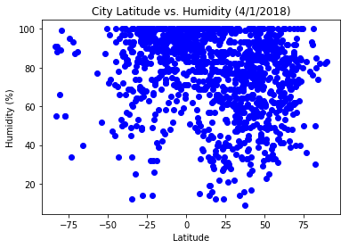
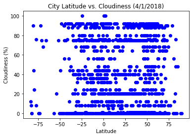
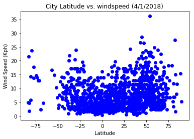
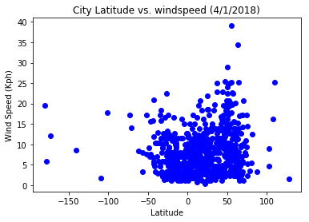

```python
import pandas as pd
import numpy as np
import json
import requests as req
from citipy import citipy
import matplotlib.pyplot as plt

from API_Key import API_Key
```


```python
num_of_cities = 4500
latitude = np.random.uniform(-90,90, size = num_of_cities)
longitude = np.random.uniform(-180,180,size = num_of_cities)
coord = pd.DataFrame(latitude, longitude)
coord = coord.reset_index()
coord = coord.rename(columns = {'index':'latitude',0:'longitude'})
#coor
```


```python
cities = []
country = []
for index, row in coord.iterrows():
    lat = row['latitude']
    lng = row['longitude']
    city = citipy.nearest_city(lat,lng)
    cities.append(city.city_name)
    country.append(city.country_code)
```


```python
cities_df = pd.DataFrame(cities)
cities_df['country_code'] = pd.DataFrame(country)
cities_df = cities_df.rename(columns = {0 : 'city_name'})
cities_df['latitude'] = coord['latitude']
cities_df['longitude'] = coord['longitude']
cities_df['temperature'] = ''
cities_df['humidity'] = ''
cities_df['cloudiness'] =''
cities_df['wind_speed'] = ''
```


```python
units = 'imperial'

for index, row in cities_df.iterrows():
    url = 'http://api.openweathermap.org/data/2.5/weather?'

    city = row[0]
    query_url = f'{url}appid={API_Key}&q={city}&units={units}'
    city_weather = req.get(query_url)
    weather_json = city_weather.json()
    #print(weather_json)
    try:
        temp = weather_json['main']['temp']
        humid = weather_json['main']['humidity']
        cloud = weather_json['clouds']['all']
        wind = weather_json['wind']['speed']
        cities_df.set_value(index,'temperature', temp)
        cities_df.set_value(index, 'humidity', humid)
        cities_df.set_value(index, 'cloudiness', cloud)
        cities_df.set_value(index, 'wind_speed', wind)
        #print(temperature)
    except:
        continue

#append cities_df with temp and other data
```


```python
cities_df
```


<div>
<style>
    .dataframe thead tr:only-child th {
        text-align: right;
    }

    .dataframe thead th {
        text-align: left;
    }

    .dataframe tbody tr th {
        vertical-align: top;
    }
</style>
<table border="1" class="dataframe">
  <thead>
    <tr style="text-align: right;">
      <th></th>
      <th>city_name</th>
      <th>country_code</th>
      <th>latitude</th>
      <th>longitude</th>
      <th>temperature</th>
      <th>humidity</th>
      <th>cloudiness</th>
      <th>wind_speed</th>
    </tr>
  </thead>
  <tbody>
    <tr>
      <th>0</th>
      <td>illoqqortoormiut</td>
      <td>gl</td>
      <td>82.618632</td>
      <td>-32.820346</td>
      <td></td>
      <td></td>
      <td></td>
      <td></td>
    </tr>
    <tr>
      <th>1</th>
      <td>clyde river</td>
      <td>ca</td>
      <td>68.102439</td>
      <td>-71.556313</td>
      <td>8.6</td>
      <td>84</td>
      <td>90</td>
      <td>17.22</td>
    </tr>
    <tr>
      <th>2</th>
      <td>illoqqortoormiut</td>
      <td>gl</td>
      <td>116.164130</td>
      <td>-23.707253</td>
      <td></td>
      <td></td>
      <td></td>
      <td></td>
    </tr>
    <tr>
      <th>3</th>
      <td>barentsburg</td>
      <td>sj</td>
      <td>161.513000</td>
      <td>-14.577677</td>
      <td></td>
      <td></td>
      <td></td>
      <td></td>
    </tr>
    <tr>
      <th>4</th>
      <td>illoqqortoormiut</td>
      <td>gl</td>
      <td>148.879519</td>
      <td>-26.660290</td>
      <td></td>
      <td></td>
      <td></td>
      <td></td>
    </tr>
    <tr>
      <th>5</th>
      <td>baiao</td>
      <td>br</td>
      <td>-2.495296</td>
      <td>-50.112236</td>
      <td>77.1</td>
      <td>95</td>
      <td>36</td>
      <td>2.37</td>
    </tr>
    <tr>
      <th>6</th>
      <td>belushya guba</td>
      <td>ru</td>
      <td>141.206772</td>
      <td>58.743389</td>
      <td></td>
      <td></td>
      <td></td>
      <td></td>
    </tr>
    <tr>
      <th>7</th>
      <td>luderitz</td>
      <td>na</td>
      <td>-32.793969</td>
      <td>5.914968</td>
      <td>62.6</td>
      <td>88</td>
      <td>36</td>
      <td>3.36</td>
    </tr>
    <tr>
      <th>8</th>
      <td>illoqqortoormiut</td>
      <td>gl</td>
      <td>108.454437</td>
      <td>-34.536518</td>
      <td></td>
      <td></td>
      <td></td>
      <td></td>
    </tr>
    <tr>
      <th>9</th>
      <td>ushuaia</td>
      <td>ar</td>
      <td>-172.889007</td>
      <td>-3.570603</td>
      <td>50</td>
      <td>76</td>
      <td>40</td>
      <td>12.1</td>
    </tr>
    <tr>
      <th>10</th>
      <td>tasiilaq</td>
      <td>gl</td>
      <td>74.221974</td>
      <td>-36.885100</td>
      <td>23</td>
      <td>67</td>
      <td>92</td>
      <td>17.22</td>
    </tr>
    <tr>
      <th>11</th>
      <td>ushuaia</td>
      <td>ar</td>
      <td>-108.928055</td>
      <td>-46.580632</td>
      <td>50</td>
      <td>76</td>
      <td>40</td>
      <td>12.1</td>
    </tr>
    <tr>
      <th>12</th>
      <td>kadoma</td>
      <td>zw</td>
      <td>-17.980137</td>
      <td>29.317712</td>
      <td>60.81</td>
      <td>67</td>
      <td>0</td>
      <td>11.65</td>
    </tr>
    <tr>
      <th>13</th>
      <td>manica</td>
      <td>mz</td>
      <td>-19.084994</td>
      <td>32.921523</td>
      <td>68</td>
      <td>100</td>
      <td>75</td>
      <td>6.93</td>
    </tr>
    <tr>
      <th>14</th>
      <td>busselton</td>
      <td>au</td>
      <td>-101.788054</td>
      <td>75.911999</td>
      <td>60.27</td>
      <td>100</td>
      <td>0</td>
      <td>17.81</td>
    </tr>
    <tr>
      <th>15</th>
      <td>elat</td>
      <td>il</td>
      <td>29.899250</td>
      <td>34.845456</td>
      <td>69.59</td>
      <td>97</td>
      <td>76</td>
      <td>2.15</td>
    </tr>
    <tr>
      <th>16</th>
      <td>barentsburg</td>
      <td>sj</td>
      <td>130.409779</td>
      <td>-3.673484</td>
      <td></td>
      <td></td>
      <td></td>
      <td></td>
    </tr>
    <tr>
      <th>17</th>
      <td>ushuaia</td>
      <td>ar</td>
      <td>-125.447277</td>
      <td>-6.004156</td>
      <td>50</td>
      <td>76</td>
      <td>40</td>
      <td>12.1</td>
    </tr>
    <tr>
      <th>18</th>
      <td>bolshaya martynovka</td>
      <td>ru</td>
      <td>47.199985</td>
      <td>41.665799</td>
      <td>43.17</td>
      <td>82</td>
      <td>32</td>
      <td>13.89</td>
    </tr>
    <tr>
      <th>19</th>
      <td>port elizabeth</td>
      <td>za</td>
      <td>-177.744305</td>
      <td>58.145337</td>
      <td>60.3</td>
      <td>54</td>
      <td>40</td>
      <td>5.82</td>
    </tr>
    <tr>
      <th>20</th>
      <td>bonthe</td>
      <td>sl</td>
      <td>4.934828</td>
      <td>-14.901494</td>
      <td>79.4</td>
      <td>90</td>
      <td>44</td>
      <td>4.94</td>
    </tr>
    <tr>
      <th>21</th>
      <td>vestmannaeyjar</td>
      <td>is</td>
      <td>55.365632</td>
      <td>-22.141811</td>
      <td>38</td>
      <td>91</td>
      <td>88</td>
      <td>12.77</td>
    </tr>
    <tr>
      <th>22</th>
      <td>jamestown</td>
      <td>sh</td>
      <td>-52.264402</td>
      <td>-16.107543</td>
      <td>63.02</td>
      <td>75</td>
      <td>8</td>
      <td>7.63</td>
    </tr>
    <tr>
      <th>23</th>
      <td>ushuaia</td>
      <td>ar</td>
      <td>-106.512844</td>
      <td>-15.866050</td>
      <td>50</td>
      <td>76</td>
      <td>40</td>
      <td>12.1</td>
    </tr>
    <tr>
      <th>24</th>
      <td>ushuaia</td>
      <td>ar</td>
      <td>-98.191156</td>
      <td>-22.808452</td>
      <td>50</td>
      <td>76</td>
      <td>40</td>
      <td>12.1</td>
    </tr>
    <tr>
      <th>25</th>
      <td>leshukonskoye</td>
      <td>ru</td>
      <td>67.863268</td>
      <td>47.373432</td>
      <td>10.86</td>
      <td>66</td>
      <td>8</td>
      <td>2.71</td>
    </tr>
    <tr>
      <th>26</th>
      <td>barentsburg</td>
      <td>sj</td>
      <td>127.767194</td>
      <td>-6.540686</td>
      <td></td>
      <td></td>
      <td></td>
      <td></td>
    </tr>
    <tr>
      <th>27</th>
      <td>east london</td>
      <td>za</td>
      <td>-42.938334</td>
      <td>33.407499</td>
      <td>75.57</td>
      <td>100</td>
      <td>44</td>
      <td>20.83</td>
    </tr>
    <tr>
      <th>28</th>
      <td>port elizabeth</td>
      <td>za</td>
      <td>-62.253432</td>
      <td>31.619369</td>
      <td>60.3</td>
      <td>54</td>
      <td>40</td>
      <td>5.82</td>
    </tr>
    <tr>
      <th>29</th>
      <td>tasiilaq</td>
      <td>gl</td>
      <td>80.893585</td>
      <td>-36.805347</td>
      <td>23</td>
      <td>67</td>
      <td>92</td>
      <td>17.22</td>
    </tr>
    <tr>
      <th>...</th>
      <td>...</td>
      <td>...</td>
      <td>...</td>
      <td>...</td>
      <td>...</td>
      <td>...</td>
      <td>...</td>
      <td>...</td>
    </tr>
    <tr>
      <th>4470</th>
      <td>bubaque</td>
      <td>gw</td>
      <td>7.443220</td>
      <td>-19.896044</td>
      <td>78.8</td>
      <td>69</td>
      <td>0</td>
      <td>6.93</td>
    </tr>
    <tr>
      <th>4471</th>
      <td>lawrenceburg</td>
      <td>us</td>
      <td>35.005190</td>
      <td>-87.254616</td>
      <td>71.1</td>
      <td>67</td>
      <td>75</td>
      <td>4.7</td>
    </tr>
    <tr>
      <th>4472</th>
      <td>clarence town</td>
      <td>bs</td>
      <td>22.912545</td>
      <td>-75.906274</td>
      <td>71.6</td>
      <td>78</td>
      <td>36</td>
      <td>4.7</td>
    </tr>
    <tr>
      <th>4473</th>
      <td>belushya guba</td>
      <td>ru</td>
      <td>117.914428</td>
      <td>44.207966</td>
      <td></td>
      <td></td>
      <td></td>
      <td></td>
    </tr>
    <tr>
      <th>4474</th>
      <td>ushuaia</td>
      <td>ar</td>
      <td>-169.379469</td>
      <td>-65.987552</td>
      <td>50</td>
      <td>76</td>
      <td>40</td>
      <td>12.1</td>
    </tr>
    <tr>
      <th>4475</th>
      <td>ushuaia</td>
      <td>ar</td>
      <td>-88.895617</td>
      <td>-65.421232</td>
      <td>50</td>
      <td>76</td>
      <td>40</td>
      <td>12.1</td>
    </tr>
    <tr>
      <th>4476</th>
      <td>ushuaia</td>
      <td>ar</td>
      <td>-124.756122</td>
      <td>-36.383739</td>
      <td>50</td>
      <td>76</td>
      <td>40</td>
      <td>12.1</td>
    </tr>
    <tr>
      <th>4477</th>
      <td>marawi</td>
      <td>sd</td>
      <td>19.710592</td>
      <td>28.471444</td>
      <td>75.03</td>
      <td>75</td>
      <td>0</td>
      <td>2.93</td>
    </tr>
    <tr>
      <th>4478</th>
      <td>praia</td>
      <td>cv</td>
      <td>12.241420</td>
      <td>-22.661897</td>
      <td>76.03</td>
      <td>61</td>
      <td>0</td>
      <td>8.05</td>
    </tr>
    <tr>
      <th>4479</th>
      <td>desbiens</td>
      <td>ca</td>
      <td>47.756765</td>
      <td>-72.122004</td>
      <td>26.6</td>
      <td>42</td>
      <td>75</td>
      <td>18.34</td>
    </tr>
    <tr>
      <th>4480</th>
      <td>illoqqortoormiut</td>
      <td>gl</td>
      <td>75.492007</td>
      <td>-24.530569</td>
      <td></td>
      <td></td>
      <td></td>
      <td></td>
    </tr>
    <tr>
      <th>4481</th>
      <td>ushuaia</td>
      <td>ar</td>
      <td>-82.472662</td>
      <td>-32.924884</td>
      <td>50</td>
      <td>76</td>
      <td>40</td>
      <td>12.1</td>
    </tr>
    <tr>
      <th>4482</th>
      <td>dikson</td>
      <td>ru</td>
      <td>148.827666</td>
      <td>62.580554</td>
      <td>6.63</td>
      <td>79</td>
      <td>76</td>
      <td>12.44</td>
    </tr>
    <tr>
      <th>4483</th>
      <td>qaanaaq</td>
      <td>gl</td>
      <td>170.954506</td>
      <td>-53.801222</td>
      <td>9.92</td>
      <td>87</td>
      <td>80</td>
      <td>1.59</td>
    </tr>
    <tr>
      <th>4484</th>
      <td>port elizabeth</td>
      <td>za</td>
      <td>-176.210017</td>
      <td>44.919075</td>
      <td>60.3</td>
      <td>54</td>
      <td>40</td>
      <td>5.82</td>
    </tr>
    <tr>
      <th>4485</th>
      <td>belushya guba</td>
      <td>ru</td>
      <td>108.590776</td>
      <td>51.454647</td>
      <td></td>
      <td></td>
      <td></td>
      <td></td>
    </tr>
    <tr>
      <th>4486</th>
      <td>hambantota</td>
      <td>lk</td>
      <td>-4.458610</td>
      <td>83.984720</td>
      <td>81.33</td>
      <td>100</td>
      <td>64</td>
      <td>7.63</td>
    </tr>
    <tr>
      <th>4487</th>
      <td>qaanaaq</td>
      <td>gl</td>
      <td>156.217558</td>
      <td>-62.678666</td>
      <td>9.92</td>
      <td>87</td>
      <td>80</td>
      <td>1.59</td>
    </tr>
    <tr>
      <th>4488</th>
      <td>ushuaia</td>
      <td>ar</td>
      <td>-103.107639</td>
      <td>-23.801448</td>
      <td>50</td>
      <td>76</td>
      <td>40</td>
      <td>12.1</td>
    </tr>
    <tr>
      <th>4489</th>
      <td>ancud</td>
      <td>cl</td>
      <td>-40.768010</td>
      <td>-77.331652</td>
      <td>54.2</td>
      <td>84</td>
      <td>0</td>
      <td>4.72</td>
    </tr>
    <tr>
      <th>4490</th>
      <td>aguada de pasajeros</td>
      <td>cu</td>
      <td>21.562899</td>
      <td>-81.273841</td>
      <td>82.4</td>
      <td>54</td>
      <td>88</td>
      <td>10.29</td>
    </tr>
    <tr>
      <th>4491</th>
      <td>canico</td>
      <td>pt</td>
      <td>31.103098</td>
      <td>-15.801615</td>
      <td>61.84</td>
      <td>77</td>
      <td>20</td>
      <td>2.24</td>
    </tr>
    <tr>
      <th>4492</th>
      <td>qaanaaq</td>
      <td>gl</td>
      <td>159.154328</td>
      <td>-88.743681</td>
      <td>9.92</td>
      <td>87</td>
      <td>80</td>
      <td>1.59</td>
    </tr>
    <tr>
      <th>4493</th>
      <td>port elizabeth</td>
      <td>za</td>
      <td>-170.793244</td>
      <td>43.621623</td>
      <td>60.3</td>
      <td>54</td>
      <td>40</td>
      <td>5.82</td>
    </tr>
    <tr>
      <th>4494</th>
      <td>illoqqortoormiut</td>
      <td>gl</td>
      <td>81.966760</td>
      <td>-19.977862</td>
      <td></td>
      <td></td>
      <td></td>
      <td></td>
    </tr>
    <tr>
      <th>4495</th>
      <td>chapais</td>
      <td>ca</td>
      <td>52.096815</td>
      <td>-75.528906</td>
      <td>15.8</td>
      <td>61</td>
      <td>75</td>
      <td>12.75</td>
    </tr>
    <tr>
      <th>4496</th>
      <td>ushuaia</td>
      <td>ar</td>
      <td>-123.949907</td>
      <td>-28.351354</td>
      <td>50</td>
      <td>76</td>
      <td>40</td>
      <td>12.1</td>
    </tr>
    <tr>
      <th>4497</th>
      <td>ushuaia</td>
      <td>ar</td>
      <td>-93.334273</td>
      <td>-75.473936</td>
      <td>50</td>
      <td>76</td>
      <td>40</td>
      <td>12.1</td>
    </tr>
    <tr>
      <th>4498</th>
      <td>kavaratti</td>
      <td>in</td>
      <td>7.931019</td>
      <td>65.071289</td>
      <td>83.54</td>
      <td>100</td>
      <td>56</td>
      <td>2.59</td>
    </tr>
    <tr>
      <th>4499</th>
      <td>darnah</td>
      <td>ly</td>
      <td>33.442968</td>
      <td>23.103995</td>
      <td>60.81</td>
      <td>100</td>
      <td>8</td>
      <td>19.82</td>
    </tr>
  </tbody>
</table>
<p>4500 rows × 8 columns</p>
</div>


```python
cities_df.replace('', np.nan, inplace= True)
cities_df = cities_df.drop_duplicates(subset=['city_name','country_code'], keep='first')
cities_df = cities_df.dropna()
cities_df
```


<div>
<style>
    .dataframe thead tr:only-child th {
        text-align: right;
    }

    .dataframe thead th {
        text-align: left;
    }

    .dataframe tbody tr th {
        vertical-align: top;
    }
</style>
<table border="1" class="dataframe">
  <thead>
    <tr style="text-align: right;">
      <th></th>
      <th>city_name</th>
      <th>country_code</th>
      <th>latitude</th>
      <th>longitude</th>
      <th>temperature</th>
      <th>humidity</th>
      <th>cloudiness</th>
      <th>wind_speed</th>
    </tr>
  </thead>
  <tbody>
    <tr>
      <th>1</th>
      <td>clyde river</td>
      <td>ca</td>
      <td>68.102439</td>
      <td>-71.556313</td>
      <td>8.60</td>
      <td>84.0</td>
      <td>90.0</td>
      <td>17.22</td>
    </tr>
    <tr>
      <th>5</th>
      <td>baiao</td>
      <td>br</td>
      <td>-2.495296</td>
      <td>-50.112236</td>
      <td>77.10</td>
      <td>95.0</td>
      <td>36.0</td>
      <td>2.37</td>
    </tr>
    <tr>
      <th>7</th>
      <td>luderitz</td>
      <td>na</td>
      <td>-32.793969</td>
      <td>5.914968</td>
      <td>62.60</td>
      <td>88.0</td>
      <td>36.0</td>
      <td>3.36</td>
    </tr>
    <tr>
      <th>9</th>
      <td>ushuaia</td>
      <td>ar</td>
      <td>-172.889007</td>
      <td>-3.570603</td>
      <td>50.00</td>
      <td>76.0</td>
      <td>40.0</td>
      <td>12.10</td>
    </tr>
    <tr>
      <th>10</th>
      <td>tasiilaq</td>
      <td>gl</td>
      <td>74.221974</td>
      <td>-36.885100</td>
      <td>23.00</td>
      <td>67.0</td>
      <td>92.0</td>
      <td>17.22</td>
    </tr>
    <tr>
      <th>12</th>
      <td>kadoma</td>
      <td>zw</td>
      <td>-17.980137</td>
      <td>29.317712</td>
      <td>60.81</td>
      <td>67.0</td>
      <td>0.0</td>
      <td>11.65</td>
    </tr>
    <tr>
      <th>13</th>
      <td>manica</td>
      <td>mz</td>
      <td>-19.084994</td>
      <td>32.921523</td>
      <td>68.00</td>
      <td>100.0</td>
      <td>75.0</td>
      <td>6.93</td>
    </tr>
    <tr>
      <th>14</th>
      <td>busselton</td>
      <td>au</td>
      <td>-101.788054</td>
      <td>75.911999</td>
      <td>60.27</td>
      <td>100.0</td>
      <td>0.0</td>
      <td>17.81</td>
    </tr>
    <tr>
      <th>15</th>
      <td>elat</td>
      <td>il</td>
      <td>29.899250</td>
      <td>34.845456</td>
      <td>69.59</td>
      <td>97.0</td>
      <td>76.0</td>
      <td>2.15</td>
    </tr>
    <tr>
      <th>18</th>
      <td>bolshaya martynovka</td>
      <td>ru</td>
      <td>47.199985</td>
      <td>41.665799</td>
      <td>43.17</td>
      <td>82.0</td>
      <td>32.0</td>
      <td>13.89</td>
    </tr>
    <tr>
      <th>19</th>
      <td>port elizabeth</td>
      <td>za</td>
      <td>-177.744305</td>
      <td>58.145337</td>
      <td>60.30</td>
      <td>54.0</td>
      <td>40.0</td>
      <td>5.82</td>
    </tr>
    <tr>
      <th>20</th>
      <td>bonthe</td>
      <td>sl</td>
      <td>4.934828</td>
      <td>-14.901494</td>
      <td>79.40</td>
      <td>90.0</td>
      <td>44.0</td>
      <td>4.94</td>
    </tr>
    <tr>
      <th>21</th>
      <td>vestmannaeyjar</td>
      <td>is</td>
      <td>55.365632</td>
      <td>-22.141811</td>
      <td>38.00</td>
      <td>91.0</td>
      <td>88.0</td>
      <td>12.77</td>
    </tr>
    <tr>
      <th>22</th>
      <td>jamestown</td>
      <td>sh</td>
      <td>-52.264402</td>
      <td>-16.107543</td>
      <td>63.02</td>
      <td>75.0</td>
      <td>8.0</td>
      <td>7.63</td>
    </tr>
    <tr>
      <th>25</th>
      <td>leshukonskoye</td>
      <td>ru</td>
      <td>67.863268</td>
      <td>47.373432</td>
      <td>10.86</td>
      <td>66.0</td>
      <td>8.0</td>
      <td>2.71</td>
    </tr>
    <tr>
      <th>27</th>
      <td>east london</td>
      <td>za</td>
      <td>-42.938334</td>
      <td>33.407499</td>
      <td>75.57</td>
      <td>100.0</td>
      <td>44.0</td>
      <td>20.83</td>
    </tr>
    <tr>
      <th>30</th>
      <td>poykovskiy</td>
      <td>ru</td>
      <td>62.509869</td>
      <td>73.033657</td>
      <td>15.80</td>
      <td>66.0</td>
      <td>40.0</td>
      <td>6.71</td>
    </tr>
    <tr>
      <th>31</th>
      <td>carutapera</td>
      <td>br</td>
      <td>6.768497</td>
      <td>-41.594459</td>
      <td>77.91</td>
      <td>96.0</td>
      <td>92.0</td>
      <td>5.17</td>
    </tr>
    <tr>
      <th>32</th>
      <td>dikson</td>
      <td>ru</td>
      <td>81.202294</td>
      <td>76.823283</td>
      <td>6.63</td>
      <td>79.0</td>
      <td>76.0</td>
      <td>12.44</td>
    </tr>
    <tr>
      <th>34</th>
      <td>longyearbyen</td>
      <td>sj</td>
      <td>107.400664</td>
      <td>25.471815</td>
      <td>10.40</td>
      <td>43.0</td>
      <td>0.0</td>
      <td>16.11</td>
    </tr>
    <tr>
      <th>36</th>
      <td>mwene-ditu</td>
      <td>cd</td>
      <td>-7.951722</td>
      <td>22.857304</td>
      <td>69.59</td>
      <td>93.0</td>
      <td>56.0</td>
      <td>2.93</td>
    </tr>
    <tr>
      <th>37</th>
      <td>husavik</td>
      <td>is</td>
      <td>73.121131</td>
      <td>-14.459041</td>
      <td>23.24</td>
      <td>86.0</td>
      <td>76.0</td>
      <td>10.98</td>
    </tr>
    <tr>
      <th>38</th>
      <td>shache</td>
      <td>cn</td>
      <td>39.142925</td>
      <td>78.955404</td>
      <td>49.38</td>
      <td>57.0</td>
      <td>24.0</td>
      <td>6.06</td>
    </tr>
    <tr>
      <th>40</th>
      <td>plock</td>
      <td>pl</td>
      <td>52.619618</td>
      <td>19.448197</td>
      <td>36.02</td>
      <td>99.0</td>
      <td>92.0</td>
      <td>25.08</td>
    </tr>
    <tr>
      <th>44</th>
      <td>port alfred</td>
      <td>za</td>
      <td>-70.802744</td>
      <td>48.250467</td>
      <td>72.06</td>
      <td>90.0</td>
      <td>32.0</td>
      <td>14.00</td>
    </tr>
    <tr>
      <th>46</th>
      <td>salcininkai</td>
      <td>lt</td>
      <td>54.155127</td>
      <td>25.712694</td>
      <td>37.40</td>
      <td>100.0</td>
      <td>90.0</td>
      <td>4.70</td>
    </tr>
    <tr>
      <th>47</th>
      <td>albany</td>
      <td>au</td>
      <td>-179.991335</td>
      <td>85.843200</td>
      <td>38.10</td>
      <td>32.0</td>
      <td>20.0</td>
      <td>19.46</td>
    </tr>
    <tr>
      <th>50</th>
      <td>mbeya</td>
      <td>tz</td>
      <td>-7.992951</td>
      <td>33.317439</td>
      <td>58.25</td>
      <td>97.0</td>
      <td>44.0</td>
      <td>2.37</td>
    </tr>
    <tr>
      <th>52</th>
      <td>nanortalik</td>
      <td>gl</td>
      <td>55.015955</td>
      <td>-40.318729</td>
      <td>34.08</td>
      <td>100.0</td>
      <td>0.0</td>
      <td>39.06</td>
    </tr>
    <tr>
      <th>56</th>
      <td>sorland</td>
      <td>no</td>
      <td>72.878830</td>
      <td>5.334641</td>
      <td>35.16</td>
      <td>100.0</td>
      <td>48.0</td>
      <td>7.40</td>
    </tr>
    <tr>
      <th>...</th>
      <td>...</td>
      <td>...</td>
      <td>...</td>
      <td>...</td>
      <td>...</td>
      <td>...</td>
      <td>...</td>
      <td>...</td>
    </tr>
    <tr>
      <th>4220</th>
      <td>zhob</td>
      <td>pk</td>
      <td>31.508144</td>
      <td>69.868250</td>
      <td>48.75</td>
      <td>85.0</td>
      <td>48.0</td>
      <td>2.71</td>
    </tr>
    <tr>
      <th>4228</th>
      <td>saint-dizier</td>
      <td>fr</td>
      <td>48.280944</td>
      <td>4.710193</td>
      <td>40.12</td>
      <td>93.0</td>
      <td>0.0</td>
      <td>4.70</td>
    </tr>
    <tr>
      <th>4230</th>
      <td>orel-izumrud</td>
      <td>ru</td>
      <td>42.398881</td>
      <td>39.161263</td>
      <td>55.40</td>
      <td>47.0</td>
      <td>20.0</td>
      <td>13.42</td>
    </tr>
    <tr>
      <th>4231</th>
      <td>sindgi</td>
      <td>in</td>
      <td>16.839293</td>
      <td>76.503005</td>
      <td>73.59</td>
      <td>68.0</td>
      <td>0.0</td>
      <td>10.76</td>
    </tr>
    <tr>
      <th>4234</th>
      <td>teplodar</td>
      <td>ua</td>
      <td>46.541448</td>
      <td>30.348821</td>
      <td>46.40</td>
      <td>93.0</td>
      <td>40.0</td>
      <td>8.95</td>
    </tr>
    <tr>
      <th>4246</th>
      <td>shenavan</td>
      <td>am</td>
      <td>39.767869</td>
      <td>43.731286</td>
      <td>46.40</td>
      <td>52.0</td>
      <td>0.0</td>
      <td>4.70</td>
    </tr>
    <tr>
      <th>4255</th>
      <td>kambove</td>
      <td>cd</td>
      <td>-10.243786</td>
      <td>26.475927</td>
      <td>65.45</td>
      <td>82.0</td>
      <td>12.0</td>
      <td>7.07</td>
    </tr>
    <tr>
      <th>4256</th>
      <td>pfarrkirchen</td>
      <td>de</td>
      <td>48.568890</td>
      <td>12.967056</td>
      <td>38.85</td>
      <td>93.0</td>
      <td>88.0</td>
      <td>18.03</td>
    </tr>
    <tr>
      <th>4285</th>
      <td>voi</td>
      <td>ke</td>
      <td>-3.022242</td>
      <td>38.850376</td>
      <td>69.09</td>
      <td>98.0</td>
      <td>92.0</td>
      <td>3.15</td>
    </tr>
    <tr>
      <th>4301</th>
      <td>port-de-bouc</td>
      <td>fr</td>
      <td>42.628185</td>
      <td>4.540805</td>
      <td>43.86</td>
      <td>100.0</td>
      <td>0.0</td>
      <td>3.36</td>
    </tr>
    <tr>
      <th>4313</th>
      <td>bondoukou</td>
      <td>ci</td>
      <td>8.271033</td>
      <td>-2.416771</td>
      <td>71.12</td>
      <td>97.0</td>
      <td>76.0</td>
      <td>5.95</td>
    </tr>
    <tr>
      <th>4315</th>
      <td>diu</td>
      <td>in</td>
      <td>19.813172</td>
      <td>71.496713</td>
      <td>63.78</td>
      <td>89.0</td>
      <td>0.0</td>
      <td>3.71</td>
    </tr>
    <tr>
      <th>4323</th>
      <td>san cristobal</td>
      <td>ec</td>
      <td>-4.191831</td>
      <td>-87.123087</td>
      <td>60.80</td>
      <td>67.0</td>
      <td>75.0</td>
      <td>5.82</td>
    </tr>
    <tr>
      <th>4324</th>
      <td>porbandar</td>
      <td>in</td>
      <td>20.678602</td>
      <td>68.881068</td>
      <td>70.53</td>
      <td>81.0</td>
      <td>24.0</td>
      <td>4.72</td>
    </tr>
    <tr>
      <th>4340</th>
      <td>comrie</td>
      <td>gb</td>
      <td>56.451788</td>
      <td>-4.025414</td>
      <td>31.39</td>
      <td>92.0</td>
      <td>0.0</td>
      <td>3.36</td>
    </tr>
    <tr>
      <th>4389</th>
      <td>luena</td>
      <td>ao</td>
      <td>-11.712825</td>
      <td>19.038649</td>
      <td>63.69</td>
      <td>95.0</td>
      <td>68.0</td>
      <td>2.71</td>
    </tr>
    <tr>
      <th>4393</th>
      <td>diapaga</td>
      <td>bf</td>
      <td>11.837290</td>
      <td>2.241226</td>
      <td>71.75</td>
      <td>47.0</td>
      <td>0.0</td>
      <td>3.15</td>
    </tr>
    <tr>
      <th>4406</th>
      <td>eydhafushi</td>
      <td>mv</td>
      <td>4.654632</td>
      <td>71.344179</td>
      <td>83.58</td>
      <td>100.0</td>
      <td>92.0</td>
      <td>8.52</td>
    </tr>
    <tr>
      <th>4417</th>
      <td>linden</td>
      <td>gy</td>
      <td>5.866382</td>
      <td>-58.023622</td>
      <td>80.60</td>
      <td>69.0</td>
      <td>0.0</td>
      <td>6.93</td>
    </tr>
    <tr>
      <th>4431</th>
      <td>langarud</td>
      <td>ir</td>
      <td>37.401563</td>
      <td>50.222872</td>
      <td>44.60</td>
      <td>93.0</td>
      <td>88.0</td>
      <td>4.70</td>
    </tr>
    <tr>
      <th>4432</th>
      <td>pitangui</td>
      <td>br</td>
      <td>-19.667637</td>
      <td>-44.918599</td>
      <td>71.88</td>
      <td>73.0</td>
      <td>24.0</td>
      <td>2.93</td>
    </tr>
    <tr>
      <th>4435</th>
      <td>polyarnyy</td>
      <td>ru</td>
      <td>69.335955</td>
      <td>33.958887</td>
      <td>19.40</td>
      <td>92.0</td>
      <td>40.0</td>
      <td>5.84</td>
    </tr>
    <tr>
      <th>4468</th>
      <td>tornio</td>
      <td>fi</td>
      <td>67.219872</td>
      <td>23.162798</td>
      <td>29.57</td>
      <td>74.0</td>
      <td>0.0</td>
      <td>12.75</td>
    </tr>
    <tr>
      <th>4470</th>
      <td>bubaque</td>
      <td>gw</td>
      <td>7.443220</td>
      <td>-19.896044</td>
      <td>78.80</td>
      <td>69.0</td>
      <td>0.0</td>
      <td>6.93</td>
    </tr>
    <tr>
      <th>4471</th>
      <td>lawrenceburg</td>
      <td>us</td>
      <td>35.005190</td>
      <td>-87.254616</td>
      <td>71.10</td>
      <td>67.0</td>
      <td>75.0</td>
      <td>4.70</td>
    </tr>
    <tr>
      <th>4472</th>
      <td>clarence town</td>
      <td>bs</td>
      <td>22.912545</td>
      <td>-75.906274</td>
      <td>71.60</td>
      <td>78.0</td>
      <td>36.0</td>
      <td>4.70</td>
    </tr>
    <tr>
      <th>4479</th>
      <td>desbiens</td>
      <td>ca</td>
      <td>47.756765</td>
      <td>-72.122004</td>
      <td>26.60</td>
      <td>42.0</td>
      <td>75.0</td>
      <td>18.34</td>
    </tr>
    <tr>
      <th>4490</th>
      <td>aguada de pasajeros</td>
      <td>cu</td>
      <td>21.562899</td>
      <td>-81.273841</td>
      <td>82.40</td>
      <td>54.0</td>
      <td>88.0</td>
      <td>10.29</td>
    </tr>
    <tr>
      <th>4491</th>
      <td>canico</td>
      <td>pt</td>
      <td>31.103098</td>
      <td>-15.801615</td>
      <td>61.84</td>
      <td>77.0</td>
      <td>20.0</td>
      <td>2.24</td>
    </tr>
    <tr>
      <th>4495</th>
      <td>chapais</td>
      <td>ca</td>
      <td>52.096815</td>
      <td>-75.528906</td>
      <td>15.80</td>
      <td>61.0</td>
      <td>75.0</td>
      <td>12.75</td>
    </tr>
  </tbody>
</table>
<p>758 rows × 8 columns</p>
</div>


```python
x_axis = cities_df['latitude']
y_temp_axis = cities_df['temperature']

plt.plot(x_axis,y_temp_axis, marker='o', color='blue', linewidth = 0)
plt.title('City Latitude vs. Max Temperature (4/1/2018)')
plt.xlabel('Latitude')
plt.ylabel('Temperature (C)')
plt.show()
```





```python
y_humid_axis = cities_df['humidity']

plt.plot(x_axis,y_humid_axis, marker='o', color='blue', linewidth = 0)
plt.title('City Latitude vs. Humidity (4/1/2018)')
plt.xlabel('Latitude')
plt.ylabel('Humidity (%)')
plt.show()
```





```python
y_cloud_axis = cities_df['cloudiness']

plt.plot(x_axis,y_cloud_axis, marker='o', color='blue', linewidth = 0)
plt.title('City Latitude vs. Cloudiness (4/1/2018)')
plt.xlabel('Latitude')
plt.ylabel('Cloudiness (%)')
plt.show()
```





```python
y_wind_axis = cities_df['wind_speed']

plt.plot(x_axis,y_wind_axis, marker='o', color='blue', linewidth = 0)
plt.title('City Latitude vs. windspeed (4/1/2018)')
plt.xlabel('Latitude')
plt.ylabel('Wind Speed (Kph)')
plt.show()
```





```python
cities_df.to_csv('CitiesWeatherData.csv')
```
